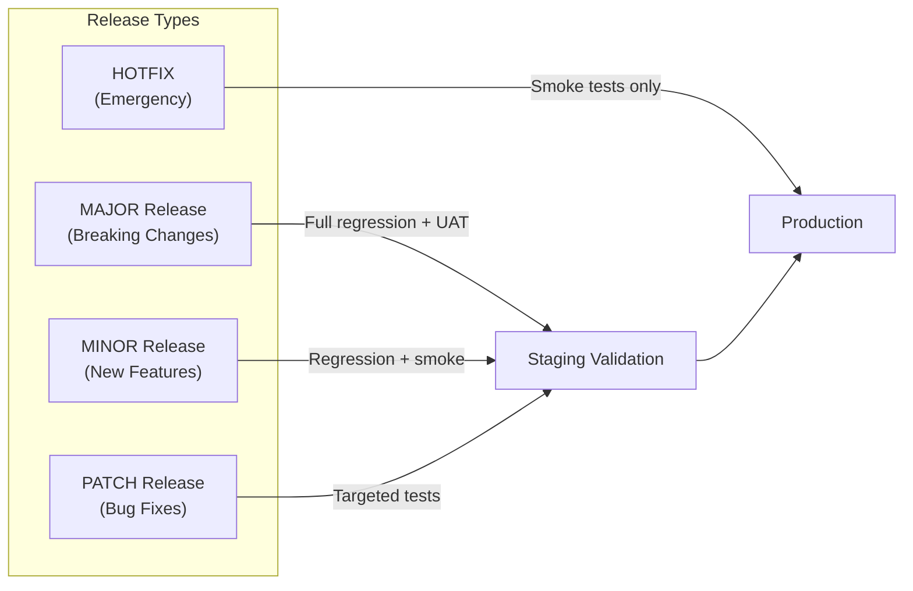
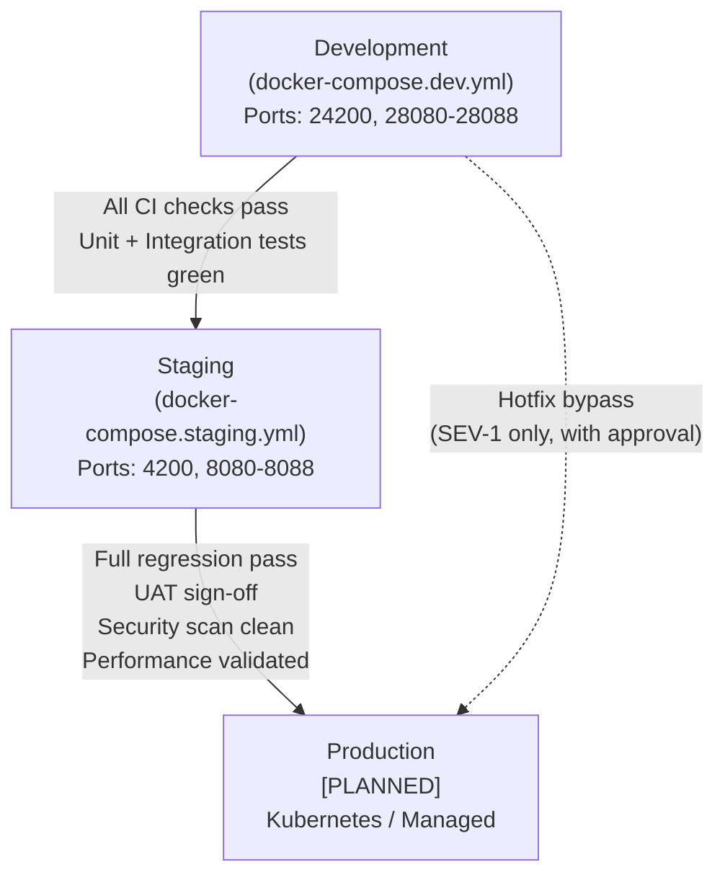
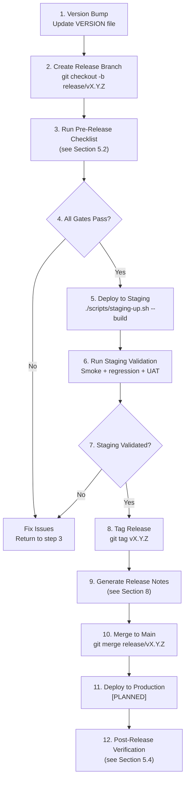
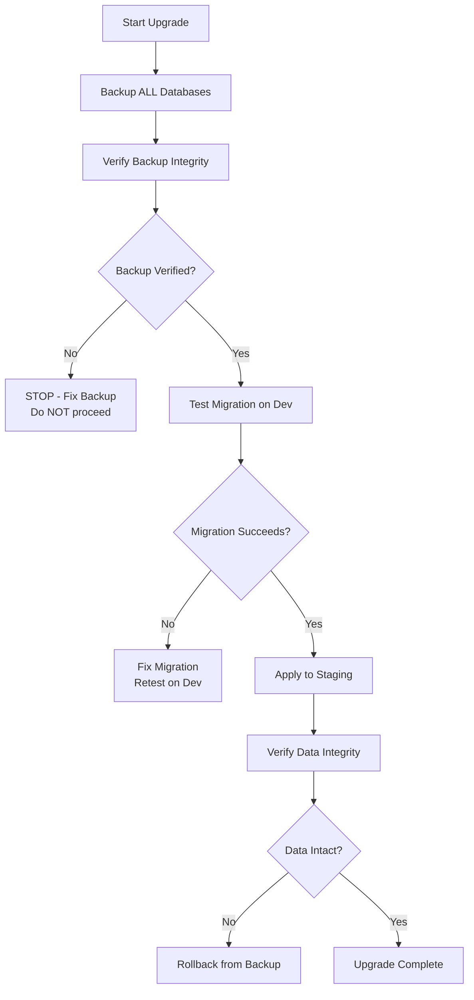
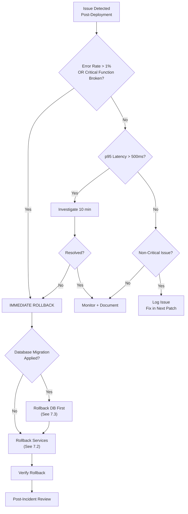
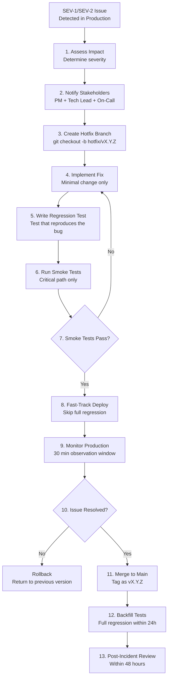
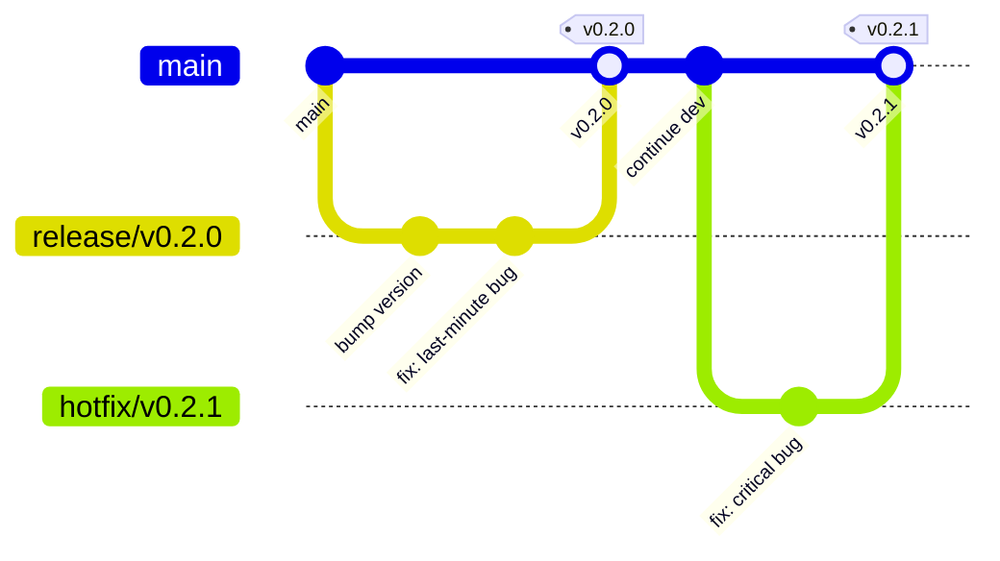

# Release Management Framework

**Version:** 1.0.0
**Last Updated:** 2026-03-02
**Owner:** Release Manager (REL Agent)
**Status:** [IMPLEMENTED] -- This framework document; tooling/automation is [IN-PROGRESS]

---

## 1. Purpose

This document defines the release management process for the EMSIST platform. It covers versioning strategy, release types, environment promotion, deployment checklists, rollback procedures, and hotfix workflows.

**Motivation:** The project has experienced data loss during ad-hoc upgrades because no formal release process existed. This framework establishes mandatory backup, verification, and rollback gates to prevent recurrence.

---

## 2. Versioning Strategy

EMSIST uses **Semantic Versioning 2.0.0** (SemVer) for platform-wide releases.

### 2.1 Version Format

```
MAJOR.MINOR.PATCH[-PRERELEASE][+BUILD]

Examples:
  0.1.0           -- Current initial development version
  1.0.0           -- First production release
  1.2.0-rc.1      -- Release candidate
  1.2.1           -- Patch/hotfix
```

### 2.2 Version Semantics

| Component | When to Increment | Examples |
|-----------|-------------------|----------|
| **MAJOR** | Breaking API changes, incompatible DB migrations, major architecture shifts | Remove an API endpoint, change auth flow, PostgreSQL major version upgrade |
| **MINOR** | New features, backward-compatible additions, new services | New admin page, new API endpoint, new microservice |
| **PATCH** | Bug fixes, security patches, documentation fixes | Fix login redirect, patch CVE, correct validation |

### 2.3 Source of Truth

The platform version is stored in a single file at the repository root.

- **File:** `/VERSION`
- **Format:** Single line containing the SemVer string (e.g., `0.1.0`)
- **Current version:** `0.1.0`

Individual backend services use `1.0.0-SNAPSHOT` in their `pom.xml` during development. The platform VERSION file is the release version.

### 2.4 Pre-Release Labels

| Label | Purpose | Example |
|-------|---------|---------|
| `alpha` | Internal testing, unstable | `0.2.0-alpha.1` |
| `beta` | Feature-complete, external testing | `1.0.0-beta.1` |
| `rc` | Release candidate, final validation | `1.0.0-rc.1` |

---

## 3. Release Types

### 3.1 Overview



### 3.2 Major Release

**When:** Breaking changes, database schema migrations that alter existing data, infrastructure version upgrades (PostgreSQL, Neo4j, Keycloak major versions).

**Requirements:**

| Gate | Requirement |
|------|-------------|
| Code freeze | 48 hours before release |
| Full regression | All test suites pass (unit, integration, E2E, a11y, responsive) |
| UAT sign-off | Product owner validates all acceptance criteria |
| Security scan | SAST + DAST clean (no HIGH/CRITICAL findings) |
| Performance test | Load + stress test results within SLO thresholds |
| Database backup | All databases backed up and verified restorable |
| Rollback tested | Rollback procedure executed on staging successfully |
| Release notes | Complete changelog with breaking changes highlighted |
| Stakeholder notification | 72 hours advance notice |

### 3.3 Minor Release

**When:** New features, new API endpoints, UI enhancements. No breaking changes.

**Requirements:**

| Gate | Requirement |
|------|-------------|
| Code freeze | 24 hours before release |
| Regression suite | Full regression pass |
| Smoke tests | Critical path verified |
| Security scan | SAST clean |
| Database backup | All databases backed up |
| Release notes | Changelog with new features documented |
| Stakeholder notification | 48 hours advance notice |

### 3.4 Patch Release

**When:** Bug fixes, security patches, minor corrections. No new features.

**Requirements:**

| Gate | Requirement |
|------|-------------|
| Code freeze | None (branch-based) |
| Targeted tests | Tests covering the fix pass |
| Smoke tests | Critical path verified |
| Database backup | Affected databases backed up |
| Release notes | Bug fix description |
| Stakeholder notification | 24 hours advance notice |

### 3.5 Hotfix Release

**When:** Critical production issues requiring immediate resolution (SEV-1/SEV-2).

**Requirements:**

| Gate | Requirement |
|------|-------------|
| Code freeze | None |
| Smoke tests | Minimal critical path |
| Database backup | If DB changes involved |
| Approval | Tech Lead + PM verbal approval |
| Post-deploy | Full regression within 24 hours |

---

## 4. Environment Promotion Flow

### 4.1 Promotion Pipeline



### 4.2 Environment Details [IMPLEMENTED]

| Environment | Compose File | Env File | Network | Ports | Purpose |
|-------------|-------------|----------|---------|-------|---------|
| Development | `docker-compose.dev.yml` | `.env.dev` | `ems-dev` | 24200, 28080-28088 | Local development, live-reload |
| Staging | `docker-compose.staging.yml` | `.env.staging` | `ems-staging` | 4200, 8080-8088 | Pre-production validation |
| Production | [PLANNED] | [PLANNED] | [PLANNED] | [PLANNED] | Live system |

### 4.3 Startup Scripts [IMPLEMENTED]

| Environment | Script | Usage |
|-------------|--------|-------|
| Development | `scripts/dev-up.sh` | `./scripts/dev-up.sh [--build\|--down]` |
| Staging | `scripts/staging-up.sh` | `./scripts/staging-up.sh [--build\|--down]` |

### 4.4 Promotion Criteria

| From | To | Required |
|------|----|----------|
| Dev | Staging | CI green, unit tests pass, integration tests pass, code review approved |
| Staging | Production | Full regression pass, UAT sign-off, security scan clean, performance validated, release checklist complete |

---

## 5. Release Process

### 5.1 Release Flow



### 5.2 Pre-Release Checklist

See `/docs/governance/checklists/release-checklist.md` for the full checklist.

**Summary of gates:**

1. All CI pipeline checks pass
2. Unit test coverage >= 80%
3. Integration tests pass
4. E2E tests pass on staging
5. Security scans clean (SAST, SCA)
6. Database migrations tested on dev first
7. Rollback migration available
8. Database backup completed and verified
9. Release notes drafted
10. Stakeholders notified

### 5.3 Deployment Steps

**For Docker Compose environments (Dev + Staging):**

```bash
# 1. Pull latest code
git checkout main && git pull origin main

# 2. Verify VERSION file
cat VERSION

# 3. Backup databases (MANDATORY before deployment)
./scripts/backup-databases.sh  # [PLANNED] -- see Section 6 for manual steps

# 4. Build and deploy
docker compose -f docker-compose.staging.yml --env-file .env.staging up --build -d

# 5. Wait for health checks
# The staging-up.sh script handles this automatically

# 6. Run smoke tests
curl -s http://localhost:8080/actuator/health | jq .
curl -s http://localhost:4200 | head -1
```

### 5.4 Post-Release Verification

| Check | Command | Expected |
|-------|---------|----------|
| API Gateway health | `curl localhost:8080/actuator/health` | `{"status":"UP"}` |
| Auth facade health | `curl localhost:8081/actuator/health` | `{"status":"UP"}` |
| Frontend loads | `curl -s localhost:4200 \| head -5` | HTML content |
| PostgreSQL connectivity | `docker exec postgres pg_isready -U postgres` | `accepting connections` |
| Neo4j connectivity | `docker exec neo4j wget -q --spider http://localhost:7474` | Exit 0 |
| Valkey connectivity | `docker exec valkey valkey-cli ping` | `PONG` |
| Login flow | Manual: navigate to login page, authenticate | Successful login |

---

## 6. Database Upgrade Procedure

### 6.1 Mandatory Pre-Upgrade Backup

**RULE: NEVER deploy without a database backup. This is non-negotiable.**



### 6.2 PostgreSQL Backup

**Databases to back up** (verified from `infrastructure/docker/init-db.sql`):

| Database | Service | Volume |
|----------|---------|--------|
| `master_db` | tenant-service | `staging_postgres_data` / `dev_postgres_data` |
| `keycloak_db` | keycloak | Same PostgreSQL volume |
| `user_db` | user-service | Same PostgreSQL volume |
| `license_db` | license-service | Same PostgreSQL volume |
| `notification_db` | notification-service | Same PostgreSQL volume |
| `audit_db` | audit-service | Same PostgreSQL volume |
| `ai_db` | ai-service | Same PostgreSQL volume |

**Backup commands:**

```bash
# Backup all PostgreSQL databases (run from host)
TIMESTAMP=$(date +%Y%m%d_%H%M%S)
BACKUP_DIR="./backups/${TIMESTAMP}"
mkdir -p "${BACKUP_DIR}"

# Option 1: Dump all databases at once
docker exec postgres pg_dumpall -U postgres > "${BACKUP_DIR}/pg_dumpall.sql"

# Option 2: Dump individual databases (preferred for selective restore)
for DB in master_db keycloak_db user_db license_db notification_db audit_db ai_db; do
  docker exec postgres pg_dump -U postgres -Fc "${DB}" > "${BACKUP_DIR}/${DB}.dump"
  echo "Backed up ${DB} -> ${BACKUP_DIR}/${DB}.dump"
done

# Verify backup files are non-empty
for f in "${BACKUP_DIR}"/*.dump; do
  SIZE=$(stat -f%z "$f" 2>/dev/null || stat -c%s "$f" 2>/dev/null)
  if [ "$SIZE" -lt 100 ]; then
    echo "WARNING: Backup file $f is suspiciously small (${SIZE} bytes)"
  fi
done
```

### 6.3 Neo4j Backup

```bash
# Stop auth-facade to prevent writes during backup
docker stop auth-facade

# Backup Neo4j data volume
TIMESTAMP=$(date +%Y%m%d_%H%M%S)
docker exec neo4j neo4j-admin database dump neo4j --to-path=/tmp/
docker cp neo4j:/tmp/neo4j.dump "./backups/${TIMESTAMP}/neo4j.dump"

# Restart auth-facade
docker start auth-facade
```

### 6.4 Valkey Snapshot

```bash
# Trigger RDB snapshot
docker exec valkey valkey-cli BGSAVE

# Wait for save to complete
docker exec valkey valkey-cli LASTSAVE

# Copy the dump file
docker cp valkey:/data/dump.rdb "./backups/${TIMESTAMP}/valkey_dump.rdb"
```

### 6.5 Verify Backup Integrity

```bash
# PostgreSQL: test restore to a temporary container
docker run --rm -v "${BACKUP_DIR}:/backups" postgres:16-alpine \
  pg_restore --list "/backups/master_db.dump" > /dev/null 2>&1 \
  && echo "master_db backup valid" || echo "master_db backup CORRUPT"

# Neo4j: check dump file header
file "${BACKUP_DIR}/neo4j.dump"
# Should show: data or archive format, NOT empty

# Valkey: check dump file
file "${BACKUP_DIR}/valkey_dump.rdb"
# Should show: data, NOT empty
```

### 6.6 Flyway Migration Strategy

All EMSIST backend services use Flyway for PostgreSQL migrations. Migration files are located in each service's `src/main/resources/db/migration/` directory.

**Rules:**

1. Test all migrations on the dev environment first
2. Migrations MUST be idempotent where possible
3. Never modify an already-applied migration (create a new version instead)
4. Destructive migrations (DROP TABLE, ALTER COLUMN with data loss) require DBA approval
5. Always create a corresponding rollback SQL script for major migrations

---

## 7. Rollback Procedure

### 7.1 Rollback Decision Tree



### 7.2 Service Rollback (Docker Compose)

```bash
# Option 1: Rebuild with previous code
git checkout <previous-tag>
docker compose -f docker-compose.staging.yml --env-file .env.staging up --build -d

# Option 2: If images were tagged, use previous image tags
# Edit docker-compose file to pin previous image versions
docker compose -f docker-compose.staging.yml --env-file .env.staging up -d

# Option 3: Stop specific service and roll back
docker compose -f docker-compose.staging.yml stop <service-name>
git checkout <previous-tag> -- backend/<service-name>/
docker compose -f docker-compose.staging.yml up --build -d <service-name>
```

### 7.3 Database Rollback

```bash
# CRITICAL: Stop application services FIRST to prevent data corruption
docker compose -f docker-compose.staging.yml stop \
  auth-facade tenant-service user-service license-service \
  notification-service audit-service ai-service api-gateway frontend

# Restore PostgreSQL from backup
BACKUP_DIR="./backups/<TIMESTAMP>"

# Restore all databases
docker exec -i postgres psql -U postgres < "${BACKUP_DIR}/pg_dumpall.sql"

# OR restore individual database
docker exec -i postgres pg_restore -U postgres -d master_db --clean --if-exists \
  < "${BACKUP_DIR}/master_db.dump"

# Restore Neo4j
docker stop neo4j
docker exec neo4j neo4j-admin database load neo4j --from-path=/tmp/ --overwrite-destination=true
docker start neo4j

# Restore Valkey
docker stop valkey
docker cp "${BACKUP_DIR}/valkey_dump.rdb" valkey:/data/dump.rdb
docker start valkey

# Restart all services
docker compose -f docker-compose.staging.yml up -d
```

### 7.4 Frontend Rollback

The frontend is a static Angular build served by nginx. Rollback is done by rebuilding from the previous git tag.

```bash
git checkout <previous-tag> -- frontend/
docker compose -f docker-compose.staging.yml up --build -d frontend
```

### 7.5 Rollback Triggers

| Condition | Severity | Action |
|-----------|----------|--------|
| Error rate > 1% | SEV-1 | Immediate rollback |
| p95 latency > 500ms (sustained 10 min) | SEV-2 | Rollback if not resolved |
| Critical functionality broken (login, tenant resolution) | SEV-1 | Immediate rollback |
| Database migration failed mid-execution | SEV-1 | Restore from backup |
| Health checks failing for > 5 minutes | SEV-2 | Rollback |
| Data corruption detected | SEV-1 | Immediate rollback + restore from backup |

---

## 8. Release Notes Template

Release notes follow the **Keep a Changelog** format.

### 8.1 Template

```markdown
# Release Notes - vX.Y.Z

**Release Date:** YYYY-MM-DD
**Release Manager:** [Name]
**Release Type:** MAJOR / MINOR / PATCH / HOTFIX

## Summary

[1-3 sentence summary of the release]

## Breaking Changes

- [Description of breaking change and migration path]

## Added

- [New feature or capability]
- [New API endpoint: `POST /api/v1/resource`]

## Changed

- [Modification to existing behavior]
- [Updated dependency: library X from v1 to v2]

## Fixed

- [Bug fix description] (Issue #NNN)
- [Security fix: CVE-YYYY-NNNNN]

## Removed

- [Deprecated feature removed]

## Security

- [Security improvement or patch]

## Database Migrations

- [V{N}__description.sql] - [What it does]

## Infrastructure Changes

- [Docker image version changes]
- [Configuration changes]

## Known Issues

- [Issue description and workaround]

## Upgrade Instructions

1. [Step 1]
2. [Step 2]

## Rollback Instructions

1. [Step 1]
2. [Step 2]
```

### 8.2 Example: v0.1.0

```markdown
# Release Notes - v0.1.0

**Release Date:** 2026-03-02
**Release Type:** MINOR (Initial Development)

## Summary

Initial development release establishing core platform infrastructure,
authentication via Keycloak, multi-tenant architecture, and administration UI.

## Added

- Multi-tenant authentication with Keycloak integration
- Master tenant superuser configuration
- API Gateway with tenant context routing
- Auth facade with Neo4j graph-based configuration
- Tenant, user, license, notification, audit, and AI services
- Angular 21 frontend with PrimeNG 21 neumorphic design
- Docker Compose environments for dev and staging
- SDLC governance framework with agent evidence enforcement

## Infrastructure

- PostgreSQL 16 (pgvector) with per-service logical databases
- Neo4j 5 Community for auth graph
- Valkey 8 for distributed caching
- Kafka 7.6 (KRaft mode) for event streaming
- Keycloak 24 for identity management

## Known Issues

- product-service and persona-service are stubs (no src/)
- process-service excluded from Docker Compose topology
- License management frontend has zero test coverage
```

---

## 9. Hotfix Process

### 9.1 Hotfix Flow



### 9.2 Hotfix Rules

| Rule | Description |
|------|-------------|
| Minimal change | Hotfix MUST contain only the fix. No feature work. |
| Approval required | Tech Lead must approve before deploy |
| Regression test | A test reproducing the bug MUST be created |
| Backfill deadline | Full regression must run within 24 hours |
| Post-incident review | Required within 48 hours |
| Version bump | Increment PATCH version (e.g., 1.2.0 -> 1.2.1) |

---

## 10. Release Calendar

### 10.1 Release Cadence [PLANNED]

| Release Type | Cadence | Day |
|-------------|---------|-----|
| Major | Quarterly | First Monday of quarter |
| Minor | Bi-weekly | Every other Tuesday |
| Patch | As needed | Any business day |
| Hotfix | Immediate | Any time |

### 10.2 Maintenance Windows

| Environment | Window | Duration |
|-------------|--------|----------|
| Development | Any time | N/A |
| Staging | Business hours | 2 hours |
| Production [PLANNED] | Tuesday/Thursday 02:00-06:00 UTC | 4 hours |

---

## 11. Roles and Responsibilities

| Role | Responsibilities |
|------|-----------------|
| **Release Manager** | Owns release process, creates release plan, coordinates deployment, makes go/no-go decision |
| **QA Lead** | Validates test results, provides test sign-off, reports test coverage |
| **Tech Lead** | Reviews code changes, approves hotfixes, participates in post-incident review |
| **DevOps** | Executes deployment, manages infrastructure, monitors production |
| **PM** | Approves release scope, communicates to stakeholders, approves schedule |
| **DBA** | Reviews database migrations, approves destructive changes, assists with backup/restore |

---

## 12. Git Branching for Releases



### 12.1 Branch Naming

| Branch Type | Pattern | Example |
|-------------|---------|---------|
| Release | `release/vX.Y.Z` | `release/v0.2.0` |
| Hotfix | `hotfix/vX.Y.Z` | `hotfix/v0.2.1` |
| Feature | `feature/ISSUE-NNN-description` | `feature/ISSUE-002-license-crud` |

### 12.2 Tag Format

Tags follow the format `vX.Y.Z` (e.g., `v0.1.0`, `v1.0.0-rc.1`).

```bash
# Create annotated tag
git tag -a v0.1.0 -m "Release v0.1.0 - Initial development release"

# Push tag
git push origin v0.1.0
```

---

## 13. Automation [IN-PROGRESS]

### 13.1 GitHub Actions Release Workflow

A release workflow is defined at `.github/workflows/release.yml` that:

1. Validates the version string is valid SemVer
2. Runs all backend tests (`mvn clean verify`)
3. Runs all frontend tests and build (`npm test && npm run build`)
4. Builds Docker images with version tags
5. Creates a git tag
6. Generates changelog from commits

**Trigger:** Manual dispatch (`workflow_dispatch`) with version input.

### 13.2 Existing CI Workflows [IMPLEMENTED]

| Workflow | File | Trigger | Purpose |
|----------|------|---------|---------|
| Docs Quality | `.github/workflows/docs-quality.yml` | Push/PR to `docs/**` | Markdown lint, arc42 consistency |
| Frontend Strict Quality | `.github/workflows/frontend-strict-quality.yml` | Push/PR to `frontend/**` | Lint, typecheck, unit tests, build |
| Frontendold Governance | `.github/workflows/frontendold-governance.yml` | Push/PR to `frontendold/**` | Custom CSS audit |

### 13.3 SDLC Evidence Enforcement [IMPLEMENTED]

| Layer | File | Gate |
|-------|------|------|
| Pre-edit hook | `.claude/hooks/check-agent-evidence.sh` | Blocks source edits without BA sign-off + principles ack |
| Pre-commit hook | `.githooks/pre-commit` | Blocks commits without BA sign-off + QA report |
| Frontend governance | `scripts/frontend-governance.sh` | Layout contract validation |

---

## Related Documents

- [Release Checklist](/docs/governance/checklists/release-checklist.md)
- [RUNBOOK-006: Deployment Rollback](/runbooks/operations/RUNBOOK-006-DEPLOYMENT-ROLLBACK.md)
- [RUNBOOK-011: Major Upgrade](/runbooks/operations/RUNBOOK-011-MAJOR-UPGRADE.md)
- [Backup Strategy](/runbooks/operations/BACKUP-STRATEGY.md)
- [Deployment View (arc42)](/docs/arc42/07-deployment-view.md)

---

## Changelog

| Version | Date | Changes |
|---------|------|---------|
| 1.0.0 | 2026-03-02 | Initial release management framework |
