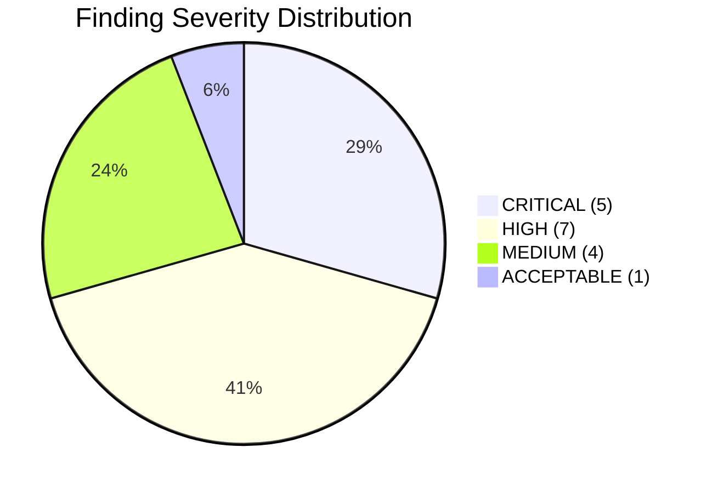
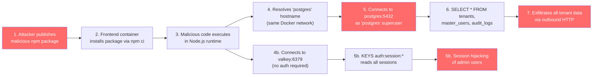
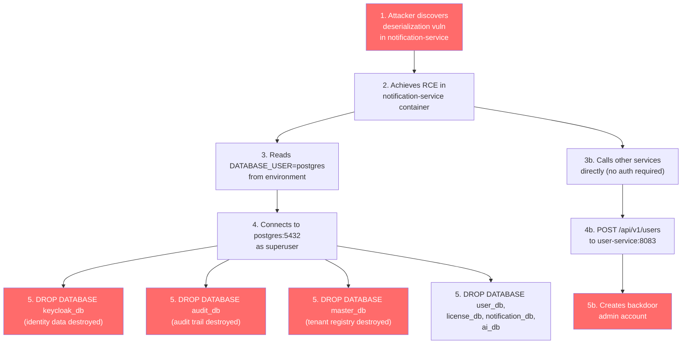
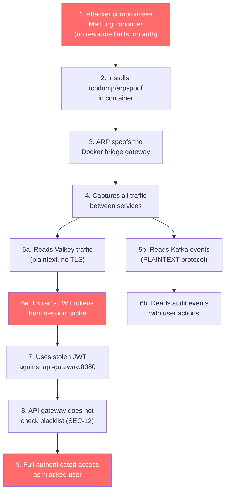
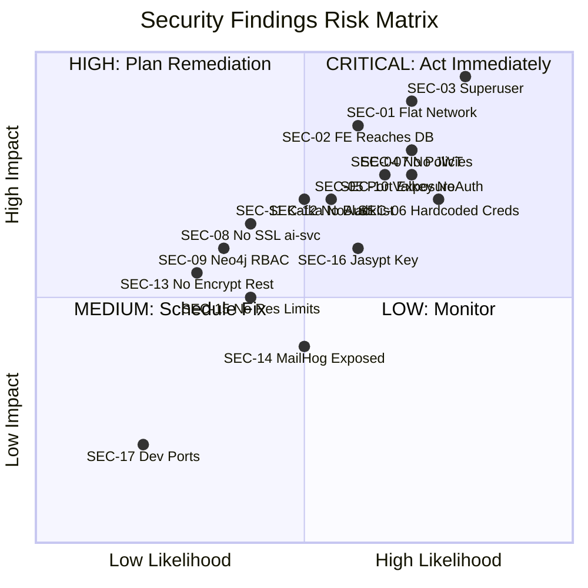
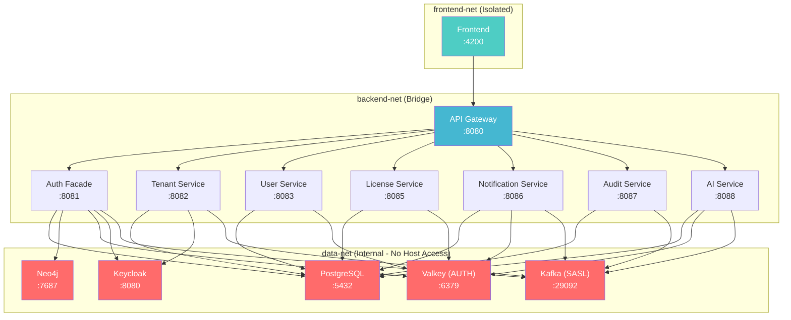

# Security Tier Boundary Audit Report

**Report ID:** SEC-AUDIT-2026-003
**Date:** 2026-03-02
**Auditor:** SEC Agent (SEC-PRINCIPLES.md v1.1.0)
**Classification:** CONFIDENTIAL -- Internal Use Only
**Overall Risk Rating:** **HIGH**

---

## Table of Contents

1. [Executive Summary](#1-executive-summary)
2. [Scope](#2-scope)
3. [Methodology](#3-methodology)
4. [Findings Summary](#4-findings-summary)
5. [Detailed Findings](#5-detailed-findings)
6. [Attack Scenarios](#6-attack-scenarios)
7. [Risk Matrix](#7-risk-matrix)
8. [Remediation Priority](#8-remediation-priority)
9. [Conclusion](#9-conclusion)
10. [Appendix: Evidence References](#10-appendix-evidence-references)

---

## 1. Executive Summary

This report presents the results of a security tier boundary audit conducted against the EMSIST platform's Docker-based deployment infrastructure. The audit assessed network segmentation, database access control, credential management, service authentication, encryption in transit, and container security across three Docker Compose environments: development (`docker-compose.dev.yml`), infrastructure (`infrastructure/docker/docker-compose.yml`), and staging (`docker-compose.staging.yml`).

**Key findings:**

- **5 CRITICAL findings** relate to flat network topology, missing network segmentation, shared database superuser credentials, absence of network policies, and unnecessary host port exposure.
- **7 HIGH findings** cover hardcoded credential defaults, missing JWT validation in 7 of 8 backend services, missing JDBC SSL mode in ai-service, Neo4j Community edition lacking RBAC, unauthenticated Valkey and Kafka, and missing token blacklist verification at the API gateway.
- **4 MEDIUM findings** address lack of encryption at rest, MailHog exposure, missing container resource limits (in `infrastructure/docker/docker-compose.yml`), and hardcoded Jasypt master key defaults.
- **1 ACCEPTABLE finding** relates to host port mapping in the development environment, which is expected for local debugging.

The platform currently operates all 17 containers (6 infrastructure + 8 backend services + 1 frontend + 2 sidecars) on a single flat Docker bridge network. Any compromised container can communicate with any other container on any port. This violates the defense-in-depth and least-privilege principles mandated by SEC-PRINCIPLES.md.

**Immediate action is required on all 5 CRITICAL and 7 HIGH findings before any staging or production deployment.**

---

## 2. Scope

### 2.1 Systems Assessed

| System | File(s) Examined | Version |
|--------|-----------------|---------|
| Development Docker Compose | `/docker-compose.dev.yml` | Current (2026-03-02) |
| Infrastructure Docker Compose | `/infrastructure/docker/docker-compose.yml` | Current |
| Staging Docker Compose | `/docker-compose.staging.yml` | Current |
| Backend Docker Compose | `/backend/docker-compose.yml` | Current |
| Dev Environment Variables | `/.env.dev` | Current |
| Staging Environment Variables | `/.env.staging` | Current |
| Database Init Script | `/infrastructure/docker/init-db.sql` | Current |
| API Gateway Security Config | `/backend/api-gateway/src/main/java/com/ems/gateway/config/SecurityConfig.java` | Current |
| API Gateway Tenant Filter | `/backend/api-gateway/src/main/java/com/ems/gateway/filter/TenantContextFilter.java` | Current |
| Auth Facade JWT Filter | `/backend/auth-facade/src/main/java/com/ems/auth/filter/JwtValidationFilter.java` | Current |
| Backend Service Security Configs | All 8 service `SecurityConfig.java` files | Current |
| Service application-docker.yml | All 8 service Docker profiles | Current |

### 2.2 Assessment Categories

| Category | Description |
|----------|-------------|
| Network Topology | Docker network segmentation and isolation |
| Database Access Control | Credential management, user privileges, connection security |
| Service Authentication | JWT validation, inter-service auth, token lifecycle |
| Encryption | TLS/SSL in transit, encryption at rest |
| Container Security | Resource limits, image security, port exposure |
| Credential Management | Secret storage, default passwords, key management |

### 2.3 Out of Scope

- Application-level OWASP Top 10 testing (covered by separate DAST scans)
- Keycloak configuration hardening (separate audit)
- Source code SAST scanning (separate pipeline stage)
- Kubernetes deployment (not yet implemented)

---

## 3. Methodology

The audit followed the OWASP Testing Guide v4.2 and NIST SP 800-190 (Container Security Guide) methodologies. Specific techniques included:

1. **Static Configuration Analysis** -- Manual review of all Docker Compose files, environment variable files, and application configuration YAML files.
2. **Network Topology Mapping** -- Traced all `networks:` declarations and service-to-service connectivity paths.
3. **Credential Inventory** -- Cataloged all credentials, default values, and secret injection mechanisms.
4. **Authentication Chain Tracing** -- Followed the JWT token lifecycle from frontend through API gateway to backend services.
5. **STRIDE Threat Modeling** -- Applied STRIDE analysis to inter-tier boundaries.
6. **Evidence-Based Documentation** -- Every finding includes specific file paths and line numbers (per SEC-PRINCIPLES.md Rule 1: EBD).

---

## 4. Findings Summary

| Severity | Count | Percentage |
|----------|-------|------------|
| CRITICAL | 5 | 29% |
| HIGH | 7 | 41% |
| MEDIUM | 4 | 24% |
| ACCEPTABLE | 1 | 6% |
| **Total** | **17** | **100%** |



### OWASP Top 10 Mapping

| OWASP Category | Findings |
|----------------|----------|
| A01 Broken Access Control | SEC-03, SEC-07, SEC-09, SEC-12 |
| A02 Cryptographic Failures | SEC-08, SEC-10, SEC-11, SEC-13 |
| A04 Insecure Design | SEC-01, SEC-02, SEC-04 |
| A05 Security Misconfiguration | SEC-05, SEC-06, SEC-14, SEC-15, SEC-16, SEC-17 |
| A07 Identification and Authentication Failures | SEC-07, SEC-10, SEC-11, SEC-12 |

---

## 5. Detailed Findings

### CRITICAL Findings

#### SEC-01: Single Flat Docker Network -- All Tiers Share One Bridge Network

| Attribute | Value |
|-----------|-------|
| **Severity** | CRITICAL |
| **CVSS-like Score** | 9.0 |
| **OWASP Category** | A04 Insecure Design |
| **STRIDE Category** | Information Disclosure, Elevation of Privilege |

**Description:** All services in every Docker Compose environment are connected to a single bridge network. The development environment uses `ems-dev`, the infrastructure compose uses `ems-network`, and the staging environment uses `ems-staging`. In each case, all infrastructure (PostgreSQL, Neo4j, Valkey, Kafka, Keycloak), all backend microservices (8 services), and the frontend container share the same network segment.

**Evidence:**

- `/docker-compose.dev.yml` line 547: `networks: ems-dev: driver: bridge` -- single network definition for all 17 services
- `/docker-compose.staging.yml` line 534: `networks: ems-staging: driver: bridge` -- identical flat topology
- `/infrastructure/docker/docker-compose.yml` line 404: `networks: ems-network: driver: bridge` -- same pattern

Every service block in all three files contains `networks: - ems-dev` (or `ems-staging` / `ems-network`), placing all containers on the same Layer 2 broadcast domain.

**Impact:** Any compromised container has direct network access to all databases, caches, message brokers, and other services. This eliminates network-level defense-in-depth and violates the principle of least privilege at the network layer.

**Remediation:**
Split into three isolated networks:

```yaml
networks:
  data-net:       # PostgreSQL, Neo4j, Valkey, Kafka (internal only)
    driver: bridge
    internal: true
  backend-net:    # Backend services + data-net access
    driver: bridge
  frontend-net:   # Frontend + api-gateway only
    driver: bridge
```

Services connect to only the networks they require:
- Frontend: `frontend-net` only
- API Gateway: `frontend-net` + `backend-net`
- Backend services: `backend-net` + `data-net`
- Databases/cache/broker: `data-net` only

---

#### SEC-02: Frontend Can Reach Databases Directly -- No Network Segmentation

| Attribute | Value |
|-----------|-------|
| **Severity** | CRITICAL |
| **CVSS-like Score** | 8.5 |
| **OWASP Category** | A04 Insecure Design |
| **STRIDE Category** | Information Disclosure, Tampering |

**Description:** The frontend container is on the same Docker network as PostgreSQL, Neo4j, Valkey, and Kafka. A compromised frontend container (e.g., via supply chain attack in `node_modules`) could directly connect to PostgreSQL on port 5432, Neo4j on port 7687, or Valkey on port 6379.

**Evidence:**

- `/docker-compose.dev.yml` lines 472-495: Frontend service is on `networks: - ems-dev`
- `/docker-compose.dev.yml` lines 28-59: PostgreSQL is on `networks: - ems-dev`
- Same network segment -- frontend can resolve `postgres`, `neo4j`, `valkey` by hostname

The frontend container runs `node:22-alpine` with full npm tooling and a bind-mounted source directory (`./frontend:/app`), increasing the attack surface.

**Impact:** Direct database access from the presentation tier bypasses all authentication and authorization controls implemented at the service layer.

**Remediation:** Place the frontend on an isolated `frontend-net` network. Only the `api-gateway` should bridge `frontend-net` and `backend-net`. The frontend should have no network path to any database or broker.

---

#### SEC-03: All Services Use `postgres` Superuser -- Any Compromised Service Can DROP ALL DATABASES

| Attribute | Value |
|-----------|-------|
| **Severity** | CRITICAL |
| **CVSS-like Score** | 9.5 |
| **OWASP Category** | A01 Broken Access Control |
| **STRIDE Category** | Tampering, Elevation of Privilege |

**Description:** Every backend service connects to PostgreSQL using the `postgres` superuser account. The only non-superuser account is `keycloak` (created in `init-db.sql`). All other services -- tenant-service, user-service, license-service, notification-service, audit-service, ai-service, and process-service -- use the `postgres` superuser with full DDL and DCL privileges across ALL databases.

**Evidence:**

- `/docker-compose.dev.yml` line 275: tenant-service `DATABASE_USER: ${DATABASE_USER:-postgres}`
- `/docker-compose.dev.yml` line 306: user-service `DATABASE_USER: ${DATABASE_USER:-postgres}`
- `/docker-compose.dev.yml` line 336: license-service `DATABASE_USER: ${DATABASE_USER:-postgres}`
- `/docker-compose.dev.yml` line 362: notification-service `DATABASE_USER: ${DATABASE_USER:-postgres}`
- `/docker-compose.dev.yml` line 396: audit-service `DATABASE_USER: ${DATABASE_USER:-postgres}`
- `/docker-compose.dev.yml` line 424: ai-service `DB_USERNAME: ${DB_USERNAME:-postgres}`
- `/.env.dev` line 27: `DATABASE_USER=postgres`
- `/.env.dev` line 28: `DATABASE_PASSWORD=dev_password_change_me`
- `/.env.staging` line 27: `DATABASE_USER=postgres` (staging also uses superuser)
- `/infrastructure/docker/init-db.sql` lines 14-27: Only `keycloak` user is created; no per-service users exist

**Impact:** If any single backend service is compromised (e.g., via deserialization, SSRF, or dependency vulnerability), the attacker gains `postgres` superuser access. This enables:
- `DROP DATABASE` on all 8 databases (master_db, keycloak_db, user_db, license_db, notification_db, audit_db, ai_db, process_db)
- `CREATE ROLE` to establish persistent backdoor accounts
- `COPY ... TO PROGRAM` for remote code execution on the database host
- Cross-database data exfiltration (read tenant data from any service's database)

**Remediation:**
1. Create per-service database users in `init-db.sql` with SCRAM-SHA-256 authentication:
```sql
CREATE USER tenant_svc WITH ENCRYPTED PASSWORD '${TENANT_SVC_PASSWORD}';
GRANT CONNECT ON DATABASE master_db TO tenant_svc;
GRANT USAGE ON SCHEMA public TO tenant_svc;
GRANT SELECT, INSERT, UPDATE, DELETE ON ALL TABLES IN SCHEMA public TO tenant_svc;
-- Repeat for each service with appropriate database
```
2. Revoke superuser access from application services
3. Use `pg_hba.conf` to restrict which users can connect to which databases
4. Store per-service passwords in a secrets manager (not env file defaults)

---

#### SEC-04: No Network Policy Enforcement -- Any Container Can Connect to Any Other Container

| Attribute | Value |
|-----------|-------|
| **Severity** | CRITICAL |
| **CVSS-like Score** | 8.0 |
| **OWASP Category** | A04 Insecure Design |
| **STRIDE Category** | Elevation of Privilege, Information Disclosure |

**Description:** Docker Compose bridge networks provide no inter-container firewall rules by default. Any container on the network can initiate TCP connections to any other container on any port. There are no Docker network policies, iptables rules, or application-level mTLS to restrict east-west traffic.

**Evidence:**

- All three Docker Compose files define a single bridge network with no additional configuration
- `/docker-compose.dev.yml` lines 545-547: `networks: ems-dev: driver: bridge` -- no `driver_opts`, no `ipam` restrictions
- No evidence of any `iptables` rules, Docker plugins, or network policy configuration in the repository

This means, for example:
- notification-service can connect to neo4j:7687 (it has no business need to)
- ai-service can connect to keycloak:8080 admin API directly (bypassing auth-facade)
- frontend can connect to kafka:29092 (no business need)

**Impact:** Lateral movement after initial compromise is unrestricted. An attacker who compromises any single container can pivot to every other service, database, and broker.

**Remediation:**
1. **Immediate:** Implement Docker network segmentation (three-network topology as described in SEC-01)
2. **Short-term:** For Kubernetes migration, define `NetworkPolicy` resources:
```yaml
apiVersion: networking.k8s.io/v1
kind: NetworkPolicy
metadata:
  name: deny-all-ingress
spec:
  podSelector: {}
  policyTypes:
    - Ingress
  ingress: []  # Deny all by default
```
3. **Medium-term:** Implement service mesh (Istio/Linkerd) with mTLS for zero-trust east-west traffic

---

#### SEC-05: Backend Service Ports Exposed to Host Unnecessarily

| Attribute | Value |
|-----------|-------|
| **Severity** | CRITICAL |
| **CVSS-like Score** | 7.5 |
| **OWASP Category** | A05 Security Misconfiguration |
| **STRIDE Category** | Information Disclosure, Tampering |

**Description:** All backend microservices have `ports:` directives that bind their application ports to the host network. In a properly designed microservice architecture, only the API gateway should be exposed to the host. Internal services should be accessible only via inter-container networking.

**Evidence (docker-compose.dev.yml):**

| Service | Host Port Binding | Line |
|---------|------------------|------|
| auth-facade | `28081:8081` | 230 |
| tenant-service | `28082:8082` | 268 |
| user-service | `28083:8083` | 302 |
| license-service | `28085:8085` | 330 |
| notification-service | `28086:8086` | 358 |
| audit-service | `28087:8087` | 390 |
| ai-service | `28088:8088` | 418 |
| api-gateway | `28080:8080` | 452 |

**Evidence (docker-compose.staging.yml):** Same pattern with canonical ports (8080-8088).

**Impact:** Any process on the Docker host (or network-adjacent machine if firewalls are permissive) can directly access backend services, bypassing the API gateway's CORS, rate limiting, and tenant context filters.

**Remediation:**
1. Remove `ports:` directives from all backend services except `api-gateway` and `frontend`
2. Services communicate via Docker internal DNS (e.g., `http://auth-facade:8081`)
3. For local debugging, use `docker compose exec` or `docker network connect` on demand
4. In staging, only expose: `api-gateway:8080`, `frontend:4200`, and `keycloak:8180`

---

### HIGH Findings

#### SEC-06: Hardcoded Credential Defaults in application.yml

| Attribute | Value |
|-----------|-------|
| **Severity** | HIGH |
| **CVSS-like Score** | 7.0 |
| **OWASP Category** | A05 Security Misconfiguration |
| **STRIDE Category** | Spoofing, Information Disclosure |

**Description:** All service configuration files include default credential values in Spring property placeholders. If the corresponding environment variable is not set, the service falls back to a well-known default password.

**Evidence:**

- `/backend/ai-service/src/main/resources/application-docker.yml` line 6: `password: ${DB_PASSWORD:postgres}` -- fallback to `postgres`
- `/backend/tenant-service/src/main/resources/application-docker.yml` line 6: `password: ${DATABASE_PASSWORD:postgres}` -- fallback to `postgres`
- `/backend/auth-facade/src/main/resources/application.yml` line 19: `password: ${VALKEY_PASSWORD:}` -- empty default (no auth)
- `/docker-compose.dev.yml` line 33: `POSTGRES_PASSWORD: ${POSTGRES_PASSWORD:-dev_password_change_me}`
- `/docker-compose.dev.yml` line 244: `JASYPT_PASSWORD: ${JASYPT_PASSWORD:-dev_jasypt_secret_change_me}`

**Impact:** If `.env` files are missing or incomplete in any environment, services silently connect with default credentials. These defaults are committed to version control and publicly known.

**Remediation:**
1. Remove `:default` fallbacks from credential placeholders: use `${VAR}` instead of `${VAR:-default}`
2. Use Spring's `@ConfigurationProperties` validation to fail-fast when credentials are missing
3. In `backend/docker-compose.yml`, the `POSTGRES_PASSWORD` already uses `${POSTGRES_PASSWORD:?Database password required}` (line 17) -- this pattern should be adopted universally

---

#### SEC-07: 7 of 8 Backend Services Lack JWT Validation

| Attribute | Value |
|-----------|-------|
| **Severity** | HIGH |
| **CVSS-like Score** | 8.0 |
| **OWASP Category** | A01 Broken Access Control, A07 Identification and Authentication Failures |
| **STRIDE Category** | Spoofing, Elevation of Privilege |

**Description:** Only `auth-facade` implements JWT token validation via `JwtValidationFilter`. All other 7 backend services configure Spring Security with `.anyRequest().permitAll()`, meaning they accept any request regardless of authentication state. The API gateway also uses `.anyExchange().permitAll()` and does not validate tokens.

**Evidence:**

| Service | SecurityConfig Pattern | File |
|---------|----------------------|------|
| auth-facade | JWT filter + role-based access | `/backend/auth-facade/src/main/java/.../DynamicBrokerSecurityConfig.java` |
| tenant-service | `.anyRequest().permitAll()` (line 36) | `/backend/tenant-service/.../SecurityConfig.java` |
| user-service | `.anyRequest().permitAll()` (line 32) | `/backend/user-service/.../SecurityConfig.java` |
| license-service | `.anyRequest().permitAll()` (line 34) | `/backend/license-service/.../SecurityConfig.java` |
| notification-service | `.anyRequest().permitAll()` (line 30) | `/backend/notification-service/.../SecurityConfig.java` |
| audit-service | `.anyRequest().permitAll()` (line 30) | `/backend/audit-service/.../SecurityConfig.java` |
| ai-service | `.anyRequest().permitAll()` (line 33) | `/backend/ai-service/.../SecurityConfig.java` |
| process-service | `.permitAll()` on specific paths | `/backend/process-service/.../SecurityConfig.java` |
| api-gateway | `.anyExchange().permitAll()` (line 30) | `/backend/api-gateway/.../SecurityConfig.java` |

The comment in `user-service/SecurityConfig.java` line 32 explicitly states: `// For now, we trust the API Gateway to validate tokens` -- but the API gateway does NOT validate tokens (see above).

**Impact:** If any backend service port is reachable (see SEC-05), requests with no authentication token are accepted. Combined with SEC-01/SEC-04 (flat network), any compromised container can call any service API without authentication.

**Remediation:**
1. Create a shared `ems-security-starter` library with a common JWT validation filter
2. Add the JWT validation filter to each service's `SecurityFilterChain`
3. Configure appropriate `permitAll()` only for health checks and public endpoints
4. Validate the `X-Tenant-ID` header matches the JWT's tenant claim at each service

---

#### SEC-08: ai-service Missing `sslmode=verify-full` in Docker JDBC URL

| Attribute | Value |
|-----------|-------|
| **Severity** | HIGH |
| **CVSS-like Score** | 6.5 |
| **OWASP Category** | A02 Cryptographic Failures |
| **STRIDE Category** | Information Disclosure, Tampering |

**Description:** The ai-service's Docker profile constructs the JDBC URL dynamically from environment variables without appending SSL parameters. Other services include `?sslmode=verify-full` in their Docker JDBC URLs.

**Evidence:**

- `/backend/ai-service/src/main/resources/application-docker.yml` line 4:
  `url: jdbc:postgresql://${DB_HOST:postgres}:${DB_PORT:5432}/${DB_NAME:ai_db}` -- **no sslmode parameter**
- Compare to `/backend/tenant-service/src/main/resources/application-docker.yml` line 4:
  `url: ${DATABASE_URL:jdbc:postgresql://postgres:5432/master_db?sslmode=verify-full}` -- **has sslmode**
- All other services (audit, notification, user, license, process) include `sslmode=verify-full` in their Docker JDBC URLs

**Impact:** Database connections from ai-service to PostgreSQL are unencrypted in the Docker environment. On a shared network, any container performing ARP spoofing or packet capture can observe SQL queries and result sets in plaintext, including AI conversation data and potentially sensitive user prompts.

**Remediation:**
Update `/backend/ai-service/src/main/resources/application-docker.yml`:
```yaml
spring:
  datasource:
    url: jdbc:postgresql://${DB_HOST:postgres}:${DB_PORT:5432}/${DB_NAME:ai_db}?sslmode=verify-full
```

---

#### SEC-09: Neo4j Community Edition -- No Role-Based Access Control

| Attribute | Value |
|-----------|-------|
| **Severity** | HIGH |
| **CVSS-like Score** | 6.0 |
| **OWASP Category** | A01 Broken Access Control |
| **STRIDE Category** | Elevation of Privilege |

**Description:** The platform uses Neo4j Community Edition, which provides only a single built-in user (`neo4j`) with no support for role-based access control (RBAC). Neo4j Enterprise Edition supports fine-grained RBAC with read-only users, database-level access control, and property-level security.

**Evidence:**

- `/docker-compose.dev.yml` line 68: `image: neo4j:5-community`
- `/docker-compose.staging.yml` line 69: `image: neo4j:5-community`
- `/infrastructure/docker/docker-compose.yml` line 43: `image: neo4j:5.12.0-community`
- Single user configured: `/docker-compose.dev.yml` line 70: `NEO4J_AUTH: ${NEO4J_AUTH:-neo4j/dev_neo4j_password}`

Only `auth-facade` uses Neo4j for the authentication graph. However, the single `neo4j` user has full read/write/admin access to all databases and procedures.

**Impact:** Application-level access control is the only protection. If Neo4j credentials are compromised (see SEC-06), the attacker has unrestricted admin access to all graph data including authentication relationships, tenant mappings, and role assignments.

**Remediation:**
1. **Short-term:** Implement application-level access control in auth-facade (read-only queries where possible, parameterized Cypher)
2. **Medium-term:** Evaluate Neo4j Enterprise or AuraDB for RBAC, sub-graph access control, and encryption at rest
3. **Alternative:** If Enterprise is not viable, add a Neo4j proxy layer that enforces query allowlists

---

#### SEC-10: Valkey Has No AUTH Password Configured

| Attribute | Value |
|-----------|-------|
| **Severity** | HIGH |
| **CVSS-like Score** | 7.5 |
| **OWASP Category** | A02 Cryptographic Failures, A07 Identification and Authentication Failures |
| **STRIDE Category** | Spoofing, Information Disclosure, Tampering |

**Description:** Valkey (Redis-compatible cache) runs with no authentication. There is no `--requirepass` command flag, no `VALKEY_PASSWORD` environment variable configured in Docker Compose, and no password set in application configurations.

**Evidence:**

- `/docker-compose.dev.yml` lines 98-115: Valkey service has no `command:` with `--requirepass` and no password environment variable
- `/docker-compose.staging.yml` lines 99-116: Same -- no authentication configured
- `/backend/auth-facade/src/main/resources/application.yml` line 19: `password: ${VALKEY_PASSWORD:}` -- empty string default (no auth)
- No `VALKEY_PASSWORD` key in `/.env.dev` or `/.env.staging`

**Impact:** Any container on the Docker network can connect to Valkey and:
- Read all cached session tokens (session hijacking)
- Read/modify rate limit counters (bypass rate limiting)
- Read/delete token blacklist entries (re-enable revoked tokens)
- Execute `FLUSHALL` to clear all caches (denial of service)
- Use `CONFIG SET` to write arbitrary files to disk (potential RCE via `redis-rce` technique)

**Remediation:**
1. Add `--requirepass` to the Valkey command:
```yaml
valkey:
  image: valkey/valkey:8-alpine
  command: valkey-server --requirepass ${VALKEY_PASSWORD}
```
2. Set `VALKEY_PASSWORD` in `.env.dev` and `.env.staging`
3. Update all service application.yml files to include the password:
```yaml
spring.data.redis.password: ${VALKEY_PASSWORD}
```
4. Disable dangerous commands: `--rename-command FLUSHALL "" --rename-command CONFIG ""`

---

#### SEC-11: Kafka Has No SASL Authentication

| Attribute | Value |
|-----------|-------|
| **Severity** | HIGH |
| **CVSS-like Score** | 7.0 |
| **OWASP Category** | A02 Cryptographic Failures, A07 Identification and Authentication Failures |
| **STRIDE Category** | Spoofing, Information Disclosure, Tampering |

**Description:** Kafka uses PLAINTEXT listeners with no SASL authentication. All inter-broker and client-broker communication is unencrypted and unauthenticated.

**Evidence:**

- `/docker-compose.dev.yml` line 122: `KAFKA_LISTENER_SECURITY_PROTOCOL_MAP: CONTROLLER:PLAINTEXT,PLAINTEXT:PLAINTEXT,PLAINTEXT_HOST:PLAINTEXT` -- all PLAINTEXT
- `/docker-compose.staging.yml` line 122: Identical PLAINTEXT configuration
- No SASL-related configuration in any Docker Compose or application.yml file
- Kafka services in application.yml specify `bootstrap-servers` with no security properties:
  - `/backend/ai-service/src/main/resources/application.yml` line 38: `bootstrap-servers: ${KAFKA_SERVERS:localhost:9092}` -- no SASL

**Impact:** Any container on the Docker network can:
- Produce messages to any topic (inject malicious audit events, fake notifications)
- Consume messages from any topic (read sensitive event data)
- Create or delete topics (denial of service)
- Observe all event traffic in plaintext (information disclosure)

**Remediation:**
1. Configure SASL_PLAINTEXT (development) or SASL_SSL (staging/production):
```yaml
KAFKA_LISTENER_SECURITY_PROTOCOL_MAP: CONTROLLER:PLAINTEXT,SASL_PLAINTEXT:SASL_PLAINTEXT
KAFKA_SASL_MECHANISM_INTER_BROKER_PROTOCOL: PLAIN
KAFKA_SASL_ENABLED_MECHANISMS: PLAIN
```
2. Create per-service Kafka credentials
3. Configure Kafka ACLs to restrict topic access per service
4. Enable TLS for staging and production

---

#### SEC-12: Token Blacklist Not Verified in API Gateway

| Attribute | Value |
|-----------|-------|
| **Severity** | HIGH |
| **CVSS-like Score** | 7.0 |
| **OWASP Category** | A01 Broken Access Control, A07 Identification and Authentication Failures |
| **STRIDE Category** | Spoofing |

**Description:** When a user logs out, `auth-facade` blacklists the JWT's `jti` (JWT ID) in Valkey. However, the API gateway does not check this blacklist. The gateway's `TenantContextFilter` only validates the `X-Tenant-ID` header format -- it does not perform any JWT validation or blacklist lookup.

**Evidence:**

- `/backend/api-gateway/src/main/java/com/ems/gateway/filter/TenantContextFilter.java`: The filter validates UUID format of `X-Tenant-ID` (lines 39-43) but performs NO token validation or blacklist check
- `/backend/api-gateway/src/main/java/com/ems/gateway/config/SecurityConfig.java` line 30: `.anyExchange().permitAll()` -- no authentication enforcement
- `/backend/auth-facade/src/main/java/com/ems/auth/filter/JwtValidationFilter.java` lines 75-79: Auth-facade DOES check blacklist (`tokenService.isBlacklisted(jti)`) but this only protects auth-facade endpoints
- Since other backend services use `.permitAll()` (SEC-07), a blacklisted token can be used against any downstream service

**Impact:** After logout, a stolen or intercepted JWT remains valid until its natural expiration (configured as 15 minutes per SEC-PRINCIPLES.md). During this window, the token can be used to access any backend service API.

**Remediation:**
1. Add a `JwtBlacklistFilter` to the API gateway that checks Valkey for `auth:blacklist:{jti}`:
```java
@Component
public class JwtBlacklistFilter implements GlobalFilter {
    // Check Valkey for blacklisted JTI before routing
}
```
2. This filter should run after `TenantContextFilter` (order -99)
3. Return HTTP 401 with `{"error": "token_revoked"}` for blacklisted tokens

---

### MEDIUM Findings

#### SEC-13: No Encryption at Rest for PostgreSQL Volumes

| Attribute | Value |
|-----------|-------|
| **Severity** | MEDIUM |
| **CVSS-like Score** | 5.5 |
| **OWASP Category** | A02 Cryptographic Failures |
| **STRIDE Category** | Information Disclosure |

**Description:** Docker named volumes store PostgreSQL data in plaintext on the host filesystem. If the Docker host is compromised or a volume is exported/backed up without encryption, all database contents are exposed.

**Evidence:**

- `/docker-compose.dev.yml` lines 503-508: `dev_postgres_data:` -- standard Docker volume, no encryption
- `/docker-compose.staging.yml` lines 497-502: `staging_postgres_data:` -- same
- No `PGCRYPTO` column-level encryption or `pg_tde` extension configured
- Data checksums are enabled (`POSTGRES_INITDB_ARGS: "--data-checksums"`) for integrity but NOT encryption

**Impact:** Physical access to the Docker host or backup media exposes all tenant data, user records, license keys, and audit logs.

**Remediation:**
1. **Host-level:** Enable filesystem encryption (LUKS on Linux, FileVault on macOS)
2. **Kubernetes:** Use an encrypted `StorageClass` with `encrypted: "true"`
3. **Application-level:** Use `pgcrypto` for sensitive columns (PII, license keys)
4. **Backup:** Encrypt all backup files with GPG or age before off-host transfer

---

#### SEC-14: MailHog Exposed on Host Network

| Attribute | Value |
|-----------|-------|
| **Severity** | MEDIUM |
| **CVSS-like Score** | 4.0 |
| **OWASP Category** | A05 Security Misconfiguration |
| **STRIDE Category** | Information Disclosure |

**Description:** MailHog's web UI is exposed on the host network, making all captured emails accessible to anyone who can reach the Docker host.

**Evidence:**

- `/docker-compose.dev.yml` lines 215-216: `ports: "21025:1025"` and `"28025:8025"` -- SMTP and web UI exposed
- `/docker-compose.staging.yml` lines 215-216: `ports: "1025:1025"` and `"8025:8025"` -- exposed on standard ports in staging
- MailHog has no authentication mechanism -- the web UI is completely open

**Impact:** In staging, password reset emails, notification emails, and any other transactional emails are visible to anyone with network access to port 8025. This could expose password reset tokens, enabling account takeover.

**Remediation:**
1. **Development:** Bind to localhost only: `"127.0.0.1:28025:8025"`
2. **Staging:** Remove MailHog entirely; use a proper SMTP service with authentication
3. **Alternative:** Replace MailHog with Mailpit, which supports basic authentication

---

#### SEC-15: No Container Resource Limits in Infrastructure Docker Compose

| Attribute | Value |
|-----------|-------|
| **Severity** | MEDIUM |
| **CVSS-like Score** | 5.0 |
| **OWASP Category** | A05 Security Misconfiguration |
| **STRIDE Category** | Denial of Service |

**Description:** The infrastructure Docker Compose file (`/infrastructure/docker/docker-compose.yml`) does not define `deploy.resources.limits` for any service. While the dev and staging compose files DO include resource limits, the infrastructure compose (which is the oldest configuration file) does not.

**Evidence:**

- `/infrastructure/docker/docker-compose.yml`: No `deploy:` or `resources:` blocks on any service (postgres lines 8-25, valkey lines 28-40, neo4j lines 42-60, kafka lines 76-92, keycloak lines 98-123)
- Compare to `/docker-compose.dev.yml` lines 61-64: postgres has `memory: 512M, cpus: "1.0"`
- The infrastructure compose also lacks MailHog resource limits (not present at all)

Note: The dev and staging compose files DO include resource limits on all services. This finding is specifically about the infrastructure/docker/docker-compose.yml file.

**Impact:** Without resource limits, a single container experiencing a memory leak, fork bomb, or hash collision attack can consume all host resources, causing denial of service for all other containers.

**Remediation:**
Add `deploy.resources.limits` to all services in `infrastructure/docker/docker-compose.yml` matching the patterns established in the dev and staging files.

---

#### SEC-16: Jasypt Master Key Hardcoded in Docker Compose Defaults

| Attribute | Value |
|-----------|-------|
| **Severity** | MEDIUM |
| **CVSS-like Score** | 6.0 |
| **OWASP Category** | A05 Security Misconfiguration |
| **STRIDE Category** | Information Disclosure |

**Description:** The Jasypt encryption master key, used by auth-facade to encrypt sensitive configuration values, has a hardcoded default in the Docker Compose files and committed `.env` files.

**Evidence:**

- `/docker-compose.dev.yml` line 244: `JASYPT_PASSWORD: ${JASYPT_PASSWORD:-dev_jasypt_secret_change_me}`
- `/docker-compose.staging.yml` line 245: `JASYPT_PASSWORD: ${JASYPT_PASSWORD:-staging_jasypt_secret_change_me}`
- `/.env.dev` line 52: `JASYPT_PASSWORD=dev_jasypt_secret_change_me`
- `/.env.staging` line 52: `JASYPT_PASSWORD=staging_jasypt_secret_change_me`

These `.env` files are tracked in the git repository (shown as untracked `??` in git status, but present in the working directory).

**Impact:** Anyone with repository access knows the Jasypt master key for both environments. Any ENC() encrypted values in configuration can be trivially decrypted.

**Remediation:**
1. Remove default fallback: use `${JASYPT_PASSWORD}` (no `:-default`)
2. Do NOT commit `.env` files to git (add to `.gitignore`)
3. In staging/production, inject via secrets manager (Vault, AWS SSM, K8s Secrets)
4. Rotate the Jasypt master key and re-encrypt all ENC() values

---

### ACCEPTABLE Findings

#### SEC-17: Docker Compose Host Port Mapping for Dev Debugging

| Attribute | Value |
|-----------|-------|
| **Severity** | ACCEPTABLE |
| **CVSS-like Score** | 2.0 |
| **OWASP Category** | A05 Security Misconfiguration |
| **STRIDE Category** | Information Disclosure |

**Description:** The development Docker Compose file maps infrastructure ports to the host for local debugging and tooling access (e.g., pgAdmin, Neo4j Browser, Redis Insight).

**Evidence:**

- `/docker-compose.dev.yml` line 48: `"25432:5432"` -- PostgreSQL
- `/docker-compose.dev.yml` line 77-78: `"27474:7474"`, `"27687:7687"` -- Neo4j
- `/docker-compose.dev.yml` line 101: `"26379:6379"` -- Valkey
- `/docker-compose.dev.yml` line 135: `"29092:9092"` -- Kafka

These use non-standard host ports (25432, 27474, etc.) to avoid conflicts with local installations.

**Impact:** Minimal in a development-only context. The dev environment is expected to run on a developer's workstation behind a firewall/NAT.

**Remediation:**
- **Development:** Acceptable as-is. Consider binding to localhost only: `"127.0.0.1:25432:5432"`
- **Staging/Production:** Remove ALL infrastructure port mappings (this is NOT done in staging -- see SEC-05)

---

## 6. Attack Scenarios

### 6.1 Scenario 1: Compromised Frontend Container to Data Exfiltration

**Attack Path:** Supply chain attack via malicious npm package in frontend container leads to direct database access and full data exfiltration.

**Exploited Findings:** SEC-01 (flat network), SEC-02 (frontend reaches DB), SEC-03 (superuser), SEC-10 (no Valkey auth)



**Likelihood:** MEDIUM (supply chain attacks are increasingly common; npm ecosystem is a known vector)
**Impact:** CRITICAL (full database access, all tenant data, session hijacking)
**Risk:** CRITICAL

---

### 6.2 Scenario 2: Compromised Backend Service to Cross-Database Destruction

**Attack Path:** Deserialization vulnerability in any backend service leads to PostgreSQL superuser access and destruction of all 8 databases.

**Exploited Findings:** SEC-03 (superuser), SEC-04 (no network policy), SEC-07 (no JWT validation)



**Likelihood:** MEDIUM (Java deserialization vulnerabilities are well-documented; Spring Boot has had CVEs)
**Impact:** CRITICAL (total data destruction, irrecoverable without backups)
**Risk:** CRITICAL

---

### 6.3 Scenario 3: Network Sniffing on Docker Bridge for Session Hijacking

**Attack Path:** Attacker compromises any low-privilege container, performs ARP spoofing on the Docker bridge, captures Valkey and Kafka traffic in plaintext, and hijacks admin sessions.

**Exploited Findings:** SEC-10 (no Valkey auth), SEC-11 (no Kafka SASL), SEC-12 (no blacklist check), SEC-04 (no network policy)



**Likelihood:** LOW-MEDIUM (requires initial container compromise, but MailHog has no security)
**Impact:** HIGH (session hijacking, data access as authenticated user)
**Risk:** HIGH

---

## 7. Risk Matrix



### Risk Summary Table

| Finding | Likelihood | Impact | Risk Level |
|---------|-----------|--------|------------|
| SEC-01 | High | Critical | **CRITICAL** |
| SEC-02 | Medium-High | Critical | **CRITICAL** |
| SEC-03 | High | Critical | **CRITICAL** |
| SEC-04 | High | High | **CRITICAL** |
| SEC-05 | Medium-High | High | **CRITICAL** |
| SEC-06 | High | High | **HIGH** |
| SEC-07 | High | High | **HIGH** |
| SEC-08 | Low-Medium | High | **HIGH** |
| SEC-09 | Low-Medium | Medium-High | **HIGH** |
| SEC-10 | High | High | **HIGH** |
| SEC-11 | Medium | High | **HIGH** |
| SEC-12 | Medium | High | **HIGH** |
| SEC-13 | Low | Medium | **MEDIUM** |
| SEC-14 | Medium | Low-Medium | **MEDIUM** |
| SEC-15 | Low-Medium | Medium | **MEDIUM** |
| SEC-16 | Medium-High | Medium | **MEDIUM** |
| SEC-17 | Low | Low | **ACCEPTABLE** |

---

## 8. Remediation Priority

### Target State: Network Segmentation



### Prioritized Remediation Roadmap

| Priority | Findings | Action | Effort | Target Date |
|----------|----------|--------|--------|-------------|
| **P0 -- Immediate** | SEC-03 | Create per-service PostgreSQL users with least-privilege grants | 1 day | Within 1 week |
| **P0 -- Immediate** | SEC-10 | Add `--requirepass` to Valkey, update all service configs | 0.5 day | Within 1 week |
| **P0 -- Immediate** | SEC-06 | Remove hardcoded credential defaults, add fail-fast validation | 0.5 day | Within 1 week |
| **P1 -- Urgent** | SEC-01, SEC-02, SEC-04 | Implement three-network Docker topology | 1-2 days | Within 2 weeks |
| **P1 -- Urgent** | SEC-05 | Remove host port bindings from backend services (keep gateway + frontend) | 0.5 day | Within 2 weeks |
| **P1 -- Urgent** | SEC-07 | Create shared JWT validation library; add to all services | 2-3 days | Within 2 weeks |
| **P1 -- Urgent** | SEC-12 | Add JWT blacklist check to API gateway | 1 day | Within 2 weeks |
| **P2 -- Planned** | SEC-08 | Add `sslmode=verify-full` to ai-service Docker JDBC URL | 0.5 hour | Within 1 month |
| **P2 -- Planned** | SEC-11 | Configure Kafka SASL authentication | 1 day | Within 1 month |
| **P2 -- Planned** | SEC-16 | Remove Jasypt defaults; inject via secrets manager | 0.5 day | Within 1 month |
| **P2 -- Planned** | SEC-14 | Bind MailHog to localhost (dev); remove from staging | 0.5 hour | Within 1 month |
| **P3 -- Strategic** | SEC-09 | Evaluate Neo4j Enterprise or proxy-based RBAC | 1-2 weeks | Within 3 months |
| **P3 -- Strategic** | SEC-13 | Implement encryption at rest (host-level + column-level) | 1-2 weeks | Within 3 months |
| **P3 -- Strategic** | SEC-15 | Add resource limits to infrastructure Docker Compose | 0.5 day | Within 3 months |

---

## 9. Conclusion

The EMSIST platform has **significant security deficiencies at the infrastructure tier boundary level**. The overall risk rating of **HIGH** is driven primarily by the flat Docker network topology, shared PostgreSQL superuser credentials, and the absence of authentication on 7 of 8 backend services.

These findings represent systemic design gaps rather than point vulnerabilities. The root cause is that security controls were deferred during initial development ("for now, we trust the API Gateway" -- user-service SecurityConfig.java line 32) and never retroactively hardened.

**Critical blockers for staging/production readiness:**

1. Network segmentation must be implemented (SEC-01, SEC-02, SEC-04)
2. Per-service database users must replace the shared `postgres` superuser (SEC-03)
3. JWT validation must be enforced at every service boundary (SEC-07)
4. Valkey authentication must be enabled (SEC-10)
5. Token blacklist must be enforced at the API gateway (SEC-12)

Until these 5 items are resolved, the platform MUST NOT be deployed to a shared staging environment or production. Any single container compromise currently enables full data exfiltration and cross-service lateral movement.

**Positive observations:**
- The dev and staging compose files include container resource limits (partially addressing DoS)
- WAL-level replication is configured for PostgreSQL disaster recovery readiness
- Health checks are configured on all critical services
- The auth-facade service has a well-implemented JWT validation filter that can serve as a template
- Most services use `sslmode=verify-full` in their JDBC URLs (ai-service is the exception)

---

## 10. Appendix: Evidence References

### File Path Index

| Finding | Primary Evidence File | Key Lines |
|---------|----------------------|-----------|
| SEC-01 | `/Users/mksulty/Claude/EMSIST/docker-compose.dev.yml` | 545-547 (network definition) |
| SEC-02 | `/Users/mksulty/Claude/EMSIST/docker-compose.dev.yml` | 472-495 (frontend), 28-59 (postgres) |
| SEC-03 | `/Users/mksulty/Claude/EMSIST/.env.dev` | 27-28 (DATABASE_USER=postgres) |
| SEC-03 | `/Users/mksulty/Claude/EMSIST/infrastructure/docker/init-db.sql` | 14-27 (only keycloak user created) |
| SEC-04 | `/Users/mksulty/Claude/EMSIST/docker-compose.dev.yml` | 545-547 (single bridge, no policies) |
| SEC-05 | `/Users/mksulty/Claude/EMSIST/docker-compose.staging.yml` | 231, 269, 301, 329, 357, 389, 419, 452 (ports) |
| SEC-06 | `/Users/mksulty/Claude/EMSIST/backend/ai-service/src/main/resources/application-docker.yml` | 6 (password default) |
| SEC-07 | `/Users/mksulty/Claude/EMSIST/backend/user-service/src/main/java/com/ems/user/config/SecurityConfig.java` | 32 (permitAll comment) |
| SEC-08 | `/Users/mksulty/Claude/EMSIST/backend/ai-service/src/main/resources/application-docker.yml` | 4 (no sslmode) |
| SEC-09 | `/Users/mksulty/Claude/EMSIST/docker-compose.dev.yml` | 68 (neo4j:5-community) |
| SEC-10 | `/Users/mksulty/Claude/EMSIST/docker-compose.dev.yml` | 98-115 (no requirepass) |
| SEC-10 | `/Users/mksulty/Claude/EMSIST/backend/auth-facade/src/main/resources/application.yml` | 19 (empty password) |
| SEC-11 | `/Users/mksulty/Claude/EMSIST/docker-compose.dev.yml` | 122 (PLAINTEXT protocol map) |
| SEC-12 | `/Users/mksulty/Claude/EMSIST/backend/api-gateway/src/main/java/com/ems/gateway/filter/TenantContextFilter.java` | Full file (no blacklist check) |
| SEC-12 | `/Users/mksulty/Claude/EMSIST/backend/api-gateway/src/main/java/com/ems/gateway/config/SecurityConfig.java` | 30 (permitAll) |
| SEC-13 | `/Users/mksulty/Claude/EMSIST/docker-compose.dev.yml` | 503-508 (volume definition, no encryption) |
| SEC-14 | `/Users/mksulty/Claude/EMSIST/docker-compose.staging.yml` | 215-216 (MailHog ports in staging) |
| SEC-15 | `/Users/mksulty/Claude/EMSIST/infrastructure/docker/docker-compose.yml` | All services (no deploy.resources) |
| SEC-16 | `/Users/mksulty/Claude/EMSIST/.env.dev` | 52 (JASYPT_PASSWORD) |
| SEC-16 | `/Users/mksulty/Claude/EMSIST/.env.staging` | 52 (JASYPT_PASSWORD) |
| SEC-17 | `/Users/mksulty/Claude/EMSIST/docker-compose.dev.yml` | 48, 77-78, 101, 135 (infra ports) |

### Auditor Acknowledgment

This audit was performed by the SEC agent in compliance with:
- SEC-PRINCIPLES.md v1.1.0
- OWASP Testing Guide v4.2
- NIST SP 800-190 (Container Security)
- SEC-PRINCIPLES.md Mandatory Rules: OWASP Top 10, defense in depth, least privilege, zero trust, secrets management

Principles acknowledgment recorded in `/Users/mksulty/Claude/EMSIST/docs/sdlc-evidence/principles-ack.md` on 2026-03-02.

---

**End of Report**

**Next Review:** Schedule follow-up audit after P0/P1 remediations are implemented.
**Distribution:** CISO, PM, ARCH, DevOps Lead, Development Lead
