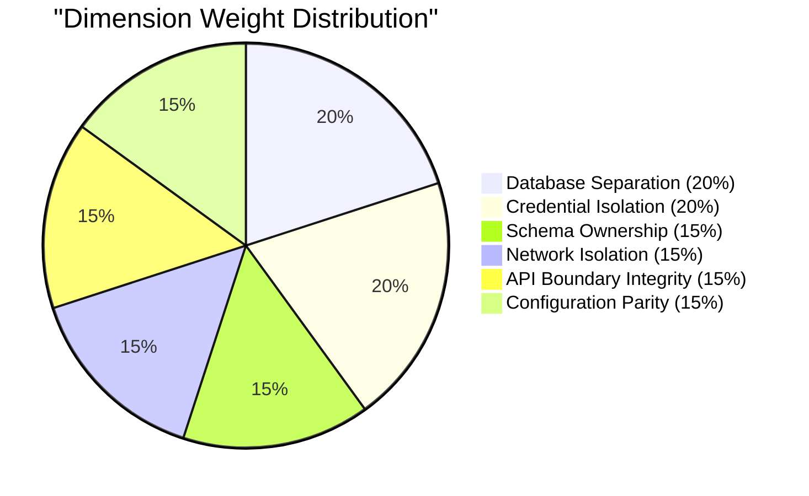
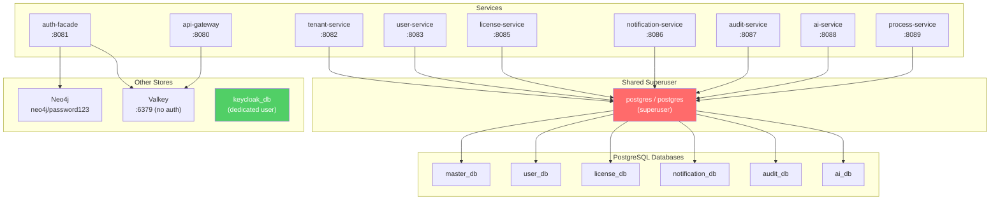
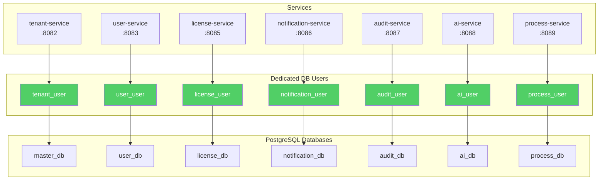
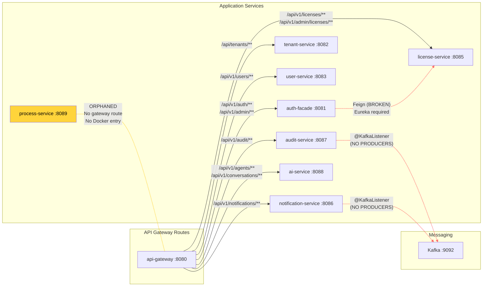
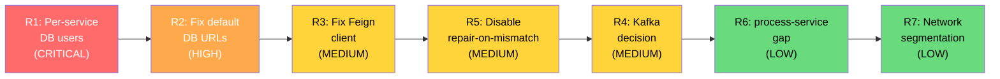

# Service Boundary and Data Isolation Audit Report

**Document ID:** GOV-AUDIT-001
**Date:** 2026-03-02
**Auditor:** SA Agent (v1.1.0)
**Classification:** Internal -- Architecture Governance
**Overall Score:** 4.7 / 10

---

## Table of Contents

1. [Executive Summary](#1-executive-summary)
2. [Audit Methodology](#2-audit-methodology)
3. [Dimension Scores](#3-dimension-scores)
4. [Per-Service Analysis](#4-per-service-analysis)
5. [Findings](#5-findings)
6. [Remediation Recommendations](#6-remediation-recommendations)
7. [Conclusion](#7-conclusion)

---

## 1. Executive Summary

This audit evaluates the data isolation posture of EMSIST's 9 microservices across 6 dimensions. The assessment was conducted by examining actual configuration files, Docker Compose definitions, init-db.sql scripts, and service-to-service communication patterns.

**Overall weighted score: 4.7 / 10** -- indicating significant data isolation gaps that must be addressed before any staging or production deployment.

**Key findings:**

- **CRITICAL:** All 7 PostgreSQL services authenticate using the `postgres` superuser with the same password. Only Keycloak has a dedicated database user.
- **HIGH:** Default `application.yml` configurations point all services to `master_db`. Docker environment overrides correct this for 6 of 7 services, but local development is broken.
- **MEDIUM:** A Feign client in `auth-facade` targets `license-service` via Eureka service discovery, but Eureka is disabled in all services.
- **MEDIUM:** Kafka consumers exist in `audit-service` and `notification-service` with zero `KafkaTemplate` producers anywhere in the codebase.
- **MEDIUM:** `repair-on-mismatch=true` in tenant-service and process-service auto-fixes Flyway checksum inconsistencies -- dangerous for production data integrity.

---

## 2. Audit Methodology

### 2.1 Scope

9 backend microservices were assessed:

| # | Service | Port | Database Technology |
|---|---------|------|---------------------|
| 1 | api-gateway | 8080 | None (routing only) |
| 2 | auth-facade | 8081 | Neo4j + Valkey |
| 3 | tenant-service | 8082 | PostgreSQL |
| 4 | user-service | 8083 | PostgreSQL |
| 5 | license-service | 8085 | PostgreSQL |
| 6 | notification-service | 8086 | PostgreSQL |
| 7 | audit-service | 8087 | PostgreSQL |
| 8 | ai-service | 8088 | PostgreSQL + pgvector |
| 9 | process-service | 8089 | PostgreSQL |

### 2.2 Evidence Sources

| Source | File Path | Purpose |
|--------|-----------|---------|
| Database init script | `/infrastructure/docker/init-db.sql` | Database and user creation |
| Docker Compose (infra) | `/infrastructure/docker/docker-compose.yml` | Service definitions and environment overrides |
| Docker Compose (backend) | `/backend/docker-compose.yml` | Backend local development compose |
| Application configs | `/backend/*/src/main/resources/application.yml` | Default datasource, Kafka, Eureka, Flyway |
| Docker profile configs | `/backend/*/src/main/resources/application-docker.yml` | Docker-environment overrides |
| Route config | `/backend/api-gateway/src/main/java/com/ems/gateway/config/RouteConfig.java` | API gateway routing |
| Feign clients | `/backend/auth-facade/src/main/java/com/ems/auth/client/LicenseServiceClient.java` | Inter-service communication |
| Kafka listeners | `/backend/*/src/main/java/**/listener/*.java` | Event consumers |

### 2.3 Scoring Framework

Each dimension is scored from 0 (no isolation) to 10 (full isolation), weighted by its importance to overall data security:



---

## 3. Dimension Scores

### 3.1 Summary Table

| # | Dimension | Score | Weight | Weighted | Verdict |
|---|-----------|-------|--------|----------|---------|
| D1 | Database Separation | 7/10 | 20% | 1.40 | PARTIAL |
| D2 | Credential Isolation | 2/10 | 20% | 0.40 | FAILING |
| D3 | Schema Ownership | 6/10 | 15% | 0.90 | PARTIAL |
| D4 | Network Isolation | 3/10 | 15% | 0.45 | FAILING |
| D5 | API Boundary Integrity | 5/10 | 15% | 0.75 | PARTIAL |
| D6 | Configuration Parity | 5/10 | 15% | 0.75 | PARTIAL |
| | **TOTAL** | | **100%** | **4.65** | **FAILING** |

**Rounded overall score: 4.7 / 10**

### 3.2 Current vs Target Topology

**Current State:** All services share the `postgres` superuser, granting every service implicit access to every database.



**Target State:** Each service authenticates with a dedicated database user that has access only to its own database.



### 3.3 Dimension Details

#### D1: Database Separation (7/10)

**What works:** The `init-db.sql` script creates 7 separate databases: `master_db`, `user_db`, `license_db`, `notification_db`, `audit_db`, `ai_db`, and `keycloak_db`. Docker Compose environment variables correctly route each service to its designated database.

**What fails:** `process_db` is referenced in `application-docker.yml` (line 4) and documentation (ADR-001, ADR-016) but is never created in `init-db.sql`. The `process-service` has no Docker Compose entry in `/infrastructure/docker/docker-compose.yml`, making it a phantom service in the deployment topology.

**Evidence:**
- `/infrastructure/docker/init-db.sql`: Lines 33-42 create 6 databases (master_db, audit_db, user_db, license_db, notification_db, ai_db). No `process_db`.
- `/backend/process-service/src/main/resources/application-docker.yml`: Line 4 references `process_db`.
- `/infrastructure/docker/docker-compose.yml`: No `process-service` entry (lines 169-413 contain all service definitions).

#### D2: Credential Isolation (2/10)

**What works:** Keycloak has a dedicated user (`keycloak` / `keycloak`) created in `init-db.sql` (lines 17-20) with grants scoped to `keycloak_db` only.

**What fails:** All 7 application services authenticate as the `postgres` superuser with password `postgres`. This means any compromised service can read, modify, or drop any database.

**Evidence (application.yml defaults):**
- `/backend/tenant-service/src/main/resources/application.yml`: Line 10-11 `username: ${DATABASE_USER:postgres}`, `password: ${DATABASE_PASSWORD:postgres}`
- `/backend/user-service/src/main/resources/application.yml`: Line 10-11 (identical)
- `/backend/license-service/src/main/resources/application.yml`: Line 10-11 (identical)
- `/backend/audit-service/src/main/resources/application.yml`: Line 10-11 (identical)
- `/backend/notification-service/src/main/resources/application.yml`: Line 10-11 (identical)
- `/backend/process-service/src/main/resources/application.yml`: Line 10-11 (identical)
- `/backend/ai-service/src/main/resources/application.yml`: Line 11-12 `username: ${DB_USERNAME:ems}`, `password: ${DB_PASSWORD:ems}` (different env var names but still overridden to `postgres` in Docker Compose, line 356)

**Docker Compose confirmation:**
- `/infrastructure/docker/docker-compose.yml`: Lines 229, 254, 280, 306, 331, 356 all set `DATABASE_USER: postgres` and `DATABASE_PASSWORD: postgres`.

#### D3: Schema Ownership (6/10)

**What works:** 6 of 7 PostgreSQL services define custom Flyway history table names, preventing migration metadata collisions if services accidentally share a database:

| Service | Flyway Table | Source |
|---------|-------------|--------|
| user-service | `flyway_schema_history_user` | `application.yml:28` |
| license-service | `flyway_schema_history_license` | `application.yml:28` |
| notification-service | `flyway_schema_history_notification` | `application.yml:28` |
| audit-service | `flyway_schema_history_audit` | `application.yml:28` |
| ai-service | `ai_service_schema_history` | `application.yml:28` |
| process-service | `flyway_schema_history_process` | `application.yml:28` |

**What fails:** `tenant-service` does NOT define a custom Flyway table name. It uses the default `flyway_schema_history`. Since tenant-service legitimately targets `master_db`, and `init-db.sql` also creates tables directly in `master_db`, there is a risk of schema ownership ambiguity. Additionally, because all services default to `master_db` in local development (see D6), multiple services' Flyway histories could collide on the default table name.

**Evidence:** Grep for `flyway_schema_history` in `/backend/tenant-service/` returned zero results. The tenant-service `application.yml` (lines 23-30) configures Flyway but omits the `table` property.

#### D4: Network Isolation (3/10)

**What works:** Docker Compose defines a single network (`ems-network`) and services declare explicit `depends_on` with health checks, ensuring startup ordering.

**What fails:** All containers -- databases, message brokers, application services, and monitoring -- share a single flat bridge network. There is no network segmentation between:
- Application tier (services)
- Data tier (PostgreSQL, Neo4j, Valkey)
- Messaging tier (Kafka, Zookeeper)
- Identity tier (Keycloak)
- Monitoring tier (Prometheus, Grafana)

Any container can directly reach any other container's ports. A compromised `notification-service` container could connect directly to `ems-neo4j:7687` or `ems-postgres:5432` and access any database.

**Evidence:**
- `/infrastructure/docker/docker-compose.yml`: Lines 403-405 define a single `ems-network: driver: bridge`.
- Every service entry includes `networks: - ems-network` (e.g., lines 25, 40, 60, 92, 123, etc.).
- No additional networks (e.g., `data-network`, `app-network`) are defined.
- Valkey is configured without authentication: no password set in Docker Compose or `application.yml`.

#### D5: API Boundary Integrity (5/10)

**What works:**
- Services communicate primarily through the API gateway (`RouteConfig.java`) with well-defined route patterns.
- Auth-facade has a Resilience4j circuit breaker configured for the license-service Feign client (`application.yml:154-169`).
- Kafka listeners use `@ConditionalOnProperty` (e.g., `spring.kafka.enabled`, defaulting to `false`), so they are inactive by default.

**What fails:**
- The Feign client `LicenseServiceClient.java` uses `@FeignClient(name = "license-service")` which resolves via Eureka service discovery. Eureka is disabled (`eureka.client.enabled: false`) in api-gateway, user-service, license-service, notification-service, audit-service, and ai-service. Auth-facade and tenant-service do NOT disable Eureka -- they configure the Eureka URL without `enabled: false`, meaning they will attempt to register and discover, but no Eureka server exists.
- Zero `KafkaTemplate` instances exist anywhere in the codebase (confirmed by grep). The Kafka consumers in `audit-service` and `notification-service` will never receive messages because no service publishes to Kafka topics.
- `process-service` has no API gateway route in `RouteConfig.java` and no Docker Compose service entry, making it unreachable in any deployment.

**Evidence:**
- `/backend/auth-facade/src/main/java/com/ems/auth/client/LicenseServiceClient.java`: Line 13-16 `@FeignClient(name = "license-service", ...)`.
- `/backend/auth-facade/src/main/resources/application.yml`: Lines 40-43 configure Eureka URL without `enabled: false`.
- `/backend/tenant-service/src/main/resources/application.yml`: Lines 39-44 configure Eureka URL without `enabled: false`.
- Grep for `KafkaTemplate` across `/backend/**/*.java`: zero results.
- `/backend/api-gateway/src/main/java/com/ems/gateway/config/RouteConfig.java`: No `process-service` route (lines 20-101).

**Service dependency graph:**



#### D6: Configuration Parity (5/10)

**What works:** Docker profile (`application-docker.yml`) files correctly override database URLs for services that have them. The docker-compose environment variables also set correct database URLs per service.

**What fails:**
- **Default database URL problem:** 6 of 7 PostgreSQL services default their `spring.datasource.url` to `master_db` (e.g., `jdbc:postgresql://localhost:5432/master_db`). This means running any service locally without setting `DATABASE_URL` will connect it to the tenant-service's database. Only `ai-service` uses a different default (`ems` database).
- **`repair-on-mismatch=true`** is enabled by default in `tenant-service` and `process-service` (`application.yml:30-31`). This Flyway flag automatically overwrites migration checksums when they differ, which masks migration corruption. While Docker profiles disable this (`application-docker.yml:12`), local development runs with it enabled.
- **Inconsistent environment variable naming:** `ai-service` uses `DB_HOST`, `DB_PORT`, `DB_NAME`, `DB_USERNAME`, `DB_PASSWORD`, while all other services use `DATABASE_URL`, `DATABASE_USER`, `DATABASE_PASSWORD`.

**Evidence:**

| Service | Default URL | Docker Override | Parity |
|---------|-------------|-----------------|--------|
| tenant-service | `master_db` | `master_db` (correct, same) | OK |
| user-service | `master_db` | `user_db` | MISMATCH |
| license-service | `master_db` | `license_db` | MISMATCH |
| notification-service | `master_db` | `notification_db` | MISMATCH |
| audit-service | `master_db` | `audit_db` | MISMATCH |
| ai-service | `ems` (non-existent) | `ai_db` | MISMATCH |
| process-service | `master_db` | `process_db` (DB not created) | MISMATCH |

---

## 4. Per-Service Analysis

### 4.1 api-gateway (Port 8080)

| Attribute | Value | Evidence |
|-----------|-------|----------|
| Database | None | No `spring.datasource` in `application.yml` |
| DB User | N/A | N/A |
| Flyway Table | N/A | No Flyway configured |
| Network Exposure | Port 8080 exposed to host | Docker Compose line 179 |
| Dependencies | auth-facade, tenant-service | Docker Compose lines 186-187 |
| Valkey | Yes (`spring.data.redis`) | `application.yml:72-75` |
| Isolation Gaps | Shares Valkey keyspace with auth-facade and other services; no key prefix namespacing enforced at infrastructure level |

### 4.2 auth-facade (Port 8081)

| Attribute | Value | Evidence |
|-----------|-------|----------|
| Database | Neo4j (`bolt://localhost:7687`) | `application.yml:28` |
| DB User | `neo4j` / `password123` | Docker Compose line 49, 204 |
| Flyway Table | N/A (Neo4j uses custom Cypher migrations) | `resources/neo4j/migrations/V001-V009` |
| Network Exposure | Port 8081 exposed to host | Docker Compose line 196 |
| Dependencies | Keycloak, Valkey, Neo4j | Docker Compose lines 208-213 |
| Inter-Service | Feign client to license-service (BROKEN) | `LicenseServiceClient.java:13` |
| Isolation Gaps | Feign client uses Eureka discovery but Eureka does not exist; Neo4j credentials are hardcoded in Docker Compose; shares Valkey with api-gateway and user-service |

### 4.3 tenant-service (Port 8082)

| Attribute | Value | Evidence |
|-----------|-------|----------|
| Database | `master_db` (default and Docker) | `application.yml:9`, Docker Compose line 227 |
| DB User | `postgres` / `postgres` | `application.yml:10-11`, Docker Compose lines 228-229 |
| Flyway Table | `flyway_schema_history` (DEFAULT) | No custom table configured |
| Network Exposure | Port 8082 exposed to host | Docker Compose line 222 |
| Dependencies | PostgreSQL, Keycloak, Kafka | Docker Compose lines 233-240 |
| Eureka | Configured but NOT disabled | `application.yml:39-44` (no `enabled: false`) |
| Isolation Gaps | Uses superuser credentials; shares `master_db` with init-db.sql seed tables; Flyway uses default table name (collision risk); Eureka configured but no server exists |

### 4.4 user-service (Port 8083)

| Attribute | Value | Evidence |
|-----------|-------|----------|
| Database (default) | `master_db` | `application.yml:9` |
| Database (Docker) | `user_db` | Docker Compose line 254 |
| DB User | `postgres` / `postgres` | `application.yml:10-11` |
| Flyway Table | `flyway_schema_history_user` | `application.yml:28` |
| Network Exposure | Port 8083 exposed to host | Docker Compose line 250 |
| Dependencies | PostgreSQL, Valkey, Kafka | Docker Compose lines 259-265 |
| Eureka | Configured AND disabled | `application.yml:40` (`enabled: ${EUREKA_ENABLED:false}`) |
| Isolation Gaps | Uses superuser credentials; local dev connects to `master_db` instead of `user_db` |

### 4.5 license-service (Port 8085)

| Attribute | Value | Evidence |
|-----------|-------|----------|
| Database (default) | `master_db` | `application.yml:9` |
| Database (Docker) | `license_db` | Docker Compose line 279 |
| DB User | `postgres` / `postgres` | `application.yml:10-11` |
| Flyway Table | `flyway_schema_history_license` | `application.yml:28` |
| Network Exposure | Port 8085 exposed to host | Docker Compose line 275 |
| Dependencies | PostgreSQL, Valkey, Kafka | Docker Compose lines 284-290 |
| Eureka | Configured AND disabled | `application.yml:40` (`enabled: ${EUREKA_ENABLED:false}`) |
| Isolation Gaps | Uses superuser credentials; Feign client from auth-facade targets this service but cannot resolve via Eureka |

### 4.6 notification-service (Port 8086)

| Attribute | Value | Evidence |
|-----------|-------|----------|
| Database (default) | `master_db` | `application.yml:9` |
| Database (Docker) | `notification_db` | Docker Compose line 306 |
| DB User | `postgres` / `postgres` | `application.yml:10-11` |
| Flyway Table | `flyway_schema_history_notification` | `application.yml:28` |
| Network Exposure | Port 8086 exposed to host | Docker Compose line 301 |
| Dependencies | PostgreSQL, Valkey, Kafka | Docker Compose lines 310-315 |
| Kafka Listener | `NotificationEventListener.java` (conditional, default OFF) | Line 17: `@ConditionalOnProperty(name = "spring.kafka.enabled", havingValue = "true", matchIfMissing = false)` |
| Isolation Gaps | Uses superuser credentials; Kafka consumer exists but no producer in any service publishes to `notification-events` topic |

### 4.7 audit-service (Port 8087)

| Attribute | Value | Evidence |
|-----------|-------|----------|
| Database (default) | `master_db` | `application.yml:9` |
| Database (Docker) | `audit_db` | Docker Compose line 330 |
| DB User | `postgres` / `postgres` | `application.yml:10-11` |
| Flyway Table | `flyway_schema_history_audit` | `application.yml:28` |
| Network Exposure | Port 8087 exposed to host | Docker Compose line 326 |
| Dependencies | PostgreSQL, Valkey, Kafka | Docker Compose lines 335-340 |
| Kafka Listener | `AuditEventListener.java` (conditional, default OFF) | Line 17: `@ConditionalOnProperty(name = "spring.kafka.enabled", havingValue = "true", matchIfMissing = false)` |
| Isolation Gaps | Uses superuser credentials; Kafka consumer exists but no producer in any service publishes to `audit-events` topic |

### 4.8 ai-service (Port 8088)

| Attribute | Value | Evidence |
|-----------|-------|----------|
| Database (default) | `ems` (non-existent database) | `application.yml:9` (`DB_NAME:ems`) |
| Database (Docker) | `ai_db` | Docker Compose line 355, `application-docker.yml:4` |
| DB User (default) | `ems` / `ems` | `application.yml:11-12` |
| DB User (Docker) | `postgres` / `postgres` | Docker Compose lines 356-357 |
| Flyway Table | `ai_service_schema_history` | `application.yml:28` |
| Network Exposure | Port 8088 exposed to host | Docker Compose line 350 |
| Dependencies | PostgreSQL, Valkey, Kafka | Docker Compose lines 361-368 |
| Eureka | Explicitly disabled | `application.yml:101` (`enabled: false`) |
| Isolation Gaps | Uses superuser credentials in Docker; default config uses non-existent `ems` database (will fail on local startup); inconsistent env var naming (`DB_*` vs `DATABASE_*`) |

### 4.9 process-service (Port 8089)

| Attribute | Value | Evidence |
|-----------|-------|----------|
| Database (default) | `master_db` | `application.yml:9` |
| Database (Docker profile) | `process_db` | `application-docker.yml:4` |
| DB User | `postgres` / `postgres` | `application.yml:10-11` |
| Flyway Table | `flyway_schema_history_process` | `application.yml:28` |
| Docker Compose Entry | **NONE** | Not present in `/infrastructure/docker/docker-compose.yml` |
| API Gateway Route | **NONE** | Not present in `RouteConfig.java` |
| Database Created | **NO** | `process_db` not in `init-db.sql` |
| Eureka | Configured but NOT disabled | `application.yml:37-43` (no `enabled: false`) |
| Isolation Gaps | Complete deployment gap -- service exists as a module but has no infrastructure support; `process_db` is referenced but never created; `repair-on-mismatch=true` enabled in default profile |

---

## 5. Findings

### F1: No Per-Service Database Users (CRITICAL)

**Dimension:** Credential Isolation (D2)
**Severity:** CRITICAL
**Risk:** Lateral movement -- a compromised service can access all databases.

**Description:** All 7 PostgreSQL services authenticate using the `postgres` superuser with the password `postgres`. The `postgres` role has unrestricted access to all databases in the PostgreSQL instance. Only Keycloak has a dedicated database user (`keycloak` / `keycloak`) with grants scoped to `keycloak_db`.

**Impact:** If any single service is compromised (e.g., via SQL injection in `notification-service`), the attacker gains full `superuser` access to every database, including `master_db` (tenant registry, master users), `audit_db` (audit trail), and `keycloak_db` (identity data).

**Evidence:**
- `/infrastructure/docker/init-db.sql`: Lines 17-21 create the `keycloak` user. No other service users are created.
- `/infrastructure/docker/docker-compose.yml`: Lines 228-229, 254-255, 280-281, 306-307, 331-332, 356-357 all specify `DATABASE_USER: postgres`.

**Remediation:** See R1 in Section 6.

---

### F2: Default application.yml Points All Services to master_db (HIGH)

**Dimension:** Configuration Parity (D6)
**Severity:** HIGH
**Risk:** Data corruption in local development -- multiple services' Flyway migrations run against the wrong database.

**Description:** The default `spring.datasource.url` in 6 of 7 PostgreSQL services is `jdbc:postgresql://localhost:5432/master_db`. Docker Compose overrides correct this for containerized deployments, but any developer running a service locally without setting the `DATABASE_URL` environment variable will connect to `master_db` and execute that service's Flyway migrations against the tenant registry database.

**Impact:**
- Local development produces incorrect schema states.
- Flyway migrations for `user-service`, `license-service`, etc. could create tables in `master_db`.
- Data corruption if services write to the wrong database.
- Developer confusion -- errors are silent because all services "work" against `master_db`.

**Evidence:**
- `/backend/user-service/src/main/resources/application.yml`: Line 9 defaults to `master_db`.
- `/backend/license-service/src/main/resources/application.yml`: Line 9 defaults to `master_db`.
- `/backend/audit-service/src/main/resources/application.yml`: Line 9 defaults to `master_db`.
- `/backend/notification-service/src/main/resources/application.yml`: Line 9 defaults to `master_db`.
- `/backend/process-service/src/main/resources/application.yml`: Line 9 defaults to `master_db`.
- `/backend/ai-service/src/main/resources/application.yml`: Line 9 defaults to `ems` (non-existent, will fail instead of silently corrupting).

**Remediation:** See R2 in Section 6.

---

### F3: Broken Feign Client -- auth-facade to license-service (MEDIUM)

**Dimension:** API Boundary Integrity (D5)
**Severity:** MEDIUM
**Risk:** Runtime failure when license validation is invoked.

**Description:** `auth-facade` declares a Feign client (`LicenseServiceClient.java`) annotated with `@FeignClient(name = "license-service")`. This name-based resolution requires Eureka service discovery. However, no Eureka server exists in the deployment (the `eureka-server` directory does not exist, and the Docker Compose entry is commented out). The Feign client has a `fallbackFactory` which will be triggered on every call, effectively making license seat validation a no-op.

**Auth-facade's Eureka configuration** does NOT include `enabled: false` (unlike user-service, license-service, etc.), meaning it will attempt to register with and discover from a non-existent Eureka server at startup.

**Evidence:**
- `/backend/auth-facade/src/main/java/com/ems/auth/client/LicenseServiceClient.java`: Lines 13-16.
- `/backend/auth-facade/src/main/resources/application.yml`: Lines 40-43 (Eureka configured, not disabled).
- `/infrastructure/docker/docker-compose.yml`: Lines 152-167 (Eureka commented out with TODO).

**Remediation:** See R3 in Section 6.

---

### F4: Kafka Dead Listeners -- No Producers Exist (MEDIUM)

**Dimension:** API Boundary Integrity (D5)
**Severity:** MEDIUM
**Risk:** False sense of event-driven architecture; dead code maintenance burden.

**Description:** Two services have `@KafkaListener` implementations:
- `audit-service`: `AuditEventListener.java` listens on topic `audit-events`.
- `notification-service`: `NotificationEventListener.java` listens on topic `notification-events`.

Both listeners are gated by `@ConditionalOnProperty(name = "spring.kafka.enabled", havingValue = "true", matchIfMissing = false)`, so they default to OFF. However, even when enabled, they will never receive messages because **zero services have a `KafkaTemplate` bean** -- confirmed by a codebase-wide grep that returned zero results.

Additionally, `tenant-service`, `user-service`, `license-service`, `notification-service`, `audit-service`, and `ai-service` all configure `spring.kafka.bootstrap-servers` in their `application.yml`, and Docker Compose passes `KAFKA_SERVERS: kafka:29092` to 6 services, despite none producing messages.

**Evidence:**
- `/backend/audit-service/src/main/java/com/ems/audit/listener/AuditEventListener.java`: Lines 23-26.
- `/backend/notification-service/src/main/java/com/ems/notification/listener/NotificationEventListener.java`: Lines 23-26.
- Grep for `KafkaTemplate` across `/backend/**/*.java`: zero matches.

**Remediation:** See R4 in Section 6.

---

### F5: Flyway repair-on-mismatch Enabled (MEDIUM)

**Dimension:** Schema Ownership (D3)
**Severity:** MEDIUM
**Risk:** Silent migration corruption -- checksum mismatches are auto-repaired instead of flagged.

**Description:** `tenant-service` and `process-service` set `spring.flyway.repair-on-mismatch: ${FLYWAY_REPAIR:true}` in their default profiles. This means if a migration file's content is modified after it was applied, Flyway will silently update the checksum in the history table instead of failing with an error. This masks a serious data integrity issue -- modified migrations mean the applied schema may differ from what the migration file now describes.

The Docker profile (`application-docker.yml`) correctly sets `repair-on-mismatch: false` for both services, but local development runs with the dangerous default.

**Evidence:**
- `/backend/tenant-service/src/main/resources/application.yml`: Line 30 `repair-on-mismatch: ${FLYWAY_REPAIR:true}`.
- `/backend/process-service/src/main/resources/application.yml`: Line 31 `repair-on-mismatch: ${FLYWAY_REPAIR:true}`.
- `/backend/tenant-service/src/main/resources/application-docker.yml`: Line 12 `repair-on-mismatch: false`.
- `/backend/process-service/src/main/resources/application-docker.yml`: Line 9 `repair-on-mismatch: false`.

**Remediation:** See R5 in Section 6.

---

### F6: process-service is an Orphaned Module (LOW)

**Dimension:** Database Separation (D1)
**Severity:** LOW
**Risk:** Configuration drift; `process_db` is documented and referenced but never created or deployed.

**Description:** `process-service` exists as a Maven module with source code, Flyway migrations, and a Docker profile referencing `process_db`. However:
1. `process_db` is not created in `init-db.sql`.
2. No Docker Compose service entry exists for `process-service`.
3. No API gateway route exists for `process-service` in `RouteConfig.java`.
4. Eureka is configured but not disabled in its `application.yml`.

The service is effectively unreachable in any deployment configuration. ADR-001 and ADR-016 reference `process_db` as if it exists, creating documentation drift.

**Evidence:**
- `/infrastructure/docker/init-db.sql`: `process_db` not in the list of created databases (lines 33-42).
- `/infrastructure/docker/docker-compose.yml`: No `process-service` entry.
- `/backend/api-gateway/src/main/java/com/ems/gateway/config/RouteConfig.java`: No process-service route.
- `/backend/process-service/src/main/resources/application-docker.yml`: Line 4 references `process_db`.

**Remediation:** See R6 in Section 6.

---

## 6. Remediation Recommendations

### R1: Create Per-Service Database Users (CRITICAL -- Priority 1)

**Addresses:** F1 (Credential Isolation)
**Estimated effort:** DBA Agent -- 2-4 hours
**Escalation:** ARCH review required (cross-service change)

Update `init-db.sql` to create dedicated users for each service database with minimal privileges:

```sql
-- Example for user-service
CREATE USER user_svc WITH ENCRYPTED PASSWORD '${USER_SVC_PASSWORD}';
GRANT CONNECT ON DATABASE user_db TO user_svc;
\c user_db
GRANT USAGE ON SCHEMA public TO user_svc;
GRANT SELECT, INSERT, UPDATE, DELETE ON ALL TABLES IN SCHEMA public TO user_svc;
ALTER DEFAULT PRIVILEGES IN SCHEMA public
    GRANT SELECT, INSERT, UPDATE, DELETE ON TABLES TO user_svc;
GRANT USAGE, SELECT ON ALL SEQUENCES IN SCHEMA public TO user_svc;
```

Update each service's `application.yml` and Docker Compose to use the dedicated user. Passwords must be injected via environment variables or secrets management, not hardcoded.

### R2: Fix Default Database URLs (HIGH -- Priority 2)

**Addresses:** F2 (Configuration Parity)
**Estimated effort:** DEV Agent -- 1 hour

Change each service's default `spring.datasource.url` to its correct database:

| Service | Current Default | Correct Default |
|---------|----------------|-----------------|
| user-service | `master_db` | `user_db` |
| license-service | `master_db` | `license_db` |
| notification-service | `master_db` | `notification_db` |
| audit-service | `master_db` | `audit_db` |
| process-service | `master_db` | `process_db` |
| ai-service | `ems` | `ai_db` |

Standardize environment variable naming: all services should use `DATABASE_URL`, `DATABASE_USER`, `DATABASE_PASSWORD` (align `ai-service` with the convention).

### R3: Replace Feign/Eureka with Direct HTTP Client (MEDIUM -- Priority 3)

**Addresses:** F3 (Broken Feign Client)
**Estimated effort:** SA design + DEV implementation -- 4 hours
**Escalation:** ARCH decision required (service discovery strategy)

Options:
1. **Replace Feign with `WebClient`** using direct URLs (consistent with how API gateway routes). Configure URL via `application.yml` property.
2. **Implement Eureka server** if service discovery is desired long-term.
3. **Use Spring Cloud Gateway route** for internal service-to-service calls.

Recommendation: Option 1 (direct `WebClient`) for simplicity, since all other inter-service communication uses direct URLs.

### R4: Remove or Implement Kafka Integration (MEDIUM -- Priority 4)

**Addresses:** F4 (Dead Kafka Listeners)
**Estimated effort:** Depends on decision -- 2-8 hours

Options:
1. **Remove dead listeners** and Kafka configuration from all services if event-driven architecture is not yet needed. Remove Kafka and Zookeeper from Docker Compose.
2. **Implement `KafkaTemplate` producers** in services that should emit audit and notification events (e.g., `auth-facade`, `tenant-service`).

Recommendation: If event-driven is planned for a future phase, keep the listener code but add a clear `[PLANNED]` status tag in documentation. If not planned, remove to reduce configuration surface and Docker resource usage.

### R5: Disable repair-on-mismatch by Default (MEDIUM -- Priority 5)

**Addresses:** F5 (Flyway auto-repair)
**Estimated effort:** DEV Agent -- 30 minutes

Change the default in `tenant-service` and `process-service` from `true` to `false`:

```yaml
flyway:
  repair-on-mismatch: ${FLYWAY_REPAIR:false}
```

Developers who need auto-repair during active migration development can set `FLYWAY_REPAIR=true` explicitly. This is safer than defaulting to auto-repair.

Additionally, add a custom Flyway table name for `tenant-service` (e.g., `flyway_schema_history_tenant`) to prevent collisions with the default table name.

### R6: Resolve process-service Deployment Gap (LOW -- Priority 6)

**Addresses:** F6 (Orphaned Module)
**Estimated effort:** DevOps + DBA -- 2 hours

Options:
1. **Add infrastructure support:** Add `process_db` to `init-db.sql`, add Docker Compose service entry, add API gateway route.
2. **Remove the module** if process-service is not planned for the current phase.

Recommendation: If process-service is in scope, implement Option 1. If not, remove or clearly mark as `[PLANNED]` in documentation and pom.xml.

### R7: Implement Network Segmentation (LOW -- Priority 7)

**Addresses:** D4 (Network Isolation)
**Estimated effort:** DevOps Agent -- 4 hours
**Escalation:** ARCH review required

Define separate Docker networks for tiers:

```yaml
networks:
  app-network:     # Application services
  data-network:    # PostgreSQL, Neo4j, Valkey
  msg-network:     # Kafka, Zookeeper
  identity-network: # Keycloak
  monitor-network:  # Prometheus, Grafana
```

Services are placed on only the networks they need. For example, `notification-service` joins `app-network` and `data-network` but not `identity-network`.

---

## 7. Conclusion

The EMSIST platform has a reasonable database separation strategy (7/10) with separate databases per service, but this is undermined by critically poor credential isolation (2/10). The shared `postgres` superuser eliminates the security benefit of database separation -- any service can access any other service's data.

**Priority remediation path:**



Implementing R1 and R2 alone would raise the overall score from **4.7 to approximately 6.5/10**. Adding R3-R5 would bring it to approximately **7.5/10**. Full remediation (R1-R7) targets **8.5+/10**.

---

**Document History:**

| Version | Date | Author | Changes |
|---------|------|--------|---------|
| 1.0 | 2026-03-02 | SA Agent v1.1.0 | Initial audit report |
