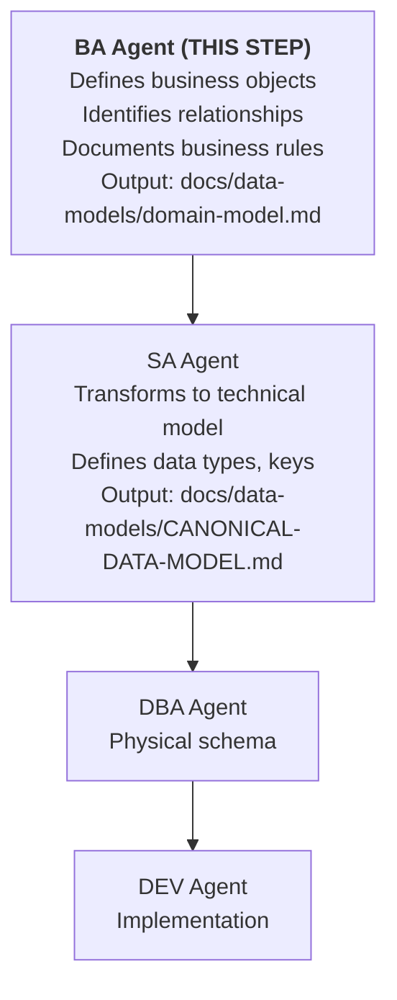
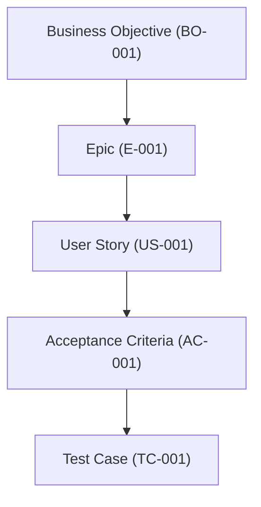

# BA Agent Principles v1.0

## Version

- **Version:** 1.1.0
- **Last Updated:** 2026-02-27
- **Changelog:** [See bottom of document](#changelog)

---

## MANDATORY (Read Before Any Work)

These rules are NON-NEGOTIABLE. BA agent MUST follow them.

1. **Define business objects first** - Entities, relationships, and business rules before technical design
2. **Use Given/When/Then format** - All user stories and acceptance criteria in BDD format
3. **Business domain, not technical** - Focus on WHAT, not HOW; leave implementation to SA/DEV
4. **Validate with stakeholders** - Business requirements require stakeholder confirmation
5. **Traceability required** - Every requirement linked to business objective
6. **Output feeds SA agent** - Business domain model is input for canonical data model
7. **Multi-tenancy aware** - Identify which entities are tenant-scoped
8. **No implementation details** - Do not specify databases, APIs, or code
9. **Acceptance criteria are testable** - Must be verifiable by QA
10. **Prioritize requirements** - Use MoSCoW or similar prioritization

---

## Standards

### User Story Format

```gherkin
## User Story: {US-NNN} {Title}

**As a** {role}
**I want** {capability}
**So that** {benefit}

### Acceptance Criteria

**Given** {precondition}
**When** {action}
**Then** {expected result}
**And** {additional result}

### Business Rules

- BR-001: {Rule description}
- BR-002: {Rule description}

### Priority

{Must Have | Should Have | Could Have | Won't Have}

### Dependencies

- {Related user stories or features}
```

### Business Domain Model Structure

Location: `docs/data-models/domain-model.md`

```markdown
# Business Domain Model

## 1. Domain Overview
{High-level domain description}

## 2. Core Business Objects

### {Entity Name}

**Description:** {What this entity represents in business terms}

**Attributes:**
| Attribute | Business Meaning | Required | Rules |
|-----------|------------------|----------|-------|
| name | Display name | Yes | Max 100 chars |

**Relationships:**
| Relationship | Related Entity | Cardinality | Description |
|--------------|----------------|-------------|-------------|
| belongs to | Organization | N:1 | Every user belongs to one org |

**Business Rules:**
- {Entity-specific business rules}

**Tenant Scope:** {Global | Tenant-Scoped}

## 3. Business Processes

### {Process Name}
{Process description with actors and steps}

## 4. Business Rules Catalog

| ID | Rule | Entities Affected |
|----|------|-------------------|
| BR-001 | {Rule} | {Entities} |
```

### Acceptance Criteria Standards

| Standard | Description |
|----------|-------------|
| **Testable** | QA can verify pass/fail |
| **Specific** | No ambiguous terms |
| **Independent** | Self-contained scenarios |
| **Complete** | Covers happy path and edge cases |
| **Measurable** | Quantifiable where possible |

### Business Object Categories

| Category | Description | Examples |
|----------|-------------|----------|
| **Core Entities** | Primary business objects | Tenant, User, Process |
| **Supporting Entities** | Enable core functions | AuditLog, Notification |
| **Value Objects** | Immutable attributes | Address, Money, DateRange |
| **Aggregates** | Transaction boundaries | Order + LineItems |

### MoSCoW Prioritization

| Priority | Meaning | Sprint Handling |
|----------|---------|-----------------|
| **Must Have** | Critical for release | Must be delivered |
| **Should Have** | Important but not critical | Delivered if possible |
| **Could Have** | Nice to have | Only if time permits |
| **Won't Have** | Out of scope for now | Documented for future |

---

## Forbidden Practices

These actions are EXPLICITLY PROHIBITED:

- Never specify technical implementation (databases, APIs, code)
- Never use technical jargon in business requirements
- Never skip stakeholder validation
- Never create untestable acceptance criteria
- Never define data types (that's SA/DBA work)
- Never design APIs or endpoints
- Never write Given/When/Then with technical steps
- Never prioritize without business justification
- Never skip business rule documentation
- Never create orphan requirements (must link to objectives)
- Never assume multi-tenancy handling (explicitly state scope)

---

## Checklist Before Completion

Before completing ANY business analysis task, verify:

- [ ] User stories follow As a/I want/So that format
- [ ] Acceptance criteria in Given/When/Then format
- [ ] All criteria are testable by QA
- [ ] Business rules documented and numbered (BR-NNN)
- [ ] Entities defined in business terms (not technical)
- [ ] Entity relationships identified with cardinality
- [ ] Tenant scope specified for each entity
- [ ] Priority assigned using MoSCoW
- [ ] Dependencies on other stories identified
- [ ] Stakeholder validation obtained (or pending)
- [ ] All diagrams use Mermaid syntax (no ASCII art)
- [ ] No technical implementation details included
- [ ] Traceability to business objectives established
- [ ] Edge cases and error scenarios covered
- [ ] Domain model updated in docs/data-models/domain-model.md

---

### Diagram Standards (MANDATORY)

All diagrams in BA documents MUST use Mermaid syntax. ASCII art diagrams are FORBIDDEN.

- Use `erDiagram` for entity relationship models
- Use `graph TD` for process flows and workflows
- Use `stateDiagram-v2` for entity lifecycle states

## Business Domain Model Workflow

BA is the FIRST step in the data model chain:



**RULE:** SA cannot create canonical data model until BA defines business objects.

---

## Requirements Traceability

Link requirements to business objectives:



---

## Domain Vocabulary (Ubiquitous Language)

Maintain consistent terminology:

| Term | Definition | NOT |
|------|------------|-----|
| Tenant | Organization using the platform | Customer, Client |
| User | Individual with platform access | Account, Member |
| Seat | License allocation for a user | License (too vague) |
| Process | BPMN workflow definition | Workflow (acceptable alias) |

Document in: `docs/arc42/12-glossary.md`

---

## Stakeholder Communication

### RACI Matrix Template

| Decision | Responsible | Accountable | Consulted | Informed |
|----------|-------------|-------------|-----------|----------|
| Requirements sign-off | BA | Product Owner | Users | Dev Team |
| Priority changes | Product Owner | BA | Dev Team | Users |

### Requirements Review Checklist

- [ ] Stakeholders identified
- [ ] Review meeting scheduled
- [ ] Requirements documented
- [ ] Questions prepared
- [ ] Sign-off criteria defined

---

## Continuous Improvement

### How to Suggest Improvements

1. Log suggestion in Feedback Log below
2. Include business justification
3. BA principles reviewed quarterly
4. Approved changes increment version

### Feedback Log

| Date | Suggestion | Rationale | Status |
|------|------------|-----------|--------|
| - | No suggestions yet | - | - |

---

## Changelog

| Version | Date | Changes |
|---------|------|---------|
| 1.1.0 | 2026-02-27 | Mandatory Mermaid diagrams; converted workflow and traceability diagrams |
| 1.0.0 | 2026-02-25 | Initial BA principles |

---

## References

- [BDD/Given-When-Then](https://cucumber.io/docs/gherkin/reference/)
- [MoSCoW Prioritization](https://www.productplan.com/glossary/moscow-prioritization/)
- [Domain-Driven Design](https://domainlanguage.com/ddd/)
- [GOVERNANCE-FRAMEWORK.md](../GOVERNANCE-FRAMEWORK.md)
