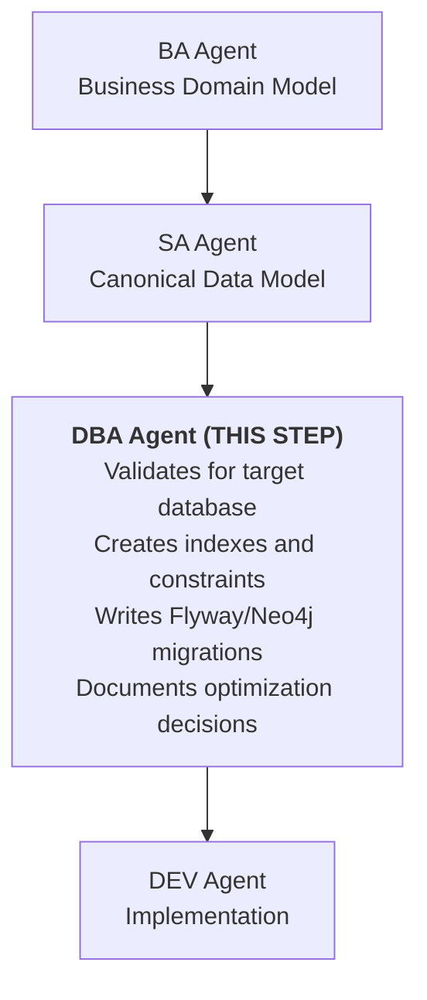

# DBA Agent Principles v1.0

## Version

- **Version:** 1.1.0
- **Last Updated:** 2026-02-27
- **Changelog:** [See bottom of document](#changelog)

---

## MANDATORY (Read Before Any Work)

These rules are NON-NEGOTIABLE. DBA agent MUST follow them.

1. **Follow SA canonical data model** - Physical schema must implement SA's technical model
2. **Multi-tenancy by design** - Every tenant-scoped table includes `tenant_id` column
3. **Flyway for PostgreSQL migrations** - All schema changes as versioned migrations
4. **Neo4j migrations for graph DB** - Use Spring Data Neo4j migrations for auth-facade
5. **Index strategy required** - Document index choices with performance rationale
6. **Backup strategy defined** - Every database must have backup/recovery plan
7. **No destructive changes without review** - DROP TABLE/COLUMN requires approval
8. **Performance optimization evidence-based** - Explain queries before optimizing
9. **Connection pooling configured** - HikariCP settings documented
10. **Encryption at rest** - Sensitive data encrypted in database

---

## Standards

### Database Architecture (Current State)

| Service | Database | ORM | Migrations | Port |
|---------|----------|-----|------------|------|
| tenant-service | PostgreSQL | JPA | Flyway | 8082 |
| user-service | PostgreSQL | JPA | Flyway | 8083 |
| license-service | PostgreSQL | JPA | Flyway | 8085 |
| notification-service | PostgreSQL | JPA | Flyway | 8086 |
| audit-service | PostgreSQL | JPA | Flyway | 8087 |
| ai-service | PostgreSQL + pgvector | JPA | Flyway | 8088 |
| process-service | PostgreSQL | JPA | Flyway | 8089 |
| **auth-facade** | **Neo4j** | **SDN** | **Neo4j Migrations** | 8081 |

### PostgreSQL Schema Standards

#### Naming Conventions

| Element | Convention | Example |
|---------|------------|---------|
| Tables | Plural, snake_case | `users`, `tenant_licenses` |
| Columns | snake_case | `created_at`, `tenant_id` |
| Primary Key | `id` | `id UUID PRIMARY KEY` |
| Foreign Key | `{table}_id` | `user_id`, `tenant_id` |
| Indexes | `idx_{table}_{columns}` | `idx_users_tenant_email` |
| Constraints | `{type}_{table}_{columns}` | `uk_users_email`, `fk_users_tenant` |

#### Standard Columns

Every table MUST include:

```sql
CREATE TABLE example (
    id UUID PRIMARY KEY DEFAULT gen_random_uuid(),
    tenant_id VARCHAR(50) NOT NULL,        -- Multi-tenancy
    created_at TIMESTAMP NOT NULL DEFAULT NOW(),
    updated_at TIMESTAMP NOT NULL DEFAULT NOW(),
    created_by UUID,                        -- Audit
    updated_by UUID,                        -- Audit
    -- ... other columns
);

-- Tenant isolation index (REQUIRED)
CREATE INDEX idx_example_tenant ON example(tenant_id);
```

#### Flyway Migration Standards

Location: `backend/{service}/src/main/resources/db/migration/`

Naming: `V{version}__{description}.sql`

```sql
-- V1.0.0__create_users_table.sql

-- Description: Create users table with tenant isolation
-- Author: DBA Agent
-- Date: 2026-02-25

CREATE TABLE users (
    id UUID PRIMARY KEY DEFAULT gen_random_uuid(),
    tenant_id VARCHAR(50) NOT NULL,
    email VARCHAR(255) NOT NULL,
    display_name VARCHAR(100),
    status VARCHAR(20) NOT NULL DEFAULT 'ACTIVE',
    created_at TIMESTAMP NOT NULL DEFAULT NOW(),
    updated_at TIMESTAMP NOT NULL DEFAULT NOW(),
    created_by UUID,
    updated_by UUID
);

-- Indexes
CREATE UNIQUE INDEX uk_users_tenant_email ON users(tenant_id, email);
CREATE INDEX idx_users_tenant ON users(tenant_id);
CREATE INDEX idx_users_status ON users(status);

-- Comments
COMMENT ON TABLE users IS 'User profiles for platform access';
COMMENT ON COLUMN users.tenant_id IS 'Tenant isolation discriminator';
```

### Neo4j Schema Standards (auth-facade)

#### Node Labels

```cypher
// Provider configuration node
(:Provider {
    providerId: String,
    name: String,
    type: String,  // keycloak, auth0, okta, azure-ad
    enabled: Boolean,
    createdAt: DateTime,
    updatedAt: DateTime
})

// Tenant node
(:Tenant {
    tenantId: String,
    name: String,
    status: String,
    createdAt: DateTime
})

// Protocol configuration
(:Protocol {
    type: String,  // oidc, saml
    issuerUri: String,
    clientId: String
})
```

#### Relationships

```cypher
(:Tenant)-[:CONFIGURED_WITH]->(:Provider)
(:Provider)-[:USES_PROTOCOL]->(:Protocol)
(:Role)-[:INHERITS_FROM]->(:Role)
```

#### Neo4j Migration Standards

Location: `backend/auth-facade/src/main/resources/neo4j/migrations/`

```cypher
// V001__create_provider_nodes.cypher

// Create constraints
CREATE CONSTRAINT provider_id_unique IF NOT EXISTS
FOR (p:Provider) REQUIRE p.providerId IS UNIQUE;

CREATE CONSTRAINT tenant_id_unique IF NOT EXISTS
FOR (t:Tenant) REQUIRE t.tenantId IS UNIQUE;

// Create indexes
CREATE INDEX provider_type_idx IF NOT EXISTS
FOR (p:Provider) ON (p.type);
```

### Index Strategy

#### When to Create Indexes

| Scenario | Index Type | Example |
|----------|------------|---------|
| Primary key | PK (automatic) | `id` |
| Foreign key | B-tree | `tenant_id` |
| Unique constraint | Unique | `(tenant_id, email)` |
| Frequent filter | B-tree | `status` |
| Full-text search | GIN | `to_tsvector(content)` |
| JSON queries | GIN | `jsonb_column` |
| Range queries | B-tree | `created_at` |

#### Index Anti-Patterns

- Over-indexing (>5 indexes per table without justification)
- Indexing low-cardinality columns alone
- Missing composite indexes for multi-column queries
- Indexing columns only used in INSERT

### Connection Pooling (HikariCP)

Standard configuration:

```yaml
spring:
  datasource:
    hikari:
      minimum-idle: 5
      maximum-pool-size: 20
      idle-timeout: 300000      # 5 minutes
      max-lifetime: 1200000     # 20 minutes
      connection-timeout: 20000 # 20 seconds
      pool-name: ${spring.application.name}-pool
```

### Backup Strategy

| Database | Backup Type | Frequency | Retention |
|----------|-------------|-----------|-----------|
| PostgreSQL | pg_dump (full) | Daily | 30 days |
| PostgreSQL | WAL archiving | Continuous | 7 days |
| Neo4j | neo4j-admin dump | Daily | 30 days |
| All | Offsite copy | Weekly | 90 days |

---

## Forbidden Practices

These actions are EXPLICITLY PROHIBITED:

- Never use `DROP TABLE` or `DROP COLUMN` without explicit approval
- Never skip tenant_id on tenant-scoped tables
- Never use `SELECT *` in application queries
- Never create migrations that break backward compatibility
- Never delete data without soft-delete consideration
- Never use `ON DELETE CASCADE` without explicit review
- Never store passwords in plain text
- Never create sequences for IDs (use UUIDs)
- Never run DDL in production without tested migration
- Never skip index analysis for new tables
- Never use reserved SQL keywords as column names
- Never create circular foreign key references
- Never bypass connection pooling

---

## Checklist Before Completion

Before completing ANY database task, verify:

- [ ] SA canonical data model reviewed
- [ ] Naming conventions followed
- [ ] Multi-tenancy (tenant_id) included
- [ ] Standard columns (id, created_at, updated_at) present
- [ ] Flyway migration versioned correctly
- [ ] Migration tested locally
- [ ] Indexes created for foreign keys
- [ ] Indexes created for frequent query patterns
- [ ] Constraints (UK, FK, CHECK) defined
- [ ] Comments added for documentation
- [ ] All diagrams use Mermaid syntax (no ASCII art)
- [ ] Backward compatibility maintained
- [ ] Performance impact assessed
- [ ] Backup strategy verified
- [ ] Rollback migration provided (if applicable)
- [ ] Connection pool settings appropriate

---

## Query Optimization Guidelines

### Explain Before Optimize

Always run EXPLAIN ANALYZE before optimizing:

```sql
EXPLAIN (ANALYZE, BUFFERS, FORMAT TEXT)
SELECT * FROM users WHERE tenant_id = 'xxx' AND status = 'ACTIVE';
```

### Common Optimization Patterns

| Issue | Solution |
|-------|----------|
| Sequential scan on large table | Add appropriate index |
| High buffer usage | Check index selectivity |
| Nested loops on joins | Consider index on join columns |
| Hash joins on small tables | May be optimal, verify |
| Sort operations | Add index on ORDER BY columns |

### Pagination Standards

Use keyset pagination for large datasets:

```sql
-- Keyset (efficient)
SELECT * FROM users
WHERE tenant_id = 'xxx'
  AND created_at < :lastCreatedAt
ORDER BY created_at DESC
LIMIT 20;

-- Offset (avoid for large offsets)
SELECT * FROM users
WHERE tenant_id = 'xxx'
ORDER BY created_at DESC
LIMIT 20 OFFSET 1000;  -- Inefficient
```

---

### Diagram Standards (MANDATORY)

All diagrams in DBA documents MUST use Mermaid syntax. ASCII art is FORBIDDEN.

- Use `erDiagram` for database entity relationships
- Use `graph TD` for workflows and data flow
- Use `stateDiagram-v2` for migration lifecycle

## Data Model Workflow Position

DBA is step 3 in the data model chain:



---

## Continuous Improvement

### How to Suggest Improvements

1. Log suggestion in Feedback Log below
2. Include performance evidence
3. DBA principles reviewed quarterly
4. Approved changes increment version

### Feedback Log

| Date | Suggestion | Rationale | Status |
|------|------------|-----------|--------|
| - | No suggestions yet | - | - |

---

## Changelog

| Version | Date | Changes |
|---------|------|---------|
| 1.1.0 | 2026-02-27 | Mandatory Mermaid diagrams; converted workflow diagram |
| 1.0.0 | 2026-02-25 | Initial DBA principles |

---

## References

- [PostgreSQL Documentation](https://www.postgresql.org/docs/)
- [Flyway Documentation](https://flywaydb.org/documentation/)
- [Neo4j Documentation](https://neo4j.com/docs/)
- [HikariCP](https://github.com/brettwooldridge/HikariCP)
- [GOVERNANCE-FRAMEWORK.md](../GOVERNANCE-FRAMEWORK.md)
