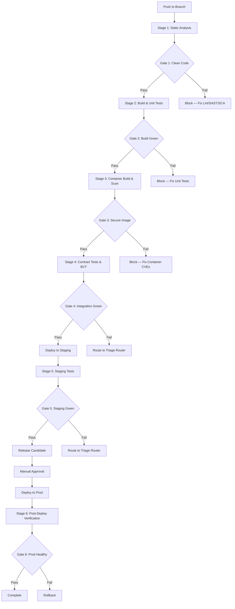
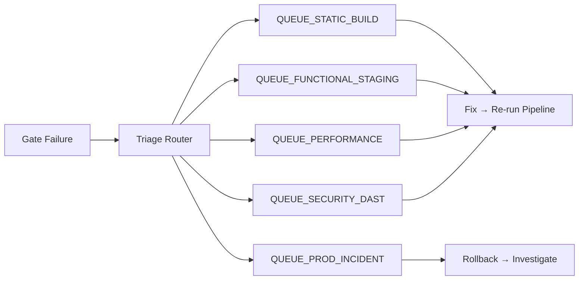
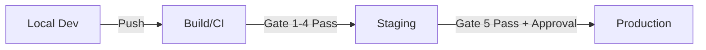
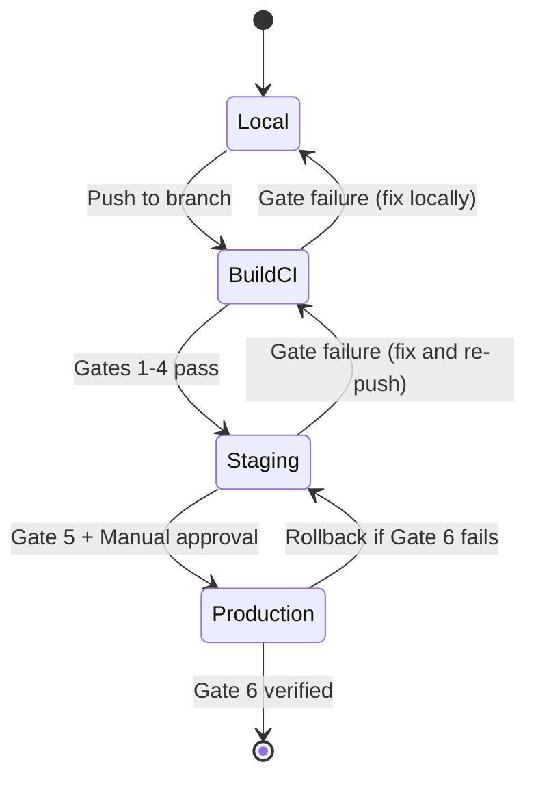
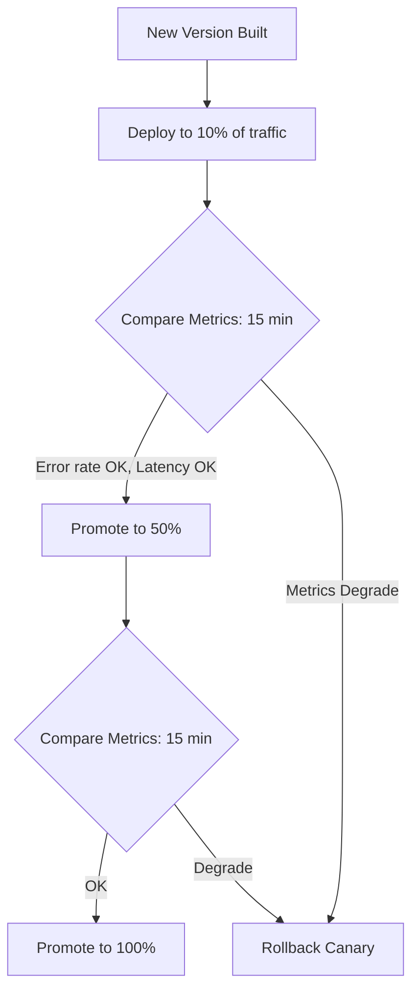

# DEVOPS Agent Principles v2.0

## Version

- **Version:** 2.0.0
- **Last Updated:** 2026-02-27
- **Changelog:** [See bottom of document](#changelog)

---

## MANDATORY (Read Before Any Work)

These rules are NON-NEGOTIABLE. DEVOPS agent MUST follow them.

1. **Infrastructure as Code** - All infrastructure defined in version-controlled code
2. **CI/CD for all changes** - No manual deployments to any environment
3. **Environment parity** - Dev, staging, prod as similar as possible
4. **Secrets via vault** - Never in code, configs, or environment files
5. **Health checks required** - Every service has liveness and readiness probes
6. **Monitoring first** - Observability configured before production deployment
7. **Rollback capability** - Every deployment must be reversible
8. **Resource limits** - All containers have CPU/memory limits
9. **Multi-tenancy aware** - Infrastructure supports tenant isolation
10. **Security scanning** - Container and dependency scans in pipeline
11. **Quality gates enforce progression** - No environment promotion without passing gates
12. **Pipeline owns build-time tests** - Linting, SAST, SCA, BVT are pipeline responsibilities

---

## CI/CD Pipeline Architecture

### Pipeline Flow

The CI/CD pipeline is the backbone of environment management. Every code change flows through this pipeline with quality gates at each stage.



### Pipeline Stages Detail

#### Stage 1: Static Analysis (Build/CI)

| Step | Tool | Owner Agent | Gate Criteria |
|------|------|-------------|---------------|
| Frontend Linting | ESLint (`ng lint`) | `devops` | Zero lint errors |
| Backend Linting | Checkstyle, SpotBugs | `devops` | Zero violations |
| SAST | SonarQube, Semgrep | `sec` | No CRITICAL/HIGH findings |
| SCA | OWASP dependency-check, `npm audit` | `sec` | No known CRITICAL/HIGH CVEs |

**Gate 1: Clean Code** — All linting passes, no critical SAST/SCA findings.

#### Stage 2: Build & Unit Tests (Build/CI)

| Step | Tool | Owner Agent | Gate Criteria |
|------|------|-------------|---------------|
| Backend Build | `mvn clean package -DskipTests` | `devops` | Build succeeds |
| Backend Unit Tests | `mvn test` (JUnit 5 + Mockito) | `qa-unit` | All pass, 80% line / 75% branch |
| Frontend Build | `ng build` | `devops` | Zero errors/warnings |
| Frontend Unit Tests | `npx vitest run --coverage` | `qa-unit` | All pass, 80% coverage |

**Gate 2: Build Green** — Both builds succeed, all unit tests pass, coverage meets targets.

#### Stage 3: Container Build & Scan (Build/CI)

| Step | Tool | Owner Agent | Gate Criteria |
|------|------|-------------|---------------|
| Docker Build | `docker build` (multi-stage) | `devops` | Image builds successfully |
| Container Scan | Trivy / Docker Scout | `sec` | No CRITICAL vulnerabilities |
| Image Push | Push to registry | `devops` | Image tagged with commit SHA |

**Gate 3: Secure Image** — Image passes container security scan.

#### Stage 4: Contract Tests & BVT (Build/CI)

| Step | Tool | Owner Agent | Gate Criteria |
|------|------|-------------|---------------|
| Contract Tests | Spring Cloud Contract / Pact | `qa-int` | All consumer-provider contracts valid |
| BVT | ~20 critical-path tests | `qa-reg` | All critical paths pass |

**Gate 4: Integration Green** — Contracts valid, BVT passes.

#### Stage 5: Staging Tests (Staging)

| Step | Tool | Owner Agent | Gate Criteria |
|------|------|-------------|---------------|
| Smoke Tests | Playwright critical-path subset | `qa-reg` | Login → Navigate → Core feature works |
| Functional E2E | Playwright full suite | `qa-int` | All E2E scenarios pass |
| Responsive Tests | Playwright viewports | `qa-int` | Desktop + Tablet + Mobile pass |
| Accessibility Tests | Playwright + axe-core | `qa-int` | Zero WCAG AAA violations |
| DAST | OWASP ZAP active scan | `sec` | No CRITICAL/HIGH findings |
| Load Tests | k6 / Gatling | `qa-perf` | p95 < 200ms, error rate < 0.1% |
| Regression Suite | Full test assembly | `qa-reg` | No regressions from baseline |
| UAT | Manual acceptance | `uat` | Stakeholder sign-off |

**Gate 5: Staging Green** — All staging tests pass, UAT signed off.

#### Stage 6: Post-Deploy Verification (Production)

| Step | Tool | Owner Agent | Gate Criteria |
|------|------|-------------|---------------|
| Health Check | Actuator endpoints | `devops` | All services UP |
| Smoke Test | Critical-path subset | `qa-reg` | Core flows work |
| Error Rate Check | Prometheus | `devops` | Error rate < 0.1% for 15 min |
| Canary Comparison | Metrics dashboard | `devops` | Canary matches baseline |

**Gate 6: Prod Healthy** — All health checks pass, error rate stable, canary clean.

### Quality Gate Failure Handling

When a gate fails, the pipeline MUST:

1. **Block promotion** — No code moves to the next environment
2. **Route to Triage Router** — The `qa` coordinator classifies the failure (see QA-PRINCIPLES.md)
3. **Notify stakeholders** — Alert the appropriate agent/team based on triage queue
4. **Log the failure** — Record in CI pipeline artifacts for post-mortem



---

## Environment Management

### Environment Overview



| Environment | Purpose | Infrastructure | Spring Profile | Compose File |
|-------------|---------|---------------|----------------|-------------|
| **Local (Dev)** | Developer machine, coding + debugging | `infrastructure/docker/docker-compose.yml` | `local` | `docker-compose.yml` |
| **Staging** | Pre-production, full integration testing | `docker-compose.staging.yml` | `docker` / `staging` | `docker-compose.staging.yml` |
| **Production** | Live system, real users | Kubernetes | `prod` | K8s manifests |

### Local Development Environment

**Owned by:** `devops` + `dev`

**Configuration:** `infrastructure/docker/docker-compose.yml`

Infrastructure services run in Docker; application services run natively (IDE / CLI).

| Service | Image | Port | Purpose |
|---------|-------|------|---------|
| PostgreSQL | `postgres:16-alpine` | 5432 | Relational data (7 services) |
| Neo4j | `neo4j:5.12.0-community` | 7474/7687 | Auth graph (auth-facade only) |
| Valkey | `valkey/valkey:8-alpine` | 6379 | Cache + rate limiting |
| Keycloak | `keycloak/keycloak:24.0` | 8180 | Identity provider |
| Kafka | `confluentinc/cp-kafka:7.5.0` | 9092 | Event streaming |

**Developer workflow:**
1. `docker compose -f infrastructure/docker/docker-compose.yml up -d` — Start infra
2. Run individual services via IDE or `mvn spring-boot:run -Dspring-boot.run.profiles=local`
3. Run frontend via `ng serve` (proxied to API gateway at :8080)

**Dev environment tests (run locally):**
- Unit tests: `mvn test` / `npx vitest run`
- Integration tests: `mvn verify -Pintegration` (Testcontainers spins up isolated containers)

### Staging Environment

**Owned by:** `devops`

**Configuration:** `docker-compose.staging.yml` (root of repository)

All services (infra + application) run in Docker, mirroring production topology.

| Aspect | Staging Config | Production Parity |
|--------|---------------|-------------------|
| Services | All 9 backend services + frontend | Same service count |
| Spring Profile | `docker` or `staging` | Mirrors `prod` config |
| Database | Same PostgreSQL 16 + Neo4j 5.12 | Same versions |
| Cache | Same Valkey 8 | Same version |
| Identity | Same Keycloak 24 | Same realm config |
| Network | Docker network (internal) | Mirrors K8s network policies |
| Secrets | `.env.staging` (not committed) | Vault in prod |
| TLS | Self-signed or Let's Encrypt staging | Let's Encrypt prod |

**Staging deployment flow:**
1. CI pipeline builds Docker images tagged with commit SHA
2. `docker compose -f docker-compose.staging.yml pull` — Pull latest images
3. `docker compose -f docker-compose.staging.yml up -d` — Deploy all services
4. Health check: wait for all `/actuator/health` endpoints to return `UP`
5. Run staging test suite (smoke → E2E → responsive → a11y → DAST → perf)

**Staging environment tests:**
- Smoke: `npx playwright test --grep @smoke`
- E2E: `npx playwright test`
- Responsive: `npx playwright test --grep @responsive`
- Accessibility: `npx playwright test --grep @a11y`
- DAST: OWASP ZAP active scan against staging URL
- Load: `k6 run scripts/load-test.js --env STAGE=staging`

### Environment Parity Validation

The `devops` agent MUST verify environment parity when:
- A new service is added
- Docker images are updated
- Configuration changes between environments

**Parity checklist:**

| Check | How to Verify | Frequency |
|-------|--------------|-----------|
| Service versions match | Compare image tags across environments | Every deployment |
| Database versions match | Compare PostgreSQL/Neo4j versions | Every infra change |
| Configuration alignment | Diff `application-local.yml` vs `application-docker.yml` | Every config change |
| Seed data consistency | Verify Flyway migration state | Every deployment |
| Network topology | Verify service discovery and routing | Every infra change |
| Resource allocation | Compare CPU/memory limits | Every scaling change |
| Secrets rotation | Verify secrets are not stale | Monthly |

### Environment Promotion Gates



| Promotion | Required Gates | Approval |
|-----------|---------------|----------|
| Local → Build/CI | Push to branch | Automatic |
| Build/CI → Staging | Gates 1-4 (lint, build, image scan, BVT) | Automatic |
| Staging → Production | Gate 5 (all staging tests) + UAT sign-off | **Manual approval required** |
| Production rollback | Gate 6 failure (health, error rate, canary) | **Automatic rollback** |

---

## Standards

### Technology Stack (Current)

| Category | Technology | Version |
|----------|------------|---------|
| Containerization | Docker | 24+ |
| Orchestration | Kubernetes | 1.28+ (Prod) |
| CI/CD | GitHub Actions | Latest |
| Registry | Docker Hub / ECR | - |
| Monitoring | Prometheus + Grafana | Latest |
| Logging | Loki / ELK | Latest |
| Tracing | Jaeger / OpenTelemetry | Latest |
| Secrets | HashiCorp Vault (Prod) / `.env` files (Dev/Staging) | Latest |
| Load Balancer | Nginx Ingress (Prod) / Nginx (Staging) | Latest |
| Load Testing | k6 | Latest |
| Container Scanning | Trivy | Latest |

### Docker Standards

#### Dockerfile Best Practices

```dockerfile
# Use specific version tags
FROM eclipse-temurin:23-jdk-alpine AS builder

# Set working directory
WORKDIR /app

# Copy dependency files first (layer caching)
COPY pom.xml .
COPY mvnw .
COPY .mvn .mvn

# Download dependencies
RUN ./mvnw dependency:go-offline

# Copy source and build
COPY src src
RUN ./mvnw package -DskipTests

# Runtime stage
FROM eclipse-temurin:23-jre-alpine AS runtime

# Create non-root user
RUN addgroup -S app && adduser -S app -G app
USER app

WORKDIR /app

# Copy artifact
COPY --from=builder /app/target/*.jar app.jar

# Health check
HEALTHCHECK --interval=30s --timeout=3s \
  CMD wget -q --spider http://localhost:8080/actuator/health || exit 1

# Run
EXPOSE 8080
ENTRYPOINT ["java", "-jar", "app.jar"]
```

#### Image Standards

| Standard | Requirement |
|----------|-------------|
| Base image | Official images only (eclipse-temurin, nginx:alpine) |
| Tags | Specific version, never `latest` in prod |
| Size | Minimize layers, use multi-stage builds |
| Security | Non-root user, no secrets in image |
| Scanning | Trivy scan in CI pipeline (Stage 3) |

### Docker Compose (Development)

Location: `infrastructure/docker/docker-compose.yml`

```yaml
version: '3.8'

services:
  postgres:
    image: postgres:16-alpine
    environment:
      POSTGRES_USER: ${DB_USER:-ems}
      POSTGRES_PASSWORD: ${DB_PASSWORD:-password}
      POSTGRES_DB: ${DB_NAME:-master_db}
    ports:
      - "5432:5432"
    volumes:
      - postgres_data:/var/lib/postgresql/data
    healthcheck:
      test: ["CMD-SHELL", "pg_isready -U ems"]
      interval: 10s
      timeout: 5s
      retries: 5

  neo4j:
    image: neo4j:5.12.0-community
    environment:
      NEO4J_AUTH: ${NEO4J_AUTH:-neo4j/password123}
    ports:
      - "7474:7474"
      - "7687:7687"
    volumes:
      - neo4j_data:/data

  valkey:
    image: valkey/valkey:8-alpine
    ports:
      - "6379:6379"
    healthcheck:
      test: ["CMD", "valkey-cli", "ping"]
      interval: 10s
      timeout: 5s
      retries: 5

volumes:
  postgres_data:
  neo4j_data:
```

### Kubernetes Standards

#### Deployment Template

```yaml
apiVersion: apps/v1
kind: Deployment
metadata:
  name: user-service
  labels:
    app: user-service
    version: v1
spec:
  replicas: 3
  selector:
    matchLabels:
      app: user-service
  template:
    metadata:
      labels:
        app: user-service
        version: v1
    spec:
      containers:
        - name: user-service
          image: ems/user-service:1.0.0
          ports:
            - containerPort: 8083
          resources:
            requests:
              cpu: "100m"
              memory: "256Mi"
            limits:
              cpu: "500m"
              memory: "512Mi"
          livenessProbe:
            httpGet:
              path: /actuator/health/liveness
              port: 8083
            initialDelaySeconds: 30
            periodSeconds: 10
          readinessProbe:
            httpGet:
              path: /actuator/health/readiness
              port: 8083
            initialDelaySeconds: 10
            periodSeconds: 5
          env:
            - name: SPRING_PROFILES_ACTIVE
              value: "kubernetes"
            - name: DB_PASSWORD
              valueFrom:
                secretKeyRef:
                  name: db-credentials
                  key: password
```

### CI/CD Pipeline (GitHub Actions)

```yaml
# .github/workflows/ci.yml
name: CI/CD Pipeline

on:
  push:
    branches: [main, develop]
  pull_request:
    branches: [main]

jobs:
  # Stage 1: Static Analysis
  static-analysis:
    runs-on: ubuntu-latest
    steps:
      - uses: actions/checkout@v4

      - name: Set up JDK 23
        uses: actions/setup-java@v4
        with:
          java-version: '23'
          distribution: 'temurin'

      - name: Set up Node.js
        uses: actions/setup-node@v4
        with:
          node-version: '22'

      - name: Backend Linting
        run: cd backend && ./mvnw checkstyle:check

      - name: Frontend Linting
        run: cd frontend && npm ci && npx ng lint

      - name: SAST Scan
        run: cd backend && ./mvnw sonar:sonar

      - name: SCA Scan
        uses: dependency-check/dependency-check-action@v1

  # Stage 2: Build & Unit Tests
  build-test:
    needs: static-analysis
    runs-on: ubuntu-latest
    steps:
      - uses: actions/checkout@v4

      - name: Backend Build & Test
        run: cd backend && ./mvnw clean verify

      - name: Frontend Build & Test
        run: cd frontend && npm ci && npx vitest run --coverage && npx ng build

  # Stage 3: Container Build & Scan
  container:
    needs: build-test
    runs-on: ubuntu-latest
    strategy:
      matrix:
        service: [api-gateway, auth-facade, tenant-service, user-service, license-service, notification-service, audit-service, ai-service, process-service]
    steps:
      - uses: actions/checkout@v4

      - name: Build Docker Image
        run: docker build -t ems/${{ matrix.service }}:${{ github.sha }} backend/${{ matrix.service }}

      - name: Trivy Container Scan
        uses: aquasecurity/trivy-action@master
        with:
          image-ref: ems/${{ matrix.service }}:${{ github.sha }}
          severity: 'CRITICAL,HIGH'
          exit-code: '1'

  # Stage 4: Contract Tests & BVT
  integration:
    needs: container
    runs-on: ubuntu-latest
    steps:
      - uses: actions/checkout@v4

      - name: Contract Tests
        run: cd backend && ./mvnw verify -Pcontracts

      - name: BVT (Build Verification Tests)
        run: cd frontend && npx playwright test --grep @bvt

  # Stage 5: Deploy to Staging + Staging Tests
  staging:
    needs: integration
    if: github.ref == 'refs/heads/main'
    runs-on: ubuntu-latest
    environment: staging
    steps:
      - name: Deploy to Staging
        run: docker compose -f docker-compose.staging.yml up -d --pull always

      - name: Wait for Health Checks
        run: ./scripts/wait-for-health.sh

      - name: Smoke Tests
        run: npx playwright test --grep @smoke

      - name: E2E Tests
        run: npx playwright test

      - name: DAST Scan
        run: docker run -t owasp/zap2docker-stable zap-baseline.py -t ${{ secrets.STAGING_URL }}

  # Stage 6: Deploy to Production
  production:
    needs: staging
    if: github.ref == 'refs/heads/main'
    runs-on: ubuntu-latest
    environment:
      name: production
      url: https://app.emsist.com
    steps:
      - name: Deploy to Kubernetes
        run: kubectl apply -f k8s/

      - name: Verify Health
        run: ./scripts/check-prod-health.sh

      - name: Post-Deploy Smoke
        run: npx playwright test --grep @smoke --config=playwright.prod.config.ts
```

### Monitoring Standards

#### Prometheus Metrics

Every service must expose:

| Metric | Type | Description |
|--------|------|-------------|
| `http_requests_total` | Counter | Total HTTP requests |
| `http_request_duration_seconds` | Histogram | Request latency |
| `jvm_memory_used_bytes` | Gauge | JVM memory |
| `db_connections_active` | Gauge | Active DB connections |
| `business_operations_total` | Counter | Business events |

```yaml
# application.yml
management:
  endpoints:
    web:
      exposure:
        include: health,info,prometheus,metrics
  endpoint:
    health:
      probes:
        enabled: true
  metrics:
    tags:
      application: ${spring.application.name}
```

#### SLO Definitions

| Service | SLO | Target | Alert Threshold |
|---------|-----|--------|-----------------|
| All APIs | Availability | 99.9% | < 99.5% |
| All APIs | Latency (p95) | < 200ms | > 500ms |
| All APIs | Error rate | < 0.1% | > 1% |

### Synthetic Monitoring (Production)

Post-deployment, the `devops` agent manages continuous production health validation:

| Monitor | Interval | Tool | Alert Channel |
|---------|----------|------|---------------|
| Health endpoint polling | 30s | Prometheus + Blackbox Exporter | PagerDuty/Slack |
| Critical-path synthetic test | 5 min | Playwright (headless) | Slack |
| Error rate dashboard | Continuous | Grafana | PagerDuty (threshold breach) |
| Resource utilization | 15s | Prometheus + cAdvisor | Grafana alerts |

### Canary Deployment

For production deployments with risk:



| Metric | Canary Pass Criteria | Rollback Trigger |
|--------|---------------------|-----------------|
| Error rate | Within 0.05% of baseline | > 0.5% above baseline |
| p95 latency | Within 50ms of baseline | > 200ms above baseline |
| CPU/Memory | Within 20% of baseline | > 50% above baseline |

### Logging Standards

Structured JSON logging:

```json
{
  "timestamp": "2026-02-25T10:30:00Z",
  "level": "INFO",
  "service": "user-service",
  "traceId": "abc123",
  "spanId": "def456",
  "tenantId": "tenant-1",
  "message": "User created",
  "userId": "user-123"
}
```

**NEVER log:**
- Passwords or secrets
- Full tokens
- PII (unless required for audit)
- Stack traces at INFO level

### Deployment Strategies

| Strategy | Use Case | Environment |
|----------|----------|-------------|
| Rolling | Standard updates | All |
| Blue-Green | Zero-downtime required | Production |
| Canary | High-risk changes | Production |
| Recreate | Database migrations | Staging (test first) |

---

## Build-Time Test Orchestration

The `devops` agent is responsible for configuring and maintaining the build-time test orchestration. This includes:

### Linting Configuration

**Frontend (ESLint):**
- Config: `frontend/.eslintrc.json`
- Command: `npx ng lint`
- CI job: `static-analysis`

**Backend (Checkstyle):**
- Config: `backend/checkstyle.xml` (if exists) or default rules
- Command: `mvn checkstyle:check`
- CI job: `static-analysis`

### Test Ordering in Pipeline

Tests are ordered from fastest/cheapest to slowest/most expensive:

```
1. Lint (seconds)        → catches syntax/style issues
2. SAST/SCA (minutes)    → catches security issues early
3. Unit tests (minutes)  → catches logic bugs
4. Container scan (min)  → catches image vulnerabilities
5. Contract tests (min)  → catches API contract breaks
6. BVT (minutes)         → catches critical-path breaks
7. E2E (10+ minutes)     → catches integration issues
8. Performance (30+ min) → catches SLO regressions
```

This "shift left" approach ensures fast feedback for common issues and reserves expensive tests for later stages.

---

## Forbidden Practices

These actions are EXPLICITLY PROHIBITED:

- Never use `latest` tag in production
- Never commit secrets to repository
- Never skip health checks
- Never deploy without CI pipeline passing all gates
- Never use root user in containers
- Never expose debug ports in production
- Never disable resource limits
- Never skip security scans (SAST, SCA, container, DAST)
- Never push directly to production without staging verification
- Never use `--force` without approval
- Never skip rollback planning
- Never ignore monitoring alerts
- Never hard-code environment-specific values
- Never promote to staging without all Build/CI gates passing
- Never promote to production without staging tests + UAT sign-off
- Never skip environment parity validation after infra changes

---

## Checklist Before Completion

Before completing ANY DevOps task, verify:

### Infrastructure
- [ ] Dockerfile follows best practices (multi-stage, non-root, health check)
- [ ] Resource limits set for all containers
- [ ] Secrets via vault/secrets manager (not in code)
- [ ] Health checks defined (liveness + readiness)

### CI/CD Pipeline
- [ ] Pipeline stages in correct order (lint → SAST/SCA → build → test → scan → BVT → deploy)
- [ ] All quality gates configured with pass/fail criteria
- [ ] Container scanning enabled (Trivy)
- [ ] Build-time tests orchestrated correctly
- [ ] Staging deployment automated
- [ ] Production deployment requires manual approval

### Environment Management
- [ ] Local dev environment works with `docker-compose up`
- [ ] Staging environment mirrors production topology
- [ ] Environment parity validated (versions, config, seed data)
- [ ] Spring profiles correct per environment (local, docker/staging, prod)
- [ ] Environment promotion gates enforced

### Monitoring & Operations
- [ ] Prometheus metrics exposed
- [ ] SLO alerts configured
- [ ] Synthetic monitoring active in production
- [ ] Canary deployment configured for high-risk changes
- [ ] Rollback procedure documented and tested
- [ ] Logging structured (JSON) with trace correlation

### Documentation
- [ ] Deployment strategy documented
- [ ] All diagrams use Mermaid syntax (no ASCII art)
- [ ] Environment configuration documented

---

## Continuous Improvement

### How to Suggest Improvements

1. Log suggestion in Feedback Log below
2. Include operational impact
3. DEVOPS principles reviewed quarterly
4. Approved changes increment version

### Feedback Log

| Date | Suggestion | Rationale | Status |
|------|------------|-----------|--------|
| - | No suggestions yet | - | - |

---

## Changelog

| Version | Date | Changes |
|---------|------|---------|
| 2.0.0 | 2026-02-27 | **Major rewrite:** Added CI/CD Pipeline Architecture with 6-stage flow and quality gates; added Environment Management (Local Dev, Staging, Production) with parity validation; added build-time test orchestration with shift-left ordering; added staging deployment flow; added synthetic monitoring and canary deployment; added environment promotion gates; integrated with QA Triage Router pattern; expanded GitHub Actions workflow with all stages; added container scanning (Trivy) to pipeline |
| 1.1.0 | 2026-02-27 | Added Mermaid diagram requirement to checklist |
| 1.0.0 | 2026-02-25 | Initial DEVOPS principles |

---

## References

- [Docker Best Practices](https://docs.docker.com/develop/develop-images/dockerfile_best-practices/)
- [Kubernetes Documentation](https://kubernetes.io/docs/)
- [GitHub Actions](https://docs.github.com/en/actions)
- [Prometheus](https://prometheus.io/docs/)
- [Trivy Container Scanner](https://trivy.dev/)
- [k6 Load Testing](https://k6.io/)
- [OWASP ZAP](https://www.zaproxy.org/)
- [GOVERNANCE-FRAMEWORK.md](../GOVERNANCE-FRAMEWORK.md)
- [QA-PRINCIPLES.md](./QA-PRINCIPLES.md) — Failure Triage Router Pattern
