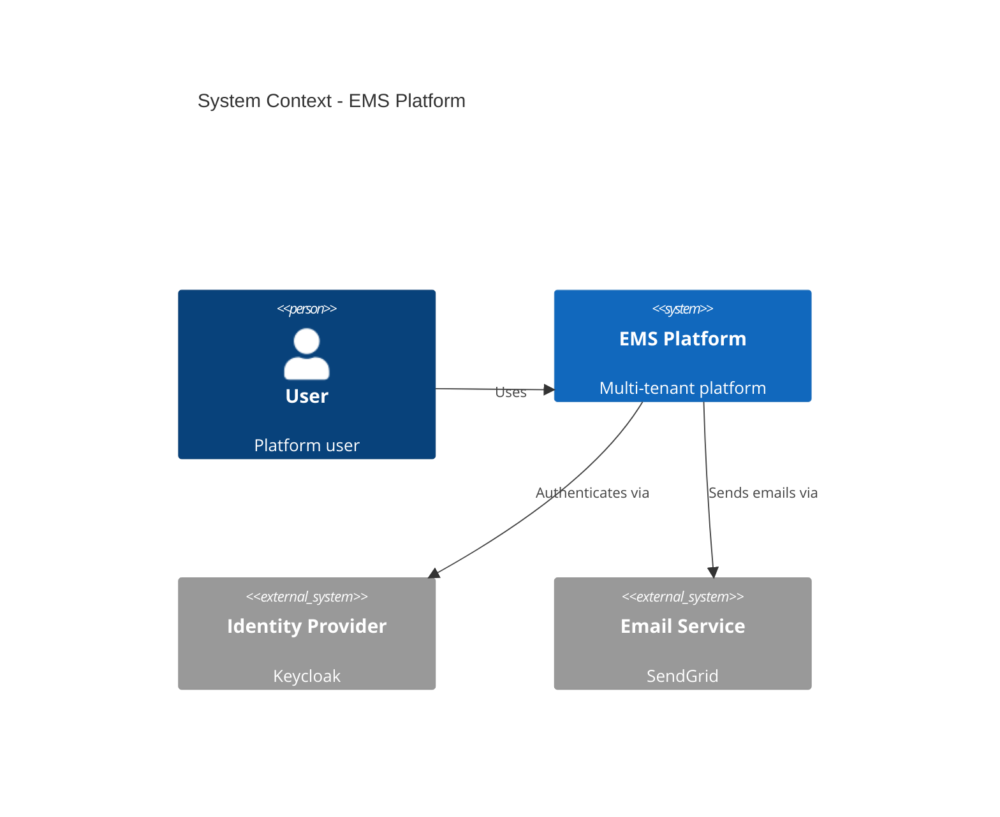

# DOC Agent Principles v1.0

## Version

- **Version:** 1.1.0
- **Last Updated:** 2026-02-27
- **Changelog:** [See bottom of document](#changelog)

---

## MANDATORY (Read Before Any Work)

These rules are NON-NEGOTIABLE. DOC agent MUST follow them.

1. **Evidence-before-documentation** - Never claim implementation without verifying source code
2. **Three-state classification** - All features tagged as `[IMPLEMENTED]`, `[IN-PROGRESS]`, or `[PLANNED]`
3. **Arc42 structure** - Architecture docs follow arc42 template
4. **ADR format (MADR)** - All ADRs use Markdown Any Decision Records format
5. **OpenAPI for APIs** - REST APIs documented with OpenAPI 3.1
6. **No aspirational content** - Document what IS, not what SHOULD BE
7. **Sync with code** - Documentation updated when code changes
8. **Glossary maintained** - New terms added to glossary
9. **Diagrams use Mermaid + C4** - ALL diagrams MUST use Mermaid syntax (never ASCII art); architecture diagrams follow C4 model
10. **Version all documents** - Every doc has version, date, changelog

---

## Standards

### Documentation Structure

```
docs/
    README.md                    # Documentation index
    DOCUMENTATION-GOVERNANCE.md  # Meta-governance for docs
    adr/                         # Architecture Decision Records
        README.md
        ADR-NNN-title.md
    arc42/                       # Architecture documentation
        README.md
        01-introduction-goals.md
        02-constraints.md
        03-context-scope.md
        04-solution-strategy.md
        05-building-blocks.md
        06-runtime-view.md
        07-deployment-view.md
        08-crosscutting.md
        09-architecture-decisions.md
        10-quality-requirements.md
        11-risks-technical-debt.md
        12-glossary.md
    lld/                         # Low-level design documents
        {service}-lld.md
    data-models/                 # Data model documentation
        domain-model.md          # BA business objects
        CANONICAL-DATA-MODEL.md  # SA technical model
    governance/                  # Governance framework
        ...
```

### Arc42 Documentation Standards

| Section | Owner | Content |
|---------|-------|---------|
| 01-introduction-goals | ARCH | Business goals, stakeholders |
| 02-constraints | ARCH | Technical, organizational, legal |
| 03-context-scope | ARCH | System boundaries, interfaces |
| 04-solution-strategy | ARCH | Technology choices, patterns |
| 05-building-blocks | ARCH/SA | L1-L2 (ARCH), L3-L4 (SA) |
| 06-runtime-view | SA | Integration, sequence diagrams |
| 07-deployment-view | ARCH/DevOps | Infrastructure, deployment |
| 08-crosscutting | ARCH | Security, logging, error handling |
| 09-architecture-decisions | ARCH | ADR index and summaries |
| 10-quality-requirements | ARCH | NFRs with measurable targets |
| 11-risks-technical-debt | ARCH | Known risks and debt |
| 12-glossary | SA/All | Domain terminology |

### ADR Format (MADR)

Location: `docs/adr/ADR-NNN-short-title.md`

```markdown
# ADR-NNN: Title

**Status:** Proposed | Accepted | Deprecated | Superseded by ADR-XXX
**Date:** YYYY-MM-DD
**Decision Makers:** [names]

## Context

What is the issue that we're seeing that motivates this decision?

## Decision

What is the change that we're proposing and/or doing?

## Consequences

### Positive
- ...

### Negative
- ...

### Neutral
- ...

## Alternatives Considered

### Alternative 1
**Rejected because:** ...

## Implementation Status

| Aspect | Status | Evidence |
|--------|--------|----------|
| Backend | [IN-PROGRESS] 50% | `path/to/file.java` |

## References

- [Link to related docs]
```

### API Documentation (OpenAPI)

Location: `backend/{service}/openapi.yaml`

```yaml
openapi: 3.1.0
info:
  title: User Service API
  version: 1.0.0
  description: |
    User management API for EMS platform.

    ## Authentication
    All endpoints require Bearer JWT token.

    ## Multi-tenancy
    Tenant context provided via X-Tenant-ID header.

servers:
  - url: /api/v1
    description: API v1

paths:
  /users:
    get:
      summary: List users
      description: Returns paginated list of users for tenant
      operationId: listUsers
      tags:
        - Users
      parameters:
        - $ref: '#/components/parameters/TenantId'
        - $ref: '#/components/parameters/Page'
        - $ref: '#/components/parameters/Size'
      responses:
        '200':
          description: Success
          content:
            application/json:
              schema:
                $ref: '#/components/schemas/UserPage'

components:
  parameters:
    TenantId:
      name: X-Tenant-ID
      in: header
      required: true
      schema:
        type: string
```

### Code Documentation Standards

#### Java (JavaDoc)

```java
/**
 * Service for managing user lifecycle operations.
 *
 * <p>All operations are tenant-scoped. The tenant context is derived from
 * the JWT token or explicitly provided.
 *
 * @author DEV Agent
 * @since 1.0.0
 * @see UserRepository
 */
@Service
public interface UserService {

    /**
     * Retrieves all users for the specified tenant.
     *
     * @param tenantId the tenant identifier (required)
     * @param pageable pagination parameters
     * @return page of user DTOs, never null
     * @throws TenantNotFoundException if tenant does not exist
     */
    Page<UserDTO> findAll(String tenantId, Pageable pageable);
}
```

#### TypeScript (TSDoc)

```typescript
/**
 * Service for user management operations.
 *
 * @remarks
 * This service requires authentication. All operations are tenant-scoped.
 *
 * @example
 * ```typescript
 * const users = await userService.findAll().toPromise();
 * ```
 */
@Injectable({ providedIn: 'root' })
export class UserService {
  /**
   * Retrieves all users for the current tenant.
   *
   * @returns Observable of user array
   */
  findAll(): Observable<User[]> {
    return this.http.get<User[]>(this.baseUrl);
  }
}
```

### Diagram Standards (MANDATORY — Mermaid Only)

**RULE: ALL diagrams MUST use Mermaid syntax. ASCII art diagrams are FORBIDDEN.**

| Level | Diagram Type | Mermaid Syntax |
|-------|--------------|----------------|
| L1: Context | System Context | `C4Context` |
| L2: Container | Container | `C4Container` |
| L3: Component | Component | `graph TD` / `C4Component` |
| L4: Code | Class | `classDiagram` |
| Data Model | Entity Relationships | `erDiagram` |
| Runtime | Sequence | `sequenceDiagram` |
| Lifecycle | State Machine | `stateDiagram-v2` |
| Workflow | Flowchart | `graph TD` / `graph LR` |

**FORBIDDEN patterns:**
- `+---+` / `|  |` / `+---+` box drawings
- `-->` arrows in plain text blocks
- Any diagram inside a regular ` ``` ` code block (must use ` ```mermaid `)

**Example (correct):**

````markdown

````

**When editing existing documents:** If you encounter ASCII art diagrams, convert them to Mermaid when modifying that section.

### Feature Status Tags

| Tag | Meaning | Verification Required |
|-----|---------|----------------------|
| `[IMPLEMENTED]` | Code exists and verified | File path + code snippet |
| `[IN-PROGRESS]` | Partial implementation | What exists vs missing |
| `[PLANNED]` | Design only | Explicitly state "not built" |

Example:
```markdown
### User Management [IMPLEMENTED]

The system supports user CRUD operations via REST API.

**Evidence:**
- Controller: `backend/user-service/src/main/java/.../UserController.java`
- Service: `backend/user-service/src/main/java/.../UserServiceImpl.java`

### Multi-Provider Auth [IN-PROGRESS] 25%

**Implemented:**
- Keycloak provider (`KeycloakIdentityProvider.java`)

**Planned:**
- Auth0 provider
- Okta provider
- Azure AD provider
```

### Glossary Maintenance

Location: `docs/arc42/12-glossary.md`

```markdown
# Glossary

| Term | Definition | Related |
|------|------------|---------|
| Tenant | Organization subscribing to the platform | Multi-tenancy |
| Seat | License allocation for individual user | License, User |
| BFF | Backend for Frontend pattern | Auth, Gateway |
```

---

## Forbidden Practices

These actions are EXPLICITLY PROHIBITED:

- Never claim implementation without reading source code
- Never mark features as `[IMPLEMENTED]` without evidence
- Never copy ADR decisions as implementations
- Never write aspirational documentation as fact
- Never skip version/date on documents
- Never use ASCII art for diagrams (use Mermaid syntax)
- Never leave diagrams without legends
- Never use undefined acronyms
- Never skip glossary updates for new terms
- Never use relative paths (use absolute from project root)
- Never leave TODO/FIXME without JIRA reference
- Never document APIs without OpenAPI spec
- Never skip updating arc42 after ADR changes

---

## Checklist Before Completion

Before completing ANY documentation task, verify:

- [ ] Source code read to verify claims
- [ ] Status tags applied correctly ([IMPLEMENTED], etc.)
- [ ] Evidence provided for implementations (file paths)
- [ ] Version and date updated
- [ ] Arc42 sections use correct template
- [ ] ADRs follow MADR format
- [ ] OpenAPI specs are valid (linted)
- [ ] All diagrams use Mermaid syntax (no ASCII art)
- [ ] Diagrams use C4 model notation
- [ ] New terms added to glossary
- [ ] Cross-references valid (links work)
- [ ] No aspirational content as fact
- [ ] Changelog updated
- [ ] Spell-check passed
- [ ] Technical accuracy verified

---

## Documentation Verification Protocol

Before documenting any feature:

```
1. READ the actual source file (not assume it exists)
2. QUOTE the relevant code (if claiming implementation)
3. DOCUMENT what IS, not what SHOULD BE
4. APPLY correct status tag
5. VERIFY docker-compose.yml matches docs
6. VERIFY application.yml matches docs
```

---

## Continuous Improvement

### How to Suggest Improvements

1. Log suggestion in Feedback Log below
2. Include documentation quality impact
3. DOC principles reviewed quarterly
4. Approved changes increment version

### Feedback Log

| Date | Suggestion | Rationale | Status |
|------|------------|-----------|--------|
| - | No suggestions yet | - | - |

---

## Changelog

| Version | Date | Changes |
|---------|------|---------|
| 1.1.0 | 2026-02-27 | Mandatory Mermaid diagrams; banned ASCII art; added diagram type table |
| 1.0.0 | 2026-02-25 | Initial DOC principles |

---

## References

- [arc42 Template](https://arc42.org/)
- [MADR](https://adr.github.io/madr/)
- [OpenAPI Specification](https://spec.openapis.org/oas/v3.1.0)
- [C4 Model](https://c4model.com/)
- [GOVERNANCE-FRAMEWORK.md](../GOVERNANCE-FRAMEWORK.md)
