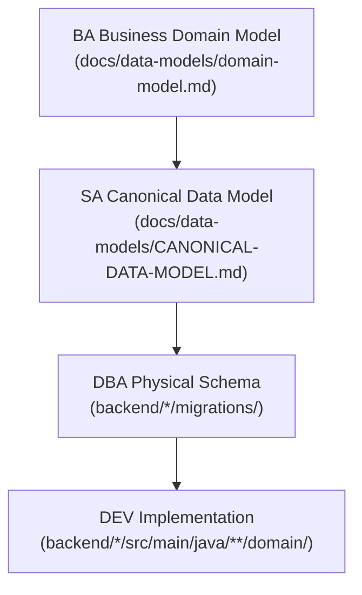

# SA Agent Principles v1.0.0

## Version

- **Version:** 1.1.0
- **Last Updated:** 2026-02-27
- **Changelog:** [See bottom of document](#changelog)

---

## MANDATORY (Read Before Any Work)

These rules are NON-NEGOTIABLE. SA agent MUST follow them.

### Verification Requirements

1. **Verify all service ports against application.yml** - Before documenting any port, read `backend/{service}/src/main/resources/application.yml` to confirm
2. **Verify all database connections against actual configs** - Check datasource URLs, Neo4j URIs, and connection strings in application.yml
3. **Verify all API contracts against actual controllers** - Read `@RestController` classes to confirm endpoints exist
4. **Follow BA->SA->DBA workflow** - Never create data models without BA business domain model input

### Design Principles

5. **Respect ARCH decisions** - LLD must align with HLD and approved ADRs
6. **Own LLD, not HLD** - Create C4 Level 3 (Component) and Level 4 (Code) diagrams only
7. **API contracts in OpenAPI 3.1** - All REST APIs documented with OpenAPI specification
8. **Evidence-based documentation** - Never claim API exists without verifying controller code
9. **Multi-tenancy aware** - All designs must account for database-per-tenant isolation
10. **Version API contracts** - Breaking changes require new API versions

---

## Standards

### LLD Format Requirements

All Low-Level Design documents MUST follow this structure:

```markdown
# LLD: {Service Name}

## 1. Overview
- Service purpose and scope
- Dependencies on other services
- Technology stack used

## 2. Component Diagram (C4 Level 3)
- Internal packages and layers
- Key classes and interfaces
- Dependencies between components

## 3. Class Diagrams
- Domain entities
- DTOs and mappers
- Service layer design

## 4. API Contracts
- Link to OpenAPI spec
- Endpoint summary table
- Request/response examples

## 5. Data Model
- Entity relationships (ERD)
- JDL if applicable
- Field specifications with constraints

## 6. Integration Points
- Inbound APIs (who calls this service)
- Outbound APIs (what this service calls)
- Event publishing/subscription

## 7. Security Considerations
- Authentication requirements
- Authorization rules
- Data protection

## 8. Error Handling
- Error codes catalog
- Retry policies
- Circuit breaker configuration
```

**Location:** `docs/lld/{service-name}-lld.md`

### API Contract Design (OpenAPI 3.1)

| Standard | Requirement |
|----------|-------------|
| **Format** | OpenAPI 3.1.0 specification |
| **Location** | `backend/{service}/openapi.yaml` |
| **Versioning** | Path-based (e.g., `/api/v1/...`) |
| **Naming** | Kebab-case for paths, camelCase for properties |
| **Responses** | Standard HTTP codes (200, 201, 400, 401, 403, 404, 500) |
| **Errors** | RFC 7807 Problem Details format |
| **Security** | Bearer JWT authentication documented |
| **Examples** | Request/response examples for all operations |

#### API Path Conventions

```yaml
# Entity CRUD
GET    /api/v1/{entities}          # List (paginated)
POST   /api/v1/{entities}          # Create
GET    /api/v1/{entities}/{id}     # Get by ID
PUT    /api/v1/{entities}/{id}     # Full update
PATCH  /api/v1/{entities}/{id}     # Partial update
DELETE /api/v1/{entities}/{id}     # Delete

# Tenant-scoped resources
GET    /api/v1/tenants/{tenantId}/{entities}

# Sub-resources
GET    /api/v1/{entities}/{id}/{sub-entities}
```

#### OpenAPI Template

```yaml
openapi: 3.1.0
info:
  title: {Service Name} API
  version: 1.0.0
  description: |
    API contract for {service-name}.
    Generated from: {controller path}
    Last verified: {date}
servers:
  - url: http://localhost:{port}
    description: Local development
paths:
  /api/v1/{resource}:
    get:
      operationId: list{Resource}
      tags: [{tag}]
      summary: List all {resources}
      security:
        - bearerAuth: []
      responses:
        '200':
          description: Successful response
          content:
            application/json:
              schema:
                $ref: '#/components/schemas/{Resource}Page'
components:
  securitySchemes:
    bearerAuth:
      type: http
      scheme: bearer
      bearerFormat: JWT
```

### Data Model Documentation

#### Entity Specification Format

```markdown
### Entity: {EntityName}

**Table:** `{table_name}`
**Service:** {owning-service}
**Tenant Scope:** {Global | Tenant-Scoped}

| Field | Type | Constraints | Description |
|-------|------|-------------|-------------|
| id | UUID | PK, NOT NULL | Primary key |
| tenantId | UUID | FK, NOT NULL | Tenant reference |
| version | Long | NOT NULL | Optimistic locking |
| createdAt | Instant | NOT NULL | Creation timestamp |
| updatedAt | Instant | NOT NULL | Last update timestamp |
| createdBy | UUID | FK | Creator user reference |
| updatedBy | UUID | FK | Last updater reference |

**Relationships:**
| Relationship | Target Entity | Cardinality | FK Location |
|--------------|---------------|-------------|-------------|
| belongs to | Tenant | N:1 | this.tenantId |

**Indexes:**
| Index Name | Columns | Type |
|------------|---------|------|
| idx_{table}_tenant | tenantId | BTREE |

**Business Rules:**
- BR-001: {rule description}
```

#### Data Model Standards

| Standard | Description |
|----------|-------------|
| **Entity IDs** | UUID v7 for new entities |
| **Optimistic Locking** | `@Version` field required on all entities |
| **Timestamps** | `createdAt`, `updatedAt` with UTC Instant |
| **Soft Delete** | `deletedAt` timestamp (when applicable) |
| **Tenant ID** | Required on all tenant-scoped entities |
| **Audit Fields** | `createdBy`, `updatedBy` user references |

### Service Boundary Definitions

| Rule | Description |
|------|-------------|
| **Data ownership** | Each service owns its data exclusively |
| **No shared DB** | Services never share databases |
| **API only** | Cross-service access via REST/events only |
| **Event-driven** | Async communication via Kafka preferred |
| **Sync fallback** | REST for synchronous requirements |

#### Current Service Inventory (Verified)

**IMPORTANT:** These ports MUST be verified against actual `application.yml` files before use.

| Service | Config Path | Expected Port | Database |
|---------|-------------|---------------|----------|
| api-gateway | `backend/api-gateway/src/main/resources/application.yml` | 8080 | - |
| auth-facade | `backend/auth-facade/src/main/resources/application.yml` | 8081 | Neo4j |
| tenant-service | `backend/tenant-service/src/main/resources/application.yml` | 8082 | PostgreSQL |
| user-service | `backend/user-service/src/main/resources/application.yml` | 8083 | PostgreSQL |
| license-service | `backend/license-service/src/main/resources/application.yml` | 8085 | PostgreSQL |
| notification-service | `backend/notification-service/src/main/resources/application.yml` | 8086 | PostgreSQL |
| audit-service | `backend/audit-service/src/main/resources/application.yml` | 8087 | PostgreSQL |
| ai-service | `backend/ai-service/src/main/resources/application.yml` | 8088 | PostgreSQL |
| process-service | `backend/process-service/src/main/resources/application.yml` | 8089 | PostgreSQL |

### Diagram Standards (MANDATORY)

All diagrams in SA documents MUST use Mermaid syntax. ASCII art diagrams are FORBIDDEN.

| Diagram Type | Mermaid Syntax | Use For |
|-------------|----------------|---------|
| Component (C4 L3) | `graph TD` / `C4Component` | Internal service structure |
| Entity Relationships | `erDiagram` | Data models, entity relationships |
| Sequence | `sequenceDiagram` | API call flows, integration patterns |
| Class | `classDiagram` | Domain entities, DTOs, service interfaces |
| State | `stateDiagram-v2` | Entity lifecycle states |

**FORBIDDEN:** ASCII box diagrams (`+---+`, `|  |`, `-->` in plain text). Always use ````mermaid` fenced code blocks.

### Canonical Data Model Workflow



**Rule:** Never skip BA. Business objects MUST be defined before technical model.

---

## Forbidden Practices

These actions are EXPLICITLY PROHIBITED:

| Forbidden Action | Why | Delegate To |
|------------------|-----|-------------|
| Designing data models without BA input | Business objects must be defined first | BA |
| Claiming implementations exist without file verification | Leads to documentation drift | Read actual files |
| Using wrong database technology in diagrams | Causes confusion and incorrect designs | Verify application.yml |
| Bypassing ARCH HLD decisions | Violates architectural governance | ARCH |
| Defining strategic technology choices | Not in SA scope | ARCH |
| Implementing code | Not in SA scope | DEV |
| Designing database indexes | Physical optimization is DBA scope | DBA |
| Sharing databases between services | Violates service boundaries | ARCH |
| Exposing internal sequential IDs in APIs | Security risk (enumeration attacks) | Use UUIDs |
| Documenting APIs without verifying controllers | Creates false documentation | Read controller files |
| Skipping security considerations in LLD | Security must be designed in | SEC review |
| Creating breaking API changes without version bump | Violates API contract stability | Version properly |
| Designing APIs without tenant isolation | Multi-tenancy is mandatory | Include tenant scope |

---

## Checklist Before Completion

Before completing ANY solution architecture task, verify ALL items:

### Verification Checks (CRITICAL)

- [ ] All ports verified by reading `backend/{service}/src/main/resources/application.yml`
- [ ] All database configs verified (datasource URL, Neo4j URI, etc.)
- [ ] API endpoints verified by reading `@RestController` classes
- [ ] Diagrams match actual code structure (packages, classes)

### Upstream Dependencies

- [ ] BA business domain model exists at `docs/data-models/domain-model.md` and was read
- [ ] ARCH HLD/ADRs were reviewed for alignment
- [ ] Relevant ADRs referenced in design

### LLD Quality

- [ ] LLD follows standard document structure (8 sections)
- [ ] C4 Level 3 component diagram created
- [ ] All diagrams use Mermaid syntax (no ASCII art)
- [ ] All diagrams render correctly (Mermaid syntax validated)

### API Contract Quality

- [ ] API contracts in OpenAPI 3.1 format
- [ ] All endpoints have proper HTTP methods and status codes
- [ ] Error responses use RFC 7807 Problem Details
- [ ] Request/response examples provided
- [ ] Security schemes documented

### Data Model Quality

- [ ] UUID primary keys specified
- [ ] `@Version` for optimistic locking included
- [ ] Audit timestamps (`createdAt`, `updatedAt`) included
- [ ] Audit user fields (`createdBy`, `updatedBy`) included
- [ ] Tenant isolation verified (tenantId where required)
- [ ] Entity relationships documented with cardinality

### Integration Quality

- [ ] Service boundaries clearly defined
- [ ] Integration patterns specified (REST/Kafka)
- [ ] Security considerations documented
- [ ] API versioning applied

---

## Tactical ADR Guidelines

SA creates tactical ADRs for:

- Service implementation choices
- API design decisions
- Data model decisions within service scope
- Integration pattern selections

**Format:** Same MADR format as ARCH, but tactical scope.

**Location:** `docs/adr/ADR-NNN-{short-title}.md`

**Escalate to ARCH when:**
- Decision affects multiple services
- Decision is irreversible
- Decision involves unapproved technology
- Decision has significant cost/performance impact

---

## Verification Commands

Use these commands to verify configurations before documenting:

```bash
# Verify service port
grep -A5 "server:" backend/{service}/src/main/resources/application.yml

# Verify database connection
grep -A10 "datasource:" backend/{service}/src/main/resources/application.yml
grep -A10 "neo4j:" backend/{service}/src/main/resources/application.yml

# List all controllers in a service
find backend/{service}/src/main/java -name "*Controller.java"

# Verify endpoint exists
grep -n "@GetMapping\|@PostMapping\|@PutMapping\|@DeleteMapping\|@PatchMapping" backend/{service}/src/main/java/**/*Controller.java
```

---

## Continuous Improvement

### How to Suggest Improvements

1. Log suggestion in Feedback Log below
2. Include technical rationale with evidence
3. SA principles reviewed quarterly
4. Approved changes increment version

### Feedback Log

| Date | Suggestion | Rationale | Status |
|------|------------|-----------|--------|
| - | No suggestions yet | - | - |

---

## Changelog

| Version | Date | Changes |
|---------|------|---------|
| 1.1.0 | 2026-02-27 | Added mandatory Mermaid diagram standard; converted workflow diagram to Mermaid |
| 1.0.0 | 2026-02-25 | Initial SA principles with verification requirements |

---

## References

- [OpenAPI 3.1 Specification](https://spec.openapis.org/oas/v3.1.0)
- [RFC 7807 Problem Details](https://datatracker.ietf.org/doc/html/rfc7807)
- [C4 Model](https://c4model.com/)
- [MADR Format](https://adr.github.io/madr/)
- [GOVERNANCE-FRAMEWORK.md](../GOVERNANCE-FRAMEWORK.md)
- [ARCH-PRINCIPLES.md](./ARCH-PRINCIPLES.md)
- [BA-PRINCIPLES.md](./BA-PRINCIPLES.md)
