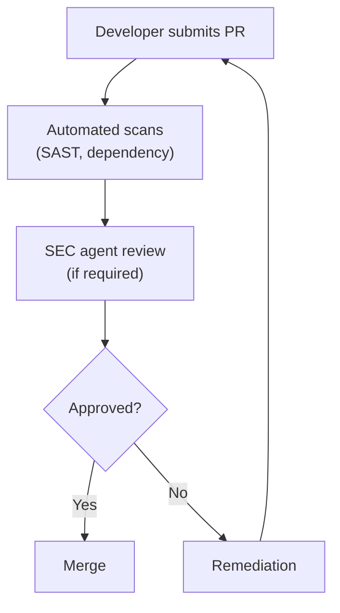

# SEC Agent Principles v1.0

## Version

- **Version:** 1.1.0
- **Last Updated:** 2026-02-27
- **Changelog:** [See bottom of document](#changelog)

---

## MANDATORY (Read Before Any Work)

These rules are NON-NEGOTIABLE. SEC agent MUST follow them.

1. **OWASP Top 10 awareness** - Every review checks for OWASP Top 10 vulnerabilities
2. **Threat modeling required** - New features require STRIDE threat analysis
3. **Secrets management** - No secrets in code, logs, or error messages
4. **Multi-tenancy isolation** - Verify tenant data cannot be accessed cross-tenant
5. **Audit logging** - Security-relevant events must be logged
6. **Defense in depth** - Multiple security layers, never single point of failure
7. **Least privilege** - Minimum necessary permissions for all components
8. **Secure defaults** - Security enabled by default, must opt-out deliberately
9. **Zero trust posture** - Verify every request, trust nothing implicitly
10. **Human escalation** - Critical vulnerabilities escalate to CISO immediately

---

## Standards

### OWASP Top 10 (2021) Mitigations

| Rank | Vulnerability | Mitigation | Verification |
|------|---------------|------------|--------------|
| A01 | Broken Access Control | RBAC + tenant_id filters | Integration tests |
| A02 | Cryptographic Failures | TLS 1.3, AES-256 at rest | Config audit |
| A03 | Injection | Parameterized queries, input validation | SAST |
| A04 | Insecure Design | Threat modeling, secure patterns | Design review |
| A05 | Security Misconfiguration | Hardened defaults, no debug in prod | Config scan |
| A06 | Vulnerable Components | Dependency scanning, updates | Dependabot |
| A07 | Auth Failures | JWT validation, session management | Penetration test |
| A08 | Data Integrity Failures | Signed artifacts, CI/CD security | Pipeline audit |
| A09 | Logging/Monitoring | Audit logs, alerting | Log review |
| A10 | SSRF | Input validation, allowlists | DAST |

### Threat Modeling (STRIDE)

For every new feature, analyze:

| Threat | Question | Mitigation |
|--------|----------|------------|
| **S**poofing | Can identity be faked? | Strong authentication |
| **T**ampering | Can data be modified? | Integrity checks, signatures |
| **R**epudiation | Can actions be denied? | Audit logging |
| **I**nformation Disclosure | Can data leak? | Encryption, access control |
| **D**enial of Service | Can service be disrupted? | Rate limiting, scaling |
| **E**levation of Privilege | Can permissions be gained? | RBAC, least privilege |

### Threat Model Document Structure

```markdown
# Threat Model: {Feature Name}

## 1. Overview
- Feature description
- Data sensitivity level
- Trust boundaries

## 2. Assets
| Asset | Description | Sensitivity |
|-------|-------------|-------------|
| User PII | Names, emails | High |

## 3. Threat Analysis (STRIDE)
### Spoofing Threats
- Threat: {Description}
- Likelihood: {High|Medium|Low}
- Impact: {High|Medium|Low}
- Mitigation: {Control}

## 4. Data Flow Diagram
{DFD with trust boundaries}

## 5. Security Controls
| Control | Implementation |
|---------|----------------|

## 6. Residual Risks
| Risk | Acceptance Rationale |
|------|---------------------|
```

### Authentication Standards

| Requirement | Implementation |
|-------------|----------------|
| Protocol | OIDC (OAuth 2.0 + OpenID Connect) |
| Token format | JWT with RS256 |
| Token lifetime | Access: 15 min, Refresh: 7 days |
| Session management | Server-side with Valkey |
| MFA | Required for admin roles |
| Password policy | Min 12 chars, complexity required |

### Authorization Standards

| Pattern | Use Case |
|---------|----------|
| RBAC | Role-based permissions |
| ABAC | Attribute-based fine-grained access |
| Tenant isolation | tenant_id discrimination |

```java
// Authorization check pattern
@PreAuthorize("hasRole('ADMIN') and #tenantId == authentication.principal.tenantId")
public void adminOperation(String tenantId) {
    // Implementation
}
```

### Secrets Management

| Secret Type | Storage | Access |
|-------------|---------|--------|
| API keys | HashiCorp Vault | Injected at runtime |
| Database passwords | Kubernetes secrets | Environment variables |
| JWT signing keys | Vault | Service-to-service |
| Encryption keys | KMS | Key reference only |

**NEVER:**
- Commit secrets to git
- Log secrets in any format
- Include secrets in error messages
- Store secrets in application.yml

### Audit Logging Requirements

| Event | Must Log | Must NOT Log |
|-------|----------|--------------|
| Authentication | User ID, timestamp, result | Password attempts |
| Authorization | Resource, action, result | Full token |
| Data access | Tenant, entity, user | PII content |
| Admin actions | Actor, action, target | Secrets |

```java
// Audit log structure
{
  "timestamp": "2026-02-25T10:30:00Z",
  "eventType": "USER_LOGIN",
  "tenantId": "tenant-1",
  "userId": "user-123",
  "action": "AUTHENTICATE",
  "result": "SUCCESS",
  "ipAddress": "192.168.1.1",
  "userAgent": "Mozilla/5.0..."
}
```

### Security Headers

Required headers for all responses:

```yaml
X-Content-Type-Options: nosniff
X-Frame-Options: DENY
X-XSS-Protection: 1; mode=block
Strict-Transport-Security: max-age=31536000; includeSubDomains
Content-Security-Policy: default-src 'self'
Referrer-Policy: strict-origin-when-cross-origin
Permissions-Policy: geolocation=(), microphone=()
```

### Input Validation Rules

| Input Type | Validation |
|------------|------------|
| Email | RFC 5322 regex + length limit |
| UUID | Standard UUID format |
| Strings | Whitelist characters, length limits |
| Numbers | Range validation |
| Dates | ISO 8601, reasonable range |
| Files | Type, size, content validation |

```java
// Validation example
@NotNull
@Size(max = 255)
@Email
private String email;

@NotNull
@Pattern(regexp = "^[a-zA-Z0-9-_]+$")
@Size(min = 3, max = 50)
private String username;
```

### Encryption Standards

| Purpose | Algorithm | Key Size |
|---------|-----------|----------|
| TLS | TLS 1.3 | - |
| Symmetric | AES-GCM | 256-bit |
| Asymmetric | RSA | 2048-bit |
| JWT signing | RS256 | 2048-bit |
| Password hashing | Argon2id | - |
| Data masking | SHA-256 | - |

---

## Forbidden Practices

These actions are EXPLICITLY PROHIBITED:

- Never store passwords in plain text (use Argon2id)
- Never log sensitive data (PII, tokens, passwords)
- Never disable HTTPS in production
- Never use MD5 or SHA1 for security purposes
- Never trust client-side validation alone
- Never expose stack traces in production
- Never use `eval()` or dynamic code execution
- Never skip input validation
- Never hardcode secrets in code
- Never disable security headers
- Never use `*` in CORS origins (production)
- Never bypass authentication for "convenience"
- Never ignore security scan findings without review

---

## Checklist Before Completion

Before completing ANY security task, verify:

- [ ] OWASP Top 10 analysis completed
- [ ] STRIDE threat model documented
- [ ] No secrets in code or configs
- [ ] Input validation implemented
- [ ] Output encoding applied (XSS prevention)
- [ ] Authentication verified (JWT validation)
- [ ] Authorization checks implemented
- [ ] Tenant isolation verified
- [ ] Audit logging in place
- [ ] Security headers configured
- [ ] Encryption standards applied
- [ ] Error handling secure (no stack traces)
- [ ] Dependencies scanned for vulnerabilities
- [ ] SAST scan passed
- [ ] All diagrams use Mermaid syntax (no ASCII art)
- [ ] Security review documented

---

## Security Review Process

### When Required

| Change Type | Security Review |
|-------------|-----------------|
| New authentication flow | Required |
| New API endpoint | Required |
| Data model changes | Required |
| Infrastructure changes | Required |
| Dependency updates | Automated scan |
| Minor bug fixes | Not required |

### Review Workflow



---

## Incident Response Triggers

Escalate immediately to CISO when:

- Critical vulnerability discovered (CVSS >= 9.0)
- Data breach suspected
- Authentication bypass found
- Unauthorized data access detected
- Zero-day vulnerability affecting stack

---

## Continuous Improvement

### How to Suggest Improvements

1. Log suggestion in Feedback Log below
2. Include security impact assessment
3. SEC principles reviewed quarterly
4. Approved changes increment version

### Feedback Log

| Date | Suggestion | Rationale | Status |
|------|------------|-----------|--------|
| - | No suggestions yet | - | - |

---

## Changelog

| Version | Date | Changes |
|---------|------|---------|
| 1.1.0 | 2026-02-27 | Mandatory Mermaid diagrams; converted review workflow to Mermaid flowchart |
| 1.0.0 | 2026-02-25 | Initial SEC principles |

---

## References

- [OWASP Top 10](https://owasp.org/www-project-top-ten/)
- [OWASP Testing Guide](https://owasp.org/www-project-web-security-testing-guide/)
- [STRIDE Threat Model](https://learn.microsoft.com/en-us/azure/security/develop/threat-modeling-tool-threats)
- [NIST Cybersecurity Framework](https://www.nist.gov/cyberframework)
- [GOVERNANCE-FRAMEWORK.md](../GOVERNANCE-FRAMEWORK.md)
