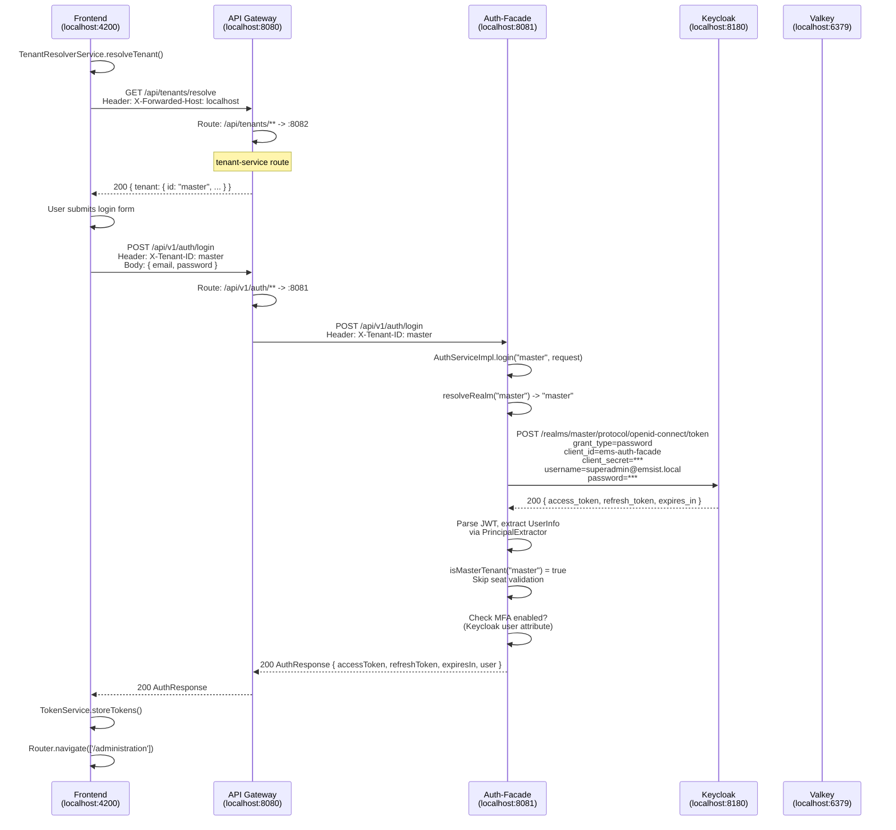
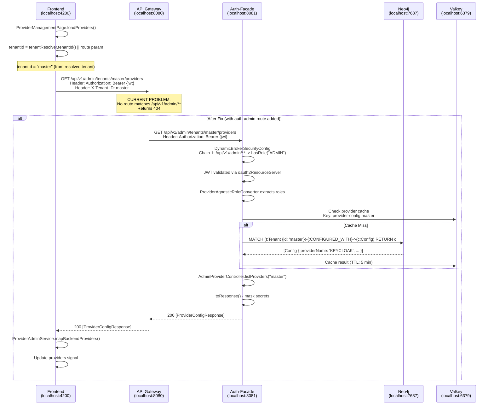
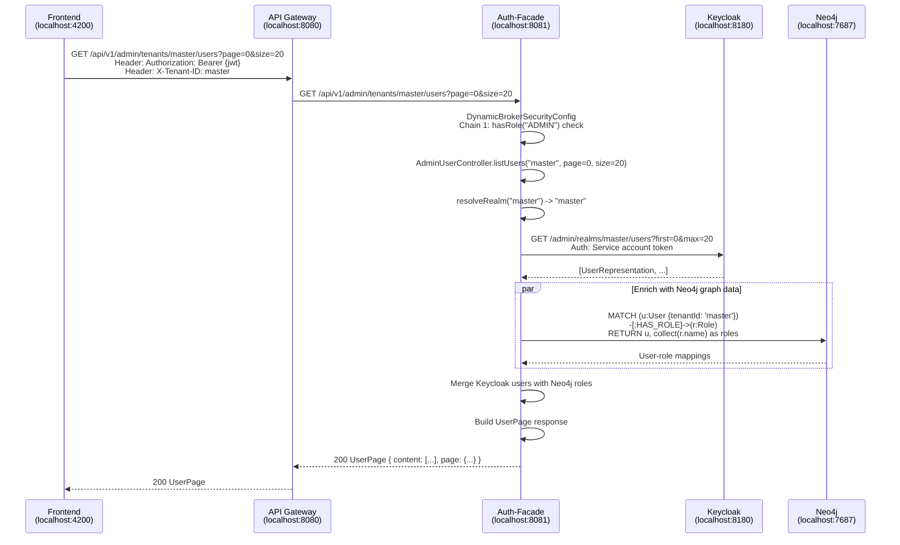

# ISSUE-001: Technical Design - Admin API Routing, User Management, and Keycloak Configuration

**Author:** SA Agent
**Date:** 2026-02-26
**Status:** Implemented
**Verified Against:** Codebase as of 2026-02-26 (commit 90dd2ee)

---

## Table of Contents

1. [Problem Summary](#1-problem-summary)
2. [API Gateway Route Fix](#2-api-gateway-route-fix)
3. [User Management API Contract](#3-user-management-api-contract)
4. [Keycloak Realm Configuration Specification](#4-keycloak-realm-configuration-specification)
5. [Data Flow Diagrams](#5-data-flow-diagrams)
6. [Tenant ID Resolution](#6-tenant-id-resolution)
7. [Implementation Checklist](#7-implementation-checklist)

---

## 1. Problem Summary

Three related issues block the frontend administration page from functioning:

| # | Problem | Root Cause | Severity |
|---|---------|------------|----------|
| 1 | Frontend calls `GET /api/v1/admin/tenants/{tenantId}/providers` but gets 404 | API Gateway `RouteConfig.java` has NO route for `/api/v1/admin/**` | **CRITICAL** |
| 2 | No user management API exists in auth-facade | Controller not implemented; only `AdminProviderController` exists | **HIGH** |
| 3 | No Keycloak realm/client/user is pre-configured | Keycloak starts empty; no realm import or init script | **CRITICAL** |

### Evidence

**Problem 1 -- Missing Gateway Route:**

File: `/Users/mksulty/Claude/EMSIST/backend/api-gateway/src/main/java/com/ems/gateway/config/RouteConfig.java`

The `RouteConfig.java` defines only the following route to auth-facade (line 23-25):

```java
.route("auth-service", r -> r
    .path("/api/v1/auth/**")
    .uri("http://localhost:8081"))
```

There is NO route matching `/api/v1/admin/**`. The frontend `ProviderAdminService` (file: `/Users/mksulty/Claude/EMSIST/frontend/src/app/features/admin/identity-providers/services/provider-admin.service.ts`, line 25) constructs the URL as:

```typescript
private readonly apiUrl = `${environment.apiUrl}/api/v1/admin/tenants`;
```

Where `environment.apiUrl` is `http://localhost:8080` (the gateway). The gateway receives the request but has no route to forward it, resulting in 404.

**Problem 2 -- No User Management Controller:**

File listing of auth-facade controllers (verified via Glob):
- `AdminProviderController.java` -- EXISTS (manages providers)
- `AuthController.java` -- EXISTS (login, refresh, logout, MFA)
- `EventController.java` -- EXISTS (auth events)
- `AdminUserController.java` -- DOES NOT EXIST

**Problem 3 -- Keycloak Empty:**

File: `/Users/mksulty/Claude/EMSIST/infrastructure/docker/docker-compose.yml` (line 98-110)

Keycloak starts with `start-dev` command and only defines admin credentials. No realm import is configured:

```yaml
keycloak:
  image: quay.io/keycloak/keycloak:24.0
  command: start-dev
  environment:
    KEYCLOAK_ADMIN: admin
    KEYCLOAK_ADMIN_PASSWORD: admin
    KC_DB: postgres
    KC_DB_URL: jdbc:postgresql://postgres:5432/keycloak_db
    KC_DB_USERNAME: keycloak
    KC_DB_PASSWORD: keycloak
```

No `--import-realm` flag, no volume mount for realm JSON.

---

## 2. API Gateway Route Fix

### 2.1 Current Route Table [IMPLEMENTED]

Verified from: `/Users/mksulty/Claude/EMSIST/backend/api-gateway/src/main/java/com/ems/gateway/config/RouteConfig.java`

| Route ID | Path Pattern | Target URI | Status |
|----------|-------------|------------|--------|
| `auth-service` | `/api/v1/auth/**` | `http://localhost:8081` | EXISTS |
| `tenant-service` | `/api/tenants/**` | `http://localhost:8082` | EXISTS |
| `user-service` | `/api/v1/users/**` | `http://localhost:8083` | EXISTS |
| `license-products` | `/api/v1/products/**` | `http://localhost:8085` | EXISTS |
| `license-service` | `/api/v1/licenses/**` | `http://localhost:8085` | EXISTS |
| `notification-service` | `/api/v1/notifications/**` | `http://localhost:8086` | EXISTS |
| `notification-templates` | `/api/v1/notification-templates/**` | `http://localhost:8086` | EXISTS |
| `audit-service` | `/api/v1/audit/**` | `http://localhost:8087` | EXISTS |
| `ai-agents` | `/api/v1/agents/**` | `http://localhost:8088` | EXISTS |
| `ai-conversations` | `/api/v1/conversations/**` | `http://localhost:8088` | EXISTS |
| `ai-providers` | `/api/v1/providers/**` | `http://localhost:8088` | EXISTS |
| `process-service` | `/api/process/**` | `http://localhost:8089` | EXISTS |

Additionally, health check routes are defined in `application.yml` for each service.

### 2.2 Missing Routes [PLANNED]

The following routes have been added to `RouteConfig.java`:

| Route ID | Path Pattern | Target URI | Purpose |
|----------|-------------|------------|---------|
| `auth-admin` | `/api/v1/admin/**` | `http://localhost:8081` | Admin endpoints (providers, users) |
| `auth-events` | `/api/v1/events/**` | `http://localhost:8081` | Auth event monitoring |

### 2.3 Required Change to RouteConfig.java

Location: `/Users/mksulty/Claude/EMSIST/backend/api-gateway/src/main/java/com/ems/gateway/config/RouteConfig.java`

Add after the existing auth-service route (after line 25):

```java
// ================================================================
// AUTH FACADE (8081) - Admin management endpoints
// ================================================================
.route("auth-admin", r -> r
    .path("/api/v1/admin/**")
    .uri("http://localhost:8081"))

// ================================================================
// AUTH FACADE (8081) - Auth event monitoring
// ================================================================
.route("auth-events", r -> r
    .path("/api/v1/events/**")
    .uri("http://localhost:8081"))
```

### 2.4 Route Ordering Note

Spring Cloud Gateway evaluates routes in order. The `auth-admin` route should be placed BEFORE any catch-all patterns. Currently there are no catch-all routes, so ordering is not critical, but placing it immediately after `auth-service` maintains logical grouping.

### 2.5 Gateway Security (No Change Needed)

The gateway `SecurityConfig.java` (file: `/Users/mksulty/Claude/EMSIST/backend/api-gateway/src/main/java/com/ems/gateway/config/SecurityConfig.java`, line 23-33) uses `.anyExchange().permitAll()` as the catch-all, so no security configuration changes are needed at the gateway level. Authentication is enforced by auth-facade's `DynamicBrokerSecurityConfig`.

### 2.6 CORS (No Change Needed)

The gateway `CorsConfig.java` already allows all common HTTP methods and headers from `localhost:4200`. The `X-Tenant-ID` header is explicitly exposed (line 45). No changes needed.

---

## 3. User Management API Contract

### 3.1 Context

Auth-facade already has the `UserNode` entity in Neo4j (file: `/Users/mksulty/Claude/EMSIST/backend/auth-facade/src/main/java/com/ems/auth/graph/entity/UserNode.java`) and uses the Keycloak Admin API for user operations (file: `/Users/mksulty/Claude/EMSIST/backend/auth-facade/src/main/java/com/ems/auth/provider/KeycloakIdentityProvider.java`).

The new endpoint serves user data by querying the Keycloak Admin API (primary source) and optionally enriching with Neo4j graph data (roles, groups).

### 3.2 Endpoint Summary

| Method | Path | Description | Auth |
|--------|------|-------------|------|
| `GET` | `/api/v1/admin/tenants/{tenantId}/users` | List users (paginated) | ADMIN role required |
| `GET` | `/api/v1/admin/tenants/{tenantId}/users/{userId}` | Get single user | ADMIN role required |

### 3.3 OpenAPI 3.1 Specification

```yaml
openapi: 3.1.0
info:
  title: Auth Facade - User Management API
  version: 1.0.0
  description: |
    User management endpoints for tenant administrators.
    Users are stored in Keycloak and enriched with Neo4j graph data (roles, groups).

    Generated from: AdminUserController.java (PLANNED - does not exist yet)
    Last verified: 2026-02-26
servers:
  - url: http://localhost:8081
    description: Auth-facade direct
  - url: http://localhost:8080
    description: Via API Gateway (requires /api/v1/admin/** route)

paths:
  /api/v1/admin/tenants/{tenantId}/users:
    get:
      operationId: listTenantUsers
      tags:
        - Admin User Management
      summary: List users for a tenant
      description: |
        Returns a paginated list of users for the specified tenant.
        Data is sourced from Keycloak Admin API for the tenant's realm,
        with optional role/group enrichment from Neo4j.
      security:
        - bearerAuth: []
      parameters:
        - name: tenantId
          in: path
          required: true
          description: Tenant identifier (e.g., "master", "tenant-acme")
          schema:
            type: string
          example: master
        - name: page
          in: query
          required: false
          description: Page number (zero-based)
          schema:
            type: integer
            minimum: 0
            default: 0
          example: 0
        - name: size
          in: query
          required: false
          description: Page size (number of users per page)
          schema:
            type: integer
            minimum: 1
            maximum: 100
            default: 20
          example: 20
        - name: search
          in: query
          required: false
          description: |
            Free-text search across email, firstName, lastName.
            Maps to Keycloak's `search` parameter.
          schema:
            type: string
          example: john
        - name: role
          in: query
          required: false
          description: |
            Filter by role name. Maps to Neo4j role lookup
            or Keycloak realm role filter.
          schema:
            type: string
            enum:
              - SUPER_ADMIN
              - ADMIN
              - MANAGER
              - USER
              - VIEWER
          example: ADMIN
        - name: status
          in: query
          required: false
          description: Filter by user active status
          schema:
            type: string
            enum:
              - active
              - inactive
              - all
            default: all
          example: active
        - name: sort
          in: query
          required: false
          description: Sort field and direction
          schema:
            type: string
            default: createdAt,desc
          example: email,asc
      responses:
        '200':
          description: Paginated list of users
          content:
            application/json:
              schema:
                $ref: '#/components/schemas/UserPage'
              example:
                content:
                  - id: "f47ac10b-58cc-4372-a567-0e02b2c3d479"
                    email: "admin@example.com"
                    firstName: "Admin"
                    lastName: "User"
                    active: true
                    emailVerified: true
                    roles:
                      - "ADMIN"
                      - "MANAGER"
                      - "USER"
                      - "VIEWER"
                    groups: []
                    identityProvider: "keycloak"
                    createdAt: "2026-01-15T10:30:00Z"
                    lastLoginAt: "2026-02-26T08:15:00Z"
                page:
                  number: 0
                  size: 20
                  totalElements: 1
                  totalPages: 1
          headers:
            X-Total-Count:
              description: Total number of users matching the query
              schema:
                type: integer
        '401':
          description: Not authenticated (missing or invalid JWT)
          content:
            application/json:
              schema:
                $ref: '#/components/schemas/ProblemDetail'
              example:
                type: "about:blank"
                title: "Unauthorized"
                status: 401
                detail: "Full authentication is required to access this resource"
                instance: "/api/v1/admin/tenants/master/users"
        '403':
          description: Insufficient permissions (requires ADMIN role)
          content:
            application/json:
              schema:
                $ref: '#/components/schemas/ProblemDetail'
              example:
                type: "about:blank"
                title: "Forbidden"
                status: 403
                detail: "Access denied. Required role: ADMIN"
                instance: "/api/v1/admin/tenants/master/users"
        '404':
          description: Tenant not found
          content:
            application/json:
              schema:
                $ref: '#/components/schemas/ProblemDetail'
              example:
                type: "about:blank"
                title: "Not Found"
                status: 404
                detail: "Tenant 'unknown-tenant' not found"
                instance: "/api/v1/admin/tenants/unknown-tenant/users"
        '500':
          description: Internal server error (e.g., Keycloak unreachable)
          content:
            application/json:
              schema:
                $ref: '#/components/schemas/ProblemDetail'

  /api/v1/admin/tenants/{tenantId}/users/{userId}:
    get:
      operationId: getTenantUser
      tags:
        - Admin User Management
      summary: Get a specific user
      description: |
        Returns detailed user information including roles, groups,
        and authentication metadata. Combines Keycloak user data
        with Neo4j graph relationships.
      security:
        - bearerAuth: []
      parameters:
        - name: tenantId
          in: path
          required: true
          description: Tenant identifier
          schema:
            type: string
          example: master
        - name: userId
          in: path
          required: true
          description: User identifier (Keycloak UUID)
          schema:
            type: string
            format: uuid
          example: "f47ac10b-58cc-4372-a567-0e02b2c3d479"
      responses:
        '200':
          description: User details
          content:
            application/json:
              schema:
                $ref: '#/components/schemas/UserResponse'
              example:
                id: "f47ac10b-58cc-4372-a567-0e02b2c3d479"
                email: "admin@example.com"
                firstName: "Admin"
                lastName: "User"
                active: true
                emailVerified: true
                roles:
                  - "ADMIN"
                  - "MANAGER"
                  - "USER"
                  - "VIEWER"
                groups:
                  - id: "grp-001"
                    name: "administrators"
                    displayName: "Administrators"
                identityProvider: "keycloak"
                mfaEnabled: false
                createdAt: "2026-01-15T10:30:00Z"
                updatedAt: "2026-02-20T14:00:00Z"
                lastLoginAt: "2026-02-26T08:15:00Z"
        '401':
          description: Not authenticated
          content:
            application/json:
              schema:
                $ref: '#/components/schemas/ProblemDetail'
        '403':
          description: Insufficient permissions (requires ADMIN role)
          content:
            application/json:
              schema:
                $ref: '#/components/schemas/ProblemDetail'
        '404':
          description: User not found in the specified tenant
          content:
            application/json:
              schema:
                $ref: '#/components/schemas/ProblemDetail'
              example:
                type: "about:blank"
                title: "Not Found"
                status: 404
                detail: "User 'f47ac10b-...' not found in tenant 'master'"
                instance: "/api/v1/admin/tenants/master/users/f47ac10b-..."

components:
  securitySchemes:
    bearerAuth:
      type: http
      scheme: bearer
      bearerFormat: JWT
      description: |
        JWT from Keycloak. Must contain realm_access.roles with ADMIN role.
        Obtained via POST /api/v1/auth/login

  schemas:
    UserResponse:
      type: object
      description: User details response
      required:
        - id
        - email
        - active
      properties:
        id:
          type: string
          format: uuid
          description: User's unique identifier (from Keycloak)
          example: "f47ac10b-58cc-4372-a567-0e02b2c3d479"
        email:
          type: string
          format: email
          description: User's email address
          example: "admin@example.com"
        firstName:
          type: string
          description: User's first name
          example: "Admin"
        lastName:
          type: string
          description: User's last name
          example: "User"
        active:
          type: boolean
          description: Whether the user account is enabled
          example: true
        emailVerified:
          type: boolean
          description: Whether the user's email has been verified
          example: true
        roles:
          type: array
          items:
            type: string
          description: |
            Effective roles (includes inherited roles).
            Hierarchy: SUPER_ADMIN > ADMIN > MANAGER > USER > VIEWER
          example: ["ADMIN", "MANAGER", "USER", "VIEWER"]
        groups:
          type: array
          items:
            $ref: '#/components/schemas/GroupSummary'
          description: Groups the user belongs to
        identityProvider:
          type: string
          description: Identity provider that manages this user
          example: "keycloak"
        externalId:
          type: string
          nullable: true
          description: External ID from federated identity provider
        mfaEnabled:
          type: boolean
          description: Whether MFA is enabled for this user
          example: false
        createdAt:
          type: string
          format: date-time
          description: Account creation timestamp
          example: "2026-01-15T10:30:00Z"
        updatedAt:
          type: string
          format: date-time
          nullable: true
          description: Last update timestamp
        lastLoginAt:
          type: string
          format: date-time
          nullable: true
          description: Last successful login timestamp
          example: "2026-02-26T08:15:00Z"

    GroupSummary:
      type: object
      properties:
        id:
          type: string
          description: Group identifier
        name:
          type: string
          description: Group name
        displayName:
          type: string
          description: Display name for UI

    UserPage:
      type: object
      description: Paginated user list
      properties:
        content:
          type: array
          items:
            $ref: '#/components/schemas/UserResponse'
        page:
          $ref: '#/components/schemas/PageMetadata'

    PageMetadata:
      type: object
      properties:
        number:
          type: integer
          description: Current page number (zero-based)
          example: 0
        size:
          type: integer
          description: Page size
          example: 20
        totalElements:
          type: integer
          format: int64
          description: Total number of matching users
          example: 45
        totalPages:
          type: integer
          description: Total number of pages
          example: 3

    ProblemDetail:
      type: object
      description: RFC 7807 Problem Details
      properties:
        type:
          type: string
          format: uri
          description: A URI reference that identifies the problem type
          example: "about:blank"
        title:
          type: string
          description: A short human-readable summary
          example: "Not Found"
        status:
          type: integer
          description: HTTP status code
          example: 404
        detail:
          type: string
          description: A human-readable explanation
          example: "User not found in tenant 'master'"
        instance:
          type: string
          format: uri
          description: A URI reference to the specific occurrence
          example: "/api/v1/admin/tenants/master/users/invalid-id"
```

### 3.4 Data Source Strategy

The user management endpoint combines two data sources:

| Field | Primary Source | Enrichment Source |
|-------|---------------|-------------------|
| `id`, `email`, `firstName`, `lastName` | Keycloak Admin API | -- |
| `active`, `emailVerified` | Keycloak Admin API | -- |
| `createdAt` (Keycloak `createdTimestamp`) | Keycloak Admin API | -- |
| `roles` (effective, with inheritance) | Neo4j `UserNode` HAS_ROLE relationships | Keycloak realm roles as fallback |
| `groups` | Neo4j `UserNode` MEMBER_OF relationships | Keycloak groups as fallback |
| `identityProvider` | Keycloak `federationLink` or attribute | Neo4j `UserNode.identityProvider` |
| `mfaEnabled` | Keycloak user attribute `mfa_enabled` | -- |
| `lastLoginAt` | Keycloak event log (last LOGIN event) | Neo4j `UserNode.lastLoginAt` |

### 3.5 Implementation Notes for DEV Agent

1. **Controller class:** `AdminUserController.java` in package `com.ems.auth.controller`
2. **Annotation:** `@RequestMapping("/api/v1/admin/tenants/{tenantId}/users")`
3. **Security:** `@PreAuthorize("hasRole('ADMIN')")` (consistent with `AdminProviderController`)
4. **Keycloak API:** Use `Keycloak.realm(realm).users()` from `keycloak-admin-client`
5. **Pagination:** Keycloak Admin API uses `first` (offset) and `max` (limit) parameters. Map `page`/`size` to `first = page * size`, `max = size`.
6. **Search:** Keycloak's `users().search(searchTerm, first, max)` supports searching across username, first name, last name, and email.
7. **Role filter:** After fetching users from Keycloak, filter against Neo4j role assignments or Keycloak realm role membership.

---

## 4. Keycloak Realm Configuration Specification

### 4.1 Current State [VERIFIED]

- Keycloak 24.0 starts with `start-dev` command
- Only the built-in `master` realm exists
- Admin credentials: `admin` / `admin`
- No `ems-auth-facade` client exists
- No custom realm roles exist
- No users exist (beyond the built-in admin)

### 4.2 Required Realm Configuration

Since auth-facade's V005 migration creates a master tenant pointing to the Keycloak `master` realm (verified in `/Users/mksulty/Claude/EMSIST/backend/auth-facade/src/main/resources/neo4j/migrations/V005__create_master_tenant.cypher`), the initial configuration targets the `master` realm.

#### 4.2.1 Realm Settings

| Setting | Value | Rationale |
|---------|-------|-----------|
| Realm | `master` | Auth-facade V005 maps tenant `master` to Keycloak realm `master` |
| Display Name | `EMS Master` | For Keycloak admin console |
| Login with email | `true` | Email is primary login identifier |
| User registration | `false` | Admin-only user creation for master tenant |
| Email as username | `true` | Simplify user management |
| Events enabled | `true` | Required for EventController audit queries |
| Login events | `LOGIN`, `LOGIN_ERROR`, `LOGOUT`, `RESET_PASSWORD` | Match `AuthEventDTO` event types |
| Admin events | `true` | Audit trail for admin operations |
| Event expiration | `604800` (7 days) | Match EventController's 7-day lookback |

#### 4.2.2 Client Configuration: `ems-auth-facade`

This client is what auth-facade uses to authenticate users via Direct Access Grant (Resource Owner Password Credentials).

| Setting | Value | Rationale |
|---------|-------|-----------|
| Client ID | `ems-auth-facade` | Matches `application.yml` line 104: `client-id: ${KEYCLOAK_CLIENT_ID:ems-auth-facade}` |
| Client Protocol | `openid-connect` | OIDC standard |
| Access Type | `confidential` | Client secret required |
| Client Authentication | `ON` | Enables client_secret usage |
| Standard Flow | `ON` | For redirect-based SSO (OAuth2 code flow) |
| Direct Access Grants | `ON` | **Required** for `KeycloakIdentityProvider.authenticate()` which uses `grant_type=password` |
| Service Accounts | `ON` | For admin API operations |
| Valid Redirect URIs | `http://localhost:4200/*`, `http://localhost:8080/*` | Frontend and gateway |
| Web Origins | `http://localhost:4200`, `http://localhost:8080` | CORS for token endpoint |
| Root URL | `http://localhost:8080` | Gateway base URL |
| Default Scopes | `openid`, `profile`, `email` | Match auth-facade `scope` parameter |
| Client Secret | (generated) | Set via `KEYCLOAK_CLIENT_SECRET` env var |

**Token Exchange (for social login):**

| Setting | Value |
|---------|-------|
| Token Exchange permission | `ON` |
| Fine-grained permissions | `ON` |

**Service Account Roles (for admin operations):**

The `ems-auth-facade` service account needs these realm-level roles to query users and events:

| Role | Purpose |
|------|---------|
| `view-users` | List and search users (user management API) |
| `view-events` | Query auth events (EventController) |
| `manage-users` | Create users, reset passwords, manage MFA |
| `view-realm` | Read realm configuration |
| `view-clients` | View client configurations |

These are assigned via: Clients > ems-auth-facade > Service Account Roles > realm-management client roles.

#### 4.2.3 Realm Roles

These roles must be created in Keycloak to match the V004 Neo4j migration roles (file: `/Users/mksulty/Claude/EMSIST/backend/auth-facade/src/main/resources/neo4j/migrations/V004__create_default_roles.cypher`):

| Keycloak Role | Neo4j Role (V004) | Description | Composite Of |
|---------------|-------------------|-------------|--------------|
| `VIEWER` | `VIEWER` | Read-only access to resources | -- |
| `USER` | `USER` | Standard user with basic CRUD | `VIEWER` |
| `MANAGER` | `MANAGER` | Team management and reporting | `USER` |
| `ADMIN` | `ADMIN` | Full administrative access within tenant | `MANAGER` |
| `SUPER_ADMIN` | `SUPER_ADMIN` | Full system access across all tenants | `ADMIN` |

**Composite role configuration:** Keycloak supports composite roles. Configure `USER` as composite containing `VIEWER`, `MANAGER` containing `USER`, etc. This mirrors the Neo4j `INHERITS_FROM` relationship chain.

Note on Spring Security mapping: The `DynamicBrokerSecurityConfig` (file: `/Users/mksulty/Claude/EMSIST/backend/auth-facade/src/main/java/com/ems/auth/config/DynamicBrokerSecurityConfig.java`, line 66) requires `.hasRole("ADMIN")`. Spring Security prepends `ROLE_` to the role name, so the Keycloak JWT must contain `ADMIN` in `realm_access.roles`. The `ProviderAgnosticRoleConverter` handles extraction from `realm_access.roles` claim.

#### 4.2.4 Superuser Account

| Field | Value | Rationale |
|-------|-------|-----------|
| Username | `superadmin@emsist.local` | Email-based login |
| Email | `superadmin@emsist.local` | Login identifier |
| Email Verified | `true` | Skip email verification |
| First Name | `Super` | Display in UI |
| Last Name | `Admin` | Display in UI |
| Password | `Admin@123` (development only) | Must be changed in non-dev environments |
| Realm Roles | `SUPER_ADMIN` | Highest privilege level |
| Enabled | `true` | Active account |

The superuser must also be registered in Neo4j as a `UserNode` with `tenantId: 'master'` and `HAS_ROLE` relationship to the `SUPER_ADMIN` role node.

### 4.3 Realm Export JSON

**Update (Implementation Change):** The `realm-export.json` approach was rejected because Keycloak does not allow importing the `master` realm via the `--import-realm` flag.

**Implemented Solution:** A sidecar init container (`keycloak-init`) was implemented using a shell script (`infrastructure/keycloak/keycloak-init.sh`).

1.  Waits for Keycloak to be healthy.
2.  Authenticates as the built-in admin.
3.  Idempotently creates the `ems-auth-facade` client.
4.  Creates the `SUPER_ADMIN` role and superuser account via the Admin REST API.

The realm JSON must include:
- Client definition (`ems-auth-facade`)
- Realm roles (`VIEWER`, `USER`, `MANAGER`, `ADMIN`, `SUPER_ADMIN`) with composite configuration
- Superuser account with `SUPER_ADMIN` role assigned
- Event listener configuration

### 4.4 V005 Migration Alignment

The V005 Cypher migration creates a Config node with `clientId: 'ems-client'` (line 51):

```cypher
CREATE (c:Config {
    clientId: 'ems-client',
    ...
})
```

However, `application.yml` (line 104) defaults to `ems-auth-facade`:

```yaml
keycloak:
  client:
    client-id: ${KEYCLOAK_CLIENT_ID:ems-auth-facade}
```

**Discrepancy:** The Neo4j Config node uses `ems-client`, but the application configuration uses `ems-auth-facade`. The V005 migration should be updated to use `ems-auth-facade` for consistency, OR the Keycloak realm should contain both client IDs. Recommend aligning on `ems-auth-facade`.

---

## 5. Data Flow Diagrams

### 5.1 Superuser Login Flow



### 5.2 Provider List Flow (Currently Broken)



### 5.3 User List Flow [PLANNED]



---

## 6. Tenant ID Resolution

### 6.1 The Problem

There are two tenant ID systems in play:

| System | ID Format | Example | Where Used |
|--------|-----------|---------|------------|
| Neo4j (auth-facade) | String slug | `master` | V005 migration, TenantNode.id, provider admin API |
| Frontend (dev tenant) | String slug or UUID | `dev-tenant-1`, `00000000-0000-0000-0000-000000000001` | TenantResolverService dev fallback |
| Frontend (real) | From backend `/api/tenants/resolve` | Whatever tenant-service returns | Production flow |
| Keycloak | Realm name | `master`, `tenant-acme` | AuthServiceImpl.resolveRealm() |

### 6.2 Current Realm Resolution Logic

From `AuthServiceImpl.java` (lines 174-185):

```java
private String resolveRealm(String tenantId) {
    if (isMasterTenant(tenantId)) {
        return "master";
    }
    if (tenantId.startsWith("tenant-")) {
        return tenantId;
    }
    return "tenant-" + tenantId;
}

private boolean isMasterTenant(String tenantId) {
    return "master".equalsIgnoreCase(tenantId) || "tenant-master".equalsIgnoreCase(tenantId);
}
```

From `AuthController.java` (lines 171-179):

```java
private String resolveRealm(String tenantId) {
    if ("master".equalsIgnoreCase(tenantId) || "tenant-master".equalsIgnoreCase(tenantId)) {
        return "master";
    }
    if (tenantId.startsWith("tenant-")) {
        return tenantId;
    }
    return "tenant-" + tenantId;
}
```

From `EventController.java` (lines 213-220):

```java
private String resolveRealm(String tenantId) {
    if (tenantId.startsWith("tenant-")) {
        return tenantId.substring(7);
    }
    return tenantId;
}
```

**Issue:** The `EventController.resolveRealm()` has DIFFERENT logic from `AuthServiceImpl.resolveRealm()`. For tenant ID `tenant-acme`:
- `AuthServiceImpl`: returns `tenant-acme` (keeps prefix)
- `EventController`: returns `acme` (strips prefix)

This is a bug -- the realm name handling is inconsistent.

### 6.3 Frontend Tenant ID Source

The `TenantResolverService` resolves tenant on startup:

1. Calls `GET /api/tenants/resolve` with `X-Forwarded-Host` header
2. Receives `EnhancedTenant` with `id` field
3. Stores `tenantId` as a computed signal: `this._tenant()?.id`

The `auth.interceptor.ts` adds this as `X-Tenant-ID` header on every request.

The `ProviderManagementPage` uses tenant ID from either route params or the resolved tenant:

```typescript
readonly tenantId = computed(() => {
    const routeTenantId = this.route.snapshot.paramMap.get('tenantId');
    return routeTenantId || this.tenantResolver.tenantId() || '';
});
```

This value becomes the `{tenantId}` path parameter in `/api/v1/admin/tenants/{tenantId}/providers`.

### 6.4 UUID vs Slug Mapping

The dev fallback tenant (in `TenantResolverService`, line 238) uses:

```typescript
id: 'dev-tenant-1',
uuid: '00000000-0000-0000-0000-000000000001',
```

If the frontend sends `dev-tenant-1` as the tenant ID in the URL path, the `AdminProviderController` passes it directly to `DynamicProviderResolver.listProviders("dev-tenant-1")`, which queries Neo4j for `(t:Tenant {id: 'dev-tenant-1'})`. This will not match the V005 migration tenant `master`.

### 6.5 Resolution Design

The tenant ID in the admin API URL path must match the Neo4j `TenantNode.id`. For the master tenant, this is `master`.

**Recommended approach:**

1. **Tenant-service** returns `id: "master"` for the master tenant when resolving `localhost`
2. **Frontend** uses the resolved `tenant.id` as the path parameter
3. **Auth-facade** uses the path parameter directly for Neo4j queries
4. **Auth-facade** maps tenant ID to Keycloak realm via `resolveRealm()` for Keycloak API calls

**No UUID-based mapping is needed** because:
- Neo4j uses string IDs (slugs), not UUIDs, for TenantNode
- Keycloak uses realm names (strings), not UUIDs
- The `{tenantId}` in the URL is a slug, not a UUID

**Action required:** The dev fallback tenant in `TenantResolverService` should use `id: 'master'` when the hostname is `localhost` to match the Neo4j V005 migration. Alternatively, accept that the dev fallback only works when the backend is offline (as designed).

### 6.6 Consolidated resolveRealm Logic

All controllers and services should use a single shared utility for realm resolution:

```java
/**
 * Utility for mapping tenant IDs to Keycloak realm names.
 *
 * Mapping rules:
 * - "master" or "tenant-master" -> "master"
 * - "tenant-{name}" -> "tenant-{name}" (kept as-is)
 * - "{name}" -> "tenant-{name}" (prefix added)
 */
public final class RealmResolver {

    private RealmResolver() {}

    public static String resolveRealm(String tenantId) {
        if (isMasterTenant(tenantId)) {
            return "master";
        }
        if (tenantId.startsWith("tenant-")) {
            return tenantId;
        }
        return "tenant-" + tenantId;
    }

    public static boolean isMasterTenant(String tenantId) {
        return "master".equalsIgnoreCase(tenantId)
            || "tenant-master".equalsIgnoreCase(tenantId);
    }
}
```

The `EventController.resolveRealm()` MUST be fixed to use this shared logic.

---

## 7. Implementation Checklist

### Phase 1: Gateway Route Fix (Unblocks frontend immediately)

| # | Task | File | Assignee |
|---|------|------|----------|
| 1.1 | Add `auth-admin` route for `/api/v1/admin/**` -> `:8081` | `backend/api-gateway/.../RouteConfig.java` | DEV |
| 1.2 | Add `auth-events` route for `/api/v1/events/**` -> `:8081` | `backend/api-gateway/.../RouteConfig.java` | DEV |
| 1.3 | Verify gateway routes with integration test | `backend/api-gateway/src/test/` | QA |

### Phase 2: Keycloak Configuration (Enables authentication)

| # | Task | File | Assignee |
|---|------|------|----------|
| 2.1 | Create realm export JSON with client, roles, superuser | `infrastructure/keycloak/realm-export.json` | DEVOPS + DBA |
| 2.2 | Update docker-compose with `--import-realm` and volume mount | `infrastructure/docker/docker-compose.yml` | DEVOPS |
| 2.3 | Fix V005 migration `clientId` from `ems-client` to `ems-auth-facade` | `backend/auth-facade/.../V005__create_master_tenant.cypher` | DBA |
| 2.4 | Create V006 migration to seed superuser in Neo4j | `backend/auth-facade/.../V006__create_superuser.cypher` | DBA |
| 2.5 | Fix `EventController.resolveRealm()` inconsistency | `backend/auth-facade/.../EventController.java` | DEV |
| 2.6 | Extract shared `RealmResolver` utility | `backend/auth-facade/.../util/RealmResolver.java` | DEV |

### Phase 3: User Management API (New feature)

| # | Task | File | Assignee |
|---|------|------|----------|
| 3.1 | Create `UserResponse` DTO | `backend/auth-facade/.../dto/UserResponse.java` | DEV |
| 3.2 | Create `UserPage` DTO (paginated wrapper) | `backend/auth-facade/.../dto/UserPage.java` | DEV |
| 3.3 | Create `AdminUserController` | `backend/auth-facade/.../controller/AdminUserController.java` | DEV |
| 3.4 | Add `listUsers()` method to `KeycloakIdentityProvider` or new `UserAdminService` | `backend/auth-facade/.../service/UserAdminService.java` | DEV |
| 3.5 | Add Neo4j query for user-role enrichment | `backend/auth-facade/.../graph/repository/` | DEV |
| 3.6 | Unit tests for AdminUserController | `backend/auth-facade/src/test/` | QA |
| 3.7 | Integration tests with test containers | `backend/auth-facade/src/test/` | QA |
| 3.8 | Update OpenAPI spec | `backend/auth-facade/openapi.yaml` | SA |

### Phase 4: Frontend Integration

| # | Task | Assignee |
|---|------|----------|
| 4.1 | Create `UserAdminService` in Angular | FE |
| 4.2 | Add user list component to administration page | FE |
| 4.3 | E2E test: login as superadmin, view providers, view users | QA |

---

## Appendix A: Files Referenced

| File | Purpose | Line References |
|------|---------|----------------|
| `/Users/mksulty/Claude/EMSIST/backend/api-gateway/src/main/java/com/ems/gateway/config/RouteConfig.java` | Gateway routes (missing admin route) | Lines 23-25 |
| `/Users/mksulty/Claude/EMSIST/backend/api-gateway/src/main/java/com/ems/gateway/config/SecurityConfig.java` | Gateway security (all permitAll) | Lines 23-33 |
| `/Users/mksulty/Claude/EMSIST/backend/api-gateway/src/main/java/com/ems/gateway/config/CorsConfig.java` | CORS config | Lines 26-55 |
| `/Users/mksulty/Claude/EMSIST/backend/api-gateway/src/main/java/com/ems/gateway/filter/TenantContextFilter.java` | X-Tenant-ID propagation | Lines 26-31 |
| `/Users/mksulty/Claude/EMSIST/backend/api-gateway/src/main/resources/application.yml` | Gateway YAML config (health routes only) | Full file |
| `/Users/mksulty/Claude/EMSIST/backend/auth-facade/src/main/java/com/ems/auth/controller/AdminProviderController.java` | Provider CRUD (existing) | Lines 39-40 |
| `/Users/mksulty/Claude/EMSIST/backend/auth-facade/src/main/java/com/ems/auth/controller/AuthController.java` | Auth endpoints (login, refresh) | Lines 29-30 |
| `/Users/mksulty/Claude/EMSIST/backend/auth-facade/src/main/java/com/ems/auth/controller/EventController.java` | Event queries (broken resolveRealm) | Lines 213-220 |
| `/Users/mksulty/Claude/EMSIST/backend/auth-facade/src/main/java/com/ems/auth/config/DynamicBrokerSecurityConfig.java` | Three security filter chains | Lines 53-73 |
| `/Users/mksulty/Claude/EMSIST/backend/auth-facade/src/main/java/com/ems/auth/config/KeycloakConfig.java` | Keycloak connection config | Full file |
| `/Users/mksulty/Claude/EMSIST/backend/auth-facade/src/main/java/com/ems/auth/service/AuthServiceImpl.java` | Auth service with resolveRealm | Lines 174-193 |
| `/Users/mksulty/Claude/EMSIST/backend/auth-facade/src/main/java/com/ems/auth/provider/KeycloakIdentityProvider.java` | Keycloak adapter | Lines 73-94, 372-380 |
| `/Users/mksulty/Claude/EMSIST/backend/auth-facade/src/main/java/com/ems/auth/graph/entity/UserNode.java` | Neo4j user entity | Full file |
| `/Users/mksulty/Claude/EMSIST/backend/auth-facade/src/main/java/com/ems/auth/graph/entity/TenantNode.java` | Neo4j tenant entity | Full file |
| `/Users/mksulty/Claude/EMSIST/backend/auth-facade/src/main/java/com/ems/auth/graph/entity/RoleNode.java` | Neo4j role entity | Full file |
| `/Users/mksulty/Claude/EMSIST/backend/auth-facade/src/main/resources/neo4j/migrations/V004__create_default_roles.cypher` | Role hierarchy creation | Full file |
| `/Users/mksulty/Claude/EMSIST/backend/auth-facade/src/main/resources/neo4j/migrations/V005__create_master_tenant.cypher` | Master tenant seed (clientId mismatch) | Line 51 |
| `/Users/mksulty/Claude/EMSIST/backend/auth-facade/src/main/resources/application.yml` | Auth-facade config | Lines 97-105 |
| `/Users/mksulty/Claude/EMSIST/infrastructure/docker/docker-compose.yml` | Keycloak container (no realm import) | Lines 98-110 |
| `/Users/mksulty/Claude/EMSIST/frontend/src/app/features/admin/identity-providers/services/provider-admin.service.ts` | Frontend admin API service | Line 25 |
| `/Users/mksulty/Claude/EMSIST/frontend/src/app/features/admin/identity-providers/pages/provider-management.page.ts` | Provider management page | Lines 356-360 |
| `/Users/mksulty/Claude/EMSIST/frontend/src/app/core/services/tenant-resolver.service.ts` | Tenant resolution service | Lines 46, 237-244 |
| `/Users/mksulty/Claude/EMSIST/frontend/src/app/core/interceptors/auth.interceptor.ts` | Auth header interceptor | Lines 74-80 |
| `/Users/mksulty/Claude/EMSIST/frontend/src/environments/environment.ts` | API URL config | Line 8 |
| `/Users/mksulty/Claude/EMSIST/frontend/src/app/models/tenant.model.ts` | Tenant model | Lines 10-40 |
| `/Users/mksulty/Claude/EMSIST/backend/common/src/main/java/com/ems/common/dto/auth/UserInfo.java` | UserInfo record | Full file |
| `/Users/mksulty/Claude/EMSIST/backend/common/src/main/java/com/ems/common/dto/auth/AuthResponse.java` | Auth response record | Full file |

## Appendix B: Discovered Bugs

| # | Bug | Location | Severity |
|---|-----|----------|----------|
| B1 | `EventController.resolveRealm()` strips `tenant-` prefix, but `AuthServiceImpl.resolveRealm()` keeps it. Inconsistent realm resolution. | `EventController.java:213-220` vs `AuthServiceImpl.java:174-185` | MEDIUM |
| B2 | V005 migration uses `clientId: 'ems-client'` but `application.yml` defaults to `ems-auth-facade`. Mismatched client IDs. | `V005__create_master_tenant.cypher:51` vs `application.yml:104` | HIGH |
| B3 | Three separate `resolveRealm()` implementations with different logic (AuthServiceImpl, AuthController, EventController). Should be a shared utility. | Multiple files | MEDIUM |
