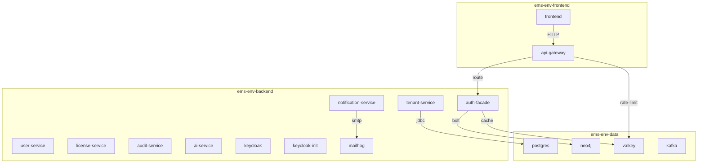

# ISSUE-INF-001: Single Flat Docker Network — No Tier Segmentation

| Field | Value |
|-------|-------|
| Severity | CRITICAL |
| Category | Security |
| Source | SEC-01 |
| Priority | P0 |
| Status | RESOLVED |
| Opened | 2026-03-02 |
| Blocked By | — |
| Fixes | docker-compose.dev.yml, docker-compose.staging.yml |
| Closes With | Phase 2 — Docker Tier Split |

## Description

All 17 services (frontend, 8 backend, keycloak, keycloak-init, postgres, neo4j, valkey, kafka, mailhog) share a single flat Docker bridge network (`ems-dev` / `ems-staging`). This means every container can reach every other container on any port — there is no network-level tier segmentation.

## Evidence

- `docker-compose.dev.yml`: Single `networks: ems-dev` definition shared by all services
- `docker-compose.staging.yml`: Single `networks: ems-staging` definition shared by all services
- No Docker network policies or restrictions configured

## Remediation

Split into 3 Docker networks:

| Network | Purpose | Members |
|---------|---------|---------|
| `ems-{env}-data` | Data tier (internal, no host access) | postgres, neo4j, valkey, kafka |
| `ems-{env}` | Backend tier (bridges data and app) | All backend services + keycloak + data services |
| `ems-{env}-frontend` | Frontend tier (isolated) | frontend + api-gateway only |

## Acceptance Criteria

- [ ] Frontend container cannot `ping postgres` (FAIL expected)
- [ ] Frontend container can `curl api-gateway:8080/actuator/health` (SUCCESS expected)
- [ ] Backend services can connect to databases (SUCCESS)
- [ ] Data tier services are not directly accessible from host (except dev debug ports)

## Resolution

**Status:** RESOLVED
**Date:** 2026-03-03
**Changed Files:** `docker-compose.dev.yml`, `docker-compose.staging.yml`

### What Changed

Replaced the single flat network (`ems-dev` / `ems-staging`) with a three-tier network topology:

| Network | Internal | Members |
|---------|----------|---------|
| `ems-{env}-data` | `true` (no host egress) | postgres, neo4j, valkey, kafka |
| `ems-{env}-backend` | `false` | All backend services, keycloak, keycloak-init, mailhog |
| `ems-{env}-frontend` | `false` | frontend, api-gateway |

Backend services are dual-homed on `ems-{env}-backend` + `ems-{env}-data` so they can reach both data stores and other backend services (e.g., keycloak for JWT validation). The api-gateway is tri-homed on all three networks because it bridges frontend requests to backend services and uses valkey for rate limiting.

The `internal: true` flag on the data network prevents containers on that network from initiating outbound connections to the Docker host, adding defense-in-depth.

### Verification

