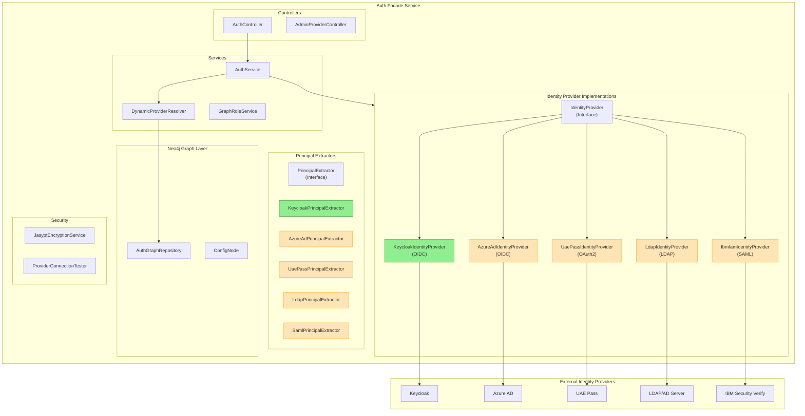
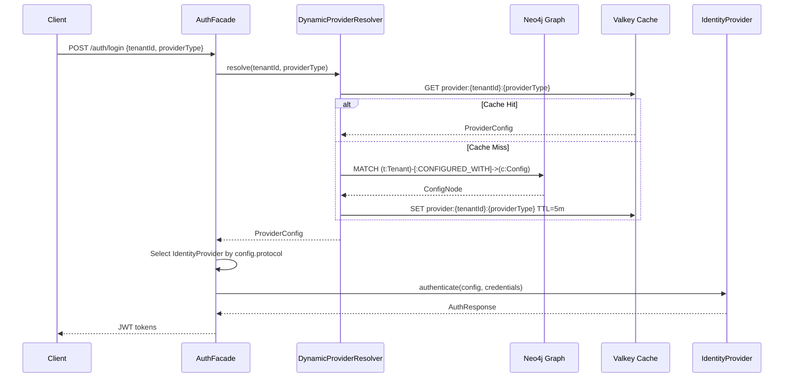
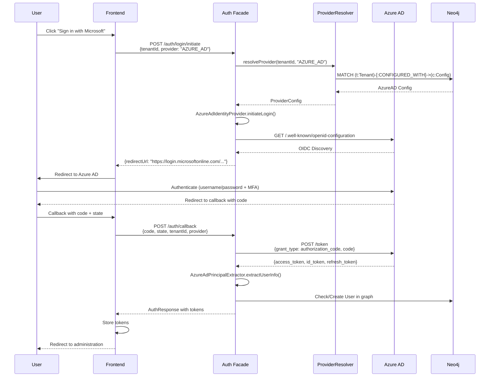
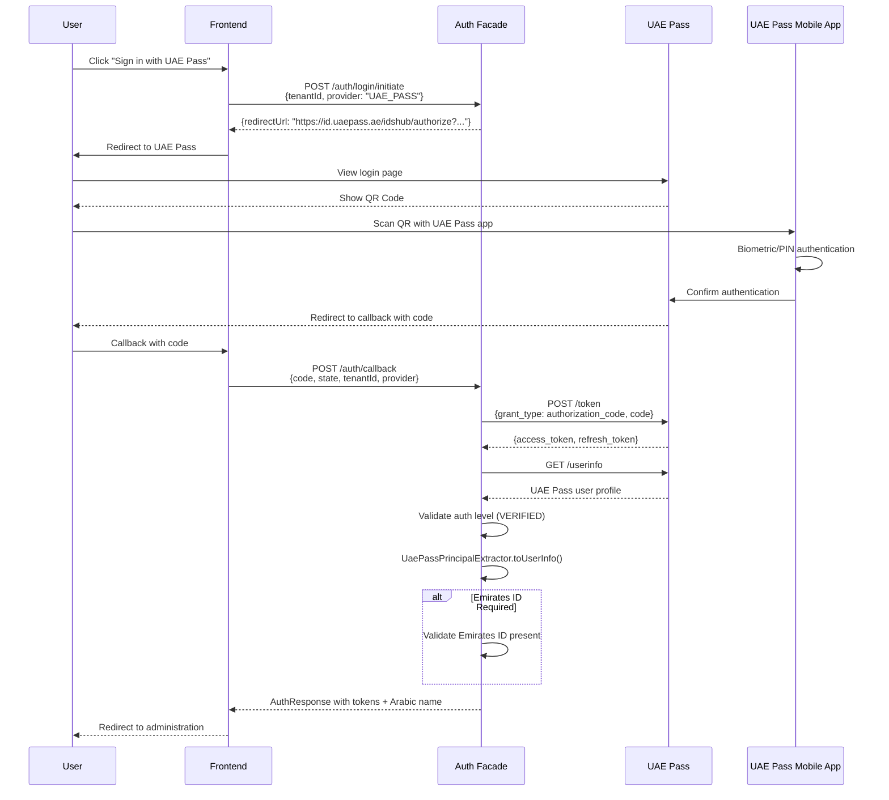
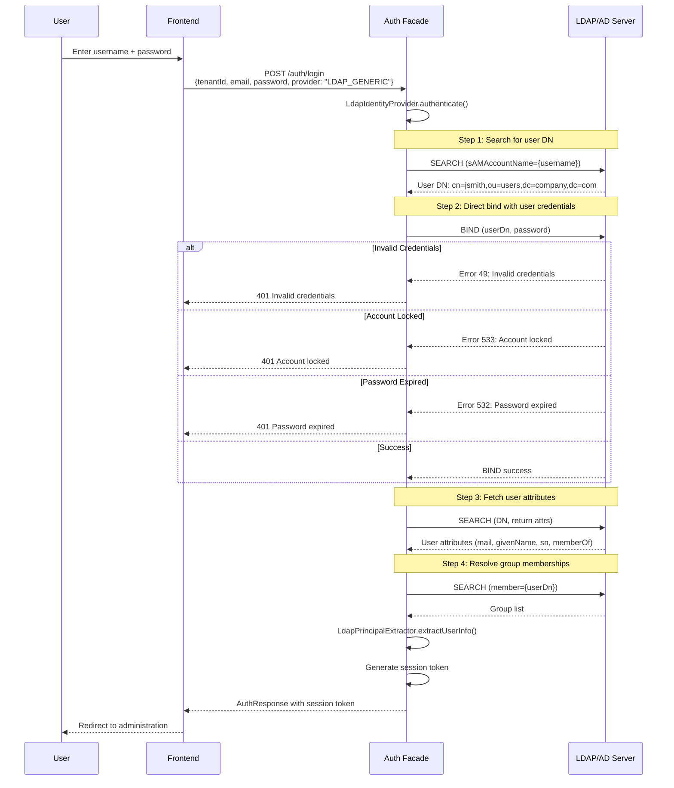
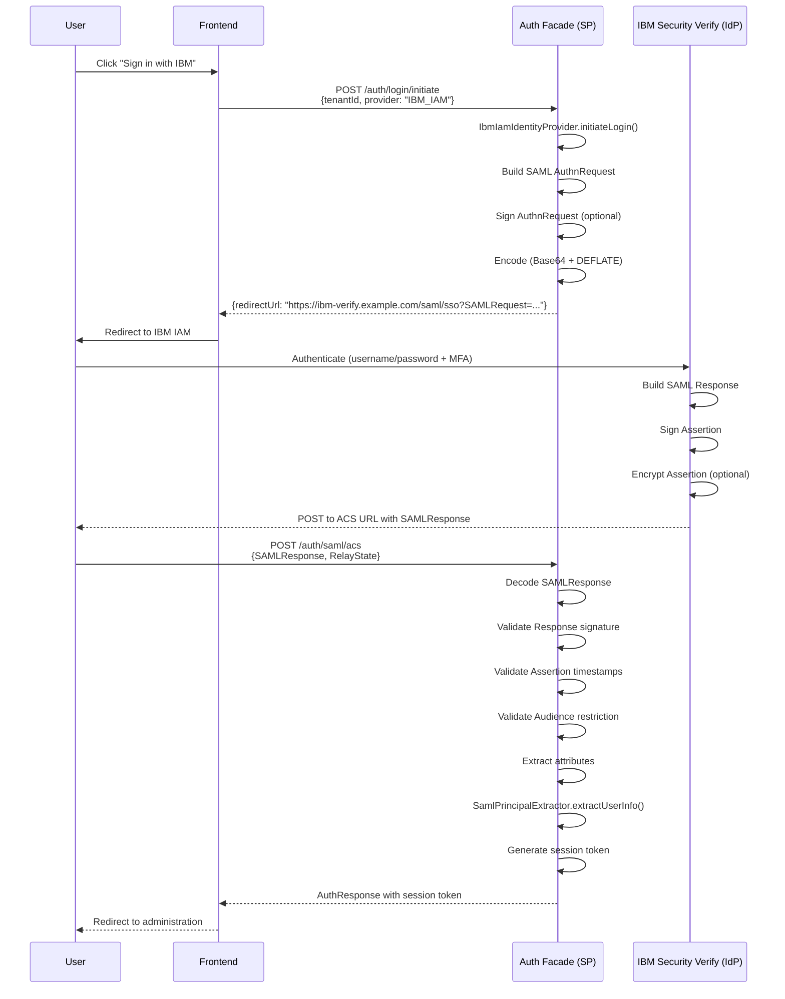

# Multi-Provider Authentication - Low-Level Design (LLD)

> **Document Type:** Low-Level Design (C4 Level 3-4)
> **Owner:** Solution Architect
> **Status:** Draft
> **Created:** 2026-02-25
> **Requirements:** [AUTH-PROVIDERS-REQUIREMENTS.md](../requirements/AUTH-PROVIDERS-REQUIREMENTS.md)
> **Parent LLD:** [auth-facade-lld.md](./auth-facade-lld.md)
> **Related ADR:** [ADR-009](../adr/ADR-009-auth-facade-neo4j-architecture.md)

---

## Table of Contents

1. [Overview](#1-overview)
2. [Provider Architecture](#2-provider-architecture)
3. [Class Design](#3-class-design)
4. [Sequence Diagrams](#4-sequence-diagrams)
5. [API Contracts](#5-api-contracts)
6. [Data Model Extensions](#6-data-model-extensions)
7. [Security Considerations](#7-security-considerations)
8. [Implementation Priorities](#8-implementation-priorities)

---

## 1. Overview

### 1.1 Scope

This LLD extends the existing auth-facade architecture ([auth-facade-lld.md](./auth-facade-lld.md)) to implement four additional identity providers:

| Provider | Protocol | Priority | Target Customers |
|----------|----------|----------|------------------|
| Azure AD (Microsoft Entra ID) | OIDC | High | Microsoft 365 enterprises |
| UAE Pass | OAuth 2.0 | Critical | UAE government entities |
| LDAP/Active Directory | LDAP v3 | High | On-premise enterprises |
| IBM IAM (Security Verify) | SAML 2.0 | High | IBM enterprise customers |

### 1.2 Design Principles

1. **Strategy Pattern**: Each provider implements `IdentityProvider` interface
2. **Configuration-Driven**: Provider selection via Neo4j graph configuration
3. **Secrets Encrypted**: All credentials encrypted with Jasypt at rest
4. **Protocol Normalization**: Canonical `UserInfo` across all protocols
5. **Tenant Isolation**: Per-tenant provider configuration in graph

### 1.3 Reference Implementation

The existing `KeycloakIdentityProvider` serves as the reference implementation pattern. All new providers follow the same structure:

```
/backend/auth-facade/src/main/java/com/ems/auth/provider/KeycloakIdentityProvider.java
```

---

## 2. Provider Architecture

### 2.1 Component Diagram (C4 Level 3)



### 2.2 Provider Selection Flow



---

## 3. Class Design

### 3.1 IdentityProvider Interface (Existing)

```java
/**
 * Strategy interface for identity provider implementations.
 * Each provider implements authentication operations for its specific protocol.
 *
 * @see KeycloakIdentityProvider - Reference OIDC implementation
 */
public interface IdentityProvider {

    AuthResponse authenticate(String realm, String email, String password);
    AuthResponse refreshToken(String realm, String refreshToken);
    void logout(String realm, String refreshToken);
    AuthResponse exchangeToken(String realm, String token, String providerHint);
    LoginInitiationResponse initiateLogin(String realm, String providerHint, String redirectUri);
    MfaSetupResponse setupMfa(String realm, String userId);
    boolean verifyMfaCode(String realm, String userId, String code);
    boolean isMfaEnabled(String realm, String userId);
    List<AuthEventDTO> getEvents(String realm, AuthEventQuery query);
    long getEventCount(String realm, AuthEventQuery query);
    boolean supports(String providerType);
    String getProviderType();
}
```

### 3.2 Azure AD Identity Provider

```java
package com.ems.auth.provider;

/**
 * Azure AD (Microsoft Entra ID) identity provider implementation.
 *
 * Protocol: OpenID Connect
 * Discovery URL: https://login.microsoftonline.com/{tenantId}/v2.0/.well-known/openid-configuration
 *
 * Features:
 * - OIDC authentication flow
 * - App role mapping
 * - Group claim extraction (up to 200 groups)
 * - Conditional Access policy enforcement (by Azure)
 * - B2B guest user support
 *
 * @see ADR-007 Provider-Agnostic Auth Facade
 */
@Service
@ConditionalOnProperty(name = "auth.providers.azure-ad.enabled", havingValue = "true")
@RequiredArgsConstructor
@Slf4j
public class AzureAdIdentityProvider implements IdentityProvider {

    private static final String PROVIDER_TYPE = "AZURE_AD";
    private static final String DISCOVERY_URL_TEMPLATE =
        "https://login.microsoftonline.com/%s/v2.0/.well-known/openid-configuration";

    private final ProviderConfig config;
    private final AzureAdPrincipalExtractor principalExtractor;
    private final RestTemplate restTemplate;
    private final ObjectMapper objectMapper;

    // OAuth2/OIDC endpoints (loaded from discovery)
    private String authorizationEndpoint;
    private String tokenEndpoint;
    private String userInfoEndpoint;
    private String jwksUri;
    private String endSessionEndpoint;

    @PostConstruct
    public void initializeEndpoints() {
        String discoveryUrl = String.format(DISCOVERY_URL_TEMPLATE, config.azureTenantId());
        loadOidcConfiguration(discoveryUrl);
    }

    @Override
    public AuthResponse authenticate(String realm, String email, String password) {
        log.debug("Azure AD: Attempting login for user {} in realm {}", email, realm);

        // Azure AD does not support Resource Owner Password Credentials by default
        // Direct password auth requires special configuration in Azure portal
        // Most Azure AD deployments use authorization code flow

        MultiValueMap<String, String> params = new LinkedMultiValueMap<>();
        params.add("grant_type", "password");
        params.add("client_id", config.clientId());
        params.add("client_secret", config.clientSecret());
        params.add("scope", String.join(" ", config.scopes()));
        params.add("username", email);
        params.add("password", password);

        try {
            ResponseEntity<String> response = executeTokenRequest(params);
            return parseTokenResponse(response.getBody());
        } catch (HttpClientErrorException e) {
            log.warn("Azure AD login failed for user {}: {}", email, e.getStatusCode());
            handleAzureError(e);
            throw new AuthenticationException("Azure AD authentication failed");
        }
    }

    @Override
    public LoginInitiationResponse initiateLogin(String realm, String providerHint, String redirectUri) {
        log.debug("Azure AD: Initiating login with redirect to {}", redirectUri);

        String state = UUID.randomUUID().toString();
        String nonce = UUID.randomUUID().toString();

        String authUrl = UriComponentsBuilder
            .fromUriString(authorizationEndpoint)
            .queryParam("client_id", config.clientId())
            .queryParam("response_type", "code")
            .queryParam("redirect_uri", redirectUri)
            .queryParam("scope", String.join(" ", config.scopes()))
            .queryParam("state", state)
            .queryParam("nonce", nonce)
            .queryParam("response_mode", "query")
            .build()
            .toUriString();

        // Apply domain hint if allowed domains configured
        if (config.allowedDomains() != null && !config.allowedDomains().isEmpty()) {
            authUrl += "&domain_hint=" + config.allowedDomains().get(0);
        }

        return LoginInitiationResponse.redirect(authUrl, state);
    }

    @Override
    public AuthResponse exchangeToken(String realm, String token, String providerHint) {
        log.debug("Azure AD: Exchanging authorization code");

        MultiValueMap<String, String> params = new LinkedMultiValueMap<>();
        params.add("grant_type", "authorization_code");
        params.add("client_id", config.clientId());
        params.add("client_secret", config.clientSecret());
        params.add("code", token);
        params.add("redirect_uri", config.redirectUri());
        params.add("scope", String.join(" ", config.scopes()));

        try {
            ResponseEntity<String> response = executeTokenRequest(params);
            return parseTokenResponse(response.getBody());
        } catch (HttpClientErrorException e) {
            log.error("Azure AD token exchange failed: {}", e.getStatusCode());
            handleAzureError(e);
            throw new AuthenticationException("Azure AD token exchange failed");
        }
    }

    @Override
    public AuthResponse refreshToken(String realm, String refreshToken) {
        log.debug("Azure AD: Refreshing token");

        MultiValueMap<String, String> params = new LinkedMultiValueMap<>();
        params.add("grant_type", "refresh_token");
        params.add("client_id", config.clientId());
        params.add("client_secret", config.clientSecret());
        params.add("refresh_token", refreshToken);
        params.add("scope", String.join(" ", config.scopes()));

        try {
            ResponseEntity<String> response = executeTokenRequest(params);
            return parseTokenResponse(response.getBody());
        } catch (HttpClientErrorException e) {
            log.warn("Azure AD token refresh failed: {}", e.getStatusCode());
            if (e.getStatusCode() == HttpStatus.BAD_REQUEST) {
                throw new InvalidTokenException("Refresh token expired or revoked");
            }
            throw new AuthenticationException("Azure AD token refresh failed");
        }
    }

    @Override
    public void logout(String realm, String refreshToken) {
        log.debug("Azure AD: Logging out user");

        // Azure AD supports RP-initiated logout
        if (endSessionEndpoint != null) {
            try {
                String logoutUrl = UriComponentsBuilder
                    .fromUriString(endSessionEndpoint)
                    .queryParam("post_logout_redirect_uri", config.postLogoutRedirectUri())
                    .build()
                    .toUriString();

                // Note: Azure AD logout is typically client-side redirect
                // Server-side token invalidation handled via token lifecycle
                log.info("Azure AD logout URL: {}", logoutUrl);
            } catch (Exception e) {
                log.warn("Azure AD logout failed: {}", e.getMessage());
            }
        }
    }

    @Override
    public boolean supports(String providerType) {
        return PROVIDER_TYPE.equalsIgnoreCase(providerType);
    }

    @Override
    public String getProviderType() {
        return PROVIDER_TYPE;
    }

    // MFA is handled by Azure AD Conditional Access - delegated to Azure
    @Override
    public MfaSetupResponse setupMfa(String realm, String userId) {
        throw new UnsupportedOperationException("MFA is managed by Azure AD Conditional Access");
    }

    @Override
    public boolean verifyMfaCode(String realm, String userId, String code) {
        throw new UnsupportedOperationException("MFA is managed by Azure AD Conditional Access");
    }

    @Override
    public boolean isMfaEnabled(String realm, String userId) {
        // MFA status determined by Azure AD policies, not queryable via standard OIDC
        return false;
    }

    // Events are retrieved from Azure AD audit logs via Microsoft Graph API
    @Override
    public List<AuthEventDTO> getEvents(String realm, AuthEventQuery query) {
        log.debug("Azure AD: Fetching events via Microsoft Graph API");
        // Implementation requires Microsoft Graph API integration
        // GET https://graph.microsoft.com/v1.0/auditLogs/signIns
        return Collections.emptyList();
    }

    @Override
    public long getEventCount(String realm, AuthEventQuery query) {
        return 0;
    }

    // =========================================================================
    // Private Helper Methods
    // =========================================================================

    private void loadOidcConfiguration(String discoveryUrl) {
        try {
            String response = restTemplate.getForObject(discoveryUrl, String.class);
            JsonNode config = objectMapper.readTree(response);

            this.authorizationEndpoint = config.get("authorization_endpoint").asText();
            this.tokenEndpoint = config.get("token_endpoint").asText();
            this.userInfoEndpoint = config.get("userinfo_endpoint").asText();
            this.jwksUri = config.get("jwks_uri").asText();
            this.endSessionEndpoint = config.has("end_session_endpoint")
                ? config.get("end_session_endpoint").asText()
                : null;

            log.info("Azure AD OIDC configuration loaded for tenant {}", this.config.azureTenantId());
        } catch (Exception e) {
            log.error("Failed to load Azure AD OIDC configuration: {}", e.getMessage());
            throw new AuthenticationException("Azure AD configuration unavailable");
        }
    }

    private ResponseEntity<String> executeTokenRequest(MultiValueMap<String, String> params) {
        HttpHeaders headers = new HttpHeaders();
        headers.setContentType(MediaType.APPLICATION_FORM_URLENCODED);
        HttpEntity<MultiValueMap<String, String>> request = new HttpEntity<>(params, headers);

        return restTemplate.postForEntity(tokenEndpoint, request, String.class);
    }

    private AuthResponse parseTokenResponse(String responseBody) {
        try {
            JsonNode json = objectMapper.readTree(responseBody);

            String accessToken = json.get("access_token").asText();
            String idToken = json.has("id_token") ? json.get("id_token").asText() : null;
            String refreshToken = json.has("refresh_token") ? json.get("refresh_token").asText() : null;
            long expiresIn = json.get("expires_in").asLong();

            // Extract user info from ID token (preferred) or access token
            UserInfo userInfo = extractUserInfo(idToken != null ? idToken : accessToken);

            return AuthResponse.success(accessToken, refreshToken, expiresIn, userInfo);
        } catch (Exception e) {
            log.error("Azure AD: Failed to parse token response: {}", e.getMessage());
            throw new AuthenticationException("Failed to process Azure AD response");
        }
    }

    private UserInfo extractUserInfo(String token) {
        try {
            String[] parts = token.split("\\.");
            if (parts.length != 3) return null;

            String payload = new String(Base64.getUrlDecoder().decode(parts[1]));
            Map<String, Object> claims = objectMapper.readValue(payload,
                new TypeReference<Map<String, Object>>() {});

            return principalExtractor.extractUserInfo(claims);
        } catch (Exception e) {
            log.warn("Azure AD: Failed to extract user info: {}", e.getMessage());
            return null;
        }
    }

    private void handleAzureError(HttpClientErrorException e) {
        try {
            JsonNode error = objectMapper.readTree(e.getResponseBodyAsString());
            String errorCode = error.has("error") ? error.get("error").asText() : "unknown";
            String errorDesc = error.has("error_description")
                ? error.get("error_description").asText()
                : e.getMessage();

            log.error("Azure AD error: {} - {}", errorCode, errorDesc);

            switch (errorCode) {
                case "invalid_grant":
                    throw new InvalidCredentialsException();
                case "invalid_client":
                    throw new AuthenticationException("Azure AD client configuration error");
                case "unauthorized_client":
                    throw new AuthenticationException("Azure AD client not authorized for this flow");
                case "interaction_required":
                    throw new AuthenticationException("MFA or consent required");
                default:
                    throw new AuthenticationException("Azure AD error: " + errorDesc);
            }
        } catch (JsonProcessingException ex) {
            log.error("Failed to parse Azure AD error response");
        }
    }
}
```

### 3.3 Azure AD Principal Extractor

```java
package com.ems.auth.security;

/**
 * Principal extractor for Azure AD JWT claims.
 *
 * Azure AD Claim Mappings:
 * - sub/oid: User object ID
 * - preferred_username/upn: User principal name (email)
 * - given_name: First name
 * - family_name: Last name
 * - email: Email address
 * - tid: Azure AD tenant ID
 * - roles: App roles (if configured)
 * - groups: Group object IDs (if configured, max 200)
 * - wids: Directory role template IDs
 */
@Component
@ConditionalOnProperty(name = "auth.providers.azure-ad.enabled", havingValue = "true")
@Slf4j
public class AzureAdPrincipalExtractor implements PrincipalExtractor {

    @Override
    public UserInfo extractUserInfo(Map<String, Object> claims) {
        return UserInfo.builder()
            .userId(extractUserId(claims))
            .email(extractEmail(claims))
            .firstName(extractString(claims, "given_name"))
            .lastName(extractString(claims, "family_name"))
            .tenantId(extractString(claims, "tid"))
            .roles(extractRoles(claims))
            .groups(extractGroups(claims))
            .identityProvider("AZURE_AD")
            .emailVerified(true) // Azure AD always verifies email
            .build();
    }

    private String extractUserId(Map<String, Object> claims) {
        // Azure AD uses 'oid' (object ID) as the stable identifier
        // 'sub' is audience-specific
        return extractString(claims, "oid", extractString(claims, "sub"));
    }

    private String extractEmail(Map<String, Object> claims) {
        // Try multiple claim paths for email
        String email = extractString(claims, "email");
        if (email == null) {
            email = extractString(claims, "preferred_username");
        }
        if (email == null) {
            email = extractString(claims, "upn");
        }
        return email;
    }

    @SuppressWarnings("unchecked")
    private Set<String> extractRoles(Map<String, Object> claims) {
        Set<String> roles = new HashSet<>();

        // App roles from Azure AD application manifest
        if (claims.containsKey("roles")) {
            Object rolesObj = claims.get("roles");
            if (rolesObj instanceof Collection) {
                roles.addAll((Collection<String>) rolesObj);
            }
        }

        // Directory roles (Azure AD built-in roles)
        if (claims.containsKey("wids")) {
            Object widsObj = claims.get("wids");
            if (widsObj instanceof Collection) {
                ((Collection<String>) widsObj).forEach(wid -> {
                    roles.add("AZURE_ROLE_" + wid);
                });
            }
        }

        return roles;
    }

    @SuppressWarnings("unchecked")
    private Set<String> extractGroups(Map<String, Object> claims) {
        Set<String> groups = new HashSet<>();

        // Group object IDs (Azure AD limits to 200 groups in token)
        if (claims.containsKey("groups")) {
            Object groupsObj = claims.get("groups");
            if (groupsObj instanceof Collection) {
                groups.addAll((Collection<String>) groupsObj);
            }
        }

        // Check for groups overage claim
        // When user has >200 groups, Azure returns a Graph URL to fetch groups
        if (claims.containsKey("_claim_names") && claims.containsKey("_claim_sources")) {
            log.warn("Azure AD: User has >200 groups, overage claim present");
            // Would need to call Microsoft Graph API to get all groups
        }

        return groups;
    }

    private String extractString(Map<String, Object> claims, String key) {
        return extractString(claims, key, null);
    }

    private String extractString(Map<String, Object> claims, String key, String defaultValue) {
        Object value = claims.get(key);
        return value != null ? value.toString() : defaultValue;
    }
}
```

### 3.4 UAE Pass Identity Provider

```java
package com.ems.auth.provider;

/**
 * UAE Pass identity provider implementation.
 *
 * Protocol: OAuth 2.0 (UAE Pass specific flow)
 *
 * Environments:
 * - Staging: https://stg-id.uaepass.ae/idshub/
 * - Production: https://id.uaepass.ae/idshub/
 *
 * Authentication Levels:
 * - ANONYMOUS: No identity verification
 * - BASIC: Email/mobile verification
 * - VERIFIED: Emirates ID verification (required for government)
 *
 * Features:
 * - Emirates ID verification
 * - Arabic/English name support
 * - Digital signature services (PKI)
 * - Mobile app authentication (QR/push)
 * - OTP-based authentication
 *
 * @see REQ-AUTH-001 Section 3.2 UAE Pass
 */
@Service
@ConditionalOnProperty(name = "auth.providers.uaepass.enabled", havingValue = "true")
@RequiredArgsConstructor
@Slf4j
public class UaePassIdentityProvider implements IdentityProvider {

    private static final String PROVIDER_TYPE = "UAE_PASS";

    // UAE Pass endpoints
    private static final String STG_BASE_URL = "https://stg-id.uaepass.ae/idshub";
    private static final String PROD_BASE_URL = "https://id.uaepass.ae/idshub";

    private final UaePassConfig config;
    private final UaePassPrincipalExtractor principalExtractor;
    private final RestTemplate restTemplate;
    private final ObjectMapper objectMapper;

    @Override
    public AuthResponse authenticate(String realm, String email, String password) {
        // UAE Pass does not support direct password authentication
        // All authentication must go through UAE Pass app or OTP flow
        throw new UnsupportedOperationException(
            "UAE Pass requires mobile app or OTP authentication. Use initiateLogin()");
    }

    @Override
    public LoginInitiationResponse initiateLogin(String realm, String providerHint, String redirectUri) {
        log.debug("UAE Pass: Initiating login for realm {} with redirect {}", realm, redirectUri);

        String baseUrl = getBaseUrl();
        String state = UUID.randomUUID().toString();

        // Build UAE Pass authorization URL
        String authUrl = UriComponentsBuilder
            .fromUriString(baseUrl + "/authorize")
            .queryParam("response_type", "code")
            .queryParam("client_id", config.clientId())
            .queryParam("scope", "urn:uae:digitalid:profile:general")
            .queryParam("state", state)
            .queryParam("redirect_uri", redirectUri)
            .queryParam("acr_values", getAcrValue())
            .queryParam("ui_locales", config.languagePreference())
            .build()
            .toUriString();

        return LoginInitiationResponse.redirect(authUrl, state);
    }

    @Override
    public AuthResponse exchangeToken(String realm, String code, String providerHint) {
        log.debug("UAE Pass: Exchanging authorization code");

        String baseUrl = getBaseUrl();

        MultiValueMap<String, String> params = new LinkedMultiValueMap<>();
        params.add("grant_type", "authorization_code");
        params.add("code", code);
        params.add("redirect_uri", config.redirectUri());
        params.add("client_id", config.clientId());
        params.add("client_secret", config.clientSecret());

        try {
            HttpHeaders headers = new HttpHeaders();
            headers.setContentType(MediaType.APPLICATION_FORM_URLENCODED);
            HttpEntity<MultiValueMap<String, String>> request = new HttpEntity<>(params, headers);

            ResponseEntity<String> response = restTemplate.postForEntity(
                baseUrl + "/token", request, String.class);

            return parseTokenResponse(response.getBody());
        } catch (HttpClientErrorException e) {
            log.error("UAE Pass token exchange failed: {}", e.getStatusCode());
            handleUaePassError(e);
            throw new AuthenticationException("UAE Pass authentication failed");
        }
    }

    @Override
    public AuthResponse refreshToken(String realm, String refreshToken) {
        log.debug("UAE Pass: Refreshing token");

        String baseUrl = getBaseUrl();

        MultiValueMap<String, String> params = new LinkedMultiValueMap<>();
        params.add("grant_type", "refresh_token");
        params.add("refresh_token", refreshToken);
        params.add("client_id", config.clientId());
        params.add("client_secret", config.clientSecret());

        try {
            HttpHeaders headers = new HttpHeaders();
            headers.setContentType(MediaType.APPLICATION_FORM_URLENCODED);
            HttpEntity<MultiValueMap<String, String>> request = new HttpEntity<>(params, headers);

            ResponseEntity<String> response = restTemplate.postForEntity(
                baseUrl + "/token", request, String.class);

            return parseTokenResponse(response.getBody());
        } catch (HttpClientErrorException e) {
            log.warn("UAE Pass token refresh failed: {}", e.getStatusCode());
            throw new InvalidTokenException("UAE Pass refresh token expired");
        }
    }

    @Override
    public void logout(String realm, String refreshToken) {
        log.debug("UAE Pass: Logout requested");
        // UAE Pass does not have a standard logout endpoint
        // Session management is handled by UAE Pass app
    }

    /**
     * Fetch user profile from UAE Pass userinfo endpoint.
     */
    public UaePassUserInfo fetchUserInfo(String accessToken) {
        log.debug("UAE Pass: Fetching user info");

        String baseUrl = getBaseUrl();

        HttpHeaders headers = new HttpHeaders();
        headers.setBearerAuth(accessToken);
        HttpEntity<Void> request = new HttpEntity<>(headers);

        try {
            ResponseEntity<String> response = restTemplate.exchange(
                baseUrl + "/userinfo", HttpMethod.GET, request, String.class);

            return parseUserInfo(response.getBody());
        } catch (HttpClientErrorException e) {
            log.error("UAE Pass userinfo failed: {}", e.getStatusCode());
            throw new AuthenticationException("Failed to fetch UAE Pass user info");
        }
    }

    @Override
    public boolean supports(String providerType) {
        return PROVIDER_TYPE.equalsIgnoreCase(providerType);
    }

    @Override
    public String getProviderType() {
        return PROVIDER_TYPE;
    }

    // MFA is built into UAE Pass (biometric/PIN on mobile app)
    @Override
    public MfaSetupResponse setupMfa(String realm, String userId) {
        throw new UnsupportedOperationException("MFA is built into UAE Pass app");
    }

    @Override
    public boolean verifyMfaCode(String realm, String userId, String code) {
        throw new UnsupportedOperationException("MFA is built into UAE Pass app");
    }

    @Override
    public boolean isMfaEnabled(String realm, String userId) {
        return true; // UAE Pass always uses MFA via mobile app
    }

    @Override
    public List<AuthEventDTO> getEvents(String realm, AuthEventQuery query) {
        // UAE Pass does not expose audit logs via API
        return Collections.emptyList();
    }

    @Override
    public long getEventCount(String realm, AuthEventQuery query) {
        return 0;
    }

    // =========================================================================
    // Private Helper Methods
    // =========================================================================

    private String getBaseUrl() {
        return config.environment() == UaePassEnvironment.PRODUCTION
            ? PROD_BASE_URL
            : STG_BASE_URL;
    }

    private String getAcrValue() {
        // ACR value determines authentication level
        return switch (config.requiredAuthLevel()) {
            case ANONYMOUS -> "urn:safelayer:tws:policies:authentication:level:anonymous";
            case BASIC -> "urn:safelayer:tws:policies:authentication:level:low";
            case VERIFIED -> "urn:safelayer:tws:policies:authentication:level:substantial";
        };
    }

    private AuthResponse parseTokenResponse(String responseBody) {
        try {
            JsonNode json = objectMapper.readTree(responseBody);

            String accessToken = json.get("access_token").asText();
            String refreshToken = json.has("refresh_token") ? json.get("refresh_token").asText() : null;
            long expiresIn = json.has("expires_in") ? json.get("expires_in").asLong() : 3600;

            // Fetch user info to populate UserInfo
            UaePassUserInfo uaePassUser = fetchUserInfo(accessToken);
            UserInfo userInfo = principalExtractor.toUserInfo(uaePassUser);

            // Validate authentication level
            validateAuthLevel(uaePassUser);

            // Validate Emirates ID if required
            if (config.emiratesIdRequired() && uaePassUser.emiratesId() == null) {
                throw new AuthenticationException("Emirates ID required for this application");
            }

            return AuthResponse.success(accessToken, refreshToken, expiresIn, userInfo);
        } catch (JsonProcessingException e) {
            log.error("UAE Pass: Failed to parse token response: {}", e.getMessage());
            throw new AuthenticationException("Failed to process UAE Pass response");
        }
    }

    private UaePassUserInfo parseUserInfo(String responseBody) {
        try {
            JsonNode json = objectMapper.readTree(responseBody);

            return new UaePassUserInfo(
                json.has("sub") ? json.get("sub").asText() : null,
                json.has("uuid") ? json.get("uuid").asText() : null,
                json.has("idn") ? json.get("idn").asText() : null,
                json.has("email") ? json.get("email").asText() : null,
                json.has("mobile") ? json.get("mobile").asText() : null,
                json.has("fullnameEN") ? json.get("fullnameEN").asText() : null,
                json.has("fullnameAR") ? json.get("fullnameAR").asText() : null,
                json.has("firstnameEN") ? json.get("firstnameEN").asText() : null,
                json.has("firstnameAR") ? json.get("firstnameAR").asText() : null,
                json.has("lastnameEN") ? json.get("lastnameEN").asText() : null,
                json.has("lastnameAR") ? json.get("lastnameAR").asText() : null,
                json.has("gender") ? json.get("gender").asText() : null,
                json.has("dob") ? json.get("dob").asText() : null,
                json.has("nationalityEN") ? json.get("nationalityEN").asText() : null,
                json.has("nationalityAR") ? json.get("nationalityAR").asText() : null,
                json.has("userType") ? json.get("userType").asText() : null,
                json.has("acr") ? json.get("acr").asText() : null
            );
        } catch (JsonProcessingException e) {
            log.error("UAE Pass: Failed to parse userinfo: {}", e.getMessage());
            throw new AuthenticationException("Failed to parse UAE Pass user info");
        }
    }

    private void validateAuthLevel(UaePassUserInfo userInfo) {
        UaePassAuthLevel achieved = parseAuthLevel(userInfo.acr());
        UaePassAuthLevel required = config.requiredAuthLevel();

        if (achieved.ordinal() < required.ordinal()) {
            throw new AuthenticationException(String.format(
                "Authentication level insufficient. Required: %s, Achieved: %s",
                required, achieved));
        }
    }

    private UaePassAuthLevel parseAuthLevel(String acr) {
        if (acr == null) return UaePassAuthLevel.ANONYMOUS;

        if (acr.contains("substantial") || acr.contains("high")) {
            return UaePassAuthLevel.VERIFIED;
        } else if (acr.contains("low")) {
            return UaePassAuthLevel.BASIC;
        }
        return UaePassAuthLevel.ANONYMOUS;
    }

    private void handleUaePassError(HttpClientErrorException e) {
        try {
            JsonNode error = objectMapper.readTree(e.getResponseBodyAsString());
            String errorCode = error.has("error") ? error.get("error").asText() : "unknown";
            String errorDesc = error.has("error_description")
                ? error.get("error_description").asText()
                : e.getMessage();

            log.error("UAE Pass error: {} - {}", errorCode, errorDesc);

            switch (errorCode) {
                case "access_denied":
                    throw new AuthenticationException("UAE Pass authentication cancelled");
                case "invalid_request":
                    throw new AuthenticationException("Invalid UAE Pass request");
                case "server_error":
                    throw new AuthenticationException("UAE Pass service unavailable");
                default:
                    throw new AuthenticationException("UAE Pass error: " + errorDesc);
            }
        } catch (JsonProcessingException ex) {
            log.error("Failed to parse UAE Pass error response");
        }
    }
}

/**
 * UAE Pass user information record.
 */
public record UaePassUserInfo(
    String sub,
    String uuid,
    String emiratesId,
    String email,
    String mobile,
    String fullNameEn,
    String fullNameAr,
    String firstNameEn,
    String firstNameAr,
    String lastNameEn,
    String lastNameAr,
    String gender,
    String dateOfBirth,
    String nationalityEn,
    String nationalityAr,
    String userType,
    String acr
) {}

/**
 * UAE Pass authentication levels.
 */
public enum UaePassAuthLevel {
    ANONYMOUS,
    BASIC,
    VERIFIED
}

/**
 * UAE Pass environment.
 */
public enum UaePassEnvironment {
    STAGING,
    PRODUCTION
}
```

### 3.5 LDAP Identity Provider

```java
package com.ems.auth.provider;

/**
 * LDAP/Active Directory identity provider implementation.
 *
 * Protocol: LDAP v3 / LDAPS
 *
 * Features:
 * - Direct bind authentication
 * - Service account bind for searches
 * - User attribute mapping (configurable)
 * - Group membership sync
 * - Nested group resolution (up to 5 levels)
 * - Connection pooling (10 connections per tenant)
 * - SSL/TLS support
 *
 * @see REQ-AUTH-001 Section 3.3 LDAP/Active Directory
 */
@Service
@ConditionalOnProperty(name = "auth.providers.ldap.enabled", havingValue = "true")
@RequiredArgsConstructor
@Slf4j
public class LdapIdentityProvider implements IdentityProvider {

    private static final String PROVIDER_TYPE = "LDAP_GENERIC";
    private static final int MAX_NESTED_GROUP_DEPTH = 5;

    private final LdapConfig config;
    private final LdapPrincipalExtractor principalExtractor;

    // Connection pool
    private final Map<String, LdapContextSource> contextSources = new ConcurrentHashMap<>();

    @Override
    public AuthResponse authenticate(String realm, String email, String password) {
        log.debug("LDAP: Attempting authentication for user {} in realm {}", email, realm);

        LdapContextSource contextSource = getContextSource(realm);

        try {
            // Step 1: Search for user DN using service account
            String userDn = searchUserDn(contextSource, email);
            if (userDn == null) {
                log.warn("LDAP: User not found: {}", email);
                throw new InvalidCredentialsException();
            }

            // Step 2: Attempt direct bind with user credentials
            validateUserCredentials(userDn, password);

            // Step 3: Fetch user attributes
            DirContextOperations userContext = fetchUserAttributes(contextSource, userDn);

            // Step 4: Fetch group memberships
            Set<String> groups = fetchGroupMemberships(contextSource, userDn);

            // Step 5: Build user info
            UserInfo userInfo = principalExtractor.extractUserInfo(userContext, groups);

            // LDAP has no tokens - generate internal session token
            String sessionToken = generateSessionToken(userDn);

            log.info("LDAP: Authentication successful for user {}", email);
            return AuthResponse.success(sessionToken, null, 28800, userInfo); // 8hr session

        } catch (AuthenticationException e) {
            log.warn("LDAP: Authentication failed for user {}: {}", email, e.getMessage());
            throw e;
        } catch (Exception e) {
            log.error("LDAP: Authentication error for user {}: {}", email, e.getMessage());
            throw new AuthenticationException("LDAP authentication failed: " + e.getMessage());
        }
    }

    @Override
    public LoginInitiationResponse initiateLogin(String realm, String providerHint, String redirectUri) {
        // LDAP uses direct credential submission, not redirect-based flow
        return LoginInitiationResponse.inline("LDAP authentication uses direct login form");
    }

    @Override
    public AuthResponse refreshToken(String realm, String refreshToken) {
        // LDAP has no refresh tokens - re-authentication required
        throw new UnsupportedOperationException("LDAP does not support token refresh");
    }

    @Override
    public AuthResponse exchangeToken(String realm, String token, String providerHint) {
        // LDAP has no token exchange
        throw new UnsupportedOperationException("LDAP does not support token exchange");
    }

    @Override
    public void logout(String realm, String refreshToken) {
        // LDAP logout is handled by session management layer
        log.debug("LDAP: Logout requested (session invalidation handled by session service)");
    }

    /**
     * Sync users from LDAP to local database.
     * Called by scheduled job if syncEnabled=true.
     */
    public List<UserInfo> syncUsers(String tenantId) {
        log.info("LDAP: Starting user sync for tenant {}", tenantId);

        LdapContextSource contextSource = getContextSource(tenantId);
        LdapTemplate ldapTemplate = new LdapTemplate(contextSource);

        List<UserInfo> users = new ArrayList<>();

        try {
            // Build search filter for all users
            String filter = config.userSearchFilter().replace("{0}", "*");

            ldapTemplate.search(
                config.userSearchBase(),
                filter,
                SearchControls.SUBTREE_SCOPE,
                (ctx) -> {
                    DirContextOperations user = (DirContextOperations) ctx;
                    Set<String> groups = fetchGroupMemberships(contextSource, user.getDn().toString());
                    users.add(principalExtractor.extractUserInfo(user, groups));
                    return null;
                }
            );

            log.info("LDAP: Sync completed for tenant {}. {} users synced.", tenantId, users.size());
            return users;

        } catch (Exception e) {
            log.error("LDAP: Sync failed for tenant {}: {}", tenantId, e.getMessage());
            throw new AuthenticationException("LDAP sync failed: " + e.getMessage());
        }
    }

    /**
     * Test LDAP connection with service account.
     */
    public TestConnectionResponse testConnection(String tenantId) {
        log.info("LDAP: Testing connection for tenant {}", tenantId);

        try {
            LdapContextSource contextSource = getContextSource(tenantId);
            DirContext ctx = contextSource.getContext(config.bindDn(), config.bindPassword());
            ctx.close();

            // Count users in search base
            LdapTemplate ldapTemplate = new LdapTemplate(contextSource);
            String filter = config.userSearchFilter().replace("{0}", "*");
            long userCount = ldapTemplate.search(
                config.userSearchBase(),
                filter,
                SearchControls.SUBTREE_SCOPE,
                (ctx2) -> 1
            ).size();

            return new TestConnectionResponse(
                true,
                String.format("Connection successful - %d users found", userCount),
                new ConnectionDetails(
                    config.serverUrl(),
                    config.userSearchBase(),
                    List.of(),
                    Map.of("port", String.valueOf(config.port()))
                ),
                null
            );

        } catch (Exception e) {
            log.error("LDAP: Connection test failed for tenant {}: {}", tenantId, e.getMessage());
            return new TestConnectionResponse(
                false,
                "Connection failed: " + e.getMessage(),
                null,
                e.getMessage()
            );
        }
    }

    @Override
    public boolean supports(String providerType) {
        return PROVIDER_TYPE.equalsIgnoreCase(providerType);
    }

    @Override
    public String getProviderType() {
        return PROVIDER_TYPE;
    }

    // MFA not supported by LDAP - requires external solution
    @Override
    public MfaSetupResponse setupMfa(String realm, String userId) {
        throw new UnsupportedOperationException("LDAP does not support MFA. Use external MFA solution.");
    }

    @Override
    public boolean verifyMfaCode(String realm, String userId, String code) {
        throw new UnsupportedOperationException("LDAP does not support MFA");
    }

    @Override
    public boolean isMfaEnabled(String realm, String userId) {
        return false;
    }

    @Override
    public List<AuthEventDTO> getEvents(String realm, AuthEventQuery query) {
        // LDAP does not have event logs accessible via LDAP protocol
        return Collections.emptyList();
    }

    @Override
    public long getEventCount(String realm, AuthEventQuery query) {
        return 0;
    }

    // =========================================================================
    // Private Helper Methods
    // =========================================================================

    private LdapContextSource getContextSource(String tenantId) {
        return contextSources.computeIfAbsent(tenantId, this::createContextSource);
    }

    private LdapContextSource createContextSource(String tenantId) {
        LdapContextSource contextSource = new LdapContextSource();
        contextSource.setUrl(config.serverUrl() + ":" + config.port());
        contextSource.setBase(config.userSearchBase());
        contextSource.setUserDn(config.bindDn());
        contextSource.setPassword(config.bindPassword());
        contextSource.setPooled(true);

        // SSL/TLS configuration
        if (config.useSsl()) {
            Map<String, Object> env = new HashMap<>();
            env.put(Context.SECURITY_PROTOCOL, "ssl");
            if (config.trustAllCertificates()) {
                env.put("java.naming.ldap.factory.socket", TrustAllSSLSocketFactory.class.getName());
            }
            contextSource.setBaseEnvironmentProperties(env);
        }

        // Timeouts
        contextSource.setConnectTimeout(Duration.ofMillis(config.connectionTimeout()));
        contextSource.setReadTimeout(Duration.ofMillis(config.readTimeout()));

        try {
            contextSource.afterPropertiesSet();
        } catch (Exception e) {
            throw new AuthenticationException("Failed to create LDAP context: " + e.getMessage());
        }

        return contextSource;
    }

    private String searchUserDn(LdapContextSource contextSource, String username) {
        LdapTemplate ldapTemplate = new LdapTemplate(contextSource);

        String filter = config.userSearchFilter().replace("{0}", username);

        List<String> results = ldapTemplate.search(
            config.userSearchBase(),
            filter,
            SearchControls.SUBTREE_SCOPE,
            (ctx) -> ((DirContextOperations) ctx).getDn().toString()
        );

        return results.isEmpty() ? null : results.get(0);
    }

    private void validateUserCredentials(String userDn, String password) {
        LdapContextSource userContext = new LdapContextSource();
        userContext.setUrl(config.serverUrl() + ":" + config.port());
        userContext.setUserDn(userDn);
        userContext.setPassword(password);

        if (config.useSsl()) {
            Map<String, Object> env = new HashMap<>();
            env.put(Context.SECURITY_PROTOCOL, "ssl");
            userContext.setBaseEnvironmentProperties(env);
        }

        try {
            userContext.afterPropertiesSet();
            DirContext ctx = userContext.getContext(userDn, password);
            ctx.close();
        } catch (NamingException e) {
            String errorMsg = e.getMessage().toLowerCase();
            if (errorMsg.contains("invalid credentials") || errorMsg.contains("49")) {
                throw new InvalidCredentialsException();
            } else if (errorMsg.contains("locked") || errorMsg.contains("533")) {
                throw new AuthenticationException("Account locked. Contact your administrator.");
            } else if (errorMsg.contains("expired") || errorMsg.contains("532")) {
                throw new AuthenticationException("Password expired. Please change your password.");
            }
            throw new AuthenticationException("LDAP bind failed: " + e.getMessage());
        } catch (Exception e) {
            throw new AuthenticationException("LDAP authentication error: " + e.getMessage());
        }
    }

    private DirContextOperations fetchUserAttributes(LdapContextSource contextSource, String userDn) {
        LdapTemplate ldapTemplate = new LdapTemplate(contextSource);
        return ldapTemplate.lookupContext(LdapNameBuilder.newInstance(userDn).build());
    }

    private Set<String> fetchGroupMemberships(LdapContextSource contextSource, String userDn) {
        Set<String> groups = new HashSet<>();

        if (config.groupSearchBase() == null) {
            return groups;
        }

        LdapTemplate ldapTemplate = new LdapTemplate(contextSource);

        // Fetch direct memberships
        String filter = config.groupSearchFilter().replace("{0}", userDn);

        ldapTemplate.search(
            config.groupSearchBase(),
            filter,
            SearchControls.SUBTREE_SCOPE,
            (ctx) -> {
                DirContextOperations group = (DirContextOperations) ctx;
                groups.add(group.getStringAttribute("cn"));
                return null;
            }
        );

        // Resolve nested groups (up to MAX_NESTED_GROUP_DEPTH)
        if (config.resolveNestedGroups()) {
            resolveNestedGroups(ldapTemplate, groups, 0);
        }

        return groups;
    }

    private void resolveNestedGroups(LdapTemplate ldapTemplate, Set<String> groups, int depth) {
        if (depth >= MAX_NESTED_GROUP_DEPTH || groups.isEmpty()) {
            return;
        }

        Set<String> newGroups = new HashSet<>();

        for (String groupCn : groups) {
            String filter = config.groupSearchFilter().replace("{0}", "cn=" + groupCn);

            ldapTemplate.search(
                config.groupSearchBase(),
                filter,
                SearchControls.SUBTREE_SCOPE,
                (ctx) -> {
                    DirContextOperations group = (DirContextOperations) ctx;
                    String cn = group.getStringAttribute("cn");
                    if (!groups.contains(cn)) {
                        newGroups.add(cn);
                    }
                    return null;
                }
            );
        }

        if (!newGroups.isEmpty()) {
            groups.addAll(newGroups);
            resolveNestedGroups(ldapTemplate, newGroups, depth + 1);
        }
    }

    private String generateSessionToken(String userDn) {
        // Generate a secure session token for LDAP users
        // This is used internally since LDAP has no OAuth tokens
        return "ldap:" + UUID.randomUUID() + ":" +
               Base64.getEncoder().encodeToString(userDn.getBytes(StandardCharsets.UTF_8));
    }
}
```

### 3.6 IBM IAM (SAML) Identity Provider

```java
package com.ems.auth.provider;

/**
 * IBM IAM (Security Verify) identity provider implementation.
 *
 * Protocol: SAML 2.0
 *
 * Features:
 * - SP-initiated SSO
 * - IdP-initiated SSO
 * - Single Logout (SLO)
 * - Signed SAML assertions
 * - Encrypted assertions (optional)
 * - Attribute mapping
 *
 * Dependencies:
 * - OpenSAML 4.x
 * - Spring Security SAML2 Service Provider
 *
 * @see REQ-AUTH-001 Section 3.4 IBM IAM
 */
@Service
@ConditionalOnProperty(name = "auth.providers.ibm-iam.enabled", havingValue = "true")
@RequiredArgsConstructor
@Slf4j
public class IbmIamIdentityProvider implements IdentityProvider {

    private static final String PROVIDER_TYPE = "IBM_IAM";
    private static final Duration ASSERTION_VALIDITY = Duration.ofMinutes(5);
    private static final Duration CLOCK_SKEW = Duration.ofMinutes(5);

    private final SamlConfig config;
    private final SamlPrincipalExtractor principalExtractor;
    private final SamlMetadataService metadataService;

    // SAML metadata (loaded from IdP)
    private String ssoUrl;
    private String sloUrl;
    private Credential idpSigningCredential;

    @PostConstruct
    public void initializeFromMetadata() {
        if (config.metadataUrl() != null) {
            loadIdpMetadata();
        }
    }

    @Override
    public AuthResponse authenticate(String realm, String email, String password) {
        // SAML does not support direct password authentication
        // All authentication must go through SAML SSO flow
        throw new UnsupportedOperationException(
            "IBM IAM uses SAML SSO. Use initiateLogin() for SP-initiated flow.");
    }

    @Override
    public LoginInitiationResponse initiateLogin(String realm, String providerHint, String redirectUri) {
        log.debug("IBM IAM: Initiating SAML SP-initiated SSO");

        try {
            // Build SAML AuthnRequest
            AuthnRequest authnRequest = buildAuthnRequest(redirectUri);

            // Sign the request if configured
            if (config.signAuthnRequest()) {
                signAuthnRequest(authnRequest);
            }

            // Encode request for redirect
            String samlRequest = encodeSamlRequest(authnRequest);
            String relayState = UUID.randomUUID().toString();

            // Build redirect URL
            String redirectUrl = UriComponentsBuilder
                .fromUriString(ssoUrl)
                .queryParam("SAMLRequest", samlRequest)
                .queryParam("RelayState", relayState)
                .build()
                .toUriString();

            return LoginInitiationResponse.redirect(redirectUrl, relayState);

        } catch (Exception e) {
            log.error("IBM IAM: Failed to initiate SAML SSO: {}", e.getMessage());
            throw new AuthenticationException("Failed to initiate IBM IAM login");
        }
    }

    /**
     * Process SAML Response (assertion consumer service).
     * Called when IdP posts back the SAML assertion.
     */
    public AuthResponse processSamlResponse(String samlResponse, String relayState) {
        log.debug("IBM IAM: Processing SAML response");

        try {
            // Decode and parse SAML response
            Response response = decodeSamlResponse(samlResponse);

            // Validate response
            validateSamlResponse(response);

            // Extract assertion
            Assertion assertion = response.getAssertions().get(0);

            // Validate assertion
            validateAssertion(assertion);

            // Extract user attributes
            Map<String, Object> attributes = extractAttributes(assertion);
            UserInfo userInfo = principalExtractor.extractUserInfo(attributes);

            // Generate session token (SAML has no OAuth tokens)
            String sessionToken = generateSessionToken(assertion);

            log.info("IBM IAM: SAML authentication successful for user {}", userInfo.email());
            return AuthResponse.success(sessionToken, null, 28800, userInfo); // 8hr session

        } catch (SamlException e) {
            log.error("IBM IAM: SAML validation failed: {}", e.getMessage());
            throw new AuthenticationException("SAML authentication failed: " + e.getMessage());
        } catch (Exception e) {
            log.error("IBM IAM: SAML processing error: {}", e.getMessage());
            throw new AuthenticationException("Failed to process IBM IAM response");
        }
    }

    @Override
    public AuthResponse exchangeToken(String realm, String token, String providerHint) {
        // For SAML, this is called with the SAMLResponse
        return processSamlResponse(token, providerHint);
    }

    @Override
    public AuthResponse refreshToken(String realm, String refreshToken) {
        // SAML has no refresh tokens - re-authentication required via SSO
        throw new UnsupportedOperationException("SAML does not support token refresh. Re-authenticate via SSO.");
    }

    @Override
    public void logout(String realm, String refreshToken) {
        log.debug("IBM IAM: Initiating SAML Single Logout");

        if (sloUrl == null || !config.enableSlo()) {
            log.debug("IBM IAM: SLO not configured or disabled");
            return;
        }

        try {
            // Build SAML LogoutRequest
            LogoutRequest logoutRequest = buildLogoutRequest(refreshToken);

            // Sign the request
            signLogoutRequest(logoutRequest);

            // Encode and send
            String samlRequest = encodeSamlRequest(logoutRequest);

            // In practice, this would redirect the user or make a backchannel call
            log.info("IBM IAM: Logout request prepared for SLO URL: {}", sloUrl);

        } catch (Exception e) {
            log.warn("IBM IAM: SLO failed: {}", e.getMessage());
        }
    }

    /**
     * Process SAML Logout Response (for SP-initiated logout).
     */
    public void processSamlLogoutResponse(String samlResponse) {
        log.debug("IBM IAM: Processing SAML logout response");
        // Validate the logout response
        // Clear local session
    }

    /**
     * Process SAML Logout Request (for IdP-initiated logout).
     */
    public String processSamlLogoutRequest(String samlRequest) {
        log.debug("IBM IAM: Processing IdP-initiated logout request");
        // Validate the logout request
        // Clear local session
        // Return logout response
        return buildLogoutResponse();
    }

    @Override
    public boolean supports(String providerType) {
        return PROVIDER_TYPE.equalsIgnoreCase(providerType);
    }

    @Override
    public String getProviderType() {
        return PROVIDER_TYPE;
    }

    // MFA is handled by IBM IAM - delegated to IdP
    @Override
    public MfaSetupResponse setupMfa(String realm, String userId) {
        throw new UnsupportedOperationException("MFA is managed by IBM IAM");
    }

    @Override
    public boolean verifyMfaCode(String realm, String userId, String code) {
        throw new UnsupportedOperationException("MFA is managed by IBM IAM");
    }

    @Override
    public boolean isMfaEnabled(String realm, String userId) {
        return false; // Cannot determine from SAML
    }

    @Override
    public List<AuthEventDTO> getEvents(String realm, AuthEventQuery query) {
        // IBM IAM events accessed via IBM Cloud audit logs, not SAML
        return Collections.emptyList();
    }

    @Override
    public long getEventCount(String realm, AuthEventQuery query) {
        return 0;
    }

    // =========================================================================
    // Private Helper Methods
    // =========================================================================

    private void loadIdpMetadata() {
        try {
            IdpMetadata metadata = metadataService.fetchMetadata(config.metadataUrl());
            this.ssoUrl = metadata.ssoUrl();
            this.sloUrl = metadata.sloUrl();
            this.idpSigningCredential = metadata.signingCredential();

            log.info("IBM IAM: Loaded IdP metadata from {}", config.metadataUrl());
        } catch (Exception e) {
            log.error("IBM IAM: Failed to load IdP metadata: {}", e.getMessage());
            throw new AuthenticationException("Failed to load IBM IAM metadata");
        }
    }

    private AuthnRequest buildAuthnRequest(String acsUrl) {
        AuthnRequest authnRequest = OpenSamlUtil.buildSamlObject(AuthnRequest.class);

        authnRequest.setID("_" + UUID.randomUUID().toString());
        authnRequest.setIssueInstant(Instant.now());
        authnRequest.setDestination(ssoUrl);
        authnRequest.setAssertionConsumerServiceURL(acsUrl);
        authnRequest.setProtocolBinding(SAMLConstants.SAML2_POST_BINDING_URI);

        // Issuer
        Issuer issuer = OpenSamlUtil.buildSamlObject(Issuer.class);
        issuer.setValue(config.entityId());
        authnRequest.setIssuer(issuer);

        // NameID Policy
        NameIDPolicy nameIdPolicy = OpenSamlUtil.buildSamlObject(NameIDPolicy.class);
        nameIdPolicy.setFormat(config.nameIdFormat().getUri());
        nameIdPolicy.setAllowCreate(true);
        authnRequest.setNameIDPolicy(nameIdPolicy);

        return authnRequest;
    }

    private void validateSamlResponse(Response response) throws SamlException {
        // Validate status
        if (!StatusCode.SUCCESS.equals(response.getStatus().getStatusCode().getValue())) {
            String statusCode = response.getStatus().getStatusCode().getValue();
            throw new SamlException("SAML response status: " + statusCode);
        }

        // Validate signature
        if (config.wantAssertionsSigned()) {
            if (response.getSignature() != null) {
                validateSignature(response.getSignature());
            } else if (!response.getAssertions().isEmpty() &&
                       response.getAssertions().get(0).getSignature() != null) {
                validateSignature(response.getAssertions().get(0).getSignature());
            } else {
                throw new SamlException("SAML assertion must be signed");
            }
        }
    }

    private void validateAssertion(Assertion assertion) throws SamlException {
        // Validate timestamps
        Instant now = Instant.now();

        // Check conditions
        if (assertion.getConditions() != null) {
            Conditions conditions = assertion.getConditions();

            if (conditions.getNotBefore() != null) {
                Instant notBefore = conditions.getNotBefore().minus(CLOCK_SKEW);
                if (now.isBefore(notBefore)) {
                    throw new SamlException("Assertion not yet valid");
                }
            }

            if (conditions.getNotOnOrAfter() != null) {
                Instant notOnOrAfter = conditions.getNotOnOrAfter().plus(CLOCK_SKEW);
                if (now.isAfter(notOnOrAfter)) {
                    throw new SamlException("Assertion expired");
                }
            }

            // Validate audience restriction
            validateAudienceRestriction(conditions.getAudienceRestrictions());
        }

        // Validate subject confirmation
        if (assertion.getSubject() != null) {
            validateSubjectConfirmation(assertion.getSubject().getSubjectConfirmations());
        }
    }

    private void validateAudienceRestriction(List<AudienceRestriction> restrictions) throws SamlException {
        if (restrictions == null || restrictions.isEmpty()) {
            return;
        }

        for (AudienceRestriction restriction : restrictions) {
            for (Audience audience : restriction.getAudiences()) {
                if (config.entityId().equals(audience.getURI())) {
                    return;
                }
            }
        }

        throw new SamlException("SP entity ID not in assertion audience");
    }

    private Map<String, Object> extractAttributes(Assertion assertion) {
        Map<String, Object> attributes = new HashMap<>();

        // Extract from attribute statements
        for (AttributeStatement stmt : assertion.getAttributeStatements()) {
            for (Attribute attr : stmt.getAttributes()) {
                String name = attr.getName();
                List<String> values = attr.getAttributeValues().stream()
                    .map(v -> v.getDOM().getTextContent())
                    .collect(Collectors.toList());

                attributes.put(name, values.size() == 1 ? values.get(0) : values);
            }
        }

        // Extract subject (NameID)
        if (assertion.getSubject() != null && assertion.getSubject().getNameID() != null) {
            attributes.put("nameId", assertion.getSubject().getNameID().getValue());
            attributes.put("nameIdFormat", assertion.getSubject().getNameID().getFormat());
        }

        return attributes;
    }

    private String generateSessionToken(Assertion assertion) {
        // Generate session token from assertion ID
        return "saml:" + assertion.getID() + ":" + Instant.now().toEpochMilli();
    }
}
```

---

## 4. Sequence Diagrams

### 4.1 Azure AD OIDC Flow



### 4.2 UAE Pass OAuth 2.0 Flow



### 4.3 LDAP Direct Bind Flow



### 4.4 IBM IAM SAML 2.0 Flow (SP-Initiated)



---

## 5. API Contracts

### 5.1 Provider-Specific Login Initiation

```yaml
# Additional endpoint for provider-specific login initiation
POST /api/v1/auth/{tenantId}/login/initiate
Summary: Initiate login with a specific identity provider
Security: None (public endpoint)

Parameters:
  - name: tenantId
    in: path
    required: true
    schema:
      type: string
    example: "tenant-acme"

RequestBody:
  required: true
  content:
    application/json:
      schema:
        type: object
        required:
          - providerType
        properties:
          providerType:
            type: string
            enum: [KEYCLOAK, AZURE_AD, UAE_PASS, LDAP_GENERIC, IBM_IAM]
            description: Identity provider type
          redirectUri:
            type: string
            format: uri
            description: Where to redirect after authentication

Responses:
  200:
    description: Login initiation successful
    content:
      application/json:
        schema:
          type: object
          properties:
            type:
              type: string
              enum: [redirect, inline]
            redirectUrl:
              type: string
              format: uri
              description: URL to redirect user to (for redirect flows)
            state:
              type: string
              description: CSRF state parameter
            message:
              type: string
              description: Message for inline flows (LDAP)
  404:
    description: Provider not configured for tenant
```

### 5.2 Azure AD Provider Configuration

```yaml
# Azure AD specific configuration fields
AzureAdConfigRequest:
  type: object
  required:
    - azureTenantId
    - clientId
    - clientSecret
  properties:
    azureTenantId:
      type: string
      pattern: '^[0-9a-f-]{36}$|^[a-zA-Z0-9-]+\.onmicrosoft\.com$'
      description: Azure AD tenant ID (GUID or domain)
      example: "contoso.onmicrosoft.com"
    clientId:
      type: string
      pattern: '^[0-9a-f-]{36}$'
      description: Azure AD application (client) ID
    clientSecret:
      type: string
      minLength: 8
      description: Azure AD client secret (encrypted at rest)
    enableAppRoles:
      type: boolean
      default: false
      description: Map Azure AD app roles to EMS roles
    enableGroupClaims:
      type: boolean
      default: false
      description: Include group memberships in token
    groupAttributeName:
      type: string
      description: Custom attribute for group claims
    allowedDomains:
      type: array
      items:
        type: string
      description: Restrict login to specific email domains
      example: ["contoso.com", "fabrikam.com"]
    scopes:
      type: array
      items:
        type: string
      default: ["openid", "profile", "email"]
```

### 5.3 UAE Pass Provider Configuration

```yaml
# UAE Pass specific configuration fields
UaePassConfigRequest:
  type: object
  required:
    - clientId
    - clientSecret
    - environment
    - requiredAuthLevel
    - displayNameAr
  properties:
    clientId:
      type: string
      maxLength: 64
      description: UAE Pass client ID
    clientSecret:
      type: string
      description: UAE Pass client secret (encrypted at rest)
    environment:
      type: string
      enum: [STAGING, PRODUCTION]
      description: UAE Pass environment
    requiredAuthLevel:
      type: string
      enum: [ANONYMOUS, BASIC, VERIFIED]
      description: Minimum required authentication level
    displayNameAr:
      type: string
      pattern: '^[\u0600-\u06FF\s]+$'
      description: Arabic display name (required for UAE Pass)
      example: "تسجيل الدخول"
    emiratesIdRequired:
      type: boolean
      default: false
      description: Require Emirates ID linkage
    enableDigitalSignature:
      type: boolean
      default: false
      description: Enable digital signature services
    languagePreference:
      type: string
      enum: [ar, en]
      default: ar
      description: Default language
```

### 5.4 LDAP Provider Configuration

```yaml
# LDAP specific configuration fields
LdapConfigRequest:
  type: object
  required:
    - serverUrl
    - port
    - bindDn
    - bindPassword
    - userSearchBase
    - userSearchFilter
  properties:
    serverUrl:
      type: string
      pattern: '^ldaps?://[a-zA-Z0-9.-]+$'
      description: LDAP server URL
      example: "ldaps://ad.contoso.com"
    port:
      type: integer
      minimum: 1
      maximum: 65535
      description: LDAP port (389 for LDAP, 636 for LDAPS)
    useSsl:
      type: boolean
      default: true
      description: Enable SSL/TLS connection
    bindDn:
      type: string
      description: Bind distinguished name (service account)
      example: "cn=svc-ems,ou=service,dc=contoso,dc=com"
    bindPassword:
      type: string
      description: Bind password (encrypted at rest)
    userSearchBase:
      type: string
      description: Base DN for user searches
      example: "ou=users,dc=contoso,dc=com"
    userSearchFilter:
      type: string
      pattern: '.*\{0\}.*'
      description: LDAP filter with {0} placeholder
      example: "(sAMAccountName={0})"
    groupSearchBase:
      type: string
      description: Base DN for group searches
    groupSearchFilter:
      type: string
      description: LDAP filter for group lookup
    userObjectClass:
      type: string
      default: "person"
    usernameAttribute:
      type: string
      default: "sAMAccountName"
    emailAttribute:
      type: string
      default: "mail"
    firstNameAttribute:
      type: string
      default: "givenName"
    lastNameAttribute:
      type: string
      default: "sn"
    memberOfAttribute:
      type: string
      default: "memberOf"
    syncEnabled:
      type: boolean
      default: false
      description: Enable periodic user sync
    syncIntervalMinutes:
      type: integer
      minimum: 15
      default: 60
      description: Sync interval in minutes
    connectionTimeout:
      type: integer
      default: 5000
      description: Connection timeout in milliseconds
    readTimeout:
      type: integer
      default: 10000
      description: Read timeout in milliseconds
```

### 5.5 IBM IAM (SAML) Provider Configuration

```yaml
# IBM IAM SAML specific configuration fields
IbmIamConfigRequest:
  type: object
  required:
    - entityId
  properties:
    metadataUrl:
      type: string
      format: uri
      description: SAML IdP metadata URL
      example: "https://ibm-verify.example.com/saml/metadata"
    entityId:
      type: string
      format: uri
      description: SAML Service Provider entity ID
      example: "https://ems.example.com/saml/sp"
    ssoUrl:
      type: string
      format: uri
      description: Single Sign-On URL (auto from metadata)
    sloUrl:
      type: string
      format: uri
      description: Single Logout URL (auto from metadata)
    signingCertificate:
      type: string
      description: IdP signing certificate (PEM format)
    encryptionCertificate:
      type: string
      description: SP encryption certificate (PEM)
    spPrivateKey:
      type: string
      description: SP private key for decryption (encrypted)
    nameIdFormat:
      type: string
      enum: [EMAIL, PERSISTENT, TRANSIENT]
      default: EMAIL
      description: NameID format
    signAuthnRequest:
      type: boolean
      default: false
      description: Sign authentication requests
    wantAssertionsSigned:
      type: boolean
      default: true
      description: Require signed SAML assertions
    wantAssertionsEncrypted:
      type: boolean
      default: false
      description: Require encrypted SAML assertions
    enableSlo:
      type: boolean
      default: false
      description: Enable Single Logout
    attributeMappings:
      type: object
      additionalProperties:
        type: string
      description: Custom attribute mappings
      example:
        email: "http://schemas.xmlsoap.org/claims/EmailAddress"
        groups: "http://schemas.xmlsoap.org/claims/Group"
```

---

## 6. Data Model Extensions

### 6.1 Extended ProviderType Enum

```java
public enum ProviderType {
    // Existing
    KEYCLOAK,
    AUTH0,
    OKTA,
    GOOGLE,
    MICROSOFT,
    GITHUB,

    // New for this feature
    AZURE_AD,       // Microsoft Entra ID
    UAE_PASS,       // UAE Government digital identity
    LDAP_GENERIC,   // LDAP/Active Directory
    IBM_IAM,        // IBM Security Verify (SAML)

    // Generic fallbacks
    SAML_GENERIC,   // Any SAML 2.0 provider
    OIDC_GENERIC    // Any OIDC provider
}
```

### 6.2 Extended ConfigNode Properties

The following properties need to be added to the `ConfigNode` entity to support the new providers.

```cypher
-- Azure AD specific properties
azureTenantId: String,           -- Azure AD tenant ID
enableAppRoles: Boolean,         -- Map Azure AD app roles
enableGroupClaims: Boolean,      -- Include group claims
allowedDomains: List<String>,    -- Restrict by email domain

-- UAE Pass specific properties
uaePassEnvironment: String,      -- STAGING or PRODUCTION
requiredAuthLevel: String,       -- ANONYMOUS, BASIC, VERIFIED
emiratesIdRequired: Boolean,     -- Require Emirates ID
displayNameAr: String,           -- Arabic display name
languagePreference: String,      -- ar or en
enableDigitalSignature: Boolean, -- PKI signing

-- LDAP specific properties (already in ConfigNode)
-- serverUrl, port, bindDn, bindPasswordEncrypted
-- userSearchBase, userSearchFilter, groupSearchBase, groupSearchFilter

-- Additional LDAP properties
useSsl: Boolean,
userObjectClass: String,
usernameAttribute: String,
emailAttribute: String,
firstNameAttribute: String,
lastNameAttribute: String,
memberOfAttribute: String,
syncEnabled: Boolean,
syncIntervalMinutes: Integer,
connectionTimeout: Integer,
readTimeout: Integer,

-- IBM IAM SAML specific properties (already in ConfigNode)
-- metadataUrl, entityId, signingCertificate

-- Additional SAML properties
ssoUrl: String,
sloUrl: String,
encryptionCertificate: String,
spPrivateKeyEncrypted: String,
nameIdFormat: String,
signAuthnRequest: Boolean,
wantAssertionsSigned: Boolean,
wantAssertionsEncrypted: Boolean,
enableSlo: Boolean,
attributeMappings: Map<String, String>
```

### 6.3 Neo4j Provider Initialization

Add the new providers to the initialization script:

```cypher
// V007__add_additional_providers.cypher

// Azure AD Provider
MERGE (p:Provider {name: 'AZURE_AD'})
SET p.vendor = 'Microsoft',
    p.displayName = 'Microsoft Entra ID',
    p.iconUrl = '/assets/icons/providers/azure-ad.svg',
    p.description = 'Microsoft cloud identity and access management (Azure AD)';

MATCH (proto:Protocol {type: 'OIDC'})
MERGE (p)-[:SUPPORTS]->(proto);

// UAE Pass Provider
MERGE (p:Provider {name: 'UAE_PASS'})
SET p.vendor = 'UAE Government',
    p.displayName = 'UAE Pass',
    p.iconUrl = '/assets/icons/providers/uae-pass.svg',
    p.description = 'UAE national digital identity platform';

MATCH (proto:Protocol {type: 'OAUTH2'})
MERGE (p)-[:SUPPORTS]->(proto);

// IBM IAM Provider
MERGE (p:Provider {name: 'IBM_IAM'})
SET p.vendor = 'IBM',
    p.displayName = 'IBM Security Verify',
    p.iconUrl = '/assets/icons/providers/ibm.svg',
    p.description = 'IBM enterprise identity and access management (SAML 2.0)';

MATCH (proto:Protocol {type: 'SAML'})
MERGE (p)-[:SUPPORTS]->(proto);

// LDAP Generic Provider (already exists, verify)
MERGE (p:Provider {name: 'LDAP_GENERIC'})
SET p.vendor = 'Generic',
    p.displayName = 'LDAP / Active Directory',
    p.iconUrl = '/assets/icons/providers/ldap.svg',
    p.description = 'LDAP or Active Directory server';

MATCH (proto:Protocol {type: 'LDAP'})
MERGE (p)-[:SUPPORTS]->(proto);
```

---

## 7. Security Considerations

### 7.1 Credential Encryption

All sensitive configuration values are encrypted using Jasypt before storage in Neo4j.

| Field | Provider | Encryption Required |
|-------|----------|---------------------|
| `clientSecret` | Azure AD, UAE Pass | Yes (Jasypt) |
| `bindPassword` | LDAP | Yes (Jasypt) |
| `spPrivateKey` | IBM IAM | Yes (Jasypt) |
| `signingCertificate` | IBM IAM | Optional |

### 7.2 Token Handling

| Provider | Token Type | Storage | Refresh Strategy |
|----------|------------|---------|------------------|
| Azure AD | JWT (OIDC) | Memory only | Refresh token (90 days) |
| UAE Pass | Opaque OAuth | Memory only | Refresh token |
| LDAP | Session token | Valkey (encrypted) | Re-authentication |
| IBM IAM | SAML Assertion | Memory only | Re-authentication via SSO |

### 7.3 LDAP Bind Security

- **Service Account**: Read-only permissions only
- **SSL/TLS**: Required for production (BR-LDAP-001)
- **Connection Pool**: Limited to 10 connections per tenant
- **Password**: Never logged, encrypted in config

```java
// LDAP bind password handling
public String validateLdapConfig(LdapConfigRequest request) {
    // Never log the password
    log.debug("Validating LDAP config for server: {}", request.serverUrl());

    // Encrypt before storage
    String encryptedPassword = encryptionService.encrypt(request.bindPassword());

    // Test connection with decrypted password
    testLdapConnection(request.serverUrl(), request.bindDn(), request.bindPassword());

    return encryptedPassword;
}
```

### 7.4 SAML Security

- **Assertion Signing**: Required (wantAssertionsSigned=true)
- **Clock Skew**: 5 minutes tolerance
- **Assertion Validity**: 5 minutes maximum
- **Audience Restriction**: SP entity ID must match
- **Replay Prevention**: Track assertion IDs

### 7.5 Rate Limiting

| Provider | Rate Limit | Lockout |
|----------|------------|---------|
| All | 5 attempts/minute | 15 min lockout |
| LDAP | 3 attempts/minute | 30 min lockout |
| UAE Pass | 3 attempts/minute | Account level |

---

## 8. Implementation Priorities

### Phase 1: Core Infrastructure (Week 1)

| Task | Effort | Owner |
|------|--------|-------|
| Extend ProviderType enum | 1h | BE |
| Add ConfigNode properties | 2h | BE |
| Neo4j migration scripts | 2h | DBA |
| Update ProviderConfigRequest DTO | 2h | BE |
| Update AdminProviderController validation | 3h | BE |

### Phase 2: Azure AD Provider (Week 2)

| Task | Effort | Owner |
|------|--------|-------|
| AzureAdIdentityProvider class | 8h | BE |
| AzureAdPrincipalExtractor class | 3h | BE |
| OIDC Discovery client | 2h | BE |
| Azure AD connection tester | 2h | BE |
| Unit tests | 4h | BE |
| Integration tests | 4h | BE |

### Phase 3: LDAP Provider (Week 3)

| Task | Effort | Owner |
|------|--------|-------|
| LdapIdentityProvider class | 10h | BE |
| LdapPrincipalExtractor class | 3h | BE |
| Connection pooling | 3h | BE |
| Group sync service | 4h | BE |
| LDAP connection tester | 3h | BE |
| Unit tests | 4h | BE |
| Integration tests (Testcontainers) | 6h | BE |

### Phase 4: UAE Pass Provider (Week 4)

| Task | Effort | Owner |
|------|--------|-------|
| UaePassIdentityProvider class | 8h | BE |
| UaePassPrincipalExtractor class | 3h | BE |
| UAE Pass staging environment setup | 2h | DevOps |
| Arabic name handling | 2h | BE |
| Auth level validation | 2h | BE |
| Unit tests | 3h | BE |
| Integration tests | 4h | BE |

### Phase 5: IBM IAM (SAML) Provider (Week 5-6)

| Task | Effort | Owner |
|------|--------|-------|
| OpenSAML integration | 6h | BE |
| IbmIamIdentityProvider class | 12h | BE |
| SamlPrincipalExtractor class | 4h | BE |
| SAML metadata service | 4h | BE |
| SP metadata generation | 3h | BE |
| SLO implementation | 4h | BE |
| Unit tests | 4h | BE |
| Integration tests | 6h | BE |

### Phase 6: Frontend & Documentation (Week 7)

| Task | Effort | Owner |
|------|--------|-------|
| Provider templates for UI | 4h | FE |
| Provider-specific form fields | 6h | FE |
| Connection test UI | 3h | FE |
| Arabic RTL support (UAE Pass) | 4h | FE |
| OpenAPI documentation | 3h | SA |
| User guide updates | 4h | Tech Writer |

---

## Document History

| Version | Date | Author | Changes |
|---------|------|--------|---------|
| 1.0.0 | 2026-02-25 | SA Agent | Initial draft from BA requirements |

---

## Handoff Notes

### For DBA

1. Execute Neo4j migration `V007__add_additional_providers.cypher`
2. Add indexes for new provider-specific fields
3. Verify encryption of sensitive fields

### For Backend Developer

1. Start with AzureAdIdentityProvider (most similar to Keycloak)
2. Use KeycloakIdentityProvider as reference implementation
3. All providers must implement full IdentityProvider interface
4. Add OpenSAML 4.x dependency for IBM IAM

### For Security Reviewer

1. Review credential encryption approach (Jasypt)
2. Review SAML assertion validation logic
3. Review LDAP bind security
4. Review rate limiting configuration

---

**Owner:** Solution Architect
**Reviewers:** ARCH, SEC, BE Lead
**Approval Required:** ARCH
