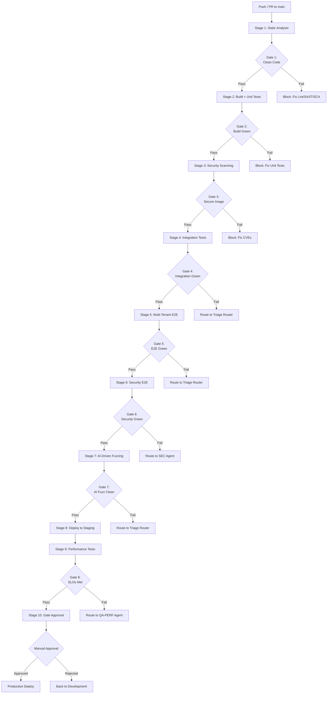
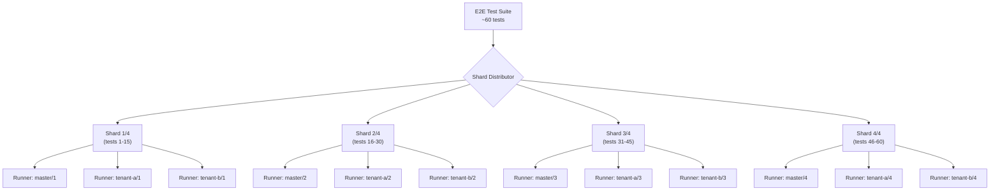
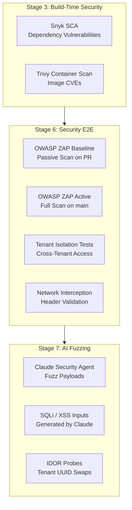
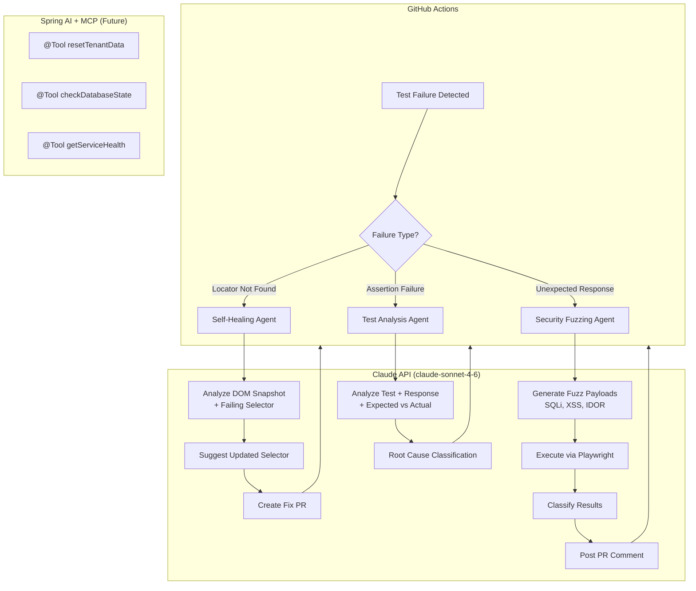
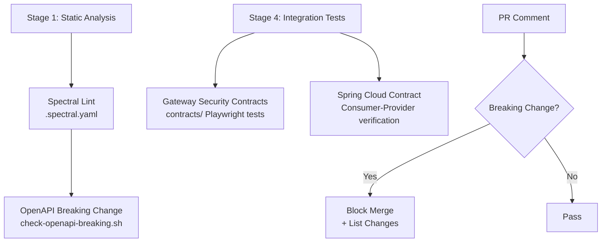
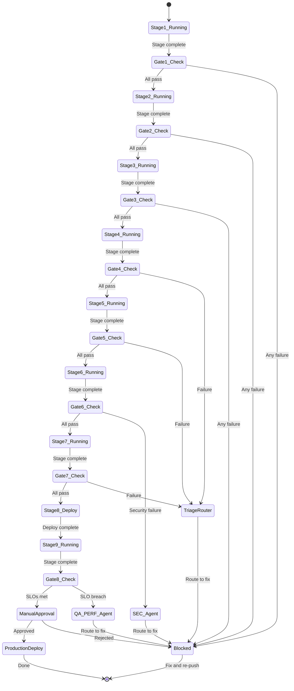
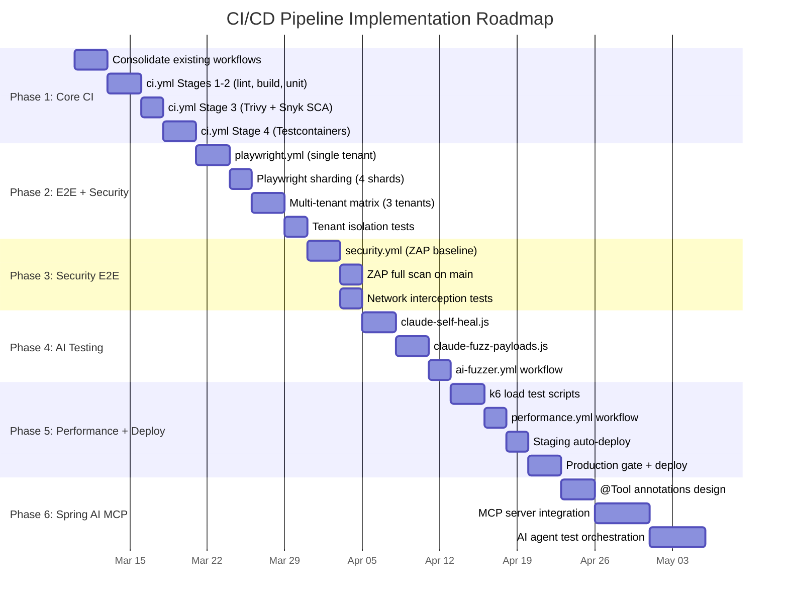
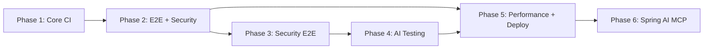

# CI/CD Pipeline LLD -- Playwright + AI-Driven Testing

**Status:** [PLANNED] -- Design document only; no workflow files have been created from this LLD yet.

**Version:** 1.0.0
**Date:** 2026-03-03
**Author:** DEVOPS Agent (DEVOPS-PRINCIPLES.md v2.0.0)

---

## Table of Contents

1. [Pipeline Overview](#1-pipeline-overview)
2. [Multi-Tenant Pipeline Configuration](#2-multi-tenant-pipeline-configuration)
3. [Playwright Sharding Strategy](#3-playwright-sharding-strategy)
4. [Security Testing Design](#4-security-testing-design)
5. [AI-Driven Testing Agent Design (Claude API)](#5-ai-driven-testing-agent-design-claude-api)
6. [OpenAPI Contract Testing](#6-openapi-contract-testing)
7. [GitHub Actions Files to Create](#7-github-actions-files-to-create)
8. [Quality Gates](#8-quality-gates)
9. [Implementation Roadmap](#9-implementation-roadmap)
10. [Existing Asset Inventory](#10-existing-asset-inventory)

---

## 1. Pipeline Overview

### 1.1 Full Pipeline Flow

The pipeline progresses from fast, cheap checks (static analysis) to slow, expensive checks (E2E, performance). Every stage is gated -- failure at any gate blocks promotion to the next stage.



### 1.2 Stage Summary

| Stage | Name | Tools | Duration | Trigger |
|-------|------|-------|----------|---------|
| 1 | Static Analysis | ESLint, Checkstyle, Semgrep, Spectral | ~2 min | Every push/PR |
| 2 | Build + Unit Tests | Maven, ng build, JUnit 5, Vitest | ~5 min | After Stage 1 |
| 3 | Security Scanning | Snyk SCA, Trivy container scan | ~3 min | After Stage 2 |
| 4 | Integration Tests | Testcontainers, Spring Cloud Contract | ~8 min | After Stage 3 |
| 5 | Multi-Tenant E2E | Playwright (sharded, tenant matrix) | ~12 min | After Stage 4 |
| 6 | Security E2E | OWASP ZAP, tenant isolation tests | ~10 min | After Stage 5 |
| 7 | AI-Driven Fuzzing | Claude API + Playwright | ~5 min | After Stage 6 |
| 8 | Deploy to Staging | docker-compose.staging.yml | ~5 min | After Stage 7 (main only) |
| 9 | Performance Tests | k6 | ~15 min | After Stage 8 |
| 10 | Gate Approval | Manual | N/A | After Stage 9 |

### 1.3 Parallel Execution Strategy

```mermaid
graph LR
    subgraph Parallel_Group_1["Stage 1 (parallel)"]
        A1[ESLint]
        A2[Checkstyle]
        A3[Semgrep SAST]
        A4[Spectral OpenAPI]
    end

    subgraph Parallel_Group_2["Stage 2 (parallel)"]
        B1[Backend Build + Unit Tests]
        B2[Frontend Build + Unit Tests]
    end

    subgraph Parallel_Group_3["Stage 3 (parallel matrix)"]
        C1[Docker Build: api-gateway]
        C2[Docker Build: auth-facade]
        C3[Docker Build: tenant-service]
        C4[Docker Build: ... x9 services]
        C5[Trivy Scan: all images]
        C6[Snyk SCA: dependencies]
    end

    subgraph Parallel_Group_4["Stage 5 (tenant x shard matrix)"]
        D1["master / shard 1..4"]
        D2["tenant-a / shard 1..4"]
        D3["tenant-b / shard 1..4"]
    end

    Parallel_Group_1 --> Parallel_Group_2
    Parallel_Group_2 --> Parallel_Group_3
    Parallel_Group_3 --> Parallel_Group_4
```



---

## 2. Multi-Tenant Pipeline Configuration

### 2.1 Tenant Matrix Strategy

EMSIST is a multi-tenant platform. E2E tests must run against multiple tenant contexts to verify tenant isolation, per-tenant branding, and tenant-scoped data access. The pipeline uses a GitHub Actions matrix strategy to run tests in parallel across tenants and shards.

```yaml
# .github/workflows/ci.yml (design reference -- [PLANNED])
name: EMSIST CI/CD Pipeline

on:
  push:
    branches: [main, develop]
  pull_request:
    branches: [main]

env:
  JAVA_VERSION: "23"
  NODE_VERSION: "22"
  PLAYWRIGHT_VERSION: "1.55.0"
  REGISTRY: ghcr.io
  IMAGE_PREFIX: ghcr.io/${{ github.repository_owner }}/emsist

concurrency:
  group: ${{ github.workflow }}-${{ github.ref }}
  cancel-in-progress: true
```

### 2.2 Tenant-Specific Secrets Injection

Each tenant in the matrix receives credentials from GitHub repository secrets using dynamic secret name resolution.

```yaml
# Multi-tenant E2E job (design reference -- [PLANNED])
jobs:
  e2e-multi-tenant:
    needs: [integration-tests]
    runs-on: ubuntu-latest
    strategy:
      fail-fast: false
      matrix:
        tenant: [master, tenant-a, tenant-b]
        shard: [1, 2, 3, 4]
    env:
      TENANT_ID: ${{ matrix.tenant }}
      TENANT_URL: ${{ secrets[format('TENANT_{0}_URL', matrix.tenant)] }}
      TENANT_ADMIN_USER: ${{ secrets[format('TENANT_{0}_ADMIN_USER', matrix.tenant)] }}
      TENANT_ADMIN_PASSWORD: ${{ secrets[format('TENANT_{0}_ADMIN_PASSWORD', matrix.tenant)] }}
      KEYCLOAK_CLIENT_SECRET: ${{ secrets[format('TENANT_{0}_KC_SECRET', matrix.tenant)] }}
      SHARD_INDEX: ${{ matrix.shard }}
      SHARD_TOTAL: 4
```

### 2.3 Required GitHub Repository Secrets

| Secret Name Pattern | Example | Purpose |
|---------------------|---------|---------|
| `TENANT_{name}_URL` | `TENANT_master_URL` | Base URL for the tenant's frontend |
| `TENANT_{name}_ADMIN_USER` | `TENANT_master_ADMIN_USER` | Admin username for login flow |
| `TENANT_{name}_ADMIN_PASSWORD` | `TENANT_master_ADMIN_PASSWORD` | Admin password (never logged) |
| `TENANT_{name}_KC_SECRET` | `TENANT_master_KC_SECRET` | Keycloak client secret for token exchange |
| `ANTHROPIC_API_KEY` | -- | Claude API key for AI fuzzing agent |
| `SNYK_TOKEN` | -- | Snyk authentication for SCA scanning |
| `ZAP_API_KEY` | -- | OWASP ZAP API key (if using ZAP cloud) |

### 2.4 Tenant Configuration for Route-Intercepted Tests

For tests that use Playwright route interception (no backend required), tenant configuration is injected via environment variables and used in test fixtures.

```typescript
// e2e/fixtures/tenant-fixture.ts (design reference -- [PLANNED])
import { test as base } from '@playwright/test';

interface TenantConfig {
  tenantId: string;
  tenantUrl: string;
  adminUser: string;
  adminPassword: string;
}

export const test = base.extend<{ tenant: TenantConfig }>({
  tenant: async ({}, use) => {
    await use({
      tenantId: process.env.TENANT_ID ?? 'master',
      tenantUrl: process.env.TENANT_URL ?? 'http://localhost:4200',
      adminUser: process.env.TENANT_ADMIN_USER ?? 'superadmin',
      adminPassword: process.env.TENANT_ADMIN_PASSWORD ?? 'dev_superadmin',
    });
  },
});
```

---

## 3. Playwright Sharding Strategy

### 3.1 Sharding Architecture

Playwright natively supports sharding with `--shard=i/n` syntax. Each shard receives a deterministic subset of the test suite. Combined with the tenant matrix, this produces `tenants x shards` parallel jobs (e.g., 3 tenants x 4 shards = 12 runners).



### 3.2 Shard Execution Job

```yaml
# Design reference -- [PLANNED]
steps:
  - name: Checkout
    uses: actions/checkout@v4

  - name: Setup Node.js
    uses: actions/setup-node@v4
    with:
      node-version: ${{ env.NODE_VERSION }}
      cache: npm
      cache-dependency-path: frontend/package-lock.json

  - name: Install dependencies
    working-directory: frontend
    run: npm ci

  - name: Install Playwright browsers
    working-directory: frontend
    run: npx playwright install --with-deps chromium

  - name: Run Playwright shard
    working-directory: frontend
    run: |
      npx playwright test \
        --shard=${{ matrix.shard }}/${{ env.SHARD_TOTAL }} \
        --reporter=blob
    env:
      PLAYWRIGHT_BASE_URL: ${{ env.TENANT_URL }}
      TENANT_ID: ${{ matrix.tenant }}

  - name: Upload blob report
    if: always()
    uses: actions/upload-artifact@v4
    with:
      name: blob-report-${{ matrix.tenant }}-${{ matrix.shard }}
      path: frontend/blob-report/
      retention-days: 7
```

### 3.3 Report Merge Job

After all shards complete, a merge job combines blob reports into a single HTML report per tenant.

```yaml
# Design reference -- [PLANNED]
merge-reports:
  needs: [e2e-multi-tenant]
  if: always()
  runs-on: ubuntu-latest
  strategy:
    matrix:
      tenant: [master, tenant-a, tenant-b]
  steps:
    - name: Checkout
      uses: actions/checkout@v4

    - name: Setup Node.js
      uses: actions/setup-node@v4
      with:
        node-version: ${{ env.NODE_VERSION }}

    - name: Download blob reports for tenant
      uses: actions/download-artifact@v4
      with:
        pattern: blob-report-${{ matrix.tenant }}-*
        path: all-blob-reports
        merge-multiple: true

    - name: Merge reports
      working-directory: frontend
      run: |
        npx playwright merge-reports \
          --reporter=html \
          ../all-blob-reports

    - name: Upload HTML report
      uses: actions/upload-artifact@v4
      with:
        name: playwright-report-${{ matrix.tenant }}
        path: frontend/playwright-report/
        retention-days: 30
```

### 3.4 Playwright Docker Image

For CI consistency, tests run inside the official Playwright Docker image. This avoids browser installation drift between runs.

```yaml
# Design reference -- [PLANNED]
# Alternative: container-based execution
container:
  image: mcr.microsoft.com/playwright:v1.55.0-jammy
  options: --user 1001
```

**Note:** The current `frontend/playwright.config.ts` defines only a `chromium` project. The pipeline should expand this to include `firefox` and `webkit` for cross-browser coverage in staging, while using `chromium` only for PR checks to keep CI fast.

### 3.5 Existing Playwright Configuration

The following Playwright assets already exist in the repository:

| Asset | Path | Status |
|-------|------|--------|
| Frontend Playwright config | `frontend/playwright.config.ts` | [IMPLEMENTED] -- Chromium only, `baseURL: http://localhost:4200` |
| Auth guard E2E test | `frontend/e2e/auth-guard.spec.ts` | [IMPLEMENTED] -- 1 test |
| Logout flow E2E tests | `frontend/e2e/logout.spec.ts` | [IMPLEMENTED] -- 9 tests (desktop, mobile, a11y, error handling) |
| History navigation E2E tests | `frontend/e2e/history-navigation.spec.ts` | [IMPLEMENTED] -- 2 tests |
| Tenant theme builder E2E tests | `frontend/e2e/tenant-theme-builder.spec.ts` | [IMPLEMENTED] -- 5 tests |
| Contract test config | `contracts/playwright.config.ts` | [IMPLEMENTED] -- Uses `@playwright/test` for API contracts |
| Contract test package | `contracts/package.json` | [IMPLEMENTED] -- `@playwright/test ^1.55.0` |

---

## 4. Security Testing Design

### 4.1 Security Testing Architecture



### 4.2 Tenant Isolation Tests (Playwright)

These tests verify that Tenant A cannot access Tenant B data. They run as part of the multi-tenant E2E matrix.

```typescript
// e2e/security/tenant-isolation.spec.ts (design reference -- [PLANNED])
import { expect, test } from '@playwright/test';

test.describe('Tenant Isolation', () => {
  test.describe.configure({ mode: 'serial' });

  const TENANT_A_ID = 'tenant-a-uuid';
  const TENANT_B_ID = 'tenant-b-uuid';

  test('cross-tenant data access is blocked with 403', async ({ request }) => {
    // Authenticate as Tenant A admin
    const loginResponse = await request.post('/api/v1/auth/login', {
      data: {
        username: process.env.TENANT_A_ADMIN_USER,
        password: process.env.TENANT_A_ADMIN_PASSWORD,
      },
      headers: { 'X-Tenant-ID': TENANT_A_ID },
    });
    const { accessToken } = await loginResponse.json();

    // Attempt to access Tenant B's users with Tenant A's token
    const crossTenantResponse = await request.get(
      `/api/v1/tenants/${TENANT_B_ID}/users`,
      {
        headers: {
          Authorization: `Bearer ${accessToken}`,
          'X-Tenant-ID': TENANT_A_ID,
        },
      },
    );

    // MUST be 403 or 404, NEVER 200
    expect([403, 404]).toContain(crossTenantResponse.status());
  });

  test('cross-tenant branding access is blocked', async ({ request }) => {
    const loginResponse = await request.post('/api/v1/auth/login', {
      data: {
        username: process.env.TENANT_A_ADMIN_USER,
        password: process.env.TENANT_A_ADMIN_PASSWORD,
      },
      headers: { 'X-Tenant-ID': TENANT_A_ID },
    });
    const { accessToken } = await loginResponse.json();

    // Attempt to read Tenant B branding
    const response = await request.get(
      `/api/v1/tenants/${TENANT_B_ID}/branding`,
      {
        headers: {
          Authorization: `Bearer ${accessToken}`,
          'X-Tenant-ID': TENANT_A_ID,
        },
      },
    );

    expect([403, 404]).toContain(response.status());
    const body = await response.text();
    // Body must NOT contain Tenant B data
    expect(body).not.toContain(TENANT_B_ID);
  });

  test('tenant ID header manipulation is rejected', async ({ request }) => {
    const loginResponse = await request.post('/api/v1/auth/login', {
      data: {
        username: process.env.TENANT_A_ADMIN_USER,
        password: process.env.TENANT_A_ADMIN_PASSWORD,
      },
      headers: { 'X-Tenant-ID': TENANT_A_ID },
    });
    const { accessToken } = await loginResponse.json();

    // Send request with Tenant A token but Tenant B header
    const response = await request.get('/api/v1/users', {
      headers: {
        Authorization: `Bearer ${accessToken}`,
        'X-Tenant-ID': TENANT_B_ID, // Manipulated header
      },
    });

    // Gateway must reject header/token mismatch
    expect([401, 403]).toContain(response.status());
  });
});
```

### 4.3 Network Interception Tests (Playwright)

These tests use Playwright's `page.route()` to intercept and inspect API traffic during E2E flows, verifying that sensitive tenant identifiers are not leaked in requests.

```typescript
// e2e/security/network-interception.spec.ts (design reference -- [PLANNED])
import { expect, test } from '@playwright/test';

test.describe('Network Security Interception', () => {
  test('API calls include correct X-Tenant-ID header', async ({ page }) => {
    const capturedHeaders: Record<string, string>[] = [];

    await page.route('**/api/**', (route) => {
      const headers = route.request().headers();
      capturedHeaders.push(headers);
      route.continue();
    });

    // Navigate and perform actions...
    await page.goto('/administration');
    await page.waitForLoadState('networkidle');

    // Verify all API calls had the correct tenant header
    for (const headers of capturedHeaders) {
      if (headers['x-tenant-id']) {
        expect(headers['x-tenant-id']).toBe(process.env.TENANT_ID);
      }
    }
  });

  test('no cross-tenant identifiers leak in URL params', async ({ page }) => {
    const otherTenantIds = ['tenant-b-uuid', 'tenant-c-uuid'];
    const capturedUrls: string[] = [];

    await page.route('**/api/**', (route) => {
      capturedUrls.push(route.request().url());
      route.continue();
    });

    await page.goto('/administration');
    await page.waitForLoadState('networkidle');

    // Verify no other tenant IDs appear in any URL
    for (const url of capturedUrls) {
      for (const otherId of otherTenantIds) {
        expect(url).not.toContain(otherId);
      }
    }
  });

  test('authentication tokens are not sent to external URLs', async ({ page }) => {
    const externalRequests: { url: string; hasAuth: boolean }[] = [];

    await page.route('**/*', (route) => {
      const url = route.request().url();
      const isExternal = !url.includes('localhost') && !url.includes('emsist');
      if (isExternal) {
        externalRequests.push({
          url,
          hasAuth: !!route.request().headers()['authorization'],
        });
      }
      route.continue();
    });

    await page.goto('/administration');
    await page.waitForLoadState('networkidle');

    // No external request should carry an Authorization header
    for (const req of externalRequests) {
      expect(req.hasAuth).toBe(false);
    }
  });
});
```

### 4.4 OWASP ZAP Integration

```yaml
# Design reference -- [PLANNED]
# .github/workflows/security.yml
security-zap:
  needs: [deploy-staging]
  runs-on: ubuntu-latest
  steps:
    - name: Checkout
      uses: actions/checkout@v4

    - name: ZAP Baseline Scan (PR)
      if: github.event_name == 'pull_request'
      uses: zaproxy/action-baseline@v0.14.0
      with:
        target: ${{ secrets.STAGING_URL }}
        rules_file_name: .zap/rules.tsv
        cmd_options: '-a -j'

    - name: ZAP Full Scan (main branch)
      if: github.ref == 'refs/heads/main'
      uses: zaproxy/action-full-scan@v0.12.0
      with:
        target: ${{ secrets.STAGING_URL }}
        rules_file_name: .zap/rules.tsv
        cmd_options: '-a -j'

    - name: Parse ZAP report
      if: always()
      run: |
        if [ -f zap-report.json ]; then
          HIGH_COUNT=$(jq '[.site[].alerts[] | select(.riskcode == "3")] | length' zap-report.json)
          CRITICAL_COUNT=$(jq '[.site[].alerts[] | select(.riskcode == "4")] | length' zap-report.json)

          echo "HIGH findings: $HIGH_COUNT"
          echo "CRITICAL findings: $CRITICAL_COUNT"

          if [ "$HIGH_COUNT" -gt 0 ] || [ "$CRITICAL_COUNT" -gt 0 ]; then
            echo "::error::ZAP found $HIGH_COUNT HIGH and $CRITICAL_COUNT CRITICAL findings"
            exit 1
          fi
        fi

    - name: Upload ZAP report
      if: always()
      uses: actions/upload-artifact@v4
      with:
        name: zap-security-report
        path: |
          zap-report.html
          zap-report.json
        retention-days: 90

    - name: Comment on PR
      if: github.event_name == 'pull_request' && always()
      uses: actions/github-script@v7
      with:
        script: |
          const fs = require('fs');
          if (fs.existsSync('zap-report.json')) {
            const report = JSON.parse(fs.readFileSync('zap-report.json'));
            const alerts = report.site?.flatMap(s => s.alerts) || [];
            const summary = alerts.map(a =>
              `| ${a.riskdesc} | ${a.name} | ${a.count} |`
            ).join('\n');

            await github.rest.issues.createComment({
              owner: context.repo.owner,
              repo: context.repo.repo,
              issue_number: context.issue.number,
              body: `## OWASP ZAP Security Scan\n\n| Risk | Finding | Count |\n|------|---------|-------|\n${summary || '| None | No findings | 0 |'}`
            });
          }
```

### 4.5 Snyk SCA Integration

```yaml
# Design reference -- [PLANNED]
snyk-sca:
  runs-on: ubuntu-latest
  steps:
    - name: Checkout
      uses: actions/checkout@v4

    - name: Setup Java
      uses: actions/setup-java@v4
      with:
        java-version: ${{ env.JAVA_VERSION }}
        distribution: temurin
        cache: maven

    - name: Snyk Backend SCA
      uses: snyk/actions/maven@master
      env:
        SNYK_TOKEN: ${{ secrets.SNYK_TOKEN }}
      with:
        args: --severity-threshold=high --all-sub-projects
        command: test
      working-directory: backend

    - name: Snyk Frontend SCA
      uses: snyk/actions/node@master
      env:
        SNYK_TOKEN: ${{ secrets.SNYK_TOKEN }}
      with:
        args: --severity-threshold=high
        command: test
      working-directory: frontend
```

---

## 5. AI-Driven Testing Agent Design (Claude API)

**Important:** EMSIST uses Anthropic Claude as its AI platform. All AI integrations use the Claude API (claude-sonnet-4-6 or later models), NOT OpenAI.

### 5.1 AI Testing Architecture



### 5.2 Self-Healing Test Agent

When a Playwright test fails because an element locator no longer matches the DOM, the self-healing agent uses Claude to suggest an updated selector.

```yaml
# .github/workflows/ai-fuzzer.yml -- self-healing job (design reference -- [PLANNED])
self-healing:
  needs: [e2e-multi-tenant]
  if: failure()
  runs-on: ubuntu-latest
  steps:
    - name: Checkout
      uses: actions/checkout@v4

    - name: Download test artifacts
      uses: actions/download-artifact@v4
      with:
        pattern: blob-report-*
        path: test-results

    - name: Extract failing test info
      id: failures
      run: |
        # Parse Playwright JSON results for failures with "locator" errors
        node scripts/ci/extract-locator-failures.js test-results > failures.json
        FAILURE_COUNT=$(jq '. | length' failures.json)
        echo "failure_count=$FAILURE_COUNT" >> "$GITHUB_OUTPUT"

    - name: Call Claude for selector suggestions
      if: steps.failures.outputs.failure_count > 0
      env:
        ANTHROPIC_API_KEY: ${{ secrets.ANTHROPIC_API_KEY }}
      run: |
        # For each failing test, send DOM snapshot + failing selector to Claude
        node scripts/ci/claude-self-heal.js failures.json > suggestions.json

    - name: Create fix PR
      if: steps.failures.outputs.failure_count > 0
      uses: actions/github-script@v7
      with:
        script: |
          const fs = require('fs');
          const suggestions = JSON.parse(fs.readFileSync('suggestions.json'));

          if (suggestions.length > 0) {
            // Create a branch with the fixes
            // This is a design placeholder -- actual implementation uses
            // git commands + gh pr create
            await github.rest.issues.createComment({
              owner: context.repo.owner,
              repo: context.repo.repo,
              issue_number: context.issue.number,
              body: `## AI Self-Healing Agent\n\nClaude suggested ${suggestions.length} selector update(s).\n\n${suggestions.map(s =>
                `- **${s.testFile}**: \`${s.oldSelector}\` -> \`${s.newSelector}\`\n  Confidence: ${s.confidence}%`
              ).join('\n')}`
            });
          }
```

### 5.3 Claude Self-Healing Script

```javascript
// scripts/ci/claude-self-heal.js (design reference -- [PLANNED])
// Called by the self-healing GitHub Actions job

const Anthropic = require('@anthropic-ai/sdk');
const fs = require('fs');

const client = new Anthropic.default();
const failures = JSON.parse(fs.readFileSync(process.argv[2], 'utf-8'));
const suggestions = [];

for (const failure of failures) {
  const response = await client.messages.create({
    model: 'claude-sonnet-4-6',
    max_tokens: 1024,
    system: `You are a Playwright test maintenance agent. Given a failing CSS/role
selector and a DOM snapshot, suggest the most resilient replacement selector.
Prefer data-testid > role > accessible name > CSS class. Return JSON only.`,
    messages: [
      {
        role: 'user',
        content: `Failing test: ${failure.testName}
Failing selector: ${failure.selector}
Error: ${failure.error}
DOM snapshot (trimmed):
${failure.domSnapshot.substring(0, 8000)}

Return JSON: { "newSelector": "...", "confidence": 0-100, "reasoning": "..." }`,
      },
    ],
  });

  const content = response.content[0].text;
  const suggestion = JSON.parse(
    content.match(/\{[\s\S]*\}/)?.[0] ?? '{}'
  );

  suggestions.push({
    testFile: failure.testFile,
    testName: failure.testName,
    oldSelector: failure.selector,
    newSelector: suggestion.newSelector,
    confidence: suggestion.confidence,
    reasoning: suggestion.reasoning,
  });
}

process.stdout.write(JSON.stringify(suggestions, null, 2));
```

### 5.4 Security Fuzzing Agent

The security fuzzing agent uses Claude to generate edge-case inputs that probe for common web vulnerabilities: SQL injection, XSS, IDOR, and tenant UUID manipulation.

```yaml
# .github/workflows/ai-fuzzer.yml -- fuzzing job (design reference -- [PLANNED])
security-fuzzing:
  needs: [deploy-staging]
  runs-on: ubuntu-latest
  steps:
    - name: Checkout
      uses: actions/checkout@v4

    - name: Setup Node.js
      uses: actions/setup-node@v4
      with:
        node-version: ${{ env.NODE_VERSION }}

    - name: Install Playwright
      working-directory: frontend
      run: |
        npm ci
        npx playwright install --with-deps chromium

    - name: Generate fuzz payloads via Claude
      env:
        ANTHROPIC_API_KEY: ${{ secrets.ANTHROPIC_API_KEY }}
      run: node scripts/ci/claude-fuzz-payloads.js > payloads.json

    - name: Execute fuzz payloads via Playwright
      working-directory: frontend
      run: |
        PAYLOADS_FILE=../payloads.json \
        PLAYWRIGHT_BASE_URL=${{ secrets.STAGING_URL }} \
        npx playwright test e2e/security/fuzz-executor.spec.ts \
          --reporter=json --output=../fuzz-results.json

    - name: Classify fuzz results
      env:
        ANTHROPIC_API_KEY: ${{ secrets.ANTHROPIC_API_KEY }}
      run: node scripts/ci/claude-classify-fuzz.js fuzz-results.json > classification.json

    - name: Post results as PR comment
      if: github.event_name == 'pull_request'
      uses: actions/github-script@v7
      with:
        script: |
          const fs = require('fs');
          const results = JSON.parse(fs.readFileSync('classification.json'));
          const failures = results.filter(r => r.status === 'FAIL');
          const anomalies = results.filter(r => r.status === 'ANOMALY');

          let body = '## AI Security Fuzzing Report\n\n';
          body += `| Status | Count |\n|--------|-------|\n`;
          body += `| PASS | ${results.filter(r => r.status === 'PASS').length} |\n`;
          body += `| FAIL | ${failures.length} |\n`;
          body += `| ANOMALY | ${anomalies.length} |\n\n`;

          if (failures.length > 0) {
            body += '### Failures (Require Immediate Attention)\n\n';
            for (const f of failures) {
              body += `- **${f.category}**: ${f.description}\n`;
              body += `  Payload: \`${f.payload}\`\n`;
              body += `  Response: ${f.responseCode}\n\n`;
            }
          }

          await github.rest.issues.createComment({
            owner: context.repo.owner,
            repo: context.repo.repo,
            issue_number: context.issue.number,
            body,
          });

    - name: Fail on security issues
      run: |
        FAIL_COUNT=$(jq '[.[] | select(.status == "FAIL")] | length' classification.json)
        if [ "$FAIL_COUNT" -gt 0 ]; then
          echo "::error::AI fuzzing found $FAIL_COUNT security issues"
          exit 1
        fi
```

### 5.5 Claude Fuzz Payload Generator

```javascript
// scripts/ci/claude-fuzz-payloads.js (design reference -- [PLANNED])
const Anthropic = require('@anthropic-ai/sdk');

const client = new Anthropic.default();

const response = await client.messages.create({
  model: 'claude-sonnet-4-6',
  max_tokens: 4096,
  system: `You are a security testing agent for a multi-tenant SaaS platform.
Generate edge-case input payloads for these categories:
1. SQL Injection (PostgreSQL dialect)
2. XSS (stored and reflected)
3. IDOR (tenant UUID manipulation)
4. Authentication bypass (JWT tampering, missing tenant headers)
5. Input validation bypass (oversized inputs, special characters, unicode)

The platform uses:
- Spring Boot 3.4.1 backend with JPA/Hibernate
- Angular 21 frontend with PrimeNG
- PostgreSQL 16 databases
- Keycloak 24 for authentication
- X-Tenant-ID header for tenant context

Return a JSON array of payloads. Each payload has:
{ "category": "sqli|xss|idor|auth_bypass|input_validation",
  "target": "field_name_or_endpoint",
  "payload": "the actual payload string",
  "description": "what this tests" }`,
  messages: [
    {
      role: 'user',
      content: 'Generate 30 diverse fuzz payloads for the EMSIST platform.',
    },
  ],
});

const content = response.content[0].text;
const payloads = JSON.parse(content.match(/\[[\s\S]*\]/)?.[0] ?? '[]');
process.stdout.write(JSON.stringify(payloads, null, 2));
```

### 5.6 Spring AI + MCP Tool Annotations (Future)

This section describes a future integration where Spring AI agents can call `@Tool`-annotated utility methods during test runs. This requires Spring AI 1.x+ with MCP (Model Context Protocol) support.

**Status:** [PLANNED] -- Spring AI MCP is not yet integrated into EMSIST services.

```java
// backend/ai-service/src/main/java/com/ems/ai/tools/TestTools.java
// Design reference -- [PLANNED]

@Component
public class TestTools {

    @Tool(description = "Reset test data for a specific tenant. "
        + "Clears all non-seed data created during test execution.")
    public void resetTenantData(
            @P("tenantId") String tenantId,
            @P("services") List<String> services) {
        // Call each service's internal /api/v1/internal/test/reset endpoint
        // Only available when SPRING_PROFILES_ACTIVE includes 'test'
        for (String service : services) {
            restClient.delete()
                .uri("http://{service}:8080/api/v1/internal/test/reset?tenantId={tenantId}",
                     service, tenantId)
                .retrieve()
                .toBodilessEntity();
        }
    }

    @Tool(description = "Check the database state for a service. "
        + "Returns table counts, migration version, and connection pool status.")
    public DatabaseState checkDatabaseState(
            @P("service") String serviceName) {
        // Call the service's actuator endpoint
        return restClient.get()
            .uri("http://{service}:8080/actuator/flyway", serviceName)
            .retrieve()
            .body(DatabaseState.class);
    }

    @Tool(description = "Get the health status of all services or a specific service.")
    public Map<String, String> getServiceHealth(
            @P("service") String serviceName) {
        // Call the actuator health endpoint
        return restClient.get()
            .uri("http://{service}:8080/actuator/health", serviceName)
            .retrieve()
            .body(new ParameterizedTypeReference<>() {});
    }
}

// Structured output for CI reporting
public record DatabaseState(
    String service,
    String flywayVersion,
    int pendingMigrations,
    int activeConnections,
    int idleConnections,
    Map<String, Long> tableCounts
) {}
```

---

## 6. OpenAPI Contract Testing

### 6.1 Existing Contract Testing Infrastructure

Contract testing is already partially implemented in the repository:

| Asset | Path | Status |
|-------|------|--------|
| Spectral ruleset | `.spectral.yaml` | [IMPLEMENTED] -- Enforces global security, bearer/OAuth2, internal API scopes |
| Breaking change script | `scripts/check-openapi-breaking.sh` | [IMPLEMENTED] -- Compares OpenAPI specs against main branch |
| API contract CI workflow | `.github/workflows/api-contract-security.yml` | [IMPLEMENTED] -- Spectral lint + breaking change check + gateway security contracts |
| Contract test package | `contracts/` | [IMPLEMENTED] -- Playwright-based API contract tests against running gateway |
| Release workflow | `.github/workflows/release.yml` | [IMPLEMENTED] -- Includes OpenAPI governance + security contract gates |

### 6.2 Contract Testing in the Pipeline



### 6.3 Enhanced Contract Testing Design

The existing pipeline already covers OpenAPI governance (Spectral) and gateway security contracts (Playwright). The following enhancements are planned:

```yaml
# Addition to Stage 4 -- [PLANNED]
contract-tests:
  runs-on: ubuntu-latest
  steps:
    - name: Checkout
      uses: actions/checkout@v4

    - name: Setup Java
      uses: actions/setup-java@v4
      with:
        java-version: ${{ env.JAVA_VERSION }}
        distribution: temurin
        cache: maven

    # Consumer-driven contract verification (Spring Cloud Contract)
    - name: Backend Contract Tests
      working-directory: backend
      run: mvn verify -Pcontracts -B -q

    # Gateway security contract tests (already exist)
    - name: Setup Node.js
      uses: actions/setup-node@v4
      with:
        node-version: ${{ env.NODE_VERSION }}
        cache: npm
        cache-dependency-path: contracts/package-lock.json

    - name: Install contract dependencies
      working-directory: contracts
      run: npm ci

    - name: Start gateway stack
      run: docker compose -f docker-compose.dev.yml up -d --build valkey api-gateway

    - name: Wait for gateway
      run: |
        for i in {1..60}; do
          curl -fsS http://localhost:28080/actuator/health > /dev/null && exit 0
          sleep 2
        done
        exit 1

    - name: Run gateway contract tests
      working-directory: contracts
      run: npm test

    - name: Teardown
      if: always()
      run: docker compose -f docker-compose.dev.yml down
```

---

## 7. GitHub Actions Files to Create

### 7.1 Workflow File Inventory

| File | Purpose | Status |
|------|---------|--------|
| `.github/workflows/ci.yml` | Main CI pipeline (Stages 1-4) | [PLANNED] |
| `.github/workflows/playwright.yml` | Multi-tenant E2E with sharding (Stage 5) | [PLANNED] |
| `.github/workflows/security.yml` | OWASP ZAP + Snyk + Trivy (Stages 3, 6) | [PLANNED] |
| `.github/workflows/ai-fuzzer.yml` | Claude-powered self-healing + security fuzzing (Stage 7) | [PLANNED] |
| `.github/workflows/performance.yml` | k6 load/stress tests (Stage 9) | [PLANNED] |
| `.github/workflows/api-contract-security.yml` | OpenAPI governance + gateway contracts | **[IMPLEMENTED]** |
| `.github/workflows/release.yml` | Release gate + production deploy | **[IMPLEMENTED]** |
| `.github/workflows/frontend-strict-quality.yml` | Frontend lint + typecheck + unit tests + build | **[IMPLEMENTED]** |
| `.github/workflows/docs-quality.yml` | Markdown lint + arc42 consistency | **[IMPLEMENTED]** |
| `.github/workflows/frontendold-governance.yml` | Legacy frontend CSS governance | **[IMPLEMENTED]** |

### 7.2 Supporting Scripts to Create

| File | Purpose | Status |
|------|---------|--------|
| `scripts/ci/extract-locator-failures.js` | Parse Playwright JSON for locator failures | [PLANNED] |
| `scripts/ci/claude-self-heal.js` | Call Claude API for selector suggestions | [PLANNED] |
| `scripts/ci/claude-fuzz-payloads.js` | Generate security fuzz payloads via Claude | [PLANNED] |
| `scripts/ci/claude-classify-fuzz.js` | Classify fuzz results via Claude | [PLANNED] |
| `scripts/ci/wait-for-health.sh` | Wait for all service health checks | [PLANNED] |
| `.zap/rules.tsv` | OWASP ZAP rule overrides | [PLANNED] |
| `e2e/security/tenant-isolation.spec.ts` | Cross-tenant access tests | [PLANNED] |
| `e2e/security/network-interception.spec.ts` | Header/token validation tests | [PLANNED] |
| `e2e/security/fuzz-executor.spec.ts` | Execute AI-generated fuzz payloads | [PLANNED] |
| `e2e/fixtures/tenant-fixture.ts` | Tenant-aware Playwright fixture | [PLANNED] |
| `k6/load-test.js` | k6 load test script | [PLANNED] |
| `k6/stress-test.js` | k6 stress test script | [PLANNED] |

### 7.3 Main CI Pipeline Design (`.github/workflows/ci.yml`)

```yaml
# .github/workflows/ci.yml -- full design reference -- [PLANNED]
name: CI Pipeline

on:
  push:
    branches: [main, develop]
  pull_request:
    branches: [main]

env:
  JAVA_VERSION: "23"
  NODE_VERSION: "22"
  PLAYWRIGHT_VERSION: "1.55.0"

concurrency:
  group: ci-${{ github.ref }}
  cancel-in-progress: true

jobs:
  # ====================================================================
  # Stage 1: Static Analysis (parallel)
  # ====================================================================
  lint-backend:
    name: Backend Lint (Checkstyle)
    runs-on: ubuntu-latest
    steps:
      - uses: actions/checkout@v4
      - uses: actions/setup-java@v4
        with:
          java-version: ${{ env.JAVA_VERSION }}
          distribution: temurin
          cache: maven
      - name: Checkstyle
        working-directory: backend
        run: ./mvnw checkstyle:check -B -q

  lint-frontend:
    name: Frontend Lint + Typecheck
    runs-on: ubuntu-latest
    defaults:
      run:
        working-directory: frontend
    steps:
      - uses: actions/checkout@v4
      - uses: actions/setup-node@v4
        with:
          node-version: ${{ env.NODE_VERSION }}
          cache: npm
          cache-dependency-path: frontend/package-lock.json
      - run: npm ci
      - run: npm run lint
      - run: npm run typecheck

  sast:
    name: SAST (Semgrep)
    runs-on: ubuntu-latest
    steps:
      - uses: actions/checkout@v4
      - name: Semgrep Scan
        uses: semgrep/semgrep-action@v1
        with:
          config: >-
            p/java
            p/typescript
            p/owasp-top-ten
          generateSarif: true
      - name: Upload SARIF
        if: always()
        uses: github/codeql-action/upload-sarif@v3
        with:
          sarif_file: semgrep.sarif

  spectral:
    name: OpenAPI Lint (Spectral)
    runs-on: ubuntu-latest
    steps:
      - uses: actions/checkout@v4
        with:
          fetch-depth: 0
      - uses: actions/setup-node@v4
        with:
          node-version: ${{ env.NODE_VERSION }}
      - name: Spectral lint
        run: |
          npx --yes @stoplight/spectral-cli@6.13.1 lint \
            --ruleset .spectral.yaml \
            backend/*/openapi.yaml
      - name: Breaking change check
        run: |
          git fetch origin main --depth=1
          ./scripts/check-openapi-breaking.sh origin/main

  # ====================================================================
  # Stage 2: Build + Unit Tests (parallel backend/frontend)
  # ====================================================================
  build-backend:
    name: Backend Build + Unit Tests
    needs: [lint-backend, sast]
    runs-on: ubuntu-latest
    steps:
      - uses: actions/checkout@v4
      - uses: actions/setup-java@v4
        with:
          java-version: ${{ env.JAVA_VERSION }}
          distribution: temurin
          cache: maven
      - name: Build + Test
        working-directory: backend
        run: ./mvnw clean verify -B -q
      - name: Check coverage
        working-directory: backend
        run: |
          # Parse JaCoCo reports for 80% line coverage
          for report in */target/site/jacoco/jacoco.xml; do
            if [ -f "$report" ]; then
              SERVICE=$(dirname "$report" | cut -d/ -f1)
              COVERED=$(grep -oP 'INSTRUCTION.*?covered="\K[0-9]+' "$report" | head -1)
              MISSED=$(grep -oP 'INSTRUCTION.*?missed="\K[0-9]+' "$report" | head -1)
              if [ -n "$COVERED" ] && [ -n "$MISSED" ]; then
                TOTAL=$((COVERED + MISSED))
                PCT=$((COVERED * 100 / TOTAL))
                echo "$SERVICE: ${PCT}% line coverage"
                if [ "$PCT" -lt 80 ]; then
                  echo "::warning::$SERVICE coverage ${PCT}% < 80% target"
                fi
              fi
            fi
          done
      - name: Upload test reports
        if: always()
        uses: actions/upload-artifact@v4
        with:
          name: backend-test-reports
          path: backend/**/target/surefire-reports/
          retention-days: 14

  build-frontend:
    name: Frontend Build + Unit Tests
    needs: [lint-frontend]
    runs-on: ubuntu-latest
    defaults:
      run:
        working-directory: frontend
    steps:
      - uses: actions/checkout@v4
      - uses: actions/setup-node@v4
        with:
          node-version: ${{ env.NODE_VERSION }}
          cache: npm
          cache-dependency-path: frontend/package-lock.json
      - run: npm ci
      - name: Unit tests with coverage
        run: npx vitest run --coverage
      - name: Check coverage threshold
        run: |
          # Vitest outputs coverage summary; check >= 80%
          npx vitest run --coverage --reporter=json 2>/dev/null || true
          # Coverage enforcement is in vitest.config.ts thresholds
      - name: Production build
        run: npm run build
      - name: Upload build artifact
        uses: actions/upload-artifact@v4
        with:
          name: frontend-dist
          path: dist/
          retention-days: 7

  # ====================================================================
  # Stage 3: Security Scanning (parallel per service)
  # ====================================================================
  container-build-scan:
    name: Docker Build + Trivy (${{ matrix.service }})
    needs: [build-backend, build-frontend]
    runs-on: ubuntu-latest
    strategy:
      fail-fast: false
      matrix:
        service:
          - api-gateway
          - auth-facade
          - tenant-service
          - user-service
          - license-service
          - notification-service
          - audit-service
          - ai-service
          - process-service
    steps:
      - uses: actions/checkout@v4
      - uses: actions/setup-java@v4
        with:
          java-version: ${{ env.JAVA_VERSION }}
          distribution: temurin
          cache: maven
      - name: Build JAR
        working-directory: backend
        run: ./mvnw clean package -B -q -DskipTests -pl common,${{ matrix.service }} -am
      - name: Build Docker image
        run: |
          docker build \
            -t emsist/${{ matrix.service }}:${{ github.sha }} \
            -f backend/${{ matrix.service }}/Dockerfile \
            backend/
      - name: Trivy container scan
        uses: aquasecurity/trivy-action@0.30.0
        with:
          image-ref: emsist/${{ matrix.service }}:${{ github.sha }}
          severity: CRITICAL,HIGH
          exit-code: "1"
          format: sarif
          output: trivy-${{ matrix.service }}.sarif
      - name: Upload Trivy SARIF
        if: always()
        uses: github/codeql-action/upload-sarif@v3
        with:
          sarif_file: trivy-${{ matrix.service }}.sarif

  # ====================================================================
  # Stage 4: Integration Tests
  # ====================================================================
  integration-tests:
    name: Integration Tests (Testcontainers + Contracts)
    needs: [container-build-scan]
    runs-on: ubuntu-latest
    steps:
      - uses: actions/checkout@v4
      - uses: actions/setup-java@v4
        with:
          java-version: ${{ env.JAVA_VERSION }}
          distribution: temurin
          cache: maven
      - name: Integration tests with Testcontainers
        working-directory: backend
        run: ./mvnw verify -Pintegration -B -q -DskipITs=false
      - name: Upload integration test reports
        if: always()
        uses: actions/upload-artifact@v4
        with:
          name: integration-test-reports
          path: backend/**/target/failsafe-reports/
          retention-days: 14
```

---

## 8. Quality Gates

### 8.1 Gate Definitions

| Stage | Gate | Tool | Pass Criteria | Fail Action |
|-------|------|------|---------------|-------------|
| **1. Static Analysis** | Clean Code | ESLint, Checkstyle | Zero lint errors | Block Stage 2 |
| **1. Static Analysis** | SAST Clean | Semgrep | No HIGH/CRITICAL findings | Block Stage 2 |
| **1. Static Analysis** | OpenAPI Valid | Spectral | All rules pass | Block Stage 2 |
| **1. Static Analysis** | No Breaking Changes | check-openapi-breaking.sh | No breaking changes without version bump | Block Stage 2 |
| **2. Build + Unit** | Build Green | Maven, ng build | Zero compilation errors | Block Stage 3 |
| **2. Build + Unit** | Unit Coverage | JaCoCo, Vitest | >= 80% line, >= 75% branch | Block Stage 3 |
| **2. Build + Unit** | Unit Tests Pass | JUnit 5, Vitest | Zero failures | Block Stage 3 |
| **3. Security** | SCA Clean | Snyk | No HIGH/CRITICAL CVEs | Block Stage 4 |
| **3. Security** | Container Clean | Trivy | No CRITICAL image CVEs | Block Stage 4 |
| **4. Integration** | Contracts Valid | Spring Cloud Contract | All consumer-provider contracts pass | Block Stage 5 |
| **4. Integration** | Gateway Contracts | Playwright (contracts/) | All security contract tests pass | Block Stage 5 |
| **4. Integration** | Integration Pass | Testcontainers | All integration tests pass | Block Stage 5 |
| **5. E2E** | Multi-Tenant E2E | Playwright (sharded) | All tests pass across all tenants | Block Stage 6 |
| **6. Security E2E** | ZAP Baseline | OWASP ZAP | No MEDIUM+ findings (PR) | Block Stage 7 |
| **6. Security E2E** | ZAP Full Scan | OWASP ZAP | No HIGH/CRITICAL findings (main) | Block Stage 7 |
| **6. Security E2E** | Tenant Isolation | Playwright | Zero cross-tenant access successes | Block Stage 7 |
| **7. AI Fuzzing** | Fuzz Clean | Claude + Playwright | Zero FAIL classifications | Block Stage 8 |
| **9. Performance** | Latency SLO | k6 | P95 < 2s | Block Stage 10 |
| **9. Performance** | Error Rate | k6 | Error rate < 1% | Block Stage 10 |
| **9. Performance** | Throughput | k6 | >= 100 RPS per service | Block Stage 10 |
| **10. Approval** | Manual | GitHub Environment Protection | Authorized reviewer approves | Block deploy |

### 8.2 Gate Enforcement Mechanism



### 8.3 Failure Triage Integration

When a gate fails, the pipeline routes to the triage router defined in QA-PRINCIPLES.md v2.0:

| Gate Failure | Triage Queue | Responsible Agent |
|-------------|-------------|-------------------|
| Lint failure | `QUEUE_STATIC_BUILD` | `devops` |
| SAST finding | `QUEUE_SECURITY_DAST` | `sec` |
| Unit test failure | `QUEUE_STATIC_BUILD` | `qa-unit` |
| Container CVE | `QUEUE_STATIC_BUILD` | `sec` |
| Contract break | `QUEUE_STATIC_BUILD` | `qa-int` |
| E2E failure | `QUEUE_FUNCTIONAL_STAGING` | `qa-int` |
| ZAP finding | `QUEUE_SECURITY_DAST` | `sec` |
| Tenant isolation breach | `QUEUE_SECURITY_DAST` | `sec` |
| AI fuzz failure | `QUEUE_SECURITY_DAST` | `sec` |
| Performance SLO breach | `QUEUE_PERFORMANCE` | `qa-perf` |

---

## 9. Implementation Roadmap

### 9.1 Phased Rollout

The pipeline is implemented in phases, starting with the highest-value / lowest-risk stages and progressing to advanced features.



### 9.2 Phase Dependencies



### 9.3 Phase Details

| Phase | Duration | Deliverables | Dependencies |
|-------|----------|-------------|-------------|
| **Phase 1: Core CI** | ~11 days | `.github/workflows/ci.yml` (Stages 1-4) | Existing workflows as reference |
| **Phase 2: E2E + Security** | ~10 days | `.github/workflows/playwright.yml`, tenant fixtures, sharding | Phase 1 CI passing |
| **Phase 3: Security E2E** | ~7 days | `.github/workflows/security.yml`, ZAP config, isolation tests | Phase 2 E2E running |
| **Phase 4: AI Testing** | ~8 days | `.github/workflows/ai-fuzzer.yml`, Claude scripts | Phase 3 + `ANTHROPIC_API_KEY` secret |
| **Phase 5: Performance + Deploy** | ~10 days | `.github/workflows/performance.yml`, k6 scripts, staging deploy | Phase 2 + staging environment ready |
| **Phase 6: Spring AI MCP** | ~13 days | `@Tool` classes, MCP server, AI agent orchestration | Phase 4 + Spring AI dependency |

---

## 10. Existing Asset Inventory

### 10.1 Implemented Workflows

| Workflow | File | Stages Covered | Notes |
|----------|------|----------------|-------|
| API Contract Security | `.github/workflows/api-contract-security.yml` | OpenAPI lint, breaking changes, gateway security contracts | Runs on every PR/push to main |
| Release | `.github/workflows/release.yml` | Validate, OpenAPI, contracts, backend tests, frontend tests, Docker build, tag/release | Manual dispatch (workflow_dispatch) |
| Frontend Strict Quality | `.github/workflows/frontend-strict-quality.yml` | Lint, typecheck, unit tests, build | Path-filtered to `frontend/**` |
| Docs Quality | `.github/workflows/docs-quality.yml` | Markdown lint, arc42 consistency | Path-filtered to `docs/**` |
| Frontendold Governance | `.github/workflows/frontendold-governance.yml` | Legacy CSS audit | Path-filtered to `frontendold/**` |

### 10.2 Implemented Test Assets

| Asset | Location | Framework | Test Count |
|-------|----------|-----------|-----------|
| Auth guard E2E | `frontend/e2e/auth-guard.spec.ts` | Playwright | 1 |
| Logout flow E2E | `frontend/e2e/logout.spec.ts` | Playwright | 9 (desktop, mobile, a11y, error) |
| History navigation E2E | `frontend/e2e/history-navigation.spec.ts` | Playwright | 2 |
| Tenant theme builder E2E | `frontend/e2e/tenant-theme-builder.spec.ts` | Playwright | 5 |
| Gateway security contracts | `contracts/` | Playwright | Multiple (API contract tests) |
| Backend unit tests | `backend/*/src/test/` | JUnit 5 + Mockito | Multiple per service |

### 10.3 Implemented Infrastructure

| Asset | Location | Notes |
|-------|----------|-------|
| Dev Docker Compose | `docker-compose.dev.yml` | Full stack with conflict-safe ports (2XXXX) |
| Staging Docker Compose | `docker-compose.staging.yml` | Full stack with canonical ports |
| Backend Dockerfiles | `backend/*/Dockerfile` | 9 services (api-gateway through process-service) |
| Init DB script | `infrastructure/docker/init-db.sql` | Creates per-service databases |
| Spectral ruleset | `.spectral.yaml` | OpenAPI governance rules |

### 10.4 Missing Assets (Required for Full Pipeline)

| Asset | Required For | Phase |
|-------|-------------|-------|
| `scripts/ci/wait-for-health.sh` | Staging deploy (Stage 8) | Phase 5 |
| `scripts/ci/extract-locator-failures.js` | Self-healing agent (Stage 7) | Phase 4 |
| `scripts/ci/claude-self-heal.js` | Self-healing agent (Stage 7) | Phase 4 |
| `scripts/ci/claude-fuzz-payloads.js` | Security fuzzing (Stage 7) | Phase 4 |
| `scripts/ci/claude-classify-fuzz.js` | Security fuzzing (Stage 7) | Phase 4 |
| `e2e/security/tenant-isolation.spec.ts` | Tenant isolation tests (Stage 6) | Phase 3 |
| `e2e/security/network-interception.spec.ts` | Header validation (Stage 6) | Phase 3 |
| `e2e/security/fuzz-executor.spec.ts` | AI fuzzing (Stage 7) | Phase 4 |
| `e2e/fixtures/tenant-fixture.ts` | Multi-tenant E2E (Stage 5) | Phase 2 |
| `k6/load-test.js` | Performance tests (Stage 9) | Phase 5 |
| `k6/stress-test.js` | Stress tests (Stage 9) | Phase 5 |
| `.zap/rules.tsv` | ZAP rule overrides (Stage 6) | Phase 3 |
| Checkstyle config | `backend/checkstyle.xml` | Backend lint (Stage 1) | Phase 1 |
| JaCoCo coverage plugin | `backend/pom.xml` | Coverage gate (Stage 2) | Phase 1 |
| Spring Cloud Contract stubs | `backend/*/src/test/resources/contracts/` | Contract tests (Stage 4) | Phase 1 |
| Frontend Playwright multi-browser config | `frontend/playwright.ci.config.ts` | Cross-browser E2E | Phase 2 |
| `ANTHROPIC_API_KEY` GitHub secret | AI agents (Stage 7) | Phase 4 |
| `SNYK_TOKEN` GitHub secret | SCA scanning (Stage 3) | Phase 1 |

---

## Appendix A: Environment-Specific Pipeline Behavior

| Pipeline Behavior | PR to main | Push to main | Release (manual) |
|------------------|------------|--------------|------------------|
| Stage 1: Static Analysis | Yes | Yes | Yes |
| Stage 2: Build + Unit Tests | Yes | Yes | Yes |
| Stage 3: Security Scanning | Yes | Yes | Yes |
| Stage 4: Integration Tests | Yes | Yes | Yes |
| Stage 5: Multi-Tenant E2E | Yes (chromium only) | Yes (multi-browser) | Yes |
| Stage 6: Security E2E | ZAP baseline only | ZAP full scan | ZAP full scan |
| Stage 7: AI Fuzzing | No | Yes | Yes |
| Stage 8: Deploy to Staging | No | Yes | Yes |
| Stage 9: Performance Tests | No | Yes | Yes |
| Stage 10: Gate Approval | No | No | Yes (manual) |
| Production Deploy | No | No | After approval |

## Appendix B: Secret Management

Secrets are stored in GitHub repository secrets and injected via environment variables. They are never printed in logs (`::add-mask::` applied to all secret values).

| Category | Secrets | Used By |
|----------|---------|---------|
| Tenant credentials | `TENANT_*_URL`, `TENANT_*_ADMIN_USER`, `TENANT_*_ADMIN_PASSWORD`, `TENANT_*_KC_SECRET` | E2E multi-tenant matrix |
| AI services | `ANTHROPIC_API_KEY` | Self-healing agent, security fuzzing agent |
| Security scanning | `SNYK_TOKEN`, `ZAP_API_KEY` | Snyk SCA, OWASP ZAP |
| Container registry | `GHCR_TOKEN` (or `GITHUB_TOKEN`) | Docker image push to ghcr.io |
| Staging infrastructure | `STAGING_URL`, `STAGING_SSH_KEY` | Deploy to staging |
| Production infrastructure | `PROD_URL`, `PROD_SSH_KEY` | Deploy to production |

**Rule:** No secrets are stored in Dockerfiles, docker-compose files, CI/CD configs, or source code. All secrets are injected at runtime via GitHub Actions secrets or environment-specific `.env` files (which are not committed).

## Appendix C: Relationship to DEVOPS-PRINCIPLES.md v2.0

This LLD implements the 6-stage pipeline architecture defined in DEVOPS-PRINCIPLES.md, with the following extensions:

| DEVOPS-PRINCIPLES Stage | LLD Stages | Extension |
|------------------------|------------|-----------|
| Stage 1: Static Analysis | Stage 1 | Added Semgrep SAST, Spectral OpenAPI lint |
| Stage 2: Build & Unit Tests | Stage 2 | Added coverage enforcement (80% line, 75% branch) |
| Stage 3: Container Build & Scan | Stage 3 | Added Snyk SCA alongside Trivy |
| Stage 4: Contract Tests & BVT | Stage 4 | Added Testcontainers integration tests |
| Stage 5: Staging Tests | Stages 5-9 | Expanded into multi-tenant E2E, security E2E, AI fuzzing, performance |
| Stage 6: Post-Deploy Verification | Stage 10 | Manual approval gate + production health check |

The principles document's quality gates, triage router queues, and environment promotion rules are all enforced by this pipeline design.
