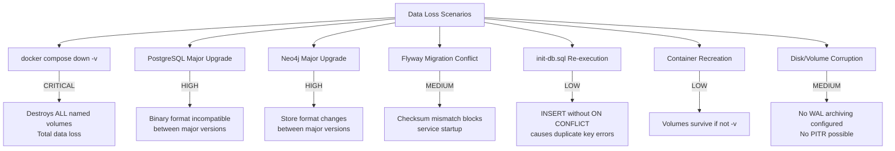
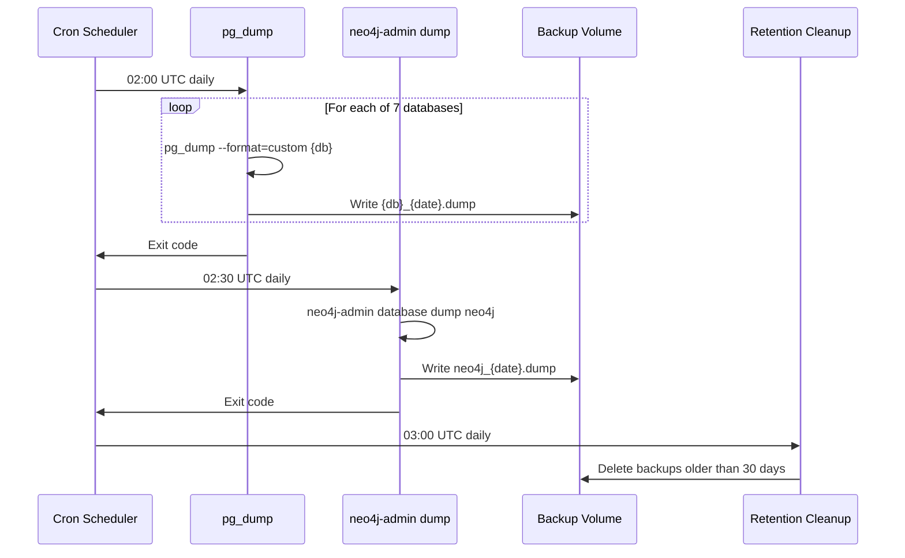
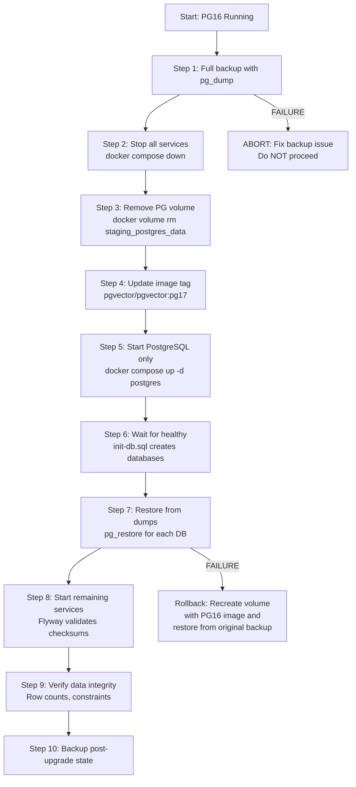
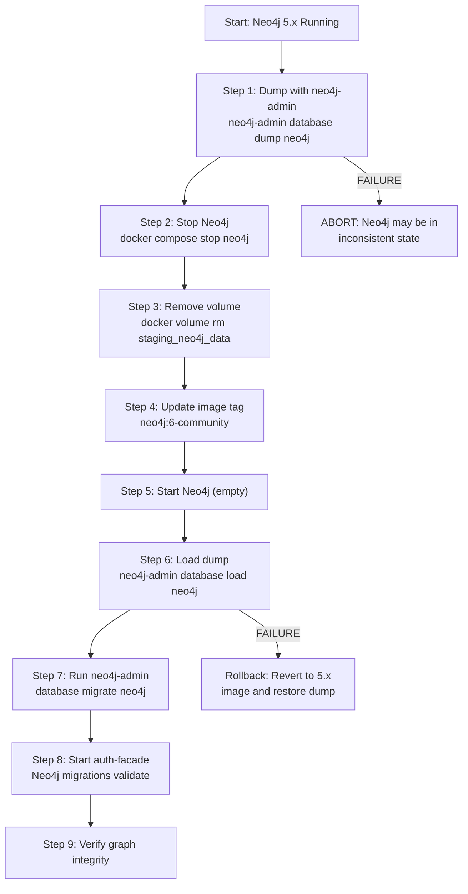
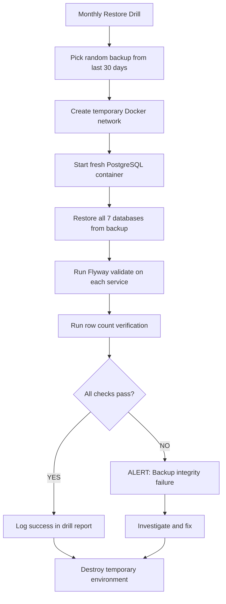

# Database Durability Strategy

**Version:** 1.0.0
**Date:** 2026-03-02
**Author:** DBA Agent
**Status:** [IN-PROGRESS] (scripts created, Docker Compose hardened, not yet deployed to cron)
**Traceability:** DBA-PRINCIPLES.md v1.1.0, ADR-001, ADR-003, ADR-016

---

## 1. Executive Summary

This document defines the backup, recovery, and upgrade strategy for all EMSIST databases. The platform runs three database technologies across Docker named volumes:

| Technology | Instance | Databases | Volume(s) |
|-----------|----------|-----------|-----------|
| PostgreSQL 16 (pgvector) | 1 container | 7 databases (`master_db`, `keycloak_db`, `user_db`, `license_db`, `notification_db`, `audit_db`, `ai_db`) | `{env}_postgres_data` |
| Neo4j 5.x Community | 1 container | 1 database (auth-facade graph) | `{env}_neo4j_data`, `{env}_neo4j_logs` |
| Valkey 8 | 1 container | 0 (ephemeral cache) | `{env}_valkey_data` |

Where `{env}` is `dev`, `staging`, or unnamed (infrastructure compose).

---

## 2. Root Cause Analysis: Data Loss Scenarios

### 2.1 Identified Risk Vectors



### 2.2 Detailed Risk Assessment

#### RISK-1: `docker compose down -v` [CRITICAL]

**Current state:** [IMPLEMENTED -- vulnerability exists]

All three docker-compose files (`docker-compose.dev.yml`, `docker-compose.staging.yml`, `infrastructure/docker/docker-compose.yml`) use Docker named volumes. Running `down -v` permanently deletes:

- All PostgreSQL data across 7 databases
- All Neo4j graph data (auth-facade provider/tenant/user/role nodes)
- All Valkey cache data (acceptable -- ephemeral)
- All Keycloak realm/user/client configuration (stored in `keycloak_db`)

**Evidence:**
- `docker-compose.dev.yml` line 482-487: `dev_postgres_data`, `dev_neo4j_data`, `dev_neo4j_logs`, `dev_valkey_data`
- `docker-compose.staging.yml` line 475-479: `staging_postgres_data`, `staging_neo4j_data`, `staging_neo4j_logs`, `staging_valkey_data`

**Mitigation:** Volume management rules (Section 3), automated pre-destruction backup (Section 5).

#### RISK-2: PostgreSQL Major Version Upgrade (16 to 17+) [HIGH]

**Current state:** [IMPLEMENTED -- vulnerability exists]

PostgreSQL stores data in a binary format specific to the major version. The `pgvector/pgvector:pg16` image writes data to the volume in PG16 format. Changing the image tag to `pg17` will cause PostgreSQL to refuse to start because the data directory format is incompatible.

**Failure mode:** Container enters crash loop with `FATAL: database files are incompatible with server` in logs.

**Mitigation:** Pre-upgrade dump/restore procedure (Section 6).

#### RISK-3: Neo4j Major Version Upgrade [HIGH]

**Current state:** [IMPLEMENTED -- vulnerability exists]

Neo4j store format changes between major versions (e.g., 4.x to 5.x). The current images are:
- `docker-compose.dev.yml` line 51: `neo4j:5-community`
- `docker-compose.staging.yml` line 51: `neo4j:5-community`
- `infrastructure/docker/docker-compose.yml` line 43: `neo4j:5.12.0-community`

Upgrading from 5.x to 6.x (when released) requires migration steps.

**Mitigation:** Pre-upgrade Neo4j dump procedure (Section 6).

#### RISK-4: Flyway Migration Conflicts [MEDIUM]

**Current state:** [IMPLEMENTED -- vulnerability exists]

Several risks in the current migration set:

1. **V1__licenses.sql** (license-service): Contains `DROP TABLE IF EXISTS ... CASCADE` at the top of V1. This is destructive on first run if those tables existed from `init-db.sql` or a previous schema.

2. **V3__drop_saas_licensing_tables.sql** (license-service): Explicit `DROP TABLE ... CASCADE` for 4 tables. This is a one-way destructive migration with no rollback path.

3. **V2__seed_bpmn_element_types.sql** (process-service): Contains `DELETE FROM bpmn_element_types WHERE tenant_id IS NULL` which wipes all system-default rows before re-inserting. Not harmful but not idempotent -- running twice produces the same result only because it deletes first.

4. **V2__seed_default_tenant.sql** (tenant-service): Plain `INSERT INTO` without `ON CONFLICT DO NOTHING`. If the master tenant already exists (e.g., from `init-db.sql` re-run), this will fail with a duplicate key violation, blocking Flyway.

5. **Checksum mismatch**: If a developer modifies an already-applied migration file, Flyway will refuse to start the service entirely.

**Mitigation:** Migration best practices (Section 7).

#### RISK-5: init-db.sql Re-execution [LOW]

**Current state:** [PARTIALLY MITIGATED]

The `init-db.sql` file is mounted as `/docker-entrypoint-initdb.d/01-init.sql`. PostgreSQL only executes files in this directory when **initializing a new data directory** (empty volume). If the volume already has data, `init-db.sql` does NOT re-run.

However, if volumes are destroyed and recreated, `init-db.sql` runs again. The file uses `SELECT ... WHERE NOT EXISTS ... \gexec` for database creation (idempotent), but the `INSERT INTO tenants` seed data at line 240 does NOT use `ON CONFLICT`. This means:

- Fresh volume: Works correctly (first run).
- Volume destroyed + recreated: Works correctly (init runs again on empty dir).
- **Risk:** If somehow the init script runs on an already-populated database (e.g., manual execution), the INSERT will fail.

**Current idempotency status of init-db.sql:**

| Operation | Idempotent? | Evidence |
|-----------|-------------|----------|
| `CREATE DATABASE` | YES | Uses `WHERE NOT EXISTS` pattern |
| `CREATE USER keycloak` | YES | Uses `IF NOT EXISTS` check |
| `GRANT ALL PRIVILEGES` | YES | Grants are additive |
| `CREATE EXTENSION` | YES | Uses `IF NOT EXISTS` |
| `CREATE TABLE` | NO | No `IF NOT EXISTS` |
| `INSERT INTO tenants` | NO | No `ON CONFLICT` |
| `INSERT INTO tenant_*` | NO | No `ON CONFLICT` |
| `CREATE INDEX` | NO | No `IF NOT EXISTS` |
| `CREATE TRIGGER` | NO | No `OR REPLACE` for trigger |

**Mitigation:** Make init-db.sql fully idempotent (Section 8).

#### RISK-6: No WAL Archiving [MEDIUM]

**Current state:** [IMPLEMENTED -- vulnerability exists]

None of the three docker-compose files configure PostgreSQL WAL (Write-Ahead Log) archiving. This means:

- No point-in-time recovery (PITR) is possible.
- If a crash occurs mid-transaction, PostgreSQL will replay from its internal WAL on the volume, but external WAL archives are not preserved.
- The `max_wal_size` and `archive_mode` settings are at PostgreSQL defaults (archive_mode = off).

**Mitigation:** WAL configuration (Section 8).

---

## 3. Volume Management Rules [PLANNED]

### 3.1 Environment-Specific Policies

| Environment | `down -v` Allowed? | Backup Before Destroy? | Retention |
|-------------|-------------------|----------------------|-----------|
| Development | YES (with caution) | Recommended | None required |
| Staging | NO (without pre-backup) | MANDATORY | 7 days |
| Production | NEVER directly | MANDATORY + approval | 30 days |

### 3.2 Safe Shutdown Commands

```bash
# SAFE: Stop containers, preserve volumes
docker compose -f docker-compose.dev.yml down

# SAFE: Stop and remove containers, preserve volumes
docker compose -f docker-compose.staging.yml down --remove-orphans

# DANGEROUS: Destroys all data -- NEVER use in staging/production
# docker compose -f docker-compose.staging.yml down -v   # <-- FORBIDDEN

# If volume cleanup is needed in staging, ALWAYS backup first:
./scripts/backup-databases.sh staging
docker compose -f docker-compose.staging.yml down -v
docker compose -f docker-compose.staging.yml up -d
./scripts/restore-databases.sh staging <backup-dir>
```

### 3.3 Volume Naming Convention

| Environment | PostgreSQL | Neo4j Data | Neo4j Logs |
|-------------|-----------|------------|------------|
| Dev | `dev_postgres_data` | `dev_neo4j_data` | `dev_neo4j_logs` |
| Staging | `staging_postgres_data` | `staging_neo4j_data` | `staging_neo4j_logs` |
| Infrastructure | `postgres_data` | `neo4j_data` | `neo4j_logs` |

---

## 4. Automated Backup Strategy [PLANNED]

### 4.1 Backup Schedule

| Database | Method | Frequency | Retention | Script |
|----------|--------|-----------|-----------|--------|
| PostgreSQL (all 7 DBs) | `pg_dump --format=custom` | Daily 02:00 UTC | 30 days rolling | `scripts/backup-databases.sh` |
| Neo4j | `neo4j-admin database dump` | Daily 02:30 UTC | 30 days rolling | `scripts/backup-databases.sh` |
| PostgreSQL WAL | Continuous archiving | Continuous | 7 days | PostgreSQL config |
| All | Offsite copy | Weekly (Sunday 04:00) | 90 days | External (S3/NFS) |

### 4.2 Backup Flow



### 4.3 Backup Storage Layout

```
/backups/
  postgresql/
    2026-03-02/
      master_db.dump
      keycloak_db.dump
      user_db.dump
      license_db.dump
      notification_db.dump
      audit_db.dump
      ai_db.dump
      backup-manifest.json
    2026-03-01/
      ...
  neo4j/
    2026-03-02/
      neo4j.dump
      backup-manifest.json
    2026-03-01/
      ...
  snapshots/
    pre-upgrade-2026-03-02T14-30-00/
      postgresql/
        ... (all 7 dumps)
      neo4j/
        neo4j.dump
      metadata.json
```

---

## 5. Backup Scripts [IMPLEMENTED]

### 5.1 scripts/backup-databases.sh [IMPLEMENTED]

**File:** `/scripts/backup-databases.sh`

Backs up all 7 PostgreSQL databases, Neo4j data, and Valkey RDB to a timestamped directory. Includes pg_dumpall for full disaster recovery. Automatically cleans up old backups (keeps last 5).

**Usage:**
```bash
# Backup dev environment
./scripts/backup-databases.sh --env dev

# Backup staging environment
./scripts/backup-databases.sh --env staging

# Backup with custom output directory
./scripts/backup-databases.sh --env staging --dir /mnt/backups
```

**Output structure:**
```
backups/{env}_{timestamp}/
  postgres/
    master_db.dump
    keycloak_db.dump
    user_db.dump
    license_db.dump
    notification_db.dump
    audit_db.dump
    ai_db.dump
    pg_dumpall.sql.gz
  neo4j/
    neo4j-data.tar.gz
  valkey/
    dump.rdb
  metadata.json
```

### 5.2 scripts/restore-databases.sh [IMPLEMENTED]

**File:** `/scripts/restore-databases.sh`

Restores databases from a backup directory. Supports restoring specific backups or the latest available. Includes interactive confirmation prompt before overwriting data.

**Usage:**
```bash
# Restore from specific backup
./scripts/restore-databases.sh --backup backups/dev_2026-03-02_120000

# Restore latest backup for an environment
./scripts/restore-databases.sh --latest --env dev

# Restore staging from specific backup
./scripts/restore-databases.sh --backup backups/staging_2026-03-02_120000 --env staging
```

### 5.3 scripts/pre-upgrade-snapshot.sh [IMPLEMENTED]

**File:** `/scripts/pre-upgrade-snapshot.sh`

Creates a comprehensive pre-upgrade snapshot including all databases, Flyway migration state, Neo4j migration markers, container image versions, and SHA-256 checksums. Snapshots are stored permanently (not subject to retention cleanup).

**Usage:**
```bash
# Full snapshot before PostgreSQL upgrade
./scripts/pre-upgrade-snapshot.sh --env staging --reason "pg16-to-pg17"

# Full snapshot before Neo4j upgrade
./scripts/pre-upgrade-snapshot.sh --env dev --reason "neo4j-5.12-to-5.20"

# Full snapshot before Keycloak upgrade
./scripts/pre-upgrade-snapshot.sh --env staging --reason "keycloak-24-to-25"
```

**Output structure:**
```
backups/snapshots/pre-upgrade-{reason}-{timestamp}/
  postgres/
    {db}.dump (x7)
    {db}_flyway_state.txt (per DB)
    checksums.sha256
    pg_dumpall.sql.gz
  neo4j/
    neo4j-data.tar.gz
    neo4j-export.cypher
    migration-state.txt
  valkey/
    dump.rdb
  compose-file-snapshot.yml
  env-file-snapshot
  metadata.json
```

---

## 6. Major Version Upgrade Procedures [PLANNED]

### 6.1 PostgreSQL Major Version Upgrade (e.g., 16 to 17)

PostgreSQL does not support in-place major version upgrades via Docker. The data directory format is incompatible between major versions.

**Procedure:**



**Detailed steps:**

```bash
# 1. Pre-upgrade snapshot
./scripts/pre-upgrade-snapshot.sh staging --reason "pg16-to-pg17"

# 2. Stop all services
docker compose -f docker-compose.staging.yml down

# 3. Remove old PostgreSQL volume
docker volume rm ems-stg_staging_postgres_data

# 4. Edit docker-compose.staging.yml: change pgvector/pgvector:pg16 -> pg17

# 5. Start only PostgreSQL (init-db.sql recreates databases)
docker compose -f docker-compose.staging.yml up -d postgres
docker compose -f docker-compose.staging.yml exec postgres pg_isready -U postgres
# Wait until healthy

# 6. Restore each database
for db in master_db keycloak_db user_db license_db notification_db audit_db ai_db; do
  docker compose -f docker-compose.staging.yml exec -T postgres \
    pg_restore -U postgres -d "$db" --clean --if-exists --no-owner \
    < /backups/snapshots/pre-upgrade-*/postgresql/"$db".dump
done

# 7. Start all services
docker compose -f docker-compose.staging.yml up -d

# 8. Verify Flyway migration checksums match
docker compose -f docker-compose.staging.yml logs tenant-service | grep -i flyway
docker compose -f docker-compose.staging.yml logs user-service | grep -i flyway

# 9. Post-upgrade backup
./scripts/backup-databases.sh staging
```

**Rollback plan:**

If restore fails, revert the image tag back to `pgvector/pgvector:pg16`, recreate the volume, and restore from the pre-upgrade snapshot.

### 6.2 Neo4j Major Version Upgrade (e.g., 5.x to 6.x)

Neo4j Community Edition supports `neo4j-admin database dump` and `neo4j-admin database load` for offline migration.

**Procedure:**



**Commands:**

```bash
# 1. Dump current graph
docker compose -f docker-compose.staging.yml exec neo4j \
  neo4j-admin database dump neo4j --to-path=/backups/

# Copy dump out of container
docker compose -f docker-compose.staging.yml cp neo4j:/backups/neo4j.dump ./neo4j-backup.dump

# 2. Stop Neo4j
docker compose -f docker-compose.staging.yml stop neo4j

# 3. Remove volume
docker volume rm ems-stg_staging_neo4j_data

# 4. Update image tag in docker-compose.staging.yml

# 5. Start Neo4j (creates new empty data dir)
docker compose -f docker-compose.staging.yml up -d neo4j

# 6. Copy dump into container and load
docker compose -f docker-compose.staging.yml cp ./neo4j-backup.dump neo4j:/backups/neo4j.dump
docker compose -f docker-compose.staging.yml exec neo4j \
  neo4j-admin database load neo4j --from-path=/backups/ --overwrite-destination

# 7. Restart Neo4j to apply
docker compose -f docker-compose.staging.yml restart neo4j

# 8. Start auth-facade to run Neo4j migrations
docker compose -f docker-compose.staging.yml up -d auth-facade
```

---

## 7. Flyway Migration Best Practices [IMPLEMENTED -- partially followed]

### 7.1 Current Migration Inventory

| Service | Migrations | Destructive? | Idempotent? |
|---------|-----------|-------------|-------------|
| tenant-service | V1-V8 | V7 alters constraints | V2 is NOT idempotent (no ON CONFLICT) |
| user-service | V1-V4 | No | Yes |
| license-service | V1-V4 | V1 drops tables, V3 drops tables | V4 uses IF NOT EXISTS (good) |
| notification-service | V1-V2 | No | Yes |
| audit-service | V1-V2 | No | Yes |
| ai-service | V1-V3 | No | V2 uses ON CONFLICT (good) |
| process-service | V1-V4 | V2 DELETEs before re-INSERT | V2 is destructive-idempotent |

### 7.2 Migration Rules

| Rule | Description | Status |
|------|-------------|--------|
| M-001 | All `CREATE TABLE` MUST use `IF NOT EXISTS` | [PARTIALLY IMPLEMENTED] -- V4 license follows; V1 license does not |
| M-002 | All `CREATE INDEX` MUST use `IF NOT EXISTS` | [PARTIALLY IMPLEMENTED] -- V4 license follows; init-db.sql does not |
| M-003 | All seed `INSERT` MUST use `ON CONFLICT DO NOTHING` | [PARTIALLY IMPLEMENTED] -- V2 ai-service follows; V2 tenant does not |
| M-004 | `DROP TABLE` requires separate, documented migration | [IMPLEMENTED] -- V3 license has documentation header |
| M-005 | Never modify an already-applied migration file | [IMPLEMENTED] -- policy enforced |
| M-006 | All `ALTER TABLE ADD COLUMN` MUST use `IF NOT EXISTS` | [IMPLEMENTED] -- V7 tenant follows |
| M-007 | Constraint changes must drop-if-exists before recreating | [IMPLEMENTED] -- V7 tenant follows |

### 7.3 Flyway Configuration Concerns

The `tenant-service` in both `docker-compose.dev.yml` (line 254-255) and `docker-compose.staging.yml` (line 254-255) sets:

```yaml
SPRING_FLYWAY_BASELINE_ON_MIGRATE: "true"
SPRING_FLYWAY_BASELINE_VERSION: "3"
```

This means Flyway will baseline at version 3, skipping V1, V2, and V3. This is likely because those migrations were applied outside Flyway (via `init-db.sql`) and Flyway needs to be told to start tracking from V4 onward.

**Risk:** If the volume is destroyed and Flyway baselines at V3, migrations V1-V3 will never run, but `init-db.sql` creates the same tables. If `init-db.sql` schema drifts from V1's schema, silent inconsistencies will appear.

**Recommendation:** Remove the baseline configuration and let Flyway run all migrations from V1. Ensure `init-db.sql` only creates databases and users, not application tables.

---

## 8. Docker Compose Safety Guards [IMPLEMENTED]

### 8.1 PostgreSQL WAL Configuration [IMPLEMENTED]

Both `docker-compose.dev.yml` and `docker-compose.staging.yml` now include WAL configuration:

**Evidence:** `docker-compose.dev.yml` lines 34-47, `docker-compose.staging.yml` lines 35-47

```yaml
environment:
  POSTGRES_INITDB_ARGS: "--data-checksums"
command:
  - "postgres"
  - "-c"
  - "wal_level=replica"
  - "-c"
  - "archive_mode=on"
  - "-c"
  - "archive_command=/bin/true"     # Placeholder; replace with cp to /backups/wal/ for PITR
  - "-c"
  - "max_wal_senders=3"
  - "-c"
  - "wal_keep_size=256MB"
```

**Note:** `archive_command=/bin/true` is a no-op placeholder. For actual point-in-time recovery, this must be changed to copy WAL segments to the backup volume. See Section 9.

### 8.2 Neo4j Backup Volume Mount [IMPLEMENTED]

Both compose files now mount a backup volume for Neo4j:

**Evidence:** `docker-compose.dev.yml` line 82, `docker-compose.staging.yml` line 83

```yaml
neo4j:
  volumes:
    - {env}_neo4j_data:/data
    - {env}_neo4j_logs:/logs
    - {env}_neo4j_backups:/backups   # IMPLEMENTED
```

### 8.3 Volume Labels [IMPLEMENTED]

All volumes now carry labels identifying persistence requirements and backup necessity:

**Evidence:** `docker-compose.dev.yml` lines 504-540, `docker-compose.staging.yml` lines 497-528

```yaml
volumes:
  dev_postgres_data:
    labels:
      com.emsist.persist: "true"
      com.emsist.backup: "required"
```

### 8.4 init-db.sql Idempotency [IMPLEMENTED]

The `init-db.sql` file has been updated to be fully idempotent:

**Evidence:** `infrastructure/docker/init-db.sql` (updated 2026-03-02)

| Operation | Idempotent? | Pattern Used |
|-----------|-------------|--------------|
| `CREATE TABLE` | YES | `CREATE TABLE IF NOT EXISTS` |
| `CREATE INDEX` | YES | `CREATE INDEX IF NOT EXISTS` |
| `CREATE TRIGGER` | YES | `DROP TRIGGER IF EXISTS` + `CREATE TRIGGER` |
| `CREATE FUNCTION` | YES | `CREATE OR REPLACE FUNCTION` |
| `INSERT seed data` | YES | `ON CONFLICT (pk) DO NOTHING` |
| `CREATE DATABASE` | YES | `WHERE NOT EXISTS` pattern |
| `CREATE USER` | YES | `IF NOT EXISTS` check |

### 8.5 Read-Only Init Script Mount [IMPLEMENTED]

The init-db.sql is mounted as read-only to prevent accidental modification:

```yaml
volumes:
  - ./infrastructure/docker/init-db.sql:/docker-entrypoint-initdb.d/01-init.sql:ro
```

---

## 9. Point-in-Time Recovery (PITR) [PLANNED]

### 9.1 Overview

PostgreSQL PITR requires WAL archiving. Once enabled, it is possible to restore the database to any point in time between the last full backup and the latest archived WAL segment.


### 9.2 WAL Archiving Setup

```yaml
# In docker-compose (postgres service command override)
command: >
  postgres
  -c wal_level=replica
  -c archive_mode=on
  -c archive_command='test ! -f /backups/wal/%f && cp %p /backups/wal/%f'
  -c max_wal_size=1GB
  -c min_wal_size=80MB
  -c archive_timeout=300
```

### 9.3 PITR Restore Procedure

```bash
# 1. Stop PostgreSQL
docker compose stop postgres

# 2. Remove current data volume
docker volume rm staging_postgres_data

# 3. Start fresh PostgreSQL
docker compose up -d postgres

# 4. Stop PostgreSQL again (we need to replace data)
docker compose stop postgres

# 5. Restore base backup
docker cp /backups/postgresql/2026-03-02/ postgres_container:/var/lib/postgresql/data/

# 6. Create recovery.signal and configure recovery_target_time
cat > recovery.conf << 'EOF'
restore_command = 'cp /backups/wal/%f %p'
recovery_target_time = '2026-03-02 14:30:00 UTC'
recovery_target_action = 'promote'
EOF
docker cp recovery.conf postgres_container:/var/lib/postgresql/data/

# 7. Start PostgreSQL -- it will replay WAL to target time
docker compose up -d postgres
```

---

## 10. Backup Retention Policy [PLANNED]

### 10.1 Retention Schedule

| Backup Type | Frequency | Keep For | Storage Estimate |
|-------------|-----------|----------|-----------------|
| Daily full (pg_dump) | Daily 02:00 | 30 days | ~30 x 7 DBs x avg 50MB = ~10.5 GB |
| Daily full (neo4j dump) | Daily 02:30 | 30 days | ~30 x avg 20MB = ~600 MB |
| WAL archives | Continuous | 7 days | ~7 x 1GB max/day = ~7 GB |
| Weekly offsite | Sunday 04:00 | 90 days | ~12 x (7 x 50MB + 20MB) = ~4.4 GB |
| Pre-upgrade snapshots | On demand | Permanent | Variable |

### 10.2 Cleanup Script

The `backup-databases.sh` script includes a cleanup step that removes backups older than the retention period.

---

## 11. Restore Testing Procedure [PLANNED]

### 11.1 Monthly Restore Drill

A restore test MUST be performed monthly to verify backup integrity.



### 11.2 Verification Queries

After restore, run these checks on each database:

```sql
-- 1. Row count verification (compare with pre-backup counts)
SELECT schemaname, relname, n_live_tup
FROM pg_stat_user_tables
ORDER BY n_live_tup DESC;

-- 2. Constraint validation
SELECT conname, conrelid::regclass, contype
FROM pg_constraint
WHERE connamespace = 'public'::regnamespace;

-- 3. Index health
SELECT indexrelname, idx_scan, idx_tup_read, idx_tup_fetch
FROM pg_stat_user_indexes;

-- 4. Flyway migration state
SELECT version, description, success, installed_on
FROM flyway_schema_history
ORDER BY installed_rank;
```

---

## 12. Backup Sidecar Container [IMPLEMENTED]

**File:** `infrastructure/docker/docker-compose.backup.yml`

A Docker Compose override file that adds an automated backup sidecar running on a cron schedule. The sidecar uses Alpine 3.19 with `postgresql16-client` and crond.

**Capabilities:**
- Runs `pg_dump` for all 7 databases daily at 02:00 UTC
- Stores backups in custom-format (`.dump`) with compression level 6
- Writes manifest JSON for each backup run
- Automatically cleans up backups older than 30 days
- Runs an initial backup on container startup
- Logs all operations to `/backups/logs/`

**Usage:**
```bash
# Start with dev environment
docker compose -f docker-compose.dev.yml \
  -f infrastructure/docker/docker-compose.backup.yml \
  --env-file .env.dev up -d

# Start with staging environment
docker compose -f docker-compose.staging.yml \
  -f infrastructure/docker/docker-compose.backup.yml \
  --env-file .env.staging up -d

# Trigger manual backup
docker compose exec backup-sidecar /usr/local/bin/run-backup.sh

# View backup logs
docker compose exec backup-sidecar cat /backups/logs/backup-$(date +%Y-%m-%d).log

# List backup contents
docker compose exec backup-sidecar ls -la /backups/postgresql/
```

**Limitations:**
- Neo4j Community Edition does not support online backup via `neo4j-admin backup`; the sidecar currently only backs up PostgreSQL. For Neo4j backups, use `scripts/backup-databases.sh` which copies the data directory.
- The sidecar installs packages on every container start (no custom image). For production, build a dedicated backup image.

---

## 13. Duplicate Seed Data Conflict [IMPLEMENTED -- issue exists]

### 13.1 Problem

Both `init-db.sql` and Flyway migration `V2__seed_default_tenant.sql` (tenant-service) seed the master tenant with id `tenant-master`. The sequences are:

1. `init-db.sql` runs on fresh volume: creates tables + inserts master tenant in `master_db`
2. Flyway V1 runs: creates the same tables (duplicate CREATE TABLE)
3. Flyway V2 runs: inserts master tenant again -- **DUPLICATE KEY VIOLATION**

### 13.2 Current Workaround

The `tenant-service` is configured with `SPRING_FLYWAY_BASELINE_VERSION: "3"` which tells Flyway to skip V1-V3 and treat V3 as the baseline. This avoids the conflict but creates a fragile dependency:

- `init-db.sql` MUST create the exact same schema as V1
- `init-db.sql` MUST seed the same data as V2
- Any drift between init-db.sql and V1/V2 will cause silent inconsistencies

### 13.3 Recommended Fix

**Option A (Recommended):** Strip `init-db.sql` down to database creation and user grants only. Let Flyway own all table creation and seed data.

**Option B:** Keep `init-db.sql` for tables but make all operations idempotent (`IF NOT EXISTS`, `ON CONFLICT DO NOTHING`), and set `SPRING_FLYWAY_BASELINE_ON_MIGRATE: false`.

---

## 14. Environment-Specific Considerations

### 14.1 Development

| Setting | Value | Rationale |
|---------|-------|-----------|
| Backup frequency | Manual only | Developers can rebuild from migrations |
| WAL archiving | Disabled | Not needed for dev |
| Volume cleanup | Allowed | Dev data is disposable |
| `down -v` | Allowed (with warning) | Quick reset for development |

### 14.2 Staging

| Setting | Value | Rationale |
|---------|-------|-----------|
| Backup frequency | Daily | Staging data may include UAT test data |
| WAL archiving | Enabled | Supports PITR for incident investigation |
| Volume cleanup | Only after backup | Staging data has value |
| `down -v` | Requires pre-backup | Must preserve data for rollback |

### 14.3 Production (Future)

| Setting | Value | Rationale |
|---------|-------|-----------|
| Backup frequency | Daily + continuous WAL | Maximize recovery options |
| WAL archiving | Mandatory | Regulatory compliance |
| Volume cleanup | NEVER without approval | Production data is irreplaceable |
| `down -v` | FORBIDDEN | Use rolling deployments instead |
| Offsite copy | Weekly to S3/NFS | Disaster recovery |

---

## 15. Summary of Deliverables

| File | Purpose | Status |
|------|---------|--------|
| `docs/lld/database-durability-strategy.md` | This document | [IMPLEMENTED] |
| `scripts/backup-databases.sh` | Automated pg_dump + neo4j data copy + valkey RDB | [IMPLEMENTED] |
| `scripts/restore-databases.sh` | Restore from backup directory with confirmation | [IMPLEMENTED] |
| `scripts/pre-upgrade-snapshot.sh` | Full snapshot with checksums before upgrades | [IMPLEMENTED] |
| `infrastructure/docker/docker-compose.backup.yml` | Backup sidecar container (cron-based) | [IMPLEMENTED] |
| `infrastructure/docker/init-db.sql` | Idempotent database initialization | [IMPLEMENTED] (updated) |
| `docker-compose.dev.yml` | WAL config, backup volumes, safety labels | [IMPLEMENTED] (updated by DevOps) |
| `docker-compose.staging.yml` | WAL config, backup volumes, safety labels | [IMPLEMENTED] (updated by DevOps) |

---

## Changelog

| Version | Date | Changes |
|---------|------|---------|
| 1.0.0 | 2026-03-02 | Initial database durability strategy |
