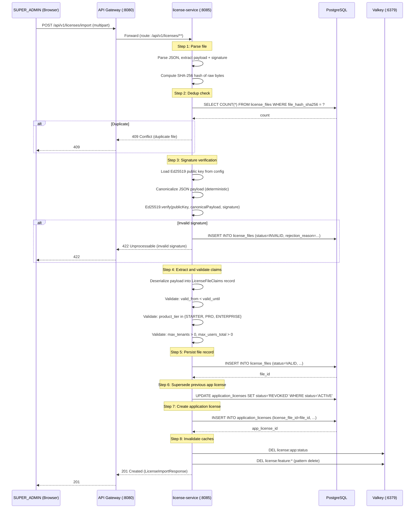
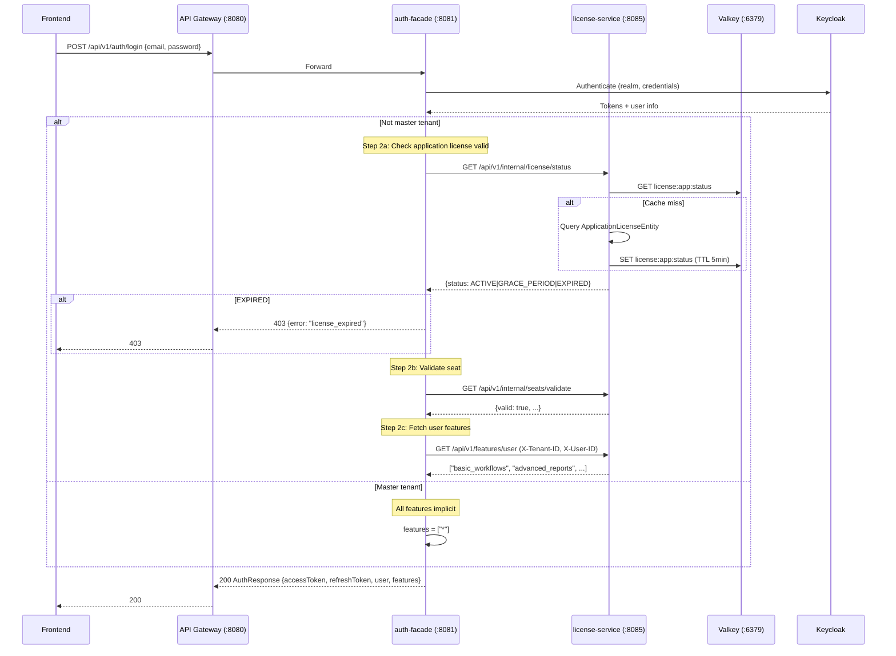

# LLD: License Service -- On-Premise Licensing

| Field | Value |
|-------|-------|
| **Document ID** | LLD-LIC-001 |
| **Service** | license-service |
| **Port** | 8085 (verified: `backend/license-service/src/main/resources/application.yml:2`) |
| **Database** | PostgreSQL (verified: `application.yml:9` -- `jdbc:postgresql://localhost:5432/master_db`) |
| **Cache** | Valkey 8 via `spring-boot-starter-data-redis` (verified: `application.yml:31-32`) |
| **Author** | SA Agent |
| **Created** | 2026-02-27 |
| **Status** | DRAFT |
| **Input Documents** | REQ-LIC-001 (On-Premise Licensing Requirements), REQ-RBAC-001 (RBAC-Licensing Requirements), ADR-014 (RBAC+Licensing), ADR-015 (On-Premise Crypto Architecture) |
| **ADR Alignment** | ADR-014 (Proposed), ADR-015 (Draft) |

---

## 1. Overview

### 1.1 Purpose

This LLD defines the technical changes to `license-service` and its integration points to transition from a SaaS subscription model to an on-premise, file-based cryptographic licensing model. The existing SaaS entities (`LicenseProductEntity`, `TenantLicenseEntity`, `UserLicenseAssignmentEntity`, `LicenseFeatureEntity`) are preserved but extended with new entities to handle signed license file import, Ed25519 signature verification, tiered licensing (Application > Tenant > User), and offline validation.

### 1.2 Scope

| In Scope | Out of Scope |
|----------|--------------|
| New entities for on-premise license files | License file generation tool (vendor-side) |
| License file import/validation API | UI implementation (frontend detail -- see section 8) |
| Ed25519 signature verification flow | Keycloak SPI or protocol mapper changes |
| Cache strategy for license state | Kafka event publishing (not implemented) |
| Flyway migration from SaaS schema | Database-per-tenant isolation (follows current single-DB pattern) |
| auth-facade login flow integration | New services or microservice decomposition |

### 1.3 Current State [IMPLEMENTED]

The license-service currently has a fully implemented SaaS model:

| Component | File | Status |
|-----------|------|--------|
| `LicenseProductEntity` | `backend/license-service/src/main/java/com/ems/license/entity/LicenseProductEntity.java` | [IMPLEMENTED] -- 3 products seeded (Starter, Pro, Enterprise) with SaaS pricing fields (`monthly_price`, `annual_price`) |
| `TenantLicenseEntity` | `backend/license-service/src/main/java/com/ems/license/entity/TenantLicenseEntity.java` | [IMPLEMENTED] -- SaaS fields (`billing_cycle`, `auto_renew`), seat management, `@Version` optimistic locking |
| `UserLicenseAssignmentEntity` | `backend/license-service/src/main/java/com/ems/license/entity/UserLicenseAssignmentEntity.java` | [IMPLEMENTED] -- JSONB feature overrides (`enabled_features`, `disabled_features`) |
| `LicenseFeatureEntity` | `backend/license-service/src/main/java/com/ems/license/entity/LicenseFeatureEntity.java` | [IMPLEMENTED] -- 12 features across 3 products |
| `FeatureGateServiceImpl` | `backend/license-service/src/main/java/com/ems/license/service/FeatureGateServiceImpl.java` | [IMPLEMENTED] -- Valkey cache with 5min TTL, key pattern `license:feature:{tenantId}:{userId}:{featureKey}` |
| `SeatValidationServiceImpl` | `backend/license-service/src/main/java/com/ems/license/service/SeatValidationServiceImpl.java` | [IMPLEMENTED] -- Valkey cache with 5min TTL, key pattern `seat:validation:{tenantId}:{userId}` |
| 5 Controllers | `FeatureGateController`, `SeatValidationController`, `TenantLicenseController`, `LicenseProductController`, `UserLicenseController` | [IMPLEMENTED] |
| Auth-facade Feign client | `backend/auth-facade/src/main/java/com/ems/auth/client/LicenseServiceClient.java` | [IMPLEMENTED] -- `validateSeat()` only; no `getUserFeatures()` method |
| Auth-facade circuit breaker | `backend/auth-facade/src/main/java/com/ems/auth/service/SeatValidationService.java:32` | [IMPLEMENTED] -- `@CircuitBreaker(name = "licenseService")` |
| Master tenant bypass | `backend/auth-facade/src/main/java/com/ems/auth/service/AuthServiceImpl.java:48` | [IMPLEMENTED] -- `!RealmResolver.isMasterTenant(tenantId)` |
| Frontend license manager | `frontend/src/app/pages/administration/sections/license-manager/license-manager-section.component.ts` | [IMPLEMENTED] -- Static shell with stat cards and empty state; no data binding |

### 1.4 Dependencies

| Dependency | Direction | Protocol |
|------------|-----------|----------|
| auth-facade | Inbound (Feign call) | REST -- `GET /api/v1/internal/seats/validate` |
| api-gateway | Inbound (route) | HTTP proxy -- routes `/api/v1/tenant-licenses/**`, `/api/v1/license-products/**`, `/api/v1/users/*/licenses/**` |
| PostgreSQL | Outbound | JDBC -- `jdbc:postgresql://localhost:5432/master_db` |
| Valkey | Outbound | Redis protocol -- `localhost:6379` |
| Keycloak | None | No direct dependency |

---

## 2. Component Diagram (C4 Level 3)

```
license-service (Spring Boot :8085)
+------------------------------------------------------------------------+
|                                                                        |
|  controller/                                                           |
|  +------------------------------------------------------------------+  |
|  | LicenseFileController [PLANNED]        - POST /import, GET /status|  |
|  | FeatureGateController [IMPLEMENTED]    - GET /features/**         |  |
|  | SeatValidationController [IMPLEMENTED] - GET /internal/seats/**   |  |
|  | TenantLicenseController [IMPLEMENTED]  - CRUD /tenant-licenses    |  |
|  | LicenseProductController [IMPLEMENTED] - GET /license-products    |  |
|  | UserLicenseController [IMPLEMENTED]    - CRUD /users/*/licenses   |  |
|  +------------------------------------------------------------------+  |
|                          |                                             |
|  service/                v                                             |
|  +------------------------------------------------------------------+  |
|  | LicenseFileService [PLANNED]                                      |  |
|  |   - importLicenseFile(bytes, filename)                            |  |
|  |   - validateSignature(payload, signature)                         |  |
|  |   - extractClaims(payload) -> LicenseFileClaims                   |  |
|  |   - provisionFromFile(claims) -> entities                         |  |
|  |                                                                   |  |
|  | FeatureGateServiceImpl [IMPLEMENTED]                              |  |
|  |   - checkFeature(), getUserFeatures(), getTenantFeatures()        |  |
|  |   - Reads from entities, caches in Valkey                         |  |
|  |                                                                   |  |
|  | SeatValidationServiceImpl [IMPLEMENTED]                           |  |
|  |   - validateSeat()                                                |  |
|  |   - Reads from entities, caches in Valkey                         |  |
|  |                                                                   |  |
|  | LicenseExpiryScheduler [PLANNED]                                  |  |
|  |   - @Scheduled checkExpiry() -> grace period enforcement          |  |
|  +------------------------------------------------------------------+  |
|                          |                                             |
|  crypto/ [PLANNED]       v                                             |
|  +------------------------------------------------------------------+  |
|  | Ed25519SignatureVerifier                                           |  |
|  |   - verify(publicKey, payload, signature) -> boolean              |  |
|  |   - Public key loaded from application.yml or classpath           |  |
|  +------------------------------------------------------------------+  |
|                          |                                             |
|  entity/                 v                                             |
|  +------------------------------------------------------------------+  |
|  | LicenseFileEntity [PLANNED]          - Imported file metadata     |  |
|  | ApplicationLicenseEntity [PLANNED]   - Top-level app license      |  |
|  | LicenseProductEntity [IMPLEMENTED]   - Product catalog            |  |
|  | LicenseFeatureEntity [IMPLEMENTED]   - Feature definitions        |  |
|  | TenantLicenseEntity [IMPLEMENTED]    - Tenant license pool        |  |
|  | UserLicenseAssignmentEntity [IMPL.]  - User seat assignment       |  |
|  +------------------------------------------------------------------+  |
|                          |                                             |
|  repository/             v                                             |
|  +------------------------------------------------------------------+  |
|  | LicenseFileRepository [PLANNED]                                   |  |
|  | ApplicationLicenseRepository [PLANNED]                            |  |
|  | LicenseProductRepository [IMPLEMENTED]                            |  |
|  | LicenseFeatureRepository [IMPLEMENTED]                            |  |
|  | TenantLicenseRepository [IMPLEMENTED]                             |  |
|  | UserLicenseAssignmentRepository [IMPLEMENTED]                     |  |
|  +------------------------------------------------------------------+  |
|                                                                        |
+------------------------------------------------------------------------+
         |                    |                    |
         v                    v                    v
    PostgreSQL             Valkey              Filesystem
    (master_db)          (:6379)            (license files
     via JDBC                                 stored as
                                              BLOBs in DB)
```

---

## 3. Data Model Changes

### 3.1 New Entity: `LicenseFileEntity` [PLANNED]

Represents a raw imported license file. Immutable after creation -- the file is the cryptographic evidence.

**Table:** `license_files`
**Service:** license-service
**Tenant Scope:** Global (imported by SUPER_ADMIN on master tenant)

| Field | Type | Constraints | Description |
|-------|------|-------------|-------------|
| id | UUID | PK, NOT NULL, DEFAULT gen_random_uuid() | Primary key |
| filename | VARCHAR(255) | NOT NULL | Original uploaded filename |
| file_hash_sha256 | VARCHAR(64) | NOT NULL, UNIQUE | SHA-256 hash of the raw file bytes (dedup) |
| file_content | BYTEA | NOT NULL | Raw file bytes (signed payload) |
| signature | BYTEA | NOT NULL | Detached Ed25519 signature bytes |
| signature_valid | BOOLEAN | NOT NULL | Whether signature verification passed |
| issuer | VARCHAR(255) | | Extracted from claims: who issued the license |
| issued_at | TIMESTAMPTZ | | Extracted from claims: issue timestamp |
| license_id_claim | VARCHAR(100) | UNIQUE | Extracted: unique license identifier from the file |
| imported_by | UUID | NOT NULL | User who imported the file |
| imported_at | TIMESTAMPTZ | NOT NULL, DEFAULT CURRENT_TIMESTAMP | Import timestamp |
| status | VARCHAR(20) | NOT NULL, DEFAULT 'PENDING' | PENDING, VALID, INVALID, SUPERSEDED |
| rejection_reason | TEXT | | Why the file was rejected (if INVALID) |
| version | BIGINT | NOT NULL, DEFAULT 0 | Optimistic locking |
| created_at | TIMESTAMPTZ | NOT NULL, DEFAULT CURRENT_TIMESTAMP | Audit |
| updated_at | TIMESTAMPTZ | NOT NULL, DEFAULT CURRENT_TIMESTAMP | Audit |

**Indexes:**

| Index Name | Columns | Type |
|------------|---------|------|
| idx_license_files_hash | file_hash_sha256 | UNIQUE BTREE |
| idx_license_files_license_id | license_id_claim | UNIQUE BTREE |
| idx_license_files_status | status | BTREE |
| idx_license_files_imported_at | imported_at | BTREE |

**Business Rules:**
- BR-LF-001: A file with the same SHA-256 hash cannot be imported twice.
- BR-LF-002: A file with an invalid signature is stored with status=INVALID and `rejection_reason` populated, but does not create downstream entities.
- BR-LF-003: When a new valid file supersedes an existing one (same `license_id_claim`), the old file's status is set to SUPERSEDED.

---

### 3.2 New Entity: `ApplicationLicenseEntity` [PLANNED]

Represents the top-level application license extracted from a valid license file. This is the "Level 1" license in the 3-tier hierarchy (Application > Tenant > User).

**Table:** `application_licenses`
**Service:** license-service
**Tenant Scope:** Global

| Field | Type | Constraints | Description |
|-------|------|-------------|-------------|
| id | UUID | PK, NOT NULL, DEFAULT gen_random_uuid() | Primary key |
| license_file_id | UUID | FK -> license_files(id), NOT NULL | Source license file |
| license_key | VARCHAR(100) | NOT NULL, UNIQUE | Unique license identifier from claims |
| licensee_name | VARCHAR(255) | NOT NULL | Organization name from claims |
| licensee_contact | VARCHAR(255) | | Contact email from claims |
| product_tier | VARCHAR(50) | NOT NULL | STARTER, PRO, ENTERPRISE |
| max_tenants | INTEGER | NOT NULL | Maximum tenants allowed |
| max_users_total | INTEGER | NOT NULL | Total user seats across all tenants |
| valid_from | DATE | NOT NULL | License validity start |
| valid_until | DATE | NOT NULL | License validity end |
| grace_period_days | INTEGER | NOT NULL, DEFAULT 30 | Days after expiry before lockout |
| features | JSONB | NOT NULL, DEFAULT '[]' | Array of feature keys granted |
| hardware_fingerprint | VARCHAR(255) | | Optional: hardware binding hash |
| status | VARCHAR(20) | NOT NULL, DEFAULT 'ACTIVE' | ACTIVE, EXPIRED, GRACE_PERIOD, REVOKED |
| activated_at | TIMESTAMPTZ | | When the license was activated |
| activated_by | UUID | | User who activated |
| version | BIGINT | NOT NULL, DEFAULT 0 | Optimistic locking |
| created_at | TIMESTAMPTZ | NOT NULL, DEFAULT CURRENT_TIMESTAMP | Audit |
| updated_at | TIMESTAMPTZ | NOT NULL, DEFAULT CURRENT_TIMESTAMP | Audit |
| created_by | UUID | | Creator user reference |

**Indexes:**

| Index Name | Columns | Type |
|------------|---------|------|
| idx_app_license_key | license_key | UNIQUE BTREE |
| idx_app_license_file | license_file_id | BTREE |
| idx_app_license_status | status | BTREE |
| idx_app_license_valid | valid_until | BTREE |

**Relationships:**

| Relationship | Target Entity | Cardinality | FK Location |
|--------------|---------------|-------------|-------------|
| sourced from | LicenseFileEntity | N:1 | this.license_file_id |
| provisions | TenantLicenseEntity | 1:N | TenantLicenseEntity.application_license_id |

**Business Rules:**
- BR-AL-001: Only one ApplicationLicense can be ACTIVE at a time. Importing a new valid license supersedes the previous one.
- BR-AL-002: The `features` JSONB array is the authoritative source for what features are available. It replaces the product-to-feature mapping for on-premise mode.
- BR-AL-003: When `valid_until` passes, status transitions to GRACE_PERIOD for `grace_period_days`, then to EXPIRED.
- BR-AL-004: Master tenant SUPER_ADMIN can operate during GRACE_PERIOD with a visual warning but not after EXPIRED.

---

### 3.3 Modified Entity: `TenantLicenseEntity` [IN-PROGRESS]

The existing `TenantLicenseEntity` needs a new FK column linking it to the `ApplicationLicenseEntity`. The SaaS-specific fields (`billing_cycle`, `auto_renew`) become nullable (deprecated for on-premise).

**Table:** `tenant_licenses` (existing)
**Changes:**

| Field | Change | Type | Constraints | Description |
|-------|--------|------|-------------|-------------|
| application_license_id | ADD | UUID | FK -> application_licenses(id), NULLABLE | Links to parent application license. NULL for legacy SaaS records. |
| billing_cycle | MODIFY | VARCHAR(20) | NULLABLE (was DEFAULT 'MONTHLY') | Deprecated for on-premise; retained for backward compatibility |
| auto_renew | MODIFY | BOOLEAN | NULLABLE (was DEFAULT TRUE) | Deprecated for on-premise |
| provisioned_from_file | ADD | BOOLEAN | NOT NULL, DEFAULT FALSE | Whether this record was created from a license file import |
| grace_period_days | ADD | INTEGER | DEFAULT 0 | Tenant-specific grace period (inherited from application license) |

**New Index:**

| Index Name | Columns | Type |
|------------|---------|------|
| idx_tenant_licenses_app_license | application_license_id | BTREE |

**Updated Relationship:**

| Relationship | Target Entity | Cardinality | FK Location |
|--------------|---------------|-------------|-------------|
| belongs to | ApplicationLicenseEntity | N:1 | this.application_license_id |
| has | UserLicenseAssignmentEntity | 1:N | UserLicenseAssignmentEntity.tenant_license_id |
| references product | LicenseProductEntity | N:1 | this.product_id |

---

### 3.4 Modified Entity: `LicenseProductEntity` [IN-PROGRESS]

The SaaS pricing fields become nullable. A new `tier_level` field provides ordinal ranking for the 3-tier on-premise model.

**Table:** `license_products` (existing)
**Changes:**

| Field | Change | Type | Constraints | Description |
|-------|--------|------|-------------|-------------|
| monthly_price | MODIFY | DECIMAL(10,2) | NULLABLE (already nullable) | No change needed -- already nullable in schema |
| annual_price | MODIFY | DECIMAL(10,2) | NULLABLE (already nullable) | No change needed -- already nullable in schema |
| tier_level | ADD | INTEGER | UNIQUE, NULLABLE | Ordinal: 1=Starter, 2=Pro, 3=Enterprise. Used to determine feature inclusion hierarchy. |

---

### 3.5 New Enum: `ApplicationLicenseStatus` [PLANNED]

```java
package com.ems.common.enums;

public enum ApplicationLicenseStatus {
    ACTIVE,         // License is valid and within validity period
    GRACE_PERIOD,   // License has expired but within grace period
    EXPIRED,        // License has expired and grace period is over
    REVOKED         // License was explicitly revoked
}
```

**Note:** The existing `LicenseStatus` enum (`ACTIVE`, `EXPIRED`, `SUSPENDED`) at `backend/common/src/main/java/com/ems/common/enums/LicenseStatus.java` remains for `TenantLicenseEntity`. The new enum is for `ApplicationLicenseEntity` which has a different lifecycle.

---

### 3.6 Entity Relationship Diagram

```mermaid
erDiagram
    LICENSE_FILES ||--o{ APPLICATION_LICENSES : "sourced from"
    APPLICATION_LICENSES ||--o{ TENANT_LICENSES : "provisions"
    TENANT_LICENSES }o--|| LICENSE_PRODUCTS : "references"
    LICENSE_PRODUCTS ||--o{ LICENSE_FEATURES : "has"
    TENANT_LICENSES ||--o{ USER_LICENSE_ASSIGNMENTS : "has"

    LICENSE_FILES {
        uuid id PK
        string filename
        string file_hash_sha256 UK
        bytea file_content
        bytea signature
        boolean signature_valid
        string issuer
        timestamptz issued_at
        string license_id_claim UK
        uuid imported_by
        timestamptz imported_at
        string status
        text rejection_reason
        bigint version
        timestamptz created_at
        timestamptz updated_at
    }

    APPLICATION_LICENSES {
        uuid id PK
        uuid license_file_id FK
        string license_key UK
        string licensee_name
        string licensee_contact
        string product_tier
        integer max_tenants
        integer max_users_total
        date valid_from
        date valid_until
        integer grace_period_days
        jsonb features
        string hardware_fingerprint
        string status
        timestamptz activated_at
        uuid activated_by
        bigint version
        timestamptz created_at
        timestamptz updated_at
        uuid created_by
    }

    TENANT_LICENSES {
        uuid id PK
        string tenant_id
        uuid product_id FK
        uuid application_license_id FK "NEW"
        integer total_seats
        integer assigned_seats
        date valid_from
        date valid_until
        string billing_cycle "DEPRECATED"
        boolean auto_renew "DEPRECATED"
        boolean provisioned_from_file "NEW"
        integer grace_period_days "NEW"
        string status
        bigint version
        timestamptz created_at
        timestamptz updated_at
    }

    LICENSE_PRODUCTS {
        uuid id PK
        string name UK
        string display_name
        text description
        decimal monthly_price "NULLABLE"
        decimal annual_price "NULLABLE"
        boolean is_active
        integer sort_order
        integer tier_level "NEW"
        timestamptz created_at
        timestamptz updated_at
    }

    LICENSE_FEATURES {
        uuid id PK
        uuid product_id FK
        string feature_key
        string display_name
        text description
        boolean is_core
        timestamptz created_at
    }

    USER_LICENSE_ASSIGNMENTS {
        uuid id PK
        uuid user_id
        uuid tenant_license_id FK
        jsonb enabled_features
        jsonb disabled_features
        timestamptz assigned_at
        uuid assigned_by
    }
```



---

## 4. API Contracts

### 4.1 Existing Endpoints (No Change) [IMPLEMENTED]

| Method | Path | Controller | Description |
|--------|------|------------|-------------|
| GET | `/api/v1/features/{featureKey}/check` | FeatureGateController | Check single feature access |
| GET | `/api/v1/features/user` | FeatureGateController | Get all user features |
| GET | `/api/v1/features/tenant` | FeatureGateController | Get all tenant features |
| GET | `/api/v1/internal/seats/validate` | SeatValidationController | Validate user seat (internal) |
| DELETE | `/api/v1/internal/seats/cache` | SeatValidationController | Invalidate seat cache |
| GET | `/api/v1/tenant-licenses` | TenantLicenseController | List tenant licenses |
| GET | `/api/v1/tenant-licenses/{id}` | TenantLicenseController | Get tenant license |
| POST | `/api/v1/tenant-licenses` | TenantLicenseController | Create tenant license |
| PATCH | `/api/v1/tenant-licenses/{id}` | TenantLicenseController | Update tenant license |
| DELETE | `/api/v1/tenant-licenses/{id}` | TenantLicenseController | Delete tenant license |
| GET | `/api/v1/tenant-licenses/{id}/users` | TenantLicenseController | List license users |
| GET | `/api/v1/license-products` | LicenseProductController | List products |
| GET | `/api/v1/license-products/{id}` | LicenseProductController | Get product |
| GET | `/api/v1/users/{userId}/licenses` | UserLicenseController | Get user licenses |
| POST | `/api/v1/users/{userId}/licenses` | UserLicenseController | Assign license |
| DELETE | `/api/v1/users/{userId}/licenses/{id}` | UserLicenseController | Revoke license |
| DELETE | `/api/v1/users/{userId}/licenses` | UserLicenseController | Revoke all |

### 4.2 New Endpoints [PLANNED]

#### 4.2.1 Import License File

```yaml
# POST /api/v1/licenses/import
# Controller: LicenseFileController [PLANNED]
# Authorization: SUPER_ADMIN only (master tenant)
# Content-Type: multipart/form-data

paths:
  /api/v1/licenses/import:
    post:
      operationId: importLicenseFile
      tags: [License Files]
      summary: Import a signed license file
      description: |
        Imports a license file, verifies its Ed25519 signature, extracts claims,
        and provisions the application license. Only accessible to SUPER_ADMIN
        on the master tenant.
      security:
        - bearerAuth: []
      requestBody:
        required: true
        content:
          multipart/form-data:
            schema:
              type: object
              required: [file]
              properties:
                file:
                  type: string
                  format: binary
                  description: The signed license file (.lic or .json)
      responses:
        '201':
          description: License file imported and validated successfully
          content:
            application/json:
              schema:
                $ref: '#/components/schemas/LicenseImportResponse'
              example:
                id: "550e8400-e29b-41d4-a716-446655440000"
                licenseKey: "LIC-2026-ENT-001"
                status: "VALID"
                productTier: "ENTERPRISE"
                licenseeName: "Acme Corp"
                maxTenants: 10
                maxUsersTotal: 500
                validFrom: "2026-01-01"
                validUntil: "2027-01-01"
                gracePeriodDays: 30
                features:
                  - "basic_workflows"
                  - "advanced_workflows"
                  - "ai_persona"
                  - "audit_logs"
                importedAt: "2026-02-27T10:00:00Z"
        '400':
          description: Invalid file format or corrupt data
          content:
            application/json:
              schema:
                $ref: '#/components/schemas/ProblemDetail'
              example:
                type: "urn:emsist:license:invalid-file"
                title: "Invalid License File"
                status: 400
                detail: "The uploaded file is not a valid license file format."
        '403':
          description: Not authorized (not SUPER_ADMIN or not master tenant)
          content:
            application/json:
              schema:
                $ref: '#/components/schemas/ProblemDetail'
        '409':
          description: Duplicate file (same SHA-256 hash already imported)
          content:
            application/json:
              schema:
                $ref: '#/components/schemas/ProblemDetail'
              example:
                type: "urn:emsist:license:duplicate-file"
                title: "Duplicate License File"
                status: 409
                detail: "A license file with this content has already been imported."
        '422':
          description: Signature verification failed
          content:
            application/json:
              schema:
                $ref: '#/components/schemas/ProblemDetail'
              example:
                type: "urn:emsist:license:invalid-signature"
                title: "Invalid Signature"
                status: 422
                detail: "The Ed25519 signature verification failed. The license file may have been tampered with."
```

#### 4.2.2 Get Application License Status

```yaml
# GET /api/v1/licenses/application/status
# Controller: LicenseFileController [PLANNED]
# Authorization: Authenticated users (any role)

  /api/v1/licenses/application/status:
    get:
      operationId: getApplicationLicenseStatus
      tags: [License Files]
      summary: Get current application license status
      description: |
        Returns the current application license status including tier, validity,
        feature list, and tenant/user consumption. Cached in Valkey for performance.
      security:
        - bearerAuth: []
      responses:
        '200':
          description: Application license status
          content:
            application/json:
              schema:
                $ref: '#/components/schemas/ApplicationLicenseStatus'
              example:
                licenseKey: "LIC-2026-ENT-001"
                status: "ACTIVE"
                productTier: "ENTERPRISE"
                licenseeName: "Acme Corp"
                validFrom: "2026-01-01"
                validUntil: "2027-01-01"
                gracePeriodDays: 30
                daysRemaining: 308
                maxTenants: 10
                currentTenants: 3
                maxUsersTotal: 500
                currentUsersTotal: 47
                features:
                  - "basic_workflows"
                  - "advanced_workflows"
                  - "ai_persona"
                expiryWarning: null
        '404':
          description: No application license has been imported
          content:
            application/json:
              schema:
                $ref: '#/components/schemas/ProblemDetail'
              example:
                type: "urn:emsist:license:no-application-license"
                title: "No Application License"
                status: 404
                detail: "No application license has been imported. Contact your administrator."
```

#### 4.2.3 Get License File History

```yaml
# GET /api/v1/licenses/files
# Controller: LicenseFileController [PLANNED]
# Authorization: SUPER_ADMIN only

  /api/v1/licenses/files:
    get:
      operationId: listLicenseFiles
      tags: [License Files]
      summary: List imported license files
      description: |
        Returns a history of all imported license files, including their
        validation status and the application licenses they created.
      security:
        - bearerAuth: []
      parameters:
        - name: status
          in: query
          required: false
          schema:
            type: string
            enum: [PENDING, VALID, INVALID, SUPERSEDED]
        - name: page
          in: query
          schema:
            type: integer
            default: 0
        - name: size
          in: query
          schema:
            type: integer
            default: 20
      responses:
        '200':
          description: Paginated list of license files
          content:
            application/json:
              schema:
                $ref: '#/components/schemas/LicenseFilePage'
```

#### 4.2.4 Provision Tenant from Application License

```yaml
# POST /api/v1/licenses/application/tenants
# Controller: LicenseFileController [PLANNED]
# Authorization: SUPER_ADMIN only

  /api/v1/licenses/application/tenants:
    post:
      operationId: provisionTenantLicense
      tags: [License Files]
      summary: Provision a tenant under the application license
      description: |
        Creates a TenantLicenseEntity linked to the active ApplicationLicense.
        Validates that the max_tenants limit has not been exceeded.
      security:
        - bearerAuth: []
      requestBody:
        required: true
        content:
          application/json:
            schema:
              $ref: '#/components/schemas/ProvisionTenantRequest'
            example:
              tenantId: "acme-corp"
              totalSeats: 50
              validFrom: "2026-03-01"
              validUntil: "2027-01-01"
      responses:
        '201':
          description: Tenant license provisioned
          content:
            application/json:
              schema:
                $ref: '#/components/schemas/TenantLicenseDTO'
        '400':
          description: Validation error
        '409':
          description: Max tenants limit reached
          content:
            application/json:
              schema:
                $ref: '#/components/schemas/ProblemDetail'
              example:
                type: "urn:emsist:license:max-tenants-exceeded"
                title: "Tenant Limit Exceeded"
                status: 409
                detail: "The application license allows 10 tenants. 10 are already provisioned."
```

### 4.3 OpenAPI Component Schemas [PLANNED]

```yaml
components:
  schemas:
    LicenseImportResponse:
      type: object
      properties:
        id:
          type: string
          format: uuid
        licenseKey:
          type: string
        status:
          type: string
          enum: [VALID, INVALID]
        productTier:
          type: string
          enum: [STARTER, PRO, ENTERPRISE]
        licenseeName:
          type: string
        maxTenants:
          type: integer
        maxUsersTotal:
          type: integer
        validFrom:
          type: string
          format: date
        validUntil:
          type: string
          format: date
        gracePeriodDays:
          type: integer
        features:
          type: array
          items:
            type: string
        importedAt:
          type: string
          format: date-time
        rejectionReason:
          type: string
          description: Only present when status is INVALID

    ApplicationLicenseStatus:
      type: object
      properties:
        licenseKey:
          type: string
        status:
          type: string
          enum: [ACTIVE, GRACE_PERIOD, EXPIRED, REVOKED]
        productTier:
          type: string
        licenseeName:
          type: string
        validFrom:
          type: string
          format: date
        validUntil:
          type: string
          format: date
        gracePeriodDays:
          type: integer
        daysRemaining:
          type: integer
          description: Days until expiry (negative if in grace period)
        maxTenants:
          type: integer
        currentTenants:
          type: integer
        maxUsersTotal:
          type: integer
        currentUsersTotal:
          type: integer
        features:
          type: array
          items:
            type: string
        expiryWarning:
          type: string
          description: Warning message when approaching expiry or in grace period

    ProvisionTenantRequest:
      type: object
      required: [tenantId, totalSeats]
      properties:
        tenantId:
          type: string
          maxLength: 50
        totalSeats:
          type: integer
          minimum: 1
        validFrom:
          type: string
          format: date
          description: Defaults to application license validFrom
        validUntil:
          type: string
          format: date
          description: Cannot exceed application license validUntil

    ProblemDetail:
      type: object
      description: RFC 7807 Problem Details
      properties:
        type:
          type: string
          format: uri
        title:
          type: string
        status:
          type: integer
        detail:
          type: string
        instance:
          type: string

  securitySchemes:
    bearerAuth:
      type: http
      scheme: bearer
      bearerFormat: JWT
```

---

## 5. Cryptographic Validation Flow [PLANNED]

### 5.1 License File Format

The license file is a JSON structure with a detached signature. The exact format per ADR-015:

```json
{
  "payload": {
    "license_id": "LIC-2026-ENT-001",
    "issuer": "EMSIST Licensing Authority",
    "issued_at": "2026-02-27T00:00:00Z",
    "licensee": {
      "name": "Acme Corp",
      "contact": "admin@acme.com"
    },
    "product_tier": "ENTERPRISE",
    "entitlements": {
      "max_tenants": 10,
      "max_users_total": 500,
      "features": [
        "basic_workflows", "basic_reports", "email_notifications",
        "advanced_workflows", "advanced_reports", "api_access", "webhooks",
        "ai_persona", "custom_branding", "sso_integration", "audit_logs",
        "priority_support"
      ]
    },
    "validity": {
      "valid_from": "2026-01-01",
      "valid_until": "2027-01-01",
      "grace_period_days": 30
    },
    "hardware_fingerprint": null
  },
  "signature": "<base64-encoded Ed25519 signature of canonical JSON payload>"
}
```

### 5.2 Validation Sequence



### 5.3 Ed25519 Verification Implementation [PLANNED]

The implementation uses Java's built-in `java.security` API (available in Java 15+, verified: project uses Java 23):

```
Ed25519SignatureVerifier [PLANNED]
  Location: com.ems.license.crypto.Ed25519SignatureVerifier

  Dependencies: java.security.KeyFactory, java.security.Signature (EdDSA)
  No external library needed -- Java 15+ includes EdDSA support.

  Configuration:
    license.crypto.public-key: <base64-encoded Ed25519 public key>
    (in application.yml, injected via @Value)

  Method: verify(byte[] payload, byte[] signature) -> boolean
    1. Decode base64 public key from config
    2. Construct PublicKey via KeyFactory.getInstance("Ed25519")
    3. Initialize Signature.getInstance("Ed25519")
    4. sig.initVerify(publicKey)
    5. sig.update(canonicalPayload)
    6. return sig.verify(signatureBytes)
```

**No new Maven dependencies required.** Java 23 includes `java.security.spec.EdECPublicKeySpec` and the `Ed25519` algorithm natively.

---

## 6. Integration with auth-facade [PLANNED]

### 6.1 Current Login Flow (Verified)

Reading `AuthServiceImpl.java:41-65`, the current login flow is:

```
1. identityProvider.authenticate(realm, email, password)  --> AuthResponse
2. IF not master tenant: seatValidationService.validateUserSeat(tenantId, userId)
3. IF MFA enabled: create MFA session, throw MfaRequiredException
4. Return AuthResponse
```

The `AuthResponse` record (at `backend/common/src/main/java/com/ems/common/dto/auth/AuthResponse.java`) currently has these fields:
- `accessToken`, `refreshToken`, `expiresIn`, `tokenType`, `user` (UserInfo), `mfaRequired`, `mfaSessionToken`

There is **no** `features` field and **no** call to `getUserFeatures()` in the login flow.

### 6.2 Planned Changes

Per ADR-014 (Proposed), the login flow should be extended to:

**auth-facade changes:**

1. **Add `features` field to `AuthResponse`** -- new `List<String> features` field
2. **Add `getUserFeatures()` to `LicenseServiceClient`** Feign interface
3. **Call `getUserFeatures()` during login** -- after seat validation, before returning
4. **Master tenant: return wildcard features** -- `["*"]` or full feature list

**license-service changes for on-premise:**

5. **`FeatureGateServiceImpl.getUserFeatures()`** needs to also check the `ApplicationLicenseEntity.features` JSONB array as the authoritative source, not just the product-feature mapping.
6. **New internal endpoint** `GET /api/v1/internal/license/status` for auth-facade to check if the application license is valid before allowing login.

### 6.3 Updated Login Sequence [PLANNED]



### 6.4 Grace Period Handling at Login

When `ApplicationLicenseEntity.status == GRACE_PERIOD`:

- Login is **allowed** (not blocked)
- The response includes a new field `licenseWarning: "License expired on 2027-01-01. Grace period ends 2027-01-31. Please renew."`
- The frontend displays a persistent banner warning
- After grace period ends (status transitions to EXPIRED), login is **blocked** for non-master tenants

### 6.5 Changes to AuthResponse [PLANNED]

```java
// backend/common/src/main/java/com/ems/common/dto/auth/AuthResponse.java
// ADD new fields:
public record AuthResponse(
    String accessToken,
    String refreshToken,
    long expiresIn,
    String tokenType,
    UserInfo user,
    boolean mfaRequired,
    String mfaSessionToken,
    List<String> features,          // NEW: feature keys from license
    String licenseWarning           // NEW: grace period warning message
) {
    // Existing factory methods updated with new parameters
}
```

---

## 7. Cache Strategy [PLANNED]

### 7.1 Existing Cache Keys (Verified)

| Key Pattern | TTL | Service | File Evidence |
|-------------|-----|---------|---------------|
| `license:feature:{tenantId}:{userId}:{featureKey}` | 5 min | license-service | `FeatureGateServiceImpl.java:33-34` |
| `license:feature:{tenantId}:tenant:{featureKey}` | 5 min | license-service | `FeatureGateServiceImpl.java:80` |
| `seat:validation:{tenantId}:{userId}` | 5 min | license-service | `SeatValidationServiceImpl.java:34-35` |

### 7.2 New Cache Keys [PLANNED]

| Key Pattern | TTL | Purpose | Invalidation Trigger |
|-------------|-----|---------|----------------------|
| `license:app:status` | 5 min | Serialized `ApplicationLicenseStatus` JSON | License file import, expiry scheduler |
| `license:app:features` | 5 min | JSON array of all features from active app license | License file import |
| `license:tenant:{tenantId}:provisioned` | 5 min | Whether tenant has a valid provisioned license | Tenant provisioning, expiry scheduler |

### 7.3 Cache Invalidation Events

| Event | Keys Invalidated | Method |
|-------|-----------------|--------|
| License file imported (valid) | `license:app:*`, `license:feature:*` | Pattern delete via `KEYS` or `SCAN` |
| Tenant provisioned | `license:tenant:{tenantId}:*` | Direct delete |
| User seat assigned/revoked | `seat:validation:{tenantId}:{userId}`, `license:feature:{tenantId}:{userId}:*` | Direct delete (existing pattern in `SeatValidationController.invalidateCache()`) |
| Expiry scheduler runs | `license:app:status` | Direct delete |

**Implementation note:** Pattern-based deletion (`license:feature:*`) should use `SCAN` with `UNLINK`, not `KEYS`, to avoid blocking the Valkey event loop. The existing implementation does not do pattern deletion, so this is a new concern.

### 7.4 Valkey Key Size Estimate

| Key | Approximate Value Size | Count |
|-----|----------------------|-------|
| `license:app:status` | ~500 bytes (JSON) | 1 |
| `license:app:features` | ~200 bytes (12 strings) | 1 |
| `license:feature:*` | 1 byte ("0" or "1") | Users x Features (e.g., 500 x 12 = 6000) |
| `seat:validation:*` | ~200 bytes (JSON) | Users (e.g., 500) |

Total Valkey overhead for licensing: approximately 50 KB for 500 users, 12 features. Negligible.

---

## 8. Migration Path (Flyway) [PLANNED]

### 8.1 Migration Strategy

The migration must be **non-destructive** -- existing SaaS data is preserved but deprecated fields are made nullable. New on-premise tables are added. This allows a rollback path if needed.

### 8.2 V3 Migration: Add On-Premise License Tables

**File:** `backend/license-service/src/main/resources/db/migration/V3__onprem_license_tables.sql`

```sql
-- ============================================================================
-- V3: On-Premise License Tables
-- ============================================================================
-- Adds support for file-based cryptographic licensing.
-- SaaS fields are preserved but deprecated. No data is deleted.
-- ============================================================================

-- 1. License Files (imported signed license files)
CREATE TABLE license_files (
    id                  UUID PRIMARY KEY DEFAULT gen_random_uuid(),
    filename            VARCHAR(255) NOT NULL,
    file_hash_sha256    VARCHAR(64) NOT NULL UNIQUE,
    file_content        BYTEA NOT NULL,
    signature           BYTEA NOT NULL,
    signature_valid     BOOLEAN NOT NULL,
    issuer              VARCHAR(255),
    issued_at           TIMESTAMPTZ,
    license_id_claim    VARCHAR(100) UNIQUE,
    imported_by         UUID NOT NULL,
    imported_at         TIMESTAMPTZ NOT NULL DEFAULT CURRENT_TIMESTAMP,
    status              VARCHAR(20) NOT NULL DEFAULT 'PENDING',
    rejection_reason    TEXT,
    version             BIGINT NOT NULL DEFAULT 0,
    created_at          TIMESTAMPTZ NOT NULL DEFAULT CURRENT_TIMESTAMP,
    updated_at          TIMESTAMPTZ NOT NULL DEFAULT CURRENT_TIMESTAMP,

    CONSTRAINT chk_license_file_status CHECK (status IN ('PENDING', 'VALID', 'INVALID', 'SUPERSEDED'))
);

CREATE INDEX idx_license_files_status ON license_files(status);
CREATE INDEX idx_license_files_imported_at ON license_files(imported_at);

-- 2. Application Licenses (extracted from valid license files)
CREATE TABLE application_licenses (
    id                      UUID PRIMARY KEY DEFAULT gen_random_uuid(),
    license_file_id         UUID NOT NULL REFERENCES license_files(id),
    license_key             VARCHAR(100) NOT NULL UNIQUE,
    licensee_name           VARCHAR(255) NOT NULL,
    licensee_contact        VARCHAR(255),
    product_tier            VARCHAR(50) NOT NULL,
    max_tenants             INTEGER NOT NULL,
    max_users_total         INTEGER NOT NULL,
    valid_from              DATE NOT NULL,
    valid_until             DATE NOT NULL,
    grace_period_days       INTEGER NOT NULL DEFAULT 30,
    features                JSONB NOT NULL DEFAULT '[]',
    hardware_fingerprint    VARCHAR(255),
    status                  VARCHAR(20) NOT NULL DEFAULT 'ACTIVE',
    activated_at            TIMESTAMPTZ,
    activated_by            UUID,
    version                 BIGINT NOT NULL DEFAULT 0,
    created_at              TIMESTAMPTZ NOT NULL DEFAULT CURRENT_TIMESTAMP,
    updated_at              TIMESTAMPTZ NOT NULL DEFAULT CURRENT_TIMESTAMP,
    created_by              UUID,

    CONSTRAINT chk_app_license_status CHECK (status IN ('ACTIVE', 'GRACE_PERIOD', 'EXPIRED', 'REVOKED')),
    CONSTRAINT chk_app_license_validity CHECK (valid_until >= valid_from),
    CONSTRAINT chk_app_license_tenants CHECK (max_tenants > 0),
    CONSTRAINT chk_app_license_users CHECK (max_users_total > 0)
);

CREATE INDEX idx_app_license_file ON application_licenses(license_file_id);
CREATE INDEX idx_app_license_status ON application_licenses(status);
CREATE INDEX idx_app_license_valid ON application_licenses(valid_until);

-- 3. Extend tenant_licenses with on-premise fields
ALTER TABLE tenant_licenses
    ADD COLUMN IF NOT EXISTS application_license_id UUID REFERENCES application_licenses(id),
    ADD COLUMN IF NOT EXISTS provisioned_from_file BOOLEAN NOT NULL DEFAULT FALSE,
    ADD COLUMN IF NOT EXISTS grace_period_days INTEGER DEFAULT 0;

CREATE INDEX IF NOT EXISTS idx_tenant_licenses_app_license ON tenant_licenses(application_license_id);

-- 4. Extend license_products with tier_level
ALTER TABLE license_products
    ADD COLUMN IF NOT EXISTS tier_level INTEGER;

-- Set tier levels for existing products
UPDATE license_products SET tier_level = 1 WHERE name = 'EMSIST_STARTER';
UPDATE license_products SET tier_level = 2 WHERE name = 'EMSIST_PRO';
UPDATE license_products SET tier_level = 3 WHERE name = 'EMSIST_ENTERPRISE';

-- Note: billing_cycle and auto_renew in tenant_licenses are already NULLABLE
-- in the existing V1 migration (billing_cycle VARCHAR(20) DEFAULT 'MONTHLY',
-- auto_renew BOOLEAN DEFAULT TRUE). They remain as-is for backward compatibility.

-- 5. GIN index on application_licenses.features for JSONB containment queries
CREATE INDEX idx_app_license_features ON application_licenses USING GIN (features);
```

### 8.3 Migration Order

| Step | Migration | Purpose | Destructive? |
|------|-----------|---------|-------------|
| 1 | V1__licenses.sql | Existing SaaS schema + seed data | No (existing) |
| 2 | V2__add_version_column.sql | Add optimistic locking | No (existing) |
| 3 | V3__onprem_license_tables.sql | Add on-premise tables + extend existing | No (additive only) |

### 8.4 Rollback Strategy

Since V3 is purely additive (no DROP, no column removal), rollback involves:
1. Remove the V3 entry from `flyway_schema_history_license`
2. `DROP TABLE IF EXISTS application_licenses CASCADE;`
3. `DROP TABLE IF EXISTS license_files CASCADE;`
4. `ALTER TABLE tenant_licenses DROP COLUMN IF EXISTS application_license_id, DROP COLUMN IF EXISTS provisioned_from_file, DROP COLUMN IF EXISTS grace_period_days;`
5. `ALTER TABLE license_products DROP COLUMN IF EXISTS tier_level;`

---

## 9. Error Handling

### 9.1 Error Codes Catalog [PLANNED]

| Error Code | HTTP Status | Type URI | Description |
|------------|-------------|----------|-------------|
| `license_file_invalid` | 400 | `urn:emsist:license:invalid-file` | File is not valid JSON or does not match expected schema |
| `license_file_too_large` | 413 | `urn:emsist:license:file-too-large` | File exceeds maximum size (e.g., 1 MB) |
| `license_file_duplicate` | 409 | `urn:emsist:license:duplicate-file` | File with same SHA-256 hash already imported |
| `license_signature_invalid` | 422 | `urn:emsist:license:invalid-signature` | Ed25519 signature verification failed |
| `license_expired` | 403 | `urn:emsist:license:expired` | Application license has expired (past grace period) |
| `license_grace_period` | 200 | (warning in response body) | License in grace period -- login allowed with warning |
| `license_max_tenants` | 409 | `urn:emsist:license:max-tenants-exceeded` | Cannot provision more tenants |
| `license_max_users` | 409 | `urn:emsist:license:max-users-exceeded` | Cannot assign more user seats |
| `license_no_application` | 404 | `urn:emsist:license:no-application-license` | No application license imported |
| `license_not_found` | 404 | `urn:emsist:license:not-found` | Requested license entity not found |

### 9.2 Error Response Format

Using RFC 7807 Problem Details (consistent with existing `GlobalExceptionHandler`):

```json
{
  "type": "urn:emsist:license:invalid-signature",
  "title": "Invalid Signature",
  "status": 422,
  "detail": "The Ed25519 signature verification failed. The license file may have been tampered with.",
  "instance": "/api/v1/licenses/import"
}
```

---

## 10. Security Considerations

### 10.1 Authorization Requirements

| Endpoint | Required Role | Tenant Scope |
|----------|---------------|--------------|
| POST `/api/v1/licenses/import` | SUPER_ADMIN | Master tenant only |
| GET `/api/v1/licenses/application/status` | Any authenticated | Any tenant |
| GET `/api/v1/licenses/files` | SUPER_ADMIN | Master tenant only |
| POST `/api/v1/licenses/application/tenants` | SUPER_ADMIN | Master tenant only |
| Existing feature/seat/license endpoints | Per existing security config | Per existing rules |

**Note:** The current `SecurityConfig.java` in license-service uses `.anyRequest().permitAll()` (verified at line 34). This means authorization is delegated to the API gateway and request headers. The new endpoints must follow this same pattern -- the gateway must enforce role checks via header forwarding.

### 10.2 Cryptographic Security

| Concern | Mitigation |
|---------|------------|
| License file tampering | Ed25519 signature verification on every import |
| Replay attack (re-importing same file) | SHA-256 dedup + `license_id_claim` uniqueness |
| Public key compromise | Key is embedded in application; rotation requires app deployment |
| Raw file stored in DB | File is signed; even if DB is compromised, cannot forge a valid license |
| Timing attack on signature verify | Java's `Signature.verify()` is constant-time for EdDSA |

### 10.3 Input Validation

| Input | Validation |
|-------|------------|
| Uploaded file | Max size 1 MB; must be valid JSON; must contain `payload` and `signature` fields |
| `payload.license_id` | Non-empty, max 100 chars |
| `payload.product_tier` | Must be one of STARTER, PRO, ENTERPRISE |
| `payload.entitlements.max_tenants` | Positive integer |
| `payload.entitlements.max_users_total` | Positive integer |
| `payload.entitlements.features` | Array of strings; each must match a known feature key |
| `payload.validity.valid_from` | ISO date, must be before `valid_until` |
| `payload.validity.valid_until` | ISO date |
| `payload.validity.grace_period_days` | Non-negative integer, max 365 |

---

## 11. Scheduled Tasks [PLANNED]

### 11.1 License Expiry Checker

```
LicenseExpiryScheduler [PLANNED]
  Location: com.ems.license.scheduler.LicenseExpiryScheduler

  @Scheduled(cron = "0 0 * * * *")  -- Every hour
  Method: checkLicenseExpiry()
    1. Query ApplicationLicenseEntity WHERE status='ACTIVE' AND valid_until < today
    2. For each: SET status='GRACE_PERIOD'
    3. Query ApplicationLicenseEntity WHERE status='GRACE_PERIOD'
       AND valid_until + grace_period_days < today
    4. For each: SET status='EXPIRED'
    5. Cascade: UPDATE tenant_licenses SET status='EXPIRED'
       WHERE application_license_id = ? AND provisioned_from_file = TRUE
    6. Invalidate Valkey: DEL license:app:status
    7. Log state transitions
```

### 11.2 Expiry Warning (for dashboard)

The `GET /api/v1/licenses/application/status` response includes `daysRemaining` and `expiryWarning`. The frontend can use these for banner display. No push mechanism is designed at this time (no Kafka, no WebSocket).

---

## 12. Frontend Integration Points [PLANNED]

### 12.1 Current Frontend License Manager

The component at `frontend/src/app/pages/administration/sections/license-manager/license-manager-section.component.ts` is a static shell with:
- 4 stat cards (Total Licenses: 0, Active: 0, Expiring Soon: 0, Assigned to Tenants: 0)
- An empty state with "Add Your First License" button
- No data binding, no service calls, no imports beyond `CommonModule`

### 12.2 Planned Frontend Changes

| Component | Change | Priority |
|-----------|--------|----------|
| `LicenseManagerSectionComponent` | Bind to license-service API; display real data | HIGH |
| License file upload dialog | New component: file upload, import status display | HIGH |
| Application license status banner | Show expiry warning across all pages when in grace period | HIGH |
| Feature gate service | New Angular service per ADR-014: `FeatureService` | HIGH |
| Feature guard | New route guard `featureGuard` per ADR-014 | MEDIUM |

**Note:** Frontend implementation details are out of scope for this LLD. This section documents the integration contract only.

---

## 13. Configuration Changes [PLANNED]

### 13.1 New application.yml Properties

```yaml
# license-service application.yml additions
license:
  crypto:
    # Ed25519 public key (base64-encoded)
    public-key: ${LICENSE_PUBLIC_KEY:}
    # Whether to enforce signature verification (disable for development)
    verify-signature: ${LICENSE_VERIFY_SIGNATURE:true}
  file:
    max-size-bytes: 1048576  # 1 MB
  expiry:
    check-cron: "0 0 * * * *"  # Every hour
  mode: onprem  # 'saas' or 'onprem' -- controls which code path is active
```

### 13.2 API Gateway Route Addition [PLANNED]

A new route must be added to `api-gateway` `RouteConfig.java`:

```
/api/v1/licenses/** --> license-service:8085
```

This is needed for the new `/api/v1/licenses/import`, `/api/v1/licenses/application/status`, etc. endpoints.

**Note:** Existing routes for `/api/v1/tenant-licenses/**` and `/api/v1/license-products/**` already exist (verified in ADR-014 evidence table).

---

## 14. Implementation Priority

| Phase | Component | Effort | Dependency |
|-------|-----------|--------|------------|
| **Phase 1: Schema** | V3 Flyway migration | Small | None |
| **Phase 2: Entities** | `LicenseFileEntity`, `ApplicationLicenseEntity`, modified `TenantLicenseEntity` | Medium | Phase 1 |
| **Phase 3: Crypto** | `Ed25519SignatureVerifier` | Small | None (Java 23 native) |
| **Phase 4: Import API** | `LicenseFileService`, `LicenseFileController` | Medium | Phase 2, 3 |
| **Phase 5: Status API** | `GET /application/status`, cache layer | Small | Phase 2 |
| **Phase 6: Provisioning** | `POST /application/tenants` | Small | Phase 2 |
| **Phase 7: Expiry Scheduler** | `LicenseExpiryScheduler` | Small | Phase 2 |
| **Phase 8: Auth Integration** | `AuthResponse` features field, Feign `getUserFeatures()` | Medium | Phase 5, ADR-014 |
| **Phase 9: Gateway Route** | Add `/api/v1/licenses/**` route | Small | Phase 4 |
| **Phase 10: Frontend** | License manager data binding, upload dialog, status banner | Large | Phase 4, 5 |

---

## 15. Open Questions (Require ARCH/PM Decision)

| ID | Question | Context | Impact |
|----|----------|---------|--------|
| OQ-1 | Should `license.mode` (saas/onprem) be a compile-time or runtime switch? | Affects whether both code paths coexist or are separate builds | Architecture (ARCH decision) |
| OQ-2 | Should hardware fingerprint binding be implemented in Phase 1 or deferred? | ADR-015 mentions it as optional; adds deployment complexity | Scope (PM decision) |
| OQ-3 | How should the Ed25519 public key be distributed? Classpath resource vs environment variable vs Vault? | Security concern; environment variable is simplest but least secure | Security (SEC + ARCH decision) |
| OQ-4 | What is the maximum license file size? 1 MB assumed. | Affects upload limits and BYTEA storage | SA decision (1 MB is reasonable) |
| OQ-5 | Should license file content be stored as BYTEA or as a file path reference? | BYTEA is simpler (no filesystem dependency); file path is lighter on DB | SA decision (BYTEA chosen for simplicity in on-premise DB backups) |

---

## 16. Traceability Matrix

| Requirement (BA) | ADR | LLD Section | Entity/Endpoint |
|-------------------|-----|-------------|-----------------|
| US-003a: Application License Activation | ADR-015 | 4.2.1, 5 | `LicenseFileEntity`, `POST /import` |
| US-003b: Tenant License Provisioning | ADR-015 | 4.2.4 | `TenantLicenseEntity` (extended), `POST /application/tenants` |
| US-003c: User Tier License Assignment | ADR-014 | 4.1 (existing) | `UserLicenseAssignmentEntity` (no change) |
| US-003d: License Renewal | ADR-015 | 4.2.1 | Re-import via `POST /import` (supersedes) |
| US-003e: License Expiry and Grace Period | ADR-015 | 11.1 | `LicenseExpiryScheduler`, `ApplicationLicenseEntity.status` |
| US-003f: License Status Dashboard | ADR-015 | 4.2.2, 12 | `GET /application/status`, frontend |
| US-003g: Master Tenant Superadmin | ADR-014 | 6.2, 6.3 | Auth-facade master tenant bypass (existing + features) |
| US-003h: Login Flow with Auth Method | ADR-014 | 6.3 | Auth-facade login integration |
| US-003i: Seat Limit Enforcement | ADR-014 | 4.1 (existing) | `SeatValidationServiceImpl` (existing) |
| US-003j: Feature Gate by License Tier | ADR-014 | 4.1 (existing), 6.2 | `FeatureGateServiceImpl`, `AuthResponse.features` |
| US-002a: SUPER_ADMIN All Sections | ADR-014 | 6.2 | Master tenant features = ["*"] |
| US-002e: Role + License Combined | ADR-014 | 6.3 | Dual-dimension check at login |

---

## Appendix A: File Inventory

All file paths referenced in this LLD, verified to exist:

| File | Exists | Purpose |
|------|--------|---------|
| `backend/license-service/src/main/java/com/ems/license/entity/LicenseProductEntity.java` | Yes | SaaS product entity |
| `backend/license-service/src/main/java/com/ems/license/entity/TenantLicenseEntity.java` | Yes | Tenant license entity |
| `backend/license-service/src/main/java/com/ems/license/entity/UserLicenseAssignmentEntity.java` | Yes | User seat assignment entity |
| `backend/license-service/src/main/java/com/ems/license/entity/LicenseFeatureEntity.java` | Yes | Feature definition entity |
| `backend/license-service/src/main/java/com/ems/license/service/FeatureGateServiceImpl.java` | Yes | Feature gate with Valkey cache |
| `backend/license-service/src/main/java/com/ems/license/service/SeatValidationServiceImpl.java` | Yes | Seat validation with Valkey cache |
| `backend/license-service/src/main/java/com/ems/license/controller/FeatureGateController.java` | Yes | Feature gate REST API |
| `backend/license-service/src/main/java/com/ems/license/controller/SeatValidationController.java` | Yes | Seat validation REST API |
| `backend/license-service/src/main/resources/application.yml` | Yes | Service configuration (port 8085) |
| `backend/license-service/src/main/resources/db/migration/V1__licenses.sql` | Yes | SaaS schema + seed data |
| `backend/license-service/src/main/resources/db/migration/V2__add_version_column.sql` | Yes | Optimistic locking |
| `backend/auth-facade/src/main/java/com/ems/auth/client/LicenseServiceClient.java` | Yes | Feign client (validateSeat only) |
| `backend/auth-facade/src/main/java/com/ems/auth/service/AuthServiceImpl.java` | Yes | Login flow with seat validation |
| `backend/auth-facade/src/main/java/com/ems/auth/service/SeatValidationService.java` | Yes | Circuit breaker wrapper |
| `backend/common/src/main/java/com/ems/common/dto/auth/AuthResponse.java` | Yes | Auth response DTO (no features field) |
| `backend/common/src/main/java/com/ems/common/enums/LicenseStatus.java` | Yes | ACTIVE, EXPIRED, SUSPENDED |
| `frontend/src/app/pages/administration/sections/license-manager/license-manager-section.component.ts` | Yes | Static license manager shell |

---

## Appendix B: Decisions Made in This LLD (Tactical)

| Decision | Rationale | Escalation Needed? |
|----------|-----------|-------------------|
| Store license file as BYTEA in PostgreSQL | Simplifies backup/restore for on-premise; no filesystem dependency | No (SA scope) |
| SHA-256 dedup on file content | Prevents duplicate imports without requiring complex business logic | No (SA scope) |
| Use Java 23 native Ed25519 (no Bouncy Castle) | No new dependency; Java 15+ includes EdDSA natively | No (SA scope) |
| Additive-only Flyway migration (no destructive changes) | Preserves rollback path; SaaS fields remain for backward compat | No (SA scope) |
| New `ApplicationLicenseEntity` rather than modifying `TenantLicenseEntity` | Clean separation of hierarchy levels; existing entity too SaaS-specific | No (SA scope) |
| `license.mode` config property | Allows runtime switching between SaaS and on-prem code paths | **Yes -- OQ-1 escalate to ARCH** |
| RFC 7807 error format for new endpoints | Consistent with existing `GlobalExceptionHandler` pattern | No (SA scope) |
| 1 MB max file size | License files are JSON with base64 signature; well under 1 MB | No (SA scope) |
| Cache TTL 5 min for application license status | Consistent with existing feature/seat cache TTL | No (SA scope) |
