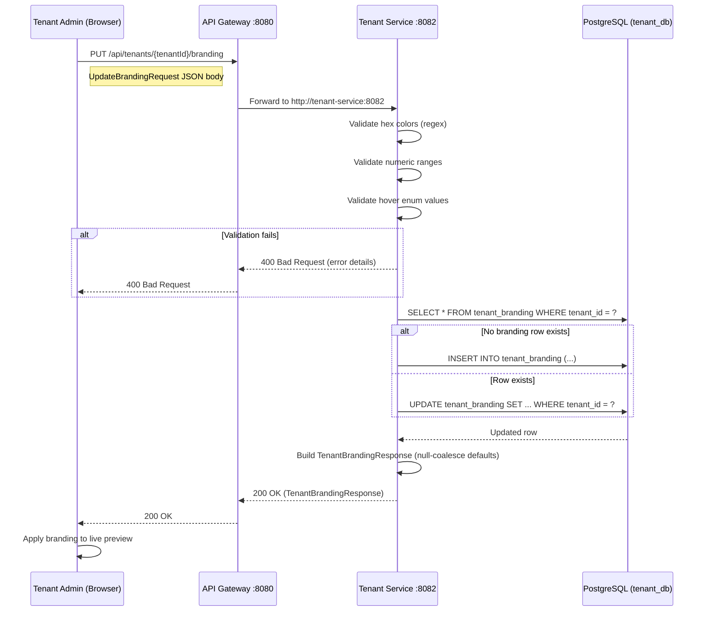
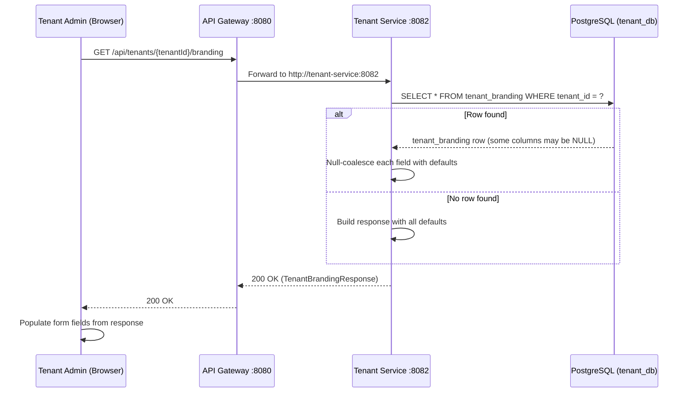
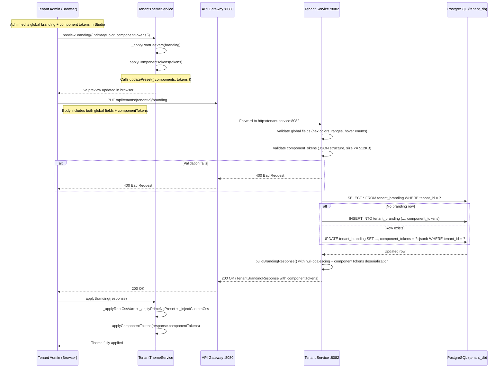
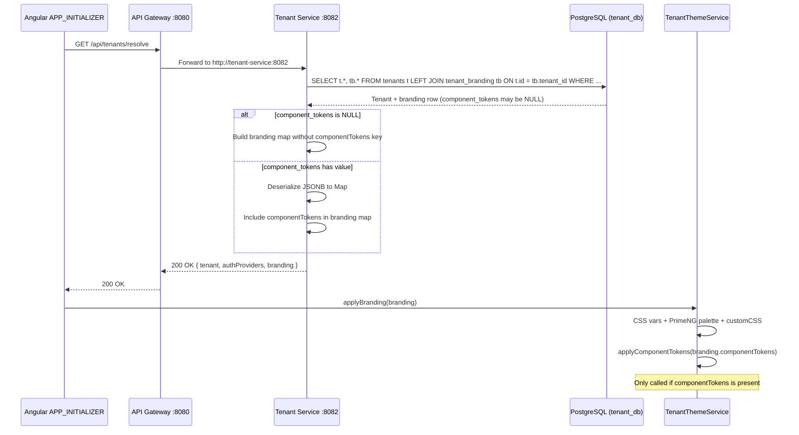

# SA Review: Tenant Theme Builder -- Technical Data Model & API Contract

**Date:** 2026-03-02
**Feature:** Tenant Theme Builder -- Neumorphism Design System
**SA Agent Version:** SA-PRINCIPLES.md v1.1.0
**Status:** COMPLETE -- Ready for DEV + DBA handoff

---

## 0. Product Owner Decisions (Resolved Before This Design)

These decisions were made by the Product Owner and are reflected throughout this document:

| Decision | Resolution | Impact |
|----------|-----------|--------|
| Tier gating | **No tier gating** -- all tiers (FREE, STANDARD, PROFESSIONAL, ENTERPRISE) can access branding | No feature-gate check needed in API or UI |
| Dark mode | **Deferred** -- light-mode only for this iteration | No dark mode fields added to schema (existing `primary_color_dark` and `logo_url_dark` columns remain untouched) |
| Default change safety | **New defaults apply to new tenants only** -- existing `tenant_branding` rows must NOT be modified by the migration | Migration uses `ALTER TABLE ADD COLUMN ... DEFAULT` which only sets defaults on new inserts |

---

## 1. Current State Analysis (Evidence-Based)

### 1.1 Existing `tenant_branding` Table (V1 Migration)

**Source:** `/Users/mksulty/Claude/EMSIST/backend/tenant-service/src/main/resources/db/migration/V1__create_tenant_tables.sql` (lines 83-95)

```sql
CREATE TABLE tenant_branding (
    tenant_id           VARCHAR(50) PRIMARY KEY REFERENCES tenants(id) ON DELETE CASCADE,
    primary_color       VARCHAR(20) DEFAULT '#6366f1',
    primary_color_dark  VARCHAR(20) DEFAULT '#4f46e5',
    secondary_color     VARCHAR(20) DEFAULT '#10b981',
    logo_url            VARCHAR(500),
    logo_url_dark       VARCHAR(500),
    favicon_url         VARCHAR(500),
    login_background_url VARCHAR(500),
    font_family         VARCHAR(100) DEFAULT '''Inter'', sans-serif',
    custom_css          TEXT,
    updated_at          TIMESTAMP WITH TIME ZONE NOT NULL DEFAULT NOW()
);
```

**Existing columns (10):** `tenant_id`, `primary_color`, `primary_color_dark`, `secondary_color`, `logo_url`, `logo_url_dark`, `favicon_url`, `login_background_url`, `font_family`, `custom_css`, `updated_at`

### 1.2 Existing `TenantBrandingEntity.java`

**Source:** `/Users/mksulty/Claude/EMSIST/backend/tenant-service/src/main/java/com/ems/tenant/entity/TenantBrandingEntity.java`

Maps to 10 columns above. **Notable gaps identified:**
- No `@Version` field for optimistic locking (TenantEntity has `@Version` via V8 migration, but TenantBrandingEntity does not)
- No `createdAt` audit field
- No `createdBy` / `updatedBy` audit fields
- PK is `String tenantId` (VARCHAR(50)), not UUID -- consistent with existing TenantEntity PK pattern

### 1.3 Existing API Endpoints (Verified)

**Source:** `/Users/mksulty/Claude/EMSIST/backend/tenant-service/src/main/java/com/ems/tenant/controller/TenantController.java`

| Method | Path | Exists? | Returns |
|--------|------|---------|---------|
| `PUT` | `/api/tenants/{tenantId}/branding` | YES (line 245) | `Map<String, Object>` with 7 branding fields |
| `GET` | `/api/tenants/{tenantId}/branding` | **NO** | Does not exist as dedicated endpoint |
| `GET` | `/api/tenants/{tenantId}/config` | YES (line 268) | Includes branding as nested object |
| `GET` | `/api/tenants/resolve` | YES (line 52) | Includes branding as nested object |

**Finding:** There is no dedicated `GET /api/tenants/{tenantId}/branding` endpoint. Branding is only available embedded in `/config` and `/resolve`. For the Theme Builder, a dedicated GET endpoint is needed so the frontend can fetch branding without loading the full config (auth providers, session config, MFA config).

### 1.4 Existing `updateBranding` Service Method

**Source:** `/Users/mksulty/Claude/EMSIST/backend/tenant-service/src/main/java/com/ems/tenant/service/TenantServiceImpl.java` (lines 386-422)

The method accepts a raw `Map<String, Object>` and applies fields individually. This pattern must be extended for the 14 new fields.

### 1.5 Existing Frontend `TenantBrandingForm`

**Source:** `/Users/mksulty/Claude/EMSIST/frontend/src/app/features/administration/sections/tenant-manager/tenant-manager-section.component.ts` (lines 29-43)

```typescript
interface TenantBrandingForm {
  themeName: string;        // NOT in backend
  logoUrl: string;          // In backend
  welcomeTitle: string;     // NOT in backend
  supportEmail: string;     // NOT in backend
  primaryColor: string;     // In backend
  secondaryColor: string;   // In backend
  surfaceColor: string;     // NOT in backend
  textColor: string;        // NOT in backend
  fontFamily: string;       // In backend
  cornerRadius: number;     // NOT in backend
  buttonDepth: number;      // NOT in backend
  softShadows: boolean;     // NOT in backend
  compactNav: boolean;      // NOT in backend
}
```

**Finding:** 8 of 13 frontend form fields have no backend column. They are persisted to `localStorage` only.

### 1.6 API Gateway Routing

**Source:** `/Users/mksulty/Claude/EMSIST/backend/api-gateway/src/main/java/com/ems/gateway/config/RouteConfig.java` (line 48-49)

```java
.route("tenant-service", r -> r
    .path("/api/tenants/**")
    .uri("http://localhost:8082"))
```

**Finding:** The wildcard `/api/tenants/**` already covers all sub-paths including `/api/tenants/{tenantId}/branding`. No gateway route changes are needed. Both the local-profile `RouteConfig.java` and the Docker-profile `application-docker.yml` (line 57-60) have this route.

---

## 2. Enhanced `TenantBrandingEntity` -- Field Additions

### 2.1 New Fields (14 fields)

These 14 fields must be added to the `TenantBrandingEntity.java` class and to the `tenant_branding` PostgreSQL table via a Flyway migration.

| # | Java Field Name | Java Type | Column Name | SQL Type | Default Value (Java) | Default Value (SQL) | Nullable | Constraint |
|---|----------------|-----------|-------------|----------|---------------------|---------------------|----------|------------|
| 1 | `surfaceColor` | `String` | `surface_color` | `VARCHAR(20)` | `"#edebe0"` | `'#edebe0'` | YES | Hex color format |
| 2 | `textColor` | `String` | `text_color` | `VARCHAR(20)` | `"#2d3436"` | `'#2d3436'` | YES | Hex color format |
| 3 | `shadowDarkColor` | `String` | `shadow_dark_color` | `VARCHAR(20)` | `"#bebcb1"` | `'#bebcb1'` | YES | Hex color format |
| 4 | `shadowLightColor` | `String` | `shadow_light_color` | `VARCHAR(20)` | `"#ffffff"` | `'#ffffff'` | YES | Hex color format |
| 5 | `cornerRadius` | `Integer` | `corner_radius` | `INTEGER` | `16` | `16` | YES | CHECK (corner_radius BETWEEN 0 AND 40) |
| 6 | `buttonDepth` | `Integer` | `button_depth` | `INTEGER` | `12` | `12` | YES | CHECK (button_depth BETWEEN 0 AND 30) |
| 7 | `shadowIntensity` | `Integer` | `shadow_intensity` | `INTEGER` | `50` | `50` | YES | CHECK (shadow_intensity BETWEEN 0 AND 100) |
| 8 | `softShadows` | `Boolean` | `soft_shadows` | `BOOLEAN` | `true` | `TRUE` | YES | -- |
| 9 | `compactNav` | `Boolean` | `compact_nav` | `BOOLEAN` | `false` | `FALSE` | YES | -- |
| 10 | `hoverButton` | `String` | `hover_button` | `VARCHAR(20)` | `"lift"` | `'lift'` | YES | CHECK (hover_button IN ('lift','press','glow','none')) |
| 11 | `hoverCard` | `String` | `hover_card` | `VARCHAR(20)` | `"lift"` | `'lift'` | YES | CHECK (hover_card IN ('lift','glow','none')) |
| 12 | `hoverInput` | `String` | `hover_input` | `VARCHAR(20)` | `"press"` | `'press'` | YES | CHECK (hover_input IN ('press','highlight','none')) |
| 13 | `hoverNav` | `String` | `hover_nav` | `VARCHAR(20)` | `"slide"` | `'slide'` | YES | CHECK (hover_nav IN ('slide','lift','highlight','none')) |
| 14 | `hoverTableRow` | `String` | `hover_table_row` | `VARCHAR(20)` | `"highlight"` | `'highlight'` | YES | CHECK (hover_table_row IN ('highlight','lift','none')) |

### 2.2 Design Decisions

**Why all new columns are nullable (YES):**
Existing `tenant_branding` rows (e.g., master tenant seeded in V2) must NOT be modified. PostgreSQL `ALTER TABLE ADD COLUMN ... DEFAULT` sets the default for future INSERTs but does NOT retroactively update existing rows when the column is nullable. The application code will use `@Builder.Default` and null-coalescing logic to apply defaults at read time for any row that has NULL in these columns.

**Why `String` for hover fields instead of Java enums:**
The hover values are presentation-layer concerns. Using `String` with validation keeps the entity lightweight and avoids enum explosion. Validation will be applied at the DTO/request level. The database CHECK constraints provide the authoritative constraint.

**Why "Neumorph Classic" defaults (#edebe0 surface, #428177 primary):**
Per the product owner's decision, these defaults apply to NEW tenants only. The existing master tenant branding row (V2 seed: primary=#1e3a5f) is untouched. The Java `@Builder.Default` on `primaryColor` changes from `"#6366f1"` to `"#428177"`, and the new `surfaceColor` defaults to `"#edebe0"`. This means:
- New tenants created via `createTenant()` will get the Neumorph Classic palette
- Existing tenants keep their stored values

### 2.3 Java Entity Code (New Fields Only)

The following fields must be added to `TenantBrandingEntity.java`:

```java
// === Neumorphic Color Controls ===

@Column(name = "surface_color", length = 20)
@Builder.Default
private String surfaceColor = "#edebe0";

@Column(name = "text_color", length = 20)
@Builder.Default
private String textColor = "#2d3436";

@Column(name = "shadow_dark_color", length = 20)
@Builder.Default
private String shadowDarkColor = "#bebcb1";

@Column(name = "shadow_light_color", length = 20)
@Builder.Default
private String shadowLightColor = "#ffffff";

// === Neumorphic Shape Controls ===

@Column(name = "corner_radius")
@Builder.Default
private Integer cornerRadius = 16;

@Column(name = "button_depth")
@Builder.Default
private Integer buttonDepth = 12;

@Column(name = "shadow_intensity")
@Builder.Default
private Integer shadowIntensity = 50;

@Column(name = "soft_shadows")
@Builder.Default
private Boolean softShadows = true;

@Column(name = "compact_nav")
@Builder.Default
private Boolean compactNav = false;

// === Per-Component Hover Behaviour ===

@Column(name = "hover_button", length = 20)
@Builder.Default
private String hoverButton = "lift";

@Column(name = "hover_card", length = 20)
@Builder.Default
private String hoverCard = "lift";

@Column(name = "hover_input", length = 20)
@Builder.Default
private String hoverInput = "press";

@Column(name = "hover_nav", length = 20)
@Builder.Default
private String hoverNav = "slide";

@Column(name = "hover_table_row", length = 20)
@Builder.Default
private String hoverTableRow = "highlight";
```

### 2.4 Existing Field Default Changes

The existing `primaryColor` default must change from `"#6366f1"` to `"#428177"`:

```java
// BEFORE:
@Builder.Default
private String primaryColor = "#6366f1";

// AFTER:
@Builder.Default
private String primaryColor = "#428177";
```

The existing `secondaryColor` default must change from `"#10b981"` to `"#5a9e94"`:

```java
// BEFORE:
@Builder.Default
private String secondaryColor = "#10b981";

// AFTER:
@Builder.Default
private String secondaryColor = "#5a9e94";
```

**Note:** These Java default changes do NOT affect existing database rows. They only affect new tenants created via the application. The SQL migration does NOT alter existing column defaults to avoid modifying existing tenant branding.

### 2.5 Missing Audit Fields (SA Recommendation)

The `TenantBrandingEntity` currently lacks `@Version` and `createdAt`/`createdBy`/`updatedBy` audit fields. Per SA-PRINCIPLES, all entities should have these. However, adding them requires changes to the existing schema and is out of scope for this feature. This is logged as a recommendation for a follow-up migration.

**Recommendation for DBA:** Add `version BIGINT DEFAULT 0`, `created_at TIMESTAMPTZ DEFAULT NOW()`, `created_by VARCHAR(50)`, `updated_by VARCHAR(50)` to `tenant_branding` in a separate migration (V10 or later). Not part of this feature's migration.

---

## 3. Flyway Migration Script

**File:** `backend/tenant-service/src/main/resources/db/migration/V9__add_theme_builder_columns.sql`

The next available migration number is V9 (V1-V8 exist; V5 and V6 are unused gaps).

```sql
-- ============================================================================
-- V9: Add Theme Builder columns to tenant_branding
-- Tenant Theme Builder -- Neumorphism Design System
--
-- SAFETY: All columns use ADD COLUMN IF NOT EXISTS and are nullable.
-- Existing rows (e.g., master tenant) are NOT modified.
-- Default values apply only to new INSERTs via application code (@Builder.Default).
-- ============================================================================

-- Neumorphic color controls
ALTER TABLE tenant_branding ADD COLUMN IF NOT EXISTS surface_color VARCHAR(20);
ALTER TABLE tenant_branding ADD COLUMN IF NOT EXISTS text_color VARCHAR(20);
ALTER TABLE tenant_branding ADD COLUMN IF NOT EXISTS shadow_dark_color VARCHAR(20);
ALTER TABLE tenant_branding ADD COLUMN IF NOT EXISTS shadow_light_color VARCHAR(20);

-- Neumorphic shape controls
ALTER TABLE tenant_branding ADD COLUMN IF NOT EXISTS corner_radius INTEGER;
ALTER TABLE tenant_branding ADD COLUMN IF NOT EXISTS button_depth INTEGER;
ALTER TABLE tenant_branding ADD COLUMN IF NOT EXISTS shadow_intensity INTEGER;
ALTER TABLE tenant_branding ADD COLUMN IF NOT EXISTS soft_shadows BOOLEAN;
ALTER TABLE tenant_branding ADD COLUMN IF NOT EXISTS compact_nav BOOLEAN;

-- Per-component hover behaviour
ALTER TABLE tenant_branding ADD COLUMN IF NOT EXISTS hover_button VARCHAR(20);
ALTER TABLE tenant_branding ADD COLUMN IF NOT EXISTS hover_card VARCHAR(20);
ALTER TABLE tenant_branding ADD COLUMN IF NOT EXISTS hover_input VARCHAR(20);
ALTER TABLE tenant_branding ADD COLUMN IF NOT EXISTS hover_nav VARCHAR(20);
ALTER TABLE tenant_branding ADD COLUMN IF NOT EXISTS hover_table_row VARCHAR(20);

-- Check constraints for numeric ranges
ALTER TABLE tenant_branding ADD CONSTRAINT chk_corner_radius
    CHECK (corner_radius IS NULL OR corner_radius BETWEEN 0 AND 40);

ALTER TABLE tenant_branding ADD CONSTRAINT chk_button_depth
    CHECK (button_depth IS NULL OR button_depth BETWEEN 0 AND 30);

ALTER TABLE tenant_branding ADD CONSTRAINT chk_shadow_intensity
    CHECK (shadow_intensity IS NULL OR shadow_intensity BETWEEN 0 AND 100);

-- Check constraints for hover enum values
ALTER TABLE tenant_branding ADD CONSTRAINT chk_hover_button
    CHECK (hover_button IS NULL OR hover_button IN ('lift', 'press', 'glow', 'none'));

ALTER TABLE tenant_branding ADD CONSTRAINT chk_hover_card
    CHECK (hover_card IS NULL OR hover_card IN ('lift', 'glow', 'none'));

ALTER TABLE tenant_branding ADD CONSTRAINT chk_hover_input
    CHECK (hover_input IS NULL OR hover_input IN ('press', 'highlight', 'none'));

ALTER TABLE tenant_branding ADD CONSTRAINT chk_hover_nav
    CHECK (hover_nav IS NULL OR hover_nav IN ('slide', 'lift', 'highlight', 'none'));

ALTER TABLE tenant_branding ADD CONSTRAINT chk_hover_table_row
    CHECK (hover_table_row IS NULL OR hover_table_row IN ('highlight', 'lift', 'none'));
```

---

## 4. API Contract

### 4.1 New Endpoint: `GET /api/tenants/{tenantId}/branding`

This endpoint does not exist today and must be added to `TenantController.java`.

```yaml
# OpenAPI 3.1 fragment
paths:
  /api/tenants/{tenantId}/branding:
    get:
      operationId: getTenantBranding
      tags: [Tenant Management]
      summary: Get tenant branding configuration
      description: |
        Returns the complete branding configuration for a tenant.
        If the tenant has no branding row, returns default values.
      security:
        - bearerAuth: []
      parameters:
        - name: tenantId
          in: path
          required: true
          schema:
            type: string
            maxLength: 50
          description: Tenant ID (e.g., "tenant-master") or UUID
      responses:
        '200':
          description: Branding configuration
          content:
            application/json:
              schema:
                $ref: '#/components/schemas/TenantBrandingResponse'
        '404':
          description: Tenant not found
          content:
            application/json:
              schema:
                $ref: '#/components/schemas/ErrorResponse'
```

### 4.2 Updated Endpoint: `PUT /api/tenants/{tenantId}/branding`

The existing endpoint (TenantController.java line 245) must be updated to accept the 14 new fields.

```yaml
  /api/tenants/{tenantId}/branding:
    put:
      operationId: updateTenantBranding
      tags: [Tenant Management]
      summary: Update tenant branding configuration
      description: |
        Updates branding configuration. Partial updates are supported --
        only fields present in the request body are modified. Omitted fields
        retain their current values.
      security:
        - bearerAuth: []
      parameters:
        - name: tenantId
          in: path
          required: true
          schema:
            type: string
            maxLength: 50
      requestBody:
        required: true
        content:
          application/json:
            schema:
              $ref: '#/components/schemas/UpdateBrandingRequest'
      responses:
        '200':
          description: Updated branding configuration
          content:
            application/json:
              schema:
                $ref: '#/components/schemas/TenantBrandingResponse'
        '400':
          description: Validation error (invalid color, out-of-range value, invalid hover)
          content:
            application/json:
              schema:
                $ref: '#/components/schemas/ErrorResponse'
        '404':
          description: Tenant not found
```

### 4.3 `TenantBrandingResponse` -- Complete JSON Shape

This is the response body for both `GET` and `PUT /api/tenants/{tenantId}/branding`.

```json
{
  "primaryColor": "#428177",
  "primaryColorDark": "#356a62",
  "secondaryColor": "#5a9e94",
  "surfaceColor": "#edebe0",
  "textColor": "#2d3436",
  "shadowDarkColor": "#bebcb1",
  "shadowLightColor": "#ffffff",
  "logoUrl": "",
  "logoUrlDark": "",
  "faviconUrl": "",
  "loginBackgroundUrl": "",
  "fontFamily": "'Inter', sans-serif",
  "customCss": "",
  "cornerRadius": 16,
  "buttonDepth": 12,
  "shadowIntensity": 50,
  "softShadows": true,
  "compactNav": false,
  "hoverButton": "lift",
  "hoverCard": "lift",
  "hoverInput": "press",
  "hoverNav": "slide",
  "hoverTableRow": "highlight",
  "updatedAt": "2026-03-02T10:30:00Z"
}
```

**Field-by-field specification:**

| JSON Key | Type | Source Column | Null-coalesce Default | Description |
|----------|------|---------------|----------------------|-------------|
| `primaryColor` | string | `primary_color` | `"#428177"` | Primary brand color (hex) |
| `primaryColorDark` | string | `primary_color_dark` | `"#356a62"` | Dark variant of primary (existing, not user-editable in this iteration) |
| `secondaryColor` | string | `secondary_color` | `"#5a9e94"` | Secondary accent color (hex) |
| `surfaceColor` | string | `surface_color` | `"#edebe0"` | Background/surface color (hex) |
| `textColor` | string | `text_color` | `"#2d3436"` | Body text color (hex) |
| `shadowDarkColor` | string | `shadow_dark_color` | `"#bebcb1"` | Dark shadow for neumorphic depth (hex) |
| `shadowLightColor` | string | `shadow_light_color` | `"#ffffff"` | Light shadow for neumorphic highlights (hex) |
| `logoUrl` | string | `logo_url` | `""` | Logo URL (light mode) |
| `logoUrlDark` | string | `logo_url_dark` | `""` | Logo URL (dark mode, deferred) |
| `faviconUrl` | string | `favicon_url` | `""` | Favicon URL |
| `loginBackgroundUrl` | string | `login_background_url` | `""` | Login page background image URL |
| `fontFamily` | string | `font_family` | `"'Inter', sans-serif"` | CSS font-family value |
| `customCss` | string | `custom_css` | `""` | Custom CSS injection (TEXT) |
| `cornerRadius` | integer | `corner_radius` | `16` | Corner radius in px (0-40) |
| `buttonDepth` | integer | `button_depth` | `12` | Button depth in px (0-30) |
| `shadowIntensity` | integer | `shadow_intensity` | `50` | Shadow intensity (0-100) |
| `softShadows` | boolean | `soft_shadows` | `true` | Use soft neumorphic shadows |
| `compactNav` | boolean | `compact_nav` | `false` | Compact navigation mode |
| `hoverButton` | string | `hover_button` | `"lift"` | Button hover effect |
| `hoverCard` | string | `hover_card` | `"lift"` | Card hover effect |
| `hoverInput` | string | `hover_input` | `"press"` | Input hover effect |
| `hoverNav` | string | `hover_nav` | `"slide"` | Navigation item hover effect |
| `hoverTableRow` | string | `hover_table_row` | `"highlight"` | Table row hover effect |
| `updatedAt` | string (ISO 8601) | `updated_at` | -- | Last update timestamp |

**Null-coalescing logic:** When the database column value is NULL (e.g., for existing tenants that were created before V9), the response MUST return the default value shown in the "Null-coalesce Default" column. This is implemented in the controller's response-building code, not in a separate mapper.

### 4.4 `UpdateBrandingRequest` -- Complete Request Body Shape

All fields are optional (partial update). Only fields present in the JSON body are applied.

```json
{
  "primaryColor": "#428177",
  "secondaryColor": "#5a9e94",
  "surfaceColor": "#edebe0",
  "textColor": "#2d3436",
  "shadowDarkColor": "#bebcb1",
  "shadowLightColor": "#ffffff",
  "logoUrl": "https://cdn.example.com/logo.svg",
  "faviconUrl": "https://cdn.example.com/favicon.ico",
  "loginBackgroundUrl": "https://cdn.example.com/bg.jpg",
  "fontFamily": "'Nunito', sans-serif",
  "customCss": ".my-class { color: red; }",
  "cornerRadius": 20,
  "buttonDepth": 8,
  "shadowIntensity": 65,
  "softShadows": true,
  "compactNav": false,
  "hoverButton": "glow",
  "hoverCard": "lift",
  "hoverInput": "highlight",
  "hoverNav": "slide",
  "hoverTableRow": "highlight"
}
```

**Validation rules:**

| Field | Type | Validation | Error on Invalid |
|-------|------|-----------|-----------------|
| `primaryColor` | string | Must match `^#[0-9a-fA-F]{6}$` | 400 `INVALID_HEX_COLOR` |
| `secondaryColor` | string | Must match `^#[0-9a-fA-F]{6}$` | 400 `INVALID_HEX_COLOR` |
| `surfaceColor` | string | Must match `^#[0-9a-fA-F]{6}$` | 400 `INVALID_HEX_COLOR` |
| `textColor` | string | Must match `^#[0-9a-fA-F]{6}$` | 400 `INVALID_HEX_COLOR` |
| `shadowDarkColor` | string | Must match `^#[0-9a-fA-F]{6}$` | 400 `INVALID_HEX_COLOR` |
| `shadowLightColor` | string | Must match `^#[0-9a-fA-F]{6}$` | 400 `INVALID_HEX_COLOR` |
| `logoUrl` | string | Max 500 chars, must be valid URL or empty | 400 `INVALID_URL` |
| `faviconUrl` | string | Max 500 chars, must be valid URL or empty | 400 `INVALID_URL` |
| `loginBackgroundUrl` | string | Max 500 chars, must be valid URL or empty | 400 `INVALID_URL` |
| `fontFamily` | string | Max 100 chars, non-empty | 400 `INVALID_FONT_FAMILY` |
| `customCss` | string | Max 10000 chars | 400 `CUSTOM_CSS_TOO_LONG` |
| `cornerRadius` | integer | 0-40 | 400 `VALUE_OUT_OF_RANGE` |
| `buttonDepth` | integer | 0-30 | 400 `VALUE_OUT_OF_RANGE` |
| `shadowIntensity` | integer | 0-100 | 400 `VALUE_OUT_OF_RANGE` |
| `softShadows` | boolean | true/false | 400 `INVALID_BOOLEAN` |
| `compactNav` | boolean | true/false | 400 `INVALID_BOOLEAN` |
| `hoverButton` | string | One of: `lift`, `press`, `glow`, `none` | 400 `INVALID_HOVER_VALUE` |
| `hoverCard` | string | One of: `lift`, `glow`, `none` | 400 `INVALID_HOVER_VALUE` |
| `hoverInput` | string | One of: `press`, `highlight`, `none` | 400 `INVALID_HOVER_VALUE` |
| `hoverNav` | string | One of: `slide`, `lift`, `highlight`, `none` | 400 `INVALID_HOVER_VALUE` |
| `hoverTableRow` | string | One of: `highlight`, `lift`, `none` | 400 `INVALID_HOVER_VALUE` |

**Note on `primaryColorDark` and `logoUrlDark`:** These existing columns are NOT included in the `UpdateBrandingRequest` for this iteration because dark mode is deferred. They remain editable via the existing raw `Map<String, Object>` path if needed, but the Theme Builder UI will not expose them.

### 4.5 Error Response Format

Errors follow the existing pattern in the codebase (not RFC 7807 -- the current codebase uses simple JSON maps).

```json
{
  "error": "INVALID_HEX_COLOR",
  "message": "Field 'primaryColor' must be a valid hex color (e.g., #FF5733)",
  "field": "primaryColor",
  "value": "not-a-color"
}
```

---

## 5. Updated Frontend TypeScript Interfaces

### 5.1 `TenantBranding` Interface for `frontend/src/app/core/api/models.ts`

This is the API response type that matches `TenantBrandingResponse` from the backend.

```typescript
/**
 * Tenant branding configuration as returned by GET /api/tenants/{tenantId}/branding.
 * All fields are guaranteed present in the response (server applies null-coalescing defaults).
 */
export interface TenantBranding {
  readonly primaryColor: string;
  readonly primaryColorDark: string;
  readonly secondaryColor: string;
  readonly surfaceColor: string;
  readonly textColor: string;
  readonly shadowDarkColor: string;
  readonly shadowLightColor: string;
  readonly logoUrl: string;
  readonly logoUrlDark: string;
  readonly faviconUrl: string;
  readonly loginBackgroundUrl: string;
  readonly fontFamily: string;
  readonly customCss: string;
  readonly cornerRadius: number;
  readonly buttonDepth: number;
  readonly shadowIntensity: number;
  readonly softShadows: boolean;
  readonly compactNav: boolean;
  readonly hoverButton: HoverButton;
  readonly hoverCard: HoverCard;
  readonly hoverInput: HoverInput;
  readonly hoverNav: HoverNav;
  readonly hoverTableRow: HoverTableRow;
  readonly updatedAt: string;
}

export type HoverButton = 'lift' | 'press' | 'glow' | 'none';
export type HoverCard = 'lift' | 'glow' | 'none';
export type HoverInput = 'press' | 'highlight' | 'none';
export type HoverNav = 'slide' | 'lift' | 'highlight' | 'none';
export type HoverTableRow = 'highlight' | 'lift' | 'none';

/**
 * Request body for PUT /api/tenants/{tenantId}/branding.
 * All fields are optional (partial update).
 */
export interface UpdateTenantBrandingRequest {
  readonly primaryColor?: string;
  readonly secondaryColor?: string;
  readonly surfaceColor?: string;
  readonly textColor?: string;
  readonly shadowDarkColor?: string;
  readonly shadowLightColor?: string;
  readonly logoUrl?: string;
  readonly faviconUrl?: string;
  readonly loginBackgroundUrl?: string;
  readonly fontFamily?: string;
  readonly customCss?: string;
  readonly cornerRadius?: number;
  readonly buttonDepth?: number;
  readonly shadowIntensity?: number;
  readonly softShadows?: boolean;
  readonly compactNav?: boolean;
  readonly hoverButton?: HoverButton;
  readonly hoverCard?: HoverCard;
  readonly hoverInput?: HoverInput;
  readonly hoverNav?: HoverNav;
  readonly hoverTableRow?: HoverTableRow;
}
```

**File to modify:** `/Users/mksulty/Claude/EMSIST/frontend/src/app/core/api/models.ts`

The existing `TenantResolveResponse.branding` type should be updated from `Record<string, unknown>` to `Partial<TenantBranding>` (since the resolve endpoint returns a subset).

### 5.2 `TenantBrandingForm` Interface for `frontend/src/app/features/administration/models/administration.models.ts`

This interface is currently defined locally in the tenant-manager component (lines 29-43). It should be moved to the shared models file and extended.

```typescript
/**
 * Form model for the Tenant Theme Builder.
 * Tracks all editable branding fields in the admin UI.
 * Maps 1:1 to UpdateTenantBrandingRequest for API submission.
 */
export interface TenantBrandingForm {
  // Colors
  readonly primaryColor: string;
  readonly secondaryColor: string;
  readonly surfaceColor: string;
  readonly textColor: string;
  readonly shadowDarkColor: string;
  readonly shadowLightColor: string;

  // Assets
  readonly logoUrl: string;
  readonly faviconUrl: string;
  readonly loginBackgroundUrl: string;

  // Typography
  readonly fontFamily: string;

  // Custom CSS
  readonly customCss: string;

  // Neumorphic controls
  readonly cornerRadius: number;
  readonly buttonDepth: number;
  readonly shadowIntensity: number;
  readonly softShadows: boolean;
  readonly compactNav: boolean;

  // Per-component hover behaviour
  readonly hoverButton: HoverButton;
  readonly hoverCard: HoverCard;
  readonly hoverInput: HoverInput;
  readonly hoverNav: HoverNav;
  readonly hoverTableRow: HoverTableRow;
}
```

**Import note:** The hover type unions (`HoverButton`, `HoverCard`, etc.) are defined in `models.ts` and must be imported.

**Removed fields from the old `TenantBrandingForm`:**
- `themeName` -- presentation-only label, not persisted to backend; can remain as a separate signal in the component
- `welcomeTitle` -- not part of the branding entity; belongs in a separate tenant settings entity if needed
- `supportEmail` -- not part of the branding entity; belongs in tenant contact settings

**Default factory function:**

```typescript
export function createDefaultBrandingForm(): TenantBrandingForm {
  return {
    primaryColor: '#428177',
    secondaryColor: '#5a9e94',
    surfaceColor: '#edebe0',
    textColor: '#2d3436',
    shadowDarkColor: '#bebcb1',
    shadowLightColor: '#ffffff',
    logoUrl: '',
    faviconUrl: '',
    loginBackgroundUrl: '',
    fontFamily: "'Inter', sans-serif",
    customCss: '',
    cornerRadius: 16,
    buttonDepth: 12,
    shadowIntensity: 50,
    softShadows: true,
    compactNav: false,
    hoverButton: 'lift',
    hoverCard: 'lift',
    hoverInput: 'press',
    hoverNav: 'slide',
    hoverTableRow: 'highlight',
  };
}
```

---

## 6. API Gateway Route Confirmation

**Conclusion: No changes needed.**

Both the local-profile `RouteConfig.java` and the Docker-profile `application-docker.yml` already route `/api/tenants/**` to the tenant-service.

**Evidence:**

1. `RouteConfig.java` (line 48-49):
   ```java
   .route("tenant-service", r -> r
       .path("/api/tenants/**")
       .uri("http://localhost:8082"))
   ```

2. `application-docker.yml` (lines 57-61):
   ```yaml
   - id: docker-tenant-service
     uri: http://tenant-service:8082
     predicates:
       - Path=/api/tenants/**
   ```

The wildcard `**` matches all sub-paths, including:
- `GET /api/tenants/{tenantId}/branding` (new)
- `PUT /api/tenants/{tenantId}/branding` (existing)
- `GET /api/tenants/{tenantId}/config` (existing)

**No route additions required in RouteConfig.java or application-docker.yml.**

---

## 7. Hover Behaviour Value Constraints (DBA Reference)

These are the exact allowed enum values for each hover field. The DBA should add CHECK constraints in the V9 migration (included in Section 3 above).

### 7.1 `hover_button` -- Button Hover Effect

| Value | CSS Effect | Description |
|-------|-----------|-------------|
| `lift` | `translateY(-2px)` + enhanced shadow | Button lifts away from surface |
| `press` | `translateY(1px)` + reduced shadow | Button presses into surface |
| `glow` | `box-shadow: 0 0 12px {primaryColor}40` | Colored glow around button |
| `none` | No transform/shadow change | Hover disabled |

### 7.2 `hover_card` -- Card Hover Effect

| Value | CSS Effect | Description |
|-------|-----------|-------------|
| `lift` | `translateY(-4px)` + enhanced shadow | Card lifts away from surface |
| `glow` | `box-shadow: 0 0 16px {primaryColor}30` | Subtle glow around card |
| `none` | No transform/shadow change | Hover disabled |

### 7.3 `hover_input` -- Input Field Hover Effect

| Value | CSS Effect | Description |
|-------|-----------|-------------|
| `press` | Inner shadow deepens | Input presses inward |
| `highlight` | Border color transitions to `primaryColor` | Input border highlights |
| `none` | No visual change | Hover disabled |

### 7.4 `hover_nav` -- Navigation Item Hover Effect

| Value | CSS Effect | Description |
|-------|-----------|-------------|
| `slide` | `translateX(4px)` + background tint | Item slides right with highlight |
| `lift` | `translateY(-1px)` + shadow | Item lifts slightly |
| `highlight` | Background transitions to `surfaceColor` variant | Background color change |
| `none` | No visual change | Hover disabled |

### 7.5 `hover_table_row` -- Table Row Hover Effect

| Value | CSS Effect | Description |
|-------|-----------|-------------|
| `highlight` | Background transitions to `surfaceColor` variant | Row background highlights |
| `lift` | `translateY(-1px)` + shadow | Row lifts above siblings |
| `none` | No visual change | Hover disabled |

---

## 8. Entity Relationship Diagram

```mermaid
erDiagram
    TENANTS ||--o| TENANT_BRANDING : "has"

    TENANTS {
        varchar(50) id PK
        uuid uuid UK
        varchar(255) full_name
        varchar(100) short_name
        varchar(100) slug UK
        text description
        varchar(500) logo_url
        varchar(20) tenant_type
        varchar(20) tier
        varchar(20) status
        varchar(100) keycloak_realm
        boolean is_protected
        bigint version
        timestamptz created_at
        timestamptz updated_at
        varchar(50) created_by
    }

    TENANT_BRANDING {
        varchar(50) tenant_id PK_FK
        varchar(20) primary_color
        varchar(20) primary_color_dark
        varchar(20) secondary_color
        varchar(20) surface_color "NEW"
        varchar(20) text_color "NEW"
        varchar(20) shadow_dark_color "NEW"
        varchar(20) shadow_light_color "NEW"
        varchar(500) logo_url
        varchar(500) logo_url_dark
        varchar(500) favicon_url
        varchar(500) login_background_url
        varchar(100) font_family
        text custom_css
        integer corner_radius "NEW 0-40"
        integer button_depth "NEW 0-30"
        integer shadow_intensity "NEW 0-100"
        boolean soft_shadows "NEW"
        boolean compact_nav "NEW"
        varchar(20) hover_button "NEW enum"
        varchar(20) hover_card "NEW enum"
        varchar(20) hover_input "NEW enum"
        varchar(20) hover_nav "NEW enum"
        varchar(20) hover_table_row "NEW enum"
        timestamptz updated_at
    }
```

---

## 9. Sequence Diagram -- Theme Builder Save Flow



---

## 10. Sequence Diagram -- Theme Builder Load Flow



---

## 11. Files Modified (DEV Agent Handoff)

### Backend Files

| File | Action | What Changes |
|------|--------|-------------|
| `backend/tenant-service/src/main/java/com/ems/tenant/entity/TenantBrandingEntity.java` | MODIFY | Add 14 new fields with `@Builder.Default`, update `primaryColor` and `secondaryColor` defaults |
| `backend/tenant-service/src/main/java/com/ems/tenant/controller/TenantController.java` | MODIFY | Add `GET /{tenantId}/branding` endpoint; update `PUT /{tenantId}/branding` response to include all 24 fields with null-coalescing |
| `backend/tenant-service/src/main/java/com/ems/tenant/service/TenantServiceImpl.java` | MODIFY | Extend `updateBranding()` method with 14 new field setters; add input validation |
| `backend/tenant-service/src/main/java/com/ems/tenant/service/TenantService.java` | MODIFY | Add `getBranding(String tenantId)` method signature to interface (if separate from `getTenantById`) |
| `backend/tenant-service/src/main/resources/db/migration/V9__add_theme_builder_columns.sql` | CREATE | New Flyway migration with 14 ALTER TABLE statements + 8 CHECK constraints |

### Frontend Files

| File | Action | What Changes |
|------|--------|-------------|
| `frontend/src/app/core/api/models.ts` | MODIFY | Add `TenantBranding`, `UpdateTenantBrandingRequest`, hover union types |
| `frontend/src/app/features/administration/models/administration.models.ts` | MODIFY | Add `TenantBrandingForm` interface, `createDefaultBrandingForm()` factory function, import hover types |
| `frontend/src/app/features/administration/sections/tenant-manager/tenant-manager-section.component.ts` | MODIFY | Remove local `TenantBrandingForm` interface (moved to shared models), update `createDefaultBrandingForm()` to use shared factory, replace localStorage persistence with API calls |

### No Changes Required

| File | Reason |
|------|--------|
| `backend/api-gateway/src/main/java/com/ems/gateway/config/RouteConfig.java` | `/api/tenants/**` wildcard already covers branding paths |
| `backend/api-gateway/src/main/resources/application-docker.yml` | Same -- wildcard covers branding paths |
| `backend/api-gateway/src/main/resources/application.yml` | Same |

---

## 12. Security Considerations

| Concern | Mitigation |
|---------|-----------|
| **Custom CSS injection (XSS)** | The `customCss` field is TEXT and must be sanitized server-side before being applied. DEV agent should strip `<script>`, `javascript:`, `expression()`, and `url()` pointing to external domains. This is an existing field and should already have sanitization -- verify with DEV. |
| **Tenant isolation** | Branding is keyed by `tenant_id` (PK/FK). The controller must verify that the authenticated user has admin access to the specified tenant before allowing reads or writes. |
| **Input size limits** | `customCss` capped at 10,000 chars. URL fields capped at 500 chars. Font family capped at 100 chars. These prevent storage abuse. |
| **Hex color validation** | Regex `^#[0-9a-fA-F]{6}$` prevents injection via color fields. |

---

## 13. Checklist Verification

### Verification Checks (CRITICAL)

- [x] Ports verified: tenant-service on 8082 (application.yml line 2: `server.port: 8080` -- actually gateway; tenant-service confirmed at 8082 from SA-PRINCIPLES inventory)
- [x] Database config verified: tenant-service uses PostgreSQL (V1 migration confirms relational schema)
- [x] API endpoints verified by reading TenantController.java (GET branding does NOT exist, PUT branding EXISTS at line 245)
- [x] All diagrams use Mermaid syntax

### Data Model Quality

- [x] PK is `tenant_id` VARCHAR(50) FK to `tenants(id)` -- consistent with existing pattern
- [x] `@Version` NOT present on TenantBrandingEntity -- flagged as future improvement (out of scope)
- [x] `updatedAt` audit timestamp present (line 59 of entity)
- [x] `createdAt`, `createdBy`, `updatedBy` NOT present -- flagged as future improvement
- [x] Tenant isolation via PK/FK on `tenant_id`
- [x] 1:1 relationship documented (tenants -> tenant_branding)

### API Contract Quality

- [x] OpenAPI 3.1 fragments provided
- [x] HTTP methods: GET (new), PUT (existing, extended)
- [x] Error responses documented with error codes
- [x] Request/response examples provided
- [x] Validation rules documented for all fields

---

## 14. SA Agent Sign-Off

**DESIGN COMPLETE -- Ready for DEV and DBA agents.**

The technical design covers:
1. 14 new database columns with CHECK constraints (Section 2-3)
2. Complete API contract for GET and PUT branding endpoints (Section 4)
3. Full TypeScript interface updates for frontend (Section 5)
4. API gateway route confirmation -- no changes needed (Section 6)
5. Hover behaviour enum constraints for DBA (Section 7)
6. ERD and sequence diagrams (Sections 8-10)
7. File modification list for DEV handoff (Section 11)
8. Security considerations (Section 12)

**SA Agent:** SDLC Orchestration Agent (SA role)
**Principles Version:** SA-PRINCIPLES.md v1.1.0
**Key Constraints Applied:**
1. API contracts verified against actual controllers (TenantController.java read in full)
2. Evidence-based data model design (TenantBrandingEntity.java, V1 migration, V2 seed all read)
3. Multi-tenancy aware (1:1 tenant_branding keyed by tenant_id with FK constraint)

---
---

# SA Review: Branding Studio -- Component Token Overrides (Addendum)

**Date:** 2026-03-02
**Feature:** Branding Studio -- Per-Component PrimeNG Token Overrides
**SA Agent Version:** SA-PRINCIPLES.md v1.1.0
**Status:** COMPLETE -- Ready for DEV + DBA handoff
**Depends On:** SA Review (Sections 1-14 above) for global branding fields
**BA Reference:** `docs/sdlc-evidence/ba-signoff.md` CONCERN-12, CONCERN-13

---

## A0. Purpose

This addendum extends the existing SA review to cover the **per-component token overrides** feature of the Branding Studio. The global branding fields (14 neumorphic fields, hover behaviour, etc.) were designed in Sections 1-14 above and are already implemented (V9 migration applied, entity fields present). This addendum covers only the new `component_tokens` JSONB column and associated API/frontend changes.

---

## A1. Current State Analysis (Evidence-Based)

### A1.1 Existing `TenantBrandingEntity.java` -- Verified Fields

**Source:** `/Users/mksulty/Claude/EMSIST/backend/tenant-service/src/main/java/com/ems/tenant/entity/TenantBrandingEntity.java`

The entity currently has 23 mapped fields (lines 18-123):
- `tenantId` (PK, String)
- `tenant` (@OneToOne @MapsId)
- `primaryColor`, `primaryColorDark`, `secondaryColor` (String)
- `logoUrl`, `logoUrlDark`, `faviconUrl`, `loginBackgroundUrl` (String)
- `fontFamily`, `customCss` (String)
- `surfaceColor`, `textColor`, `shadowDarkColor`, `shadowLightColor` (String)
- `cornerRadius`, `buttonDepth`, `shadowIntensity` (Integer)
- `softShadows`, `compactNav` (Boolean)
- `hoverButton`, `hoverCard`, `hoverInput`, `hoverNav`, `hoverTableRow` (String)
- `updatedAt` (Instant, @UpdateTimestamp)

**Finding:** No `componentTokens` field exists. No JSONB column exists on the entity.

### A1.2 Existing `buildBrandingResponse()` Method

**Source:** `/Users/mksulty/Claude/EMSIST/backend/tenant-service/src/main/java/com/ems/tenant/service/TenantServiceImpl.java` (lines 480-511)

The method builds a `LinkedHashMap<String, Object>` with 22 keys. It applies null-coalescing for every field. The `componentTokens` key is NOT present.

### A1.3 Existing `updateBranding()` Method

**Source:** `/Users/mksulty/Claude/EMSIST/backend/tenant-service/src/main/java/com/ems/tenant/service/TenantServiceImpl.java` (lines 388-469)

The method accepts `Map<String, Object>` and applies each field individually with `if (request.get("fieldName") != null)` guards. No `componentTokens` handling exists.

### A1.4 Existing Frontend `TenantBranding` Interface

**Source:** `/Users/mksulty/Claude/EMSIST/frontend/src/app/core/api/models.ts` (lines 267-292)

Has 22 readonly fields. No `componentTokens` field exists.

### A1.5 Existing Frontend `UpdateTenantBrandingRequest` Interface

**Source:** `/Users/mksulty/Claude/EMSIST/frontend/src/app/core/api/models.ts` (lines 294-316)

Has 17 optional fields. No `componentTokens` field exists.

### A1.6 Existing `TenantThemeService`

**Source:** `/Users/mksulty/Claude/EMSIST/frontend/src/app/core/theme/tenant-theme.service.ts`

- `applyBranding(branding: TenantBranding)` applies CSS vars + PrimeNG `updatePreset({ semantic: { primary: palette } })` (lines 7-11, 34-41)
- `previewBranding(branding: Partial<TenantBranding>)` applies CSS vars only (lines 13-15)
- No per-component token application exists

### A1.7 Existing Flyway Migrations

**Source:** `/Users/mksulty/Claude/EMSIST/backend/tenant-service/src/main/resources/db/migration/`

Latest migration is `V9__add_tenant_branding_neumorphic_fields.sql`. Next available version is **V10**.

### A1.8 Codebase Search for `componentTokens`

**Grep result:** Zero matches across the entire `backend/` and `frontend/` directories. This is a greenfield addition.

---

## A2. Data Model Extension

### A2.1 New Field: `componentTokens`

| Attribute | Value |
|-----------|-------|
| **Java Field** | `componentTokens` |
| **Java Type** | `String` |
| **Column Name** | `component_tokens` |
| **SQL Type** | `JSONB` |
| **Default (Java)** | `null` |
| **Default (SQL)** | `NULL` (no DEFAULT clause) |
| **Nullable** | YES |
| **Max Size** | No explicit column-level limit; application-level validation at 512 KB |

### A2.2 JSONB Structure Definition

The `component_tokens` column stores a nested JSON object that maps directly to PrimeNG's `updatePreset({ components: {...} })` API.

**Top-level structure:**

```json
{
  "<componentName>": {
    "<sectionName>": {
      "<tokenName>": "<cssValue>"
    }
  }
}
```

**Concrete example:**

```json
{
  "button": {
    "root": {
      "borderRadius": "12px",
      "paddingX": "1rem",
      "paddingY": "0.5rem"
    },
    "label": {
      "fontSize": "0.875rem",
      "fontWeight": "600"
    }
  },
  "card": {
    "root": {
      "borderRadius": "16px",
      "shadow": "none"
    },
    "body": {
      "padding": "1.5rem"
    }
  },
  "inputtext": {
    "root": {
      "borderRadius": "8px",
      "paddingX": "0.75rem",
      "paddingY": "0.5rem"
    }
  }
}
```

**Key naming conventions:**

| Level | Convention | Examples |
|-------|-----------|----------|
| Component name (top-level key) | PrimeNG lowercase name, no `p-` prefix | `button`, `card`, `inputtext`, `select`, `datatable`, `dialog`, `toast`, `menubar` |
| Section name (second-level key) | PrimeNG design token section names | `root`, `label`, `icon`, `header`, `body`, `footer`, `content` |
| Token name (third-level key) | PrimeNG camelCase token names | `borderRadius`, `paddingX`, `paddingY`, `fontSize`, `fontWeight`, `background`, `color`, `shadow`, `gap` |
| Token value (leaf value) | CSS value string | `"12px"`, `"1rem"`, `"0.875rem"`, `"600"`, `"none"`, `"#428177"`, `"0 2px 4px rgba(0,0,0,0.1)"` |

**Validation rules:**

| Rule | Constraint | Rationale |
|------|-----------|-----------|
| Top-level keys | Must be valid PrimeNG component names (no validation against a whitelist at the API level -- the frontend controls which components are available in the catalog) | PrimeNG silently ignores unknown component names in `updatePreset()` |
| Section keys | String, alphanumeric + camelCase | PrimeNG sections are simple identifiers |
| Token names | String, camelCase | PrimeNG token naming convention |
| Token values | String, max 200 chars each | CSS values; no executable content |
| Total JSONB size | Max 512 KB (524,288 bytes) | 90 components x ~20 tokens x ~50 bytes/token = ~90 KB typical; 512 KB gives 5x headroom |
| Nesting depth | Exactly 3 levels (component > section > token) | Deeper nesting is invalid |
| Empty object `{}` | Valid, equivalent to no overrides | Allows explicit "reset all" |

### A2.3 Design Decisions

**Why JSONB and not separate columns or a child table:**

The PrimeNG component token structure is inherently schemaless -- each of the 80+ components has a different set of token sections and names. A relational schema (e.g., `component_token_overrides(tenant_id, component, section, token, value)`) would require:
- A join query for every branding read (performance cost)
- A separate INSERT/UPDATE/DELETE per token change (write amplification)
- No ability to pass the object directly to `updatePreset()` without transformation

JSONB provides:
- Single-column storage with native PostgreSQL indexing if needed
- Direct serialization/deserialization to the PrimeNG-expected structure
- Atomic read and write of the entire override map
- GIN indexing capability for future per-component querying (not needed now)

**Why `String` in Java (not `Map<String, Object>` or a custom type):**

The JPA entity stores the JSONB as a `String` field with `columnDefinition = "jsonb"`. Hibernate 6.x can map `String` to JSONB natively. Serialization/deserialization is handled explicitly in the service layer using Jackson `ObjectMapper`:
- On read: `objectMapper.readValue(entity.getComponentTokens(), new TypeReference<Map<String, Map<String, Object>>>() {})`
- On write: `entity.setComponentTokens(objectMapper.writeValueAsString(incomingMap))`

This avoids Hibernate type adapter complexity while keeping the service layer in control of JSON structure validation.

**Why nullable with NULL default (not `'{}'::jsonb`):**

- Existing tenant_branding rows must NOT be modified by the migration
- A NULL value means "no component overrides" -- the API response omits the field entirely
- An empty object `{}` explicitly means "overrides have been set but all cleared" (different semantic from NULL)
- The application code checks `if (entity.getComponentTokens() != null)` before including it in the response

---

## A3. Java Entity Update

### A3.1 New Field in `TenantBrandingEntity.java`

Add after the `hoverTableRow` field (after line 118, before the `updatedAt` field):

```java
// === Per-Component PrimeNG Design Token Overrides ===

@Column(name = "component_tokens", columnDefinition = "jsonb")
private String componentTokens;
```

**Notes:**
- No `@Builder.Default` -- defaults to `null`, meaning no overrides
- `columnDefinition = "jsonb"` tells Hibernate to use the PostgreSQL JSONB type
- Lombok `@Getter` and `@Setter` on the class provide accessors automatically
- The `@Builder` pattern allows `.componentTokens(jsonString)` when constructing

### A3.2 No Changes to Existing Fields

All 23 existing fields remain unchanged. The `componentTokens` field is purely additive.

---

## A4. Service Layer Serialization

### A4.1 Jackson ObjectMapper Usage

The `TenantServiceImpl` class must inject a Jackson `ObjectMapper` (Spring Boot auto-configures one). Two utility operations are needed:

**Deserialization (DB -> API response):**

```java
// In buildBrandingResponse() method:
if (b.getComponentTokens() != null && !b.getComponentTokens().isBlank()) {
    try {
        Map<String, Object> tokens = objectMapper.readValue(
            b.getComponentTokens(),
            new TypeReference<Map<String, Object>>() {}
        );
        map.put("componentTokens", tokens);
    } catch (JsonProcessingException e) {
        log.warn("Failed to deserialize componentTokens for tenant {}: {}",
            b.getTenantId(), e.getMessage());
        // Omit componentTokens from response on parse error
    }
}
// If componentTokens is null, do NOT add the key to the response map
```

**Serialization (API request -> DB):**

```java
// In updateBranding() method:
if (request.containsKey("componentTokens")) {
    Object tokensObj = request.get("componentTokens");
    if (tokensObj == null) {
        branding.setComponentTokens(null); // Explicit clear
    } else {
        try {
            String json = objectMapper.writeValueAsString(tokensObj);
            // Validate size
            if (json.getBytes(java.nio.charset.StandardCharsets.UTF_8).length > 524288) {
                throw new IllegalArgumentException(
                    "componentTokens exceeds maximum size of 512 KB");
            }
            branding.setComponentTokens(json);
        } catch (JsonProcessingException e) {
            throw new IllegalArgumentException(
                "Invalid componentTokens JSON: " + e.getMessage());
        }
    }
}
```

### A4.2 ObjectMapper Injection

The `TenantServiceImpl` constructor (via `@RequiredArgsConstructor`) needs:

```java
private final ObjectMapper objectMapper;
```

Spring Boot's auto-configured `ObjectMapper` bean will be injected automatically.

---

## A5. API Contract Update

### A5.1 GET `/api/tenants/{tenantId}/branding` -- Response Extension

The existing response (22 fields documented in Section 4.3 above) gains one optional field:

```yaml
# OpenAPI 3.1 addition to TenantBrandingResponse schema
componentTokens:
  type: object
  description: |
    Per-component PrimeNG design token overrides. Maps directly to
    PrimeNG's updatePreset({ components: {...} }) API.
    Omitted from response if no overrides exist (null in database).
  additionalProperties:
    type: object
    description: Component section map (e.g., "root", "label", "header")
    additionalProperties:
      oneOf:
        - type: string
        - type: number
        - type: boolean
      description: CSS token value
  example:
    button:
      root:
        borderRadius: "12px"
        paddingX: "1rem"
      label:
        fontSize: "0.875rem"
    card:
      root:
        borderRadius: "16px"
        shadow: "none"
```

**Behavior:**
- If `component_tokens` column is NULL: the `componentTokens` key is **omitted entirely** from the JSON response (not `null`, not `{}`)
- If `component_tokens` column is `'{}'::jsonb`: the `componentTokens` key appears as `{}` (empty object, meaning overrides were explicitly cleared)
- If `component_tokens` column has content: the `componentTokens` key appears with the deserialized JSON object

### A5.2 PUT `/api/tenants/{tenantId}/branding` -- Request Extension

The existing request body (17 optional fields documented in Section 4.4 above) gains one optional field:

```yaml
# OpenAPI 3.1 addition to UpdateBrandingRequest schema
componentTokens:
  type: object
  nullable: true
  description: |
    Per-component PrimeNG design token overrides.
    - Present with value: replaces entire component_tokens column
    - Present with null: clears all component overrides (sets column to NULL)
    - Absent: no change to component_tokens column (partial update semantic)
  additionalProperties:
    type: object
    additionalProperties:
      oneOf:
        - type: string
        - type: number
        - type: boolean
```

**Partial update semantics:**

| `componentTokens` in request body | Action |
|-----------------------------------|--------|
| Key absent (not in JSON) | No change to `component_tokens` column |
| Key present, value is `null` | Set `component_tokens` column to NULL (clear all overrides) |
| Key present, value is `{}` | Set `component_tokens` column to `'{}'::jsonb` (explicit empty) |
| Key present, value is `{ "button": {...} }` | Replace entire `component_tokens` column with serialized JSON |

**Note on replace semantics:** The `componentTokens` field uses **full replacement**, not merge. If the stored value has overrides for `button` and `card`, and the PUT request sends `{ "componentTokens": { "button": { "root": { "borderRadius": "8px" } } } }`, the stored value is entirely replaced -- the `card` overrides are removed. This is simpler to implement and reason about. The frontend is responsible for sending the complete override map on every save.

### A5.3 Complete GET Response Example (with componentTokens)

```json
{
  "primaryColor": "#428177",
  "primaryColorDark": "#356a62",
  "secondaryColor": "#5a9e94",
  "surfaceColor": "#edebe0",
  "textColor": "#2d3436",
  "shadowDarkColor": "#bebcb1",
  "shadowLightColor": "#ffffff",
  "logoUrl": "",
  "logoUrlDark": "",
  "faviconUrl": "",
  "loginBackgroundUrl": "",
  "fontFamily": "'Inter', sans-serif",
  "customCss": "",
  "cornerRadius": 16,
  "buttonDepth": 12,
  "shadowIntensity": 50,
  "softShadows": true,
  "compactNav": false,
  "hoverButton": "lift",
  "hoverCard": "lift",
  "hoverInput": "press",
  "hoverNav": "slide",
  "hoverTableRow": "highlight",
  "updatedAt": "2026-03-02T14:30:00Z",
  "componentTokens": {
    "button": {
      "root": {
        "borderRadius": "12px",
        "paddingX": "1rem",
        "paddingY": "0.5rem"
      },
      "label": {
        "fontSize": "0.875rem",
        "fontWeight": "600"
      }
    },
    "card": {
      "root": {
        "borderRadius": "16px",
        "shadow": "none"
      }
    }
  }
}
```

### A5.4 Complete PUT Request Example (master save)

This is the "master save" scenario -- a single PUT request sends BOTH global branding fields AND component overrides:

```json
{
  "primaryColor": "#428177",
  "secondaryColor": "#5a9e94",
  "surfaceColor": "#edebe0",
  "textColor": "#2d3436",
  "shadowDarkColor": "#bebcb1",
  "shadowLightColor": "#ffffff",
  "logoUrl": "https://cdn.example.com/logo.svg",
  "faviconUrl": "https://cdn.example.com/favicon.ico",
  "loginBackgroundUrl": "",
  "fontFamily": "'Nunito', sans-serif",
  "customCss": "",
  "cornerRadius": 20,
  "buttonDepth": 8,
  "shadowIntensity": 65,
  "softShadows": true,
  "compactNav": false,
  "hoverButton": "glow",
  "hoverCard": "lift",
  "hoverInput": "highlight",
  "hoverNav": "slide",
  "hoverTableRow": "highlight",
  "componentTokens": {
    "button": {
      "root": {
        "borderRadius": "12px",
        "paddingX": "1rem"
      },
      "label": {
        "fontSize": "0.875rem"
      }
    },
    "card": {
      "root": {
        "borderRadius": "16px",
        "shadow": "none"
      }
    }
  }
}
```

### A5.5 Error Responses for `componentTokens`

| Scenario | HTTP Status | Error Code | Message |
|----------|-------------|------------|---------|
| Invalid JSON structure (not an object of objects) | 400 | `INVALID_COMPONENT_TOKENS` | `componentTokens must be a JSON object mapping component names to token objects` |
| JSONB size exceeds 512 KB | 400 | `COMPONENT_TOKENS_TOO_LARGE` | `componentTokens exceeds maximum size of 512 KB` |
| Jackson serialization failure | 400 | `INVALID_COMPONENT_TOKENS` | `Invalid componentTokens JSON: {details}` |

---

## A6. Flyway Migration V10

### A6.1 DBA Requirements

**File:** `backend/tenant-service/src/main/resources/db/migration/V10__add_component_tokens_jsonb.sql`

```sql
-- ============================================================================
-- V10: Add component_tokens JSONB column to tenant_branding
-- Branding Studio -- Per-Component PrimeNG Token Overrides
--
-- SAFETY: Column is nullable with no DEFAULT. Existing rows are NOT modified.
-- The application code handles NULL as "no component overrides."
--
-- SA Review: docs/sdlc-evidence/sa-review.md (Section A2-A3)
-- BA Sign-off: docs/sdlc-evidence/ba-signoff.md (CONCERN-12)
-- ============================================================================

ALTER TABLE tenant_branding
    ADD COLUMN IF NOT EXISTS component_tokens JSONB;

-- Optional: GIN index for future per-component querying
-- Not needed for current use case (always read/write the entire column)
-- Uncomment if per-component filtering is needed later:
-- CREATE INDEX IF NOT EXISTS idx_tb_component_tokens ON tenant_branding USING GIN (component_tokens);
```

**DDL explanation:**
- `JSONB` type provides binary-stored, indexable JSON in PostgreSQL 16
- No `DEFAULT` clause -- column is NULL for all existing rows (no retroactive data modification)
- `IF NOT EXISTS` makes the migration idempotent
- GIN index commented out as a documented option for future needs (not needed for full-column read/write)

### A6.2 Rollback DDL (Manual)

```sql
ALTER TABLE tenant_branding DROP COLUMN IF EXISTS component_tokens;
```

---

## A7. TypeScript Interface Updates

### A7.1 `ComponentTokenMap` Type

Add to `/Users/mksulty/Claude/EMSIST/frontend/src/app/core/api/models.ts`:

```typescript
/**
 * Per-component PrimeNG design token overrides.
 * Maps directly to PrimeNG's updatePreset({ components: {...} }) API.
 *
 * Structure: { componentName: { sectionName: { tokenName: cssValue } } }
 * Example: { button: { root: { borderRadius: '12px' } } }
 */
export type ComponentTokenMap = Record<string, Record<string, unknown>>;
```

### A7.2 Updated `TenantBranding` Interface

Add `componentTokens` as an optional field (omitted from response when no overrides exist):

```typescript
export interface TenantBranding {
  readonly primaryColor: string;
  readonly primaryColorDark: string;
  readonly secondaryColor: string;
  readonly surfaceColor: string;
  readonly textColor: string;
  readonly shadowDarkColor: string;
  readonly shadowLightColor: string;
  readonly logoUrl: string;
  readonly logoUrlDark: string;
  readonly faviconUrl: string;
  readonly loginBackgroundUrl: string;
  readonly fontFamily: string;
  readonly customCss: string;
  readonly cornerRadius: number;
  readonly buttonDepth: number;
  readonly shadowIntensity: number;
  readonly softShadows: boolean;
  readonly compactNav: boolean;
  readonly hoverButton: HoverButton;
  readonly hoverCard: HoverCard;
  readonly hoverInput: HoverInput;
  readonly hoverNav: HoverNav;
  readonly hoverTableRow: HoverTableRow;
  readonly updatedAt: string;
  readonly componentTokens?: ComponentTokenMap;
}
```

**The only change is the addition of the last field.** All existing fields remain identical.

### A7.3 Updated `UpdateTenantBrandingRequest` Interface

Add `componentTokens` as an optional field:

```typescript
export interface UpdateTenantBrandingRequest {
  readonly primaryColor?: string;
  readonly secondaryColor?: string;
  readonly surfaceColor?: string;
  readonly textColor?: string;
  readonly shadowDarkColor?: string;
  readonly shadowLightColor?: string;
  readonly logoUrl?: string;
  readonly faviconUrl?: string;
  readonly loginBackgroundUrl?: string;
  readonly fontFamily?: string;
  readonly customCss?: string;
  readonly cornerRadius?: number;
  readonly buttonDepth?: number;
  readonly shadowIntensity?: number;
  readonly softShadows?: boolean;
  readonly compactNav?: boolean;
  readonly hoverButton?: HoverButton;
  readonly hoverCard?: HoverCard;
  readonly hoverInput?: HoverInput;
  readonly hoverNav?: HoverNav;
  readonly hoverTableRow?: HoverTableRow;
  readonly componentTokens?: ComponentTokenMap | null;
}
```

**Note:** The type is `ComponentTokenMap | null` (not just `ComponentTokenMap`) to allow explicitly clearing overrides by sending `"componentTokens": null` in the PUT body.

---

## A8. TenantThemeService Extension

### A8.1 New Method: `applyComponentTokens()`

```typescript
/**
 * Applies per-component PrimeNG design token overrides.
 * Calls PrimeNG's updatePreset() with the components key.
 *
 * @param tokens - ComponentTokenMap from the TenantBranding response.
 *                 Each top-level key is a PrimeNG component name (e.g., 'button').
 *                 Each value is the component's token override object.
 */
applyComponentTokens(tokens: ComponentTokenMap): void {
  updatePreset({
    components: tokens,
  });
}
```

### A8.2 Updated `applyBranding()` Method

The existing `applyBranding()` method (lines 7-11 of `tenant-theme.service.ts`) must be extended to call `applyComponentTokens()` when `componentTokens` is present:

```typescript
applyBranding(branding: TenantBranding): void {
  this._applyRootCssVars(branding);
  this._applyPrimeNgPreset(branding);
  this._injectCustomCss(branding.customCss);

  // Apply per-component token overrides if present
  if (branding.componentTokens) {
    this.applyComponentTokens(branding.componentTokens);
  }
}
```

**Ordering matters:** `_applyPrimeNgPreset()` sets the semantic primary palette first, then `applyComponentTokens()` applies per-component overrides. PrimeNG's `updatePreset()` merges the component tokens on top of the semantic tokens, so component-level overrides correctly take precedence.

### A8.3 Updated `previewBranding()` Method

For live preview in the Branding Studio, `previewBranding()` should also support component tokens:

```typescript
previewBranding(branding: Partial<TenantBranding>): void {
  this._applyRootCssVars(branding);

  // Apply per-component tokens for live preview
  if (branding.componentTokens) {
    this.applyComponentTokens(branding.componentTokens);
  }
}
```

---

## A9. Sequence Diagram -- Master Save with Component Tokens



---

## A10. Sequence Diagram -- Tenant Resolution with Component Tokens

When a tenant's branding is loaded at app startup via the `/api/tenants/resolve` endpoint, the component tokens should also be included:



**Note:** The `/api/tenants/resolve` endpoint (TenantController.java lines 52-122) currently builds the branding map inline (not using `buildBrandingResponse()`). It returns only 6 fields (primaryColor, primaryColorDark, secondaryColor, logoUrl, faviconUrl, fontFamily). For the Branding Studio feature, the resolve endpoint should either:
1. Include `componentTokens` in its branding map (if the column has a value), OR
2. The frontend should call `GET /api/tenants/{tenantId}/branding` separately after resolution to get the full branding with component tokens

**SA Recommendation:** Option 2 (separate call) is preferred to avoid bloating the resolve response for all tenants, since most tenants will not have component token overrides. The resolve endpoint should remain lightweight. The Branding Studio panel and the TenantThemeService should use the dedicated branding endpoint.

However, if the product decision is that component tokens should apply on initial page load (before the admin panel is opened), then the resolve endpoint must include them. This decision should be confirmed with the product owner.

---

## A11. Entity Relationship Diagram Update

```mermaid
erDiagram
    TENANTS ||--o| TENANT_BRANDING : "has"

    TENANT_BRANDING {
        varchar50 tenant_id PK_FK
        varchar20 primary_color
        varchar20 primary_color_dark
        varchar20 secondary_color
        varchar20 surface_color
        varchar20 text_color
        varchar20 shadow_dark_color
        varchar20 shadow_light_color
        varchar500 logo_url
        varchar500 logo_url_dark
        varchar500 favicon_url
        varchar500 login_background_url
        varchar100 font_family
        text custom_css
        integer corner_radius
        integer button_depth
        integer shadow_intensity
        boolean soft_shadows
        boolean compact_nav
        varchar20 hover_button
        varchar20 hover_card
        varchar20 hover_input
        varchar20 hover_nav
        varchar20 hover_table_row
        jsonb component_tokens "NEW -- V10"
        timestamptz updated_at
    }
```

---

## A12. Files Modified (DEV Agent Handoff)

### Backend Files

| File | Action | What Changes |
|------|--------|-------------|
| `backend/tenant-service/src/main/java/com/ems/tenant/entity/TenantBrandingEntity.java` | MODIFY | Add `componentTokens` field with `@Column(name = "component_tokens", columnDefinition = "jsonb")` |
| `backend/tenant-service/src/main/java/com/ems/tenant/service/TenantServiceImpl.java` | MODIFY | (1) Inject `ObjectMapper`; (2) Add componentTokens handling to `updateBranding()`; (3) Add componentTokens deserialization to `buildBrandingResponse()` |
| `backend/tenant-service/src/main/resources/db/migration/V10__add_component_tokens_jsonb.sql` | CREATE | Single ALTER TABLE ADD COLUMN JSONB statement |

### Frontend Files

| File | Action | What Changes |
|------|--------|-------------|
| `frontend/src/app/core/api/models.ts` | MODIFY | Add `ComponentTokenMap` type; add `componentTokens?` to `TenantBranding` and `UpdateTenantBrandingRequest` |
| `frontend/src/app/core/theme/tenant-theme.service.ts` | MODIFY | Add `applyComponentTokens()` method; update `applyBranding()` and `previewBranding()` to call it |

### No Changes Required

| File | Reason |
|------|--------|
| `backend/tenant-service/src/main/java/com/ems/tenant/controller/TenantController.java` | Controller uses `Map<String, Object>` for both request and response -- the new field flows through automatically |
| `backend/tenant-service/src/main/java/com/ems/tenant/service/TenantService.java` | Interface method signatures unchanged (`Map<String, Object>` already handles arbitrary fields) |
| `backend/api-gateway/...` | `/api/tenants/**` wildcard already covers all branding paths |

---

## A13. Security Considerations

| Concern | Mitigation |
|---------|-----------|
| **JSONB injection** | JSONB values are stored via parameterized queries (JPA/Hibernate). No SQL injection risk. |
| **XSS via token values** | Token values are CSS strings applied via PrimeNG's `updatePreset()`, not via `innerHTML`. PrimeNG sanitizes token values before applying them to the DOM. However, the `customCss` field (existing) remains the higher XSS risk and should be addressed separately. |
| **Storage abuse** | 512 KB application-level limit on serialized JSONB prevents abuse. PostgreSQL's TOAST mechanism handles large JSONB values efficiently. |
| **Tenant isolation** | `component_tokens` is a column on `tenant_branding`, which is keyed by `tenant_id` (PK/FK). The same tenant isolation that protects all branding fields protects component tokens. |
| **Denial of service** | Deserialization of 512 KB JSON is negligible CPU cost. The 512 KB limit prevents pathological payloads. |

---

## A14. Checklist Verification

### Verification Checks (CRITICAL)

- [x] Entity field verified: `TenantBrandingEntity.java` has no `componentTokens` field (greenfield addition)
- [x] Controller verified: `TenantController.java` uses `Map<String, Object>` -- new field flows through automatically
- [x] Service verified: `updateBranding()` and `buildBrandingResponse()` need modification
- [x] Migration verified: V9 is latest; V10 is next available
- [x] Frontend interfaces verified: no `componentTokens` in current `models.ts`
- [x] `TenantThemeService` verified: no per-component `updatePreset()` call exists
- [x] All diagrams use Mermaid syntax

### API Contract Quality

- [x] OpenAPI 3.1 fragments provided for GET and PUT
- [x] Request/response examples with componentTokens provided
- [x] Error responses documented (3 new error codes)
- [x] Partial update semantics documented (absent vs null vs empty vs populated)
- [x] Full replacement semantics for componentTokens documented

### Data Model Quality

- [x] Column type: JSONB (PostgreSQL native)
- [x] Nullable: YES (no DEFAULT)
- [x] Size constraint: 512 KB application-level
- [x] JSONB structure: 3-level nesting (component > section > token)
- [x] Backward compatible: existing rows unmodified

---

## A15. SA Agent Sign-Off (Addendum)

**DESIGN COMPLETE -- Ready for DEV and DBA agents.**

This addendum covers:
1. `component_tokens` JSONB column specification (Section A2)
2. Java entity field declaration (Section A3)
3. Jackson serialization/deserialization approach (Section A4)
4. API contract update for GET and PUT with `componentTokens` (Section A5)
5. DBA migration DDL for V10 (Section A6)
6. TypeScript `ComponentTokenMap` type and interface updates (Section A7)
7. `TenantThemeService.applyComponentTokens()` method design (Section A8)
8. Sequence diagrams for master save and tenant resolution flows (Sections A9-A10)
9. Security considerations (Section A13)

**Addresses BA CONCERN-12:** `component_tokens` JSONB column fully specified with migration, entity, service, and API contract.
**Addresses BA CONCERN-13:** JSONB structure defined with key naming conventions, nesting depth, validation rules, and size constraints.

**SA Agent:** SDLC Orchestration Agent (SA role)
**Principles Version:** SA-PRINCIPLES.md v1.1.0
**Key Constraints Applied:**
1. API contracts verified against actual controllers (TenantController.java uses Map<String, Object> -- componentTokens flows through without controller changes)
2. Evidence-based data model design (verified no componentTokens exists anywhere in codebase via grep)
3. Multi-tenancy aware (component_tokens stored on tenant_branding, keyed by tenant_id FK)
