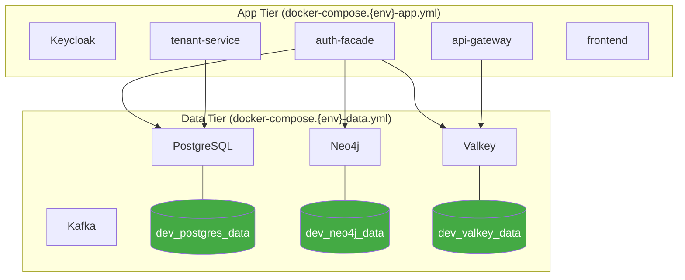
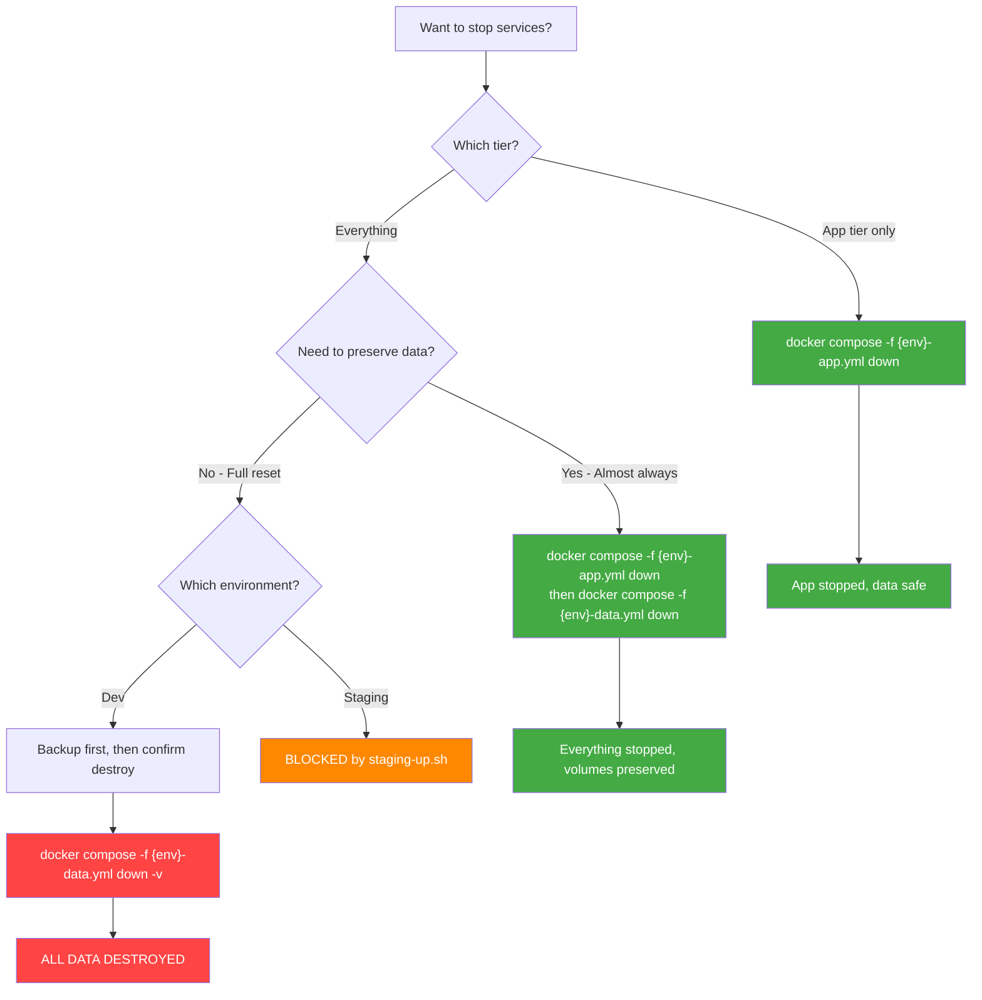
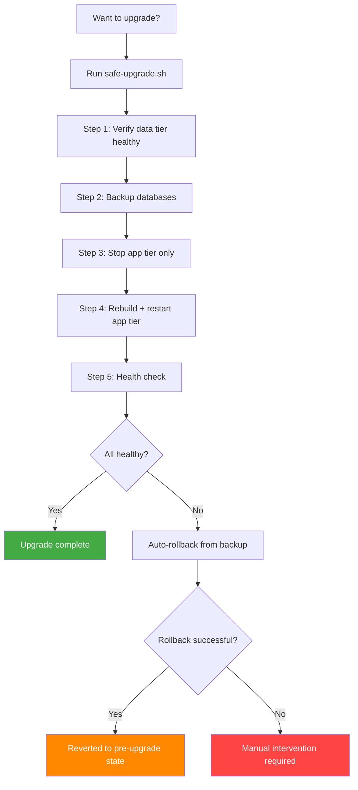

# RUNBOOK-011: Docker Volume Management

**Version:** 2.0.0
**Last Updated:** 2026-03-03
**Owner:** DevOps Agent
**Severity:** CRITICAL -- Volume mismanagement causes data loss

---

## Overview

This runbook covers the safe management of Docker volumes in the EMSIST platform. Docker volumes are the primary data persistence mechanism for all environments (dev and staging). Improper volume handling -- particularly `docker compose down -v` -- is the leading cause of data loss during upgrades.

**As of v2.0.0 (INF-003):** The compose files are split into separate **data tier** and **app tier** files. This ensures that stopping or rebuilding the app tier cannot accidentally destroy data volumes.

---

## Tier-Split Architecture (INF-003)

### Why Tier Split?

Before INF-003, all services (data stores + applications) lived in a single `docker-compose.{env}.yml` file. This meant:

- `docker compose down -v` destroyed **all** volumes, including database data
- There was no way to rebuild application containers without risking data tier stability
- Upgrades required stopping everything, including databases

The tier split separates concerns:



### File Layout

| File | Contains | Owns Volumes? | Owns Networks? |
|------|----------|---------------|----------------|
| `docker-compose.{env}-data.yml` | postgres, neo4j, valkey, kafka | **Yes** (all data volumes) | **Yes** (all 3 networks) |
| `docker-compose.{env}-app.yml` | keycloak, backend services, frontend | Only app volumes (e.g., `dev_frontend_node_modules`) | No (uses `external: true`) |
| `docker-compose.{env}.yml` | `include:` wrapper combining both | No (delegates) | No (delegates) |

### Key Safety Properties

1. **`docker compose -f {env}-app.yml down` cannot remove data volumes** -- volumes are only defined in the data tier file
2. **`docker compose -f {env}-app.yml down` cannot remove networks** -- networks are defined in the data tier and referenced as `external: true` in the app tier
3. **The backward-compatible wrapper still works** -- `docker compose -f docker-compose.{env}.yml up` starts everything as before

### Lifecycle Commands

```bash
# Start data tier independently
docker compose -f docker-compose.dev-data.yml --env-file .env.dev up -d

# Start app tier independently (requires data tier running)
docker compose -f docker-compose.dev-app.yml --env-file .env.dev up --build -d

# Stop ONLY app tier (data stays running, volumes untouched)
docker compose -f docker-compose.dev-app.yml --env-file .env.dev down

# Stop ONLY data tier (volumes preserved)
docker compose -f docker-compose.dev-data.yml --env-file .env.dev down

# Start everything via wrapper (backward-compatible)
docker compose -f docker-compose.dev.yml --env-file .env.dev up --build -d
```

---

## Volume Inventory

### Development Environment

| Volume Name | Defined In | Service | Data Type | Persist Label | Backup Required |
|-------------|-----------|---------|-----------|---------------|-----------------|
| `dev_postgres_data` | `dev-data.yml` | PostgreSQL | Database files | `true` | Yes |
| `dev_postgres_backups` | `dev-data.yml` | PostgreSQL | Backup dumps | `true` | No (is backup) |
| `dev_neo4j_data` | `dev-data.yml` | Neo4j | Graph data | `true` | Yes |
| `dev_neo4j_logs` | `dev-data.yml` | Neo4j | Log files | `false` | No |
| `dev_neo4j_backups` | `dev-data.yml` | Neo4j | Backup dumps | `true` | No (is backup) |
| `dev_valkey_data` | `dev-data.yml` | Valkey | Cache RDB | `true` | Optional |
| `dev_frontend_node_modules` | `dev-app.yml` | Frontend | npm packages | `false` | No |

### Staging Environment

| Volume Name | Defined In | Service | Data Type | Persist Label | Backup Required |
|-------------|-----------|---------|-----------|---------------|-----------------|
| `staging_postgres_data` | `staging-data.yml` | PostgreSQL | Database files | `true` | Yes (mandatory) |
| `staging_postgres_backups` | `staging-data.yml` | PostgreSQL | Backup dumps | `true` | No (is backup) |
| `staging_neo4j_data` | `staging-data.yml` | Neo4j | Graph data | `true` | Yes (mandatory) |
| `staging_neo4j_logs` | `staging-data.yml` | Neo4j | Log files | `false` | No |
| `staging_neo4j_backups` | `staging-data.yml` | Neo4j | Backup dumps | `true` | No (is backup) |
| `staging_valkey_data` | `staging-data.yml` | Valkey | Cache RDB | `true` | Yes |

### Volume Labels

All EMSIST volumes use labels for identification:

| Label | Values | Purpose |
|-------|--------|---------|
| `com.emsist.persist` | `true` / `false` | Indicates if volume contains data that must survive restarts |
| `com.emsist.env` | `dev` / `staging` | Which environment the volume belongs to |
| `com.emsist.service` | Service name | Which service uses this volume |
| `com.emsist.backup` | `required` | Whether pre-upgrade backup is mandatory |

---

## The Golden Rule

> **NEVER use `docker compose down -v` in staging or production.**

This flag (`-v`) destroys **all named volumes** associated with the compose project, including:
- PostgreSQL data (7 databases)
- Neo4j graph data (auth configuration)
- Valkey cache (session data)
- Keycloak realm configuration

With the tier split, the safest approach is to only ever run `down` against the app tier file. Data volumes are not defined there, so `-v` on the app tier file only removes app-tier volumes (like `dev_frontend_node_modules`).

### Safe Stop vs Dangerous Stop



### Command Reference

| Command | Effect | Data Safe? |
|---------|--------|------------|
| `docker compose -f {env}-app.yml down` | Stops app containers | **Yes** (data volumes untouched) |
| `docker compose -f {env}-data.yml down` | Stops data containers, keeps volumes | Yes |
| `docker compose -f {env}-data.yml down -v` | Stops data AND destroys ALL data volumes | **NO** |
| `docker compose -f {env}.yml down` | Stops everything via wrapper, keeps volumes | Yes |
| `docker compose -f {env}.yml down -v` | Stops everything AND destroys ALL volumes | **NO** |
| `docker compose stop` | Stops containers (keeps them) | Yes |
| `docker compose up -d` | Starts/restarts services, reuses existing volumes | Yes |
| `docker compose up --build -d` | Rebuilds images, reuses existing volumes | Yes |

---

## Procedures

### 1. Inspect Volume Contents

To see what is stored in a volume:

```bash
# List all EMSIST volumes
docker volume ls --filter "label=com.emsist.persist=true"

# Inspect a specific volume (shows mount point, labels, driver)
docker volume inspect ems-dev_dev_postgres_data

# Browse volume contents using a temporary container
docker run --rm -v ems-dev_dev_postgres_data:/data alpine ls -la /data/

# Check volume disk usage
docker system df -v | grep -E "(VOLUME|ems-)"
```

### 2. Backup Volumes

#### Automated Backup (Recommended)

```bash
# Back up dev environment
./scripts/backup-databases.sh --env dev

# Back up staging environment
./scripts/backup-databases.sh --env staging

# Or use Makefile shortcuts
make backup           # dev
make backup-staging   # staging
```

#### Manual PostgreSQL Backup

```bash
# Single database backup
docker exec <postgres-container> pg_dump -U postgres -Fc -f /backups/user_db.dump user_db

# Copy to host
docker cp <postgres-container>:/backups/user_db.dump ./backups/

# Full cluster backup
docker exec <postgres-container> pg_dumpall -U postgres > pg_dumpall.sql
```

#### Manual Neo4j Backup

Neo4j Community Edition does not support online `neo4j-admin backup`. Use file-level copy:

```bash
# Stop Neo4j first (required for Community Edition consistency)
docker compose -f docker-compose.dev-data.yml stop neo4j

# Copy data from volume to host
docker cp <neo4j-container>:/data/databases ./backups/neo4j-databases/
docker cp <neo4j-container>:/data/transactions ./backups/neo4j-transactions/

# Restart Neo4j
docker compose -f docker-compose.dev-data.yml start neo4j
```

#### Manual Valkey Backup

```bash
# Trigger a background save
docker exec <valkey-container> valkey-cli BGSAVE

# Wait a moment, then copy the RDB file
docker cp <valkey-container>:/data/dump.rdb ./backups/valkey-dump.rdb
```

### 3. Restore Volumes from Backup

#### Automated Restore

```bash
# Restore from latest backup
./scripts/restore-databases.sh --latest --env dev

# Restore from specific backup
./scripts/restore-databases.sh --backup backups/dev_2026-03-02_120000 --env dev

# Or use Makefile shortcuts
make rollback           # dev, latest
make rollback-staging   # staging, latest
```

#### Manual PostgreSQL Restore

```bash
# Ensure PostgreSQL is running (via data tier)
docker compose -f docker-compose.dev-data.yml up -d postgres

# Restore a single database from custom-format dump
cat user_db.dump | docker exec -i <postgres-container> pg_restore \
    -U postgres -d user_db --clean --if-exists --no-owner

# Restore from pg_dumpall (full cluster)
cat pg_dumpall.sql | docker exec -i <postgres-container> psql -U postgres
```

#### Manual Neo4j Restore

```bash
# Stop Neo4j
docker compose -f docker-compose.dev-data.yml stop neo4j

# Remove existing data from volume
docker run --rm -v ems-dev_dev_neo4j_data:/data alpine sh -c "rm -rf /data/databases/* /data/transactions/*"

# Copy backup data into volume
docker cp ./backups/neo4j-databases/ <neo4j-container>:/data/databases/
docker cp ./backups/neo4j-transactions/ <neo4j-container>:/data/transactions/

# Fix ownership
docker run --rm -v ems-dev_dev_neo4j_data:/data alpine chown -R 7474:7474 /data

# Restart Neo4j
docker compose -f docker-compose.dev-data.yml start neo4j
```

### 4. Safe Container Recreation (Preserves Volumes)

When you need to recreate containers (e.g., after configuration change):

```bash
# Recreate a single data service (volume preserved)
docker compose -f docker-compose.dev-data.yml up -d --force-recreate postgres

# Recreate all app services (data volumes preserved)
docker compose -f docker-compose.dev-app.yml up -d --force-recreate

# Rebuild and recreate a single app service (volume preserved)
docker compose -f docker-compose.dev-app.yml up -d --build --force-recreate auth-facade
```

**These commands NEVER destroy volumes.** They only affect containers.

### 5. Safe Upgrade Procedure



```bash
# Safe upgrade for dev (data tier stays running)
make upgrade

# Safe upgrade for staging (backup is mandatory, cannot be skipped)
make upgrade-staging

# Manual equivalent
./scripts/safe-upgrade.sh --env dev
./scripts/safe-upgrade.sh --env staging
```

**Key difference from pre-INF-003:** The safe-upgrade script now stops and rebuilds only the app tier (`docker-compose.{env}-app.yml`). The data tier continues running throughout the upgrade, so database connections are never interrupted.

---

## Volume Naming Conventions

| Pattern | Example | Purpose |
|---------|---------|---------|
| `{env}_{service}_data` | `dev_postgres_data` | Primary data volume |
| `{env}_{service}_logs` | `dev_neo4j_logs` | Log volume (safe to delete) |
| `{env}_{service}_backups` | `staging_postgres_backups` | Backup storage volume |
| `{env}_{service}_{purpose}` | `dev_frontend_node_modules` | Utility volume |

### Environment Prefixes

| Prefix | Compose Project | Environment |
|--------|-----------------|-------------|
| `dev_` | `ems-dev` | Development |
| `staging_` | `ems-stg` | Staging |

---

## PostgreSQL WAL Configuration

Both dev and staging compose files configure PostgreSQL with crash recovery settings:

| Setting | Value | Purpose |
|---------|-------|---------|
| `POSTGRES_INITDB_ARGS` | `--data-checksums` | Detects data corruption |
| `wal_level` | `replica` | Full WAL logging for point-in-time recovery |
| `archive_mode` | `on` | Enables WAL archiving |
| `max_wal_senders` | `3` | Supports streaming replication |
| `wal_keep_size` | `256MB` | Retains WAL segments for crash recovery |

These settings ensure that if PostgreSQL crashes mid-transaction, it can recover to a consistent state on restart.

---

## Troubleshooting

### Volume Shows as Empty After Restart

**Cause:** Container was recreated with a different volume name (project name changed).

**Fix:**
```bash
# List all volumes to find the old one
docker volume ls | grep postgres_data

# If old volume exists under different project name, copy data
docker run --rm \
    -v old_project_dev_postgres_data:/source \
    -v ems-dev_dev_postgres_data:/target \
    alpine sh -c "cp -a /source/. /target/"
```

### init-db.sh Runs Again on Existing Database

**Cause:** The `init-db.sh` is mounted into `/docker-entrypoint-initdb.d/`. PostgreSQL only runs init scripts if the data directory is **empty** (first run). If data exists, init scripts are skipped.

**This is safe.** The init script uses `IF NOT EXISTS` patterns for all database and user creation.

### App Tier Cannot Connect to Data Tier

**Cause:** Data tier networks are not running (data tier must be started first).

**Fix:**
```bash
# Start data tier first
docker compose -f docker-compose.dev-data.yml --env-file .env.dev up -d

# Verify networks exist
docker network ls | grep ems-dev

# Then start app tier
docker compose -f docker-compose.dev-app.yml --env-file .env.dev up -d
```

### Volume Disk Space Full

```bash
# Check volume sizes
docker system df -v

# Find large files in a volume
docker run --rm -v ems-dev_dev_postgres_data:/data alpine du -sh /data/*

# If WAL logs are consuming space, run a checkpoint
docker exec <postgres-container> psql -U postgres -c "CHECKPOINT;"
```

### Cannot Remove a Volume

```bash
# Volume is in use - stop the container first
docker compose -f docker-compose.dev-data.yml stop postgres
docker volume rm ems-dev_dev_postgres_data

# Volume is referenced by a stopped container
docker compose -f docker-compose.dev-data.yml down  # removes stopped containers
docker volume rm ems-dev_dev_postgres_data
```

---

## Emergency Procedures

### Data Loss Has Already Occurred

1. **Stop everything immediately:**
   ```bash
   docker compose -f docker-compose.dev-app.yml down
   docker compose -f docker-compose.dev-data.yml down
   ```

2. **Check if backups exist:**
   ```bash
   make backup-list
   # or
   ls -lt backups/
   ```

3. **Restore from latest backup:**
   ```bash
   make rollback  # dev
   # or
   make rollback-staging
   ```

4. **If no backup exists:**
   - Check Docker volume recycle bin (some Docker Desktop versions keep deleted volumes temporarily)
   - Check if any team member has a recent database dump
   - Re-run init-db.sh to recreate empty databases, then re-seed via Flyway migrations and Keycloak init

### Corrupted PostgreSQL Data

1. **Stop PostgreSQL:**
   ```bash
   docker compose -f docker-compose.dev-data.yml stop postgres
   ```

2. **Check data checksums** (if `--data-checksums` was enabled):
   ```bash
   docker run --rm -v ems-dev_dev_postgres_data:/data postgres:16-alpine \
       pg_checksums --check -D /data
   ```

3. **If corruption detected, restore from backup:**
   ```bash
   ./scripts/restore-databases.sh --latest --env dev
   ```

---

## Maintenance Schedule

| Task | Frequency | Command |
|------|-----------|---------|
| Backup dev databases | Before each rebuild | `make backup` |
| Backup staging databases | Daily / before each deploy | `make backup-staging` |
| Prune old backups | Weekly | Automatic (keeps last 5) |
| Check volume disk usage | Weekly | `docker system df -v` |
| Verify backup integrity | Monthly | Restore to temp container and verify |
| Clean dangling images | Weekly | `make clean-images` |

---

## References

- [Docker Volumes Documentation](https://docs.docker.com/storage/volumes/)
- [Docker Compose Include](https://docs.docker.com/compose/compose-file/14-include/)
- [PostgreSQL Backup and Restore](https://www.postgresql.org/docs/16/backup.html)
- [Neo4j Backup Documentation](https://neo4j.com/docs/operations-manual/current/backup-restore/)
- RUNBOOK-008-BACKUP-RESTORE.md (general backup procedures)
- RUNBOOK-009-BACKUP-FAILURE.md (backup failure troubleshooting)
- ISSUE-INF-003 (Docker Compose tier split)
