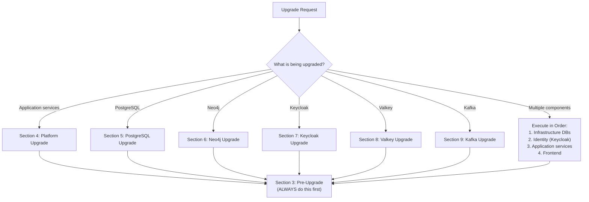
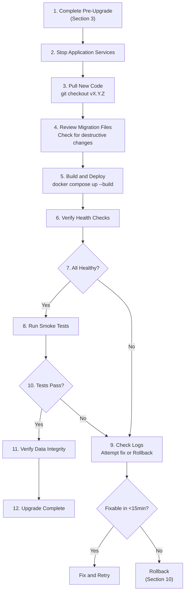
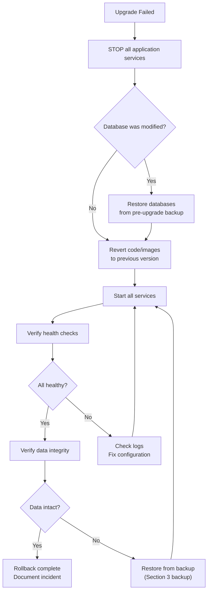

# RUNBOOK-011: Major Version Upgrade

## Quick Reference

| Property | Value |
|----------|-------|
| **Runbook ID** | RB-011 |
| **Severity** | SEV-2 |
| **On-Call Required** | Yes |
| **Estimated Duration** | 1-4 hours |
| **Maintenance Window** | Required |
| **Backup Required** | Mandatory (all databases) |

---

## 1. Overview

This runbook provides step-by-step procedures for performing major version upgrades of the EMSIST platform, including:

- Platform version upgrades (EMSIST application services)
- PostgreSQL version upgrades (e.g., 16 to 17)
- Neo4j version upgrades (e.g., 5.x to 6.x)
- Keycloak version upgrades (e.g., 24.x to 25.x)
- Infrastructure component upgrades (Valkey, Kafka)

**CRITICAL:** This runbook MUST be followed in order. Skipping steps risks data loss.

---

## 2. Pre-Upgrade Decision Flow



---

## 3. Pre-Upgrade Procedure (MANDATORY for ALL Upgrades)

### 3.1 Pre-Flight Checklist

- [ ] Maintenance window scheduled and communicated
- [ ] Release checklist completed (`docs/governance/checklists/release-checklist.md`)
- [ ] Upgrade tested on dev environment first
- [ ] Rollback procedure reviewed by team
- [ ] On-call engineer confirmed available
- [ ] Backup storage has sufficient space

### 3.2 Record Current State

```bash
# Record current platform version
cat VERSION
echo "---"

# Record current Docker image versions
docker compose -f docker-compose.staging.yml config | grep "image:" | sort

# Record current database schema versions (Flyway)
for DB in master_db user_db license_db notification_db audit_db ai_db; do
  echo "=== ${DB} ==="
  docker exec postgres psql -U postgres -d "${DB}" \
    -c "SELECT version, description, installed_on FROM flyway_schema_history ORDER BY installed_rank DESC LIMIT 3;" 2>/dev/null \
    || echo "No Flyway history (or database does not exist)"
done

# Record PostgreSQL version
docker exec postgres psql -U postgres -c "SELECT version();"

# Record Neo4j version
docker exec neo4j neo4j --version 2>/dev/null || \
  docker exec neo4j cat /var/lib/neo4j/product-info.txt 2>/dev/null || echo "Check Neo4j browser at :7474"

# Record Keycloak version
docker exec keycloak /opt/keycloak/bin/kc.sh show-config 2>/dev/null | head -5

# Save all output to a file
echo "Pre-upgrade state recorded at $(date)" > ./backups/pre-upgrade-state.txt
```

### 3.3 Backup ALL Databases

**STOP. Do not proceed until all backups are verified.**

```bash
TIMESTAMP=$(date +%Y%m%d_%H%M%S)
BACKUP_DIR="./backups/pre-upgrade-${TIMESTAMP}"
mkdir -p "${BACKUP_DIR}"

echo "Starting pre-upgrade backup at ${TIMESTAMP}..."

# ── PostgreSQL: Dump all databases ──
echo "Backing up PostgreSQL..."
docker exec postgres pg_dumpall -U postgres > "${BACKUP_DIR}/pg_dumpall.sql"

# Also dump individual databases for selective restore
for DB in master_db keycloak_db user_db license_db notification_db audit_db ai_db; do
  docker exec postgres pg_dump -U postgres -Fc "${DB}" > "${BACKUP_DIR}/${DB}.dump"
  echo "  Backed up ${DB}"
done

# ── Neo4j: Stop writes, dump database ──
echo "Backing up Neo4j..."
# Stop auth-facade to prevent writes
docker stop auth-facade 2>/dev/null || true
sleep 5
docker exec neo4j neo4j-admin database dump neo4j --to-path=/tmp/ 2>/dev/null || \
  echo "WARNING: neo4j-admin dump failed. Attempting file copy..."
docker cp neo4j:/tmp/neo4j.dump "${BACKUP_DIR}/neo4j.dump" 2>/dev/null || true

# Fallback: copy the data volume directly
docker cp neo4j:/data "${BACKUP_DIR}/neo4j-data-copy/" 2>/dev/null || true
echo "  Neo4j backup complete"

# ── Valkey: RDB snapshot ──
echo "Backing up Valkey..."
docker exec valkey valkey-cli BGSAVE
sleep 3
docker cp valkey:/data/dump.rdb "${BACKUP_DIR}/valkey_dump.rdb" 2>/dev/null || true
echo "  Valkey backup complete"

# ── Docker volumes: Snapshot names ──
echo ""
echo "Docker volume names for reference:"
docker volume ls --format '{{.Name}}' | grep -E "(staging|dev)_(postgres|neo4j|valkey)" | sort

# ── Verify backups ──
echo ""
echo "=== Backup Verification ==="
for f in "${BACKUP_DIR}"/*; do
  if [ -f "$f" ]; then
    SIZE=$(stat -f%z "$f" 2>/dev/null || stat -c%s "$f" 2>/dev/null || echo "0")
    if [ "$SIZE" -lt 100 ]; then
      echo "  FAIL: $f is only ${SIZE} bytes (likely empty or corrupt)"
    else
      echo "  OK:   $f (${SIZE} bytes)"
    fi
  fi
done

echo ""
echo "Backup directory: ${BACKUP_DIR}"
echo "VERIFY all backups are OK before proceeding."
```

### 3.4 Verify Backup Restorability

```bash
# Test PostgreSQL backup can be read
docker exec postgres pg_restore --list "${BACKUP_DIR}/master_db.dump" > /dev/null 2>&1 \
  && echo "master_db backup is valid" \
  || echo "WARNING: master_db backup may be corrupt"

# Test Neo4j dump file exists and is non-trivial
if [ -f "${BACKUP_DIR}/neo4j.dump" ]; then
  SIZE=$(stat -f%z "${BACKUP_DIR}/neo4j.dump" 2>/dev/null || stat -c%s "${BACKUP_DIR}/neo4j.dump" 2>/dev/null)
  if [ "$SIZE" -gt 1000 ]; then
    echo "Neo4j backup appears valid (${SIZE} bytes)"
  else
    echo "WARNING: Neo4j backup is small (${SIZE} bytes) -- verify manually"
  fi
else
  echo "WARNING: Neo4j dump file not found. Check neo4j-data-copy/ directory."
fi
```

---

## 4. Platform Application Upgrade

This section covers upgrading EMSIST application services (Spring Boot microservices + Angular frontend).

### 4.1 Upgrade Steps



### 4.2 Execute Upgrade

```bash
# Step 1: Pre-upgrade complete (Section 3) -- VERIFY before continuing
ls -la "${BACKUP_DIR}/"

# Step 2: Stop application services (keep infrastructure running)
docker compose -f docker-compose.staging.yml stop \
  frontend api-gateway auth-facade tenant-service user-service \
  license-service notification-service audit-service ai-service

# Step 3: Pull new version
git fetch origin
git checkout v<NEW_VERSION>
cat VERSION  # Verify version matches

# Step 4: Review new migration files
find backend -path "*/db/migration/*.sql" -newer "${BACKUP_DIR}/pg_dumpall.sql" -exec echo "New migration: {}" \;
# READ each new migration file and check for DROP/ALTER destructive operations

# Step 5: Build and deploy
docker compose -f docker-compose.staging.yml --env-file .env.staging up --build -d

# Step 6: Wait for health checks (5 min timeout)
echo "Waiting for services to start..."
sleep 30
for SERVICE in api-gateway auth-facade tenant-service user-service; do
  STATUS=$(docker inspect --format='{{if .State.Health}}{{.State.Health.Status}}{{else}}{{.State.Status}}{{end}}' \
    "$(docker compose -f docker-compose.staging.yml ps -q ${SERVICE})" 2>/dev/null || echo "not_found")
  echo "${SERVICE}: ${STATUS}"
done

# Step 7: Run smoke tests
curl -sf http://localhost:8080/actuator/health && echo "API Gateway: OK" || echo "API Gateway: FAIL"
curl -sf http://localhost:4200 > /dev/null && echo "Frontend: OK" || echo "Frontend: FAIL"
```

### 4.3 Verify Data Integrity

```bash
# Check tenant registry
docker exec postgres psql -U postgres -d master_db -c "SELECT count(*) FROM tenants;"

# Check Keycloak users
docker exec postgres psql -U postgres -d keycloak_db -c "SELECT count(*) FROM user_entity;" 2>/dev/null || \
  echo "Keycloak users table may have different name -- check manually"

# Check Flyway migration status
for DB in master_db user_db license_db notification_db audit_db ai_db; do
  echo "=== ${DB} ==="
  docker exec postgres psql -U postgres -d "${DB}" \
    -c "SELECT success, count(*) FROM flyway_schema_history GROUP BY success;" 2>/dev/null
done
```

---

## 5. PostgreSQL Major Version Upgrade

**When:** Upgrading from PostgreSQL 16 to 17 (or any major version change).

**Risk:** HIGH -- Major version upgrades require `pg_upgrade` or dump/restore. Data format changes between major versions.

### 5.1 Compatibility Check

```bash
# Check current version
docker exec postgres psql -U postgres -c "SELECT version();"

# Check pgvector compatibility with target version
# Visit: https://github.com/pgvector/pgvector#installation
# Ensure pgvector supports the target PostgreSQL version
```

### 5.2 Upgrade via Dump/Restore (Recommended for Docker)

```bash
# ── Pre: Full backup completed (Section 3) ──

# Step 1: Stop all services
docker compose -f docker-compose.staging.yml down

# Step 2: Record current volume name
CURRENT_VOLUME=$(docker volume ls --format '{{.Name}}' | grep staging_postgres_data)
echo "Current volume: ${CURRENT_VOLUME}"

# Step 3: Update docker-compose.staging.yml
# Change:  image: pgvector/pgvector:pg16
# To:      image: pgvector/pgvector:pg17  (or target version)

# Step 4: Create new volume for the new version
docker volume create staging_postgres_data_new

# Step 5: Start new PostgreSQL with empty data
# Temporarily modify docker-compose to use the new volume
docker compose -f docker-compose.staging.yml up -d postgres

# Step 6: Wait for PostgreSQL to initialize
sleep 10
docker exec postgres pg_isready -U postgres

# Step 7: Restore from dump
docker exec -i postgres psql -U postgres < "${BACKUP_DIR}/pg_dumpall.sql"

# Step 8: Run init-db.sql for any missing databases/extensions
docker exec -i postgres psql -U postgres < infrastructure/docker/init-db.sql 2>/dev/null || true

# Step 9: Verify
docker exec postgres psql -U postgres -c "SELECT version();"
docker exec postgres psql -U postgres -c "\\l"  # List all databases

# Step 10: Start all services
docker compose -f docker-compose.staging.yml up -d

# Step 11: Verify data integrity (Section 4.3)
```

### 5.3 Rollback PostgreSQL Upgrade

```bash
# Step 1: Stop all services
docker compose -f docker-compose.staging.yml down

# Step 2: Revert docker-compose image to previous version
# Change back: image: pgvector/pgvector:pg16

# Step 3: Remove the new volume, restore old volume
docker volume rm staging_postgres_data_new 2>/dev/null || true

# Step 4: Start with old PostgreSQL version
docker compose -f docker-compose.staging.yml up -d postgres
sleep 10

# Step 5: Restore from pre-upgrade backup
docker exec -i postgres psql -U postgres < "${BACKUP_DIR}/pg_dumpall.sql"

# Step 6: Restart all services
docker compose -f docker-compose.staging.yml up -d
```

---

## 6. Neo4j Version Upgrade

**When:** Upgrading Neo4j (e.g., 5.x Community to a newer 5.x or to 6.x).

**Risk:** MEDIUM-HIGH -- Graph database format changes between major versions. Only auth-facade depends on Neo4j.

### 6.1 Pre-Upgrade Check

```bash
# Current version
docker exec neo4j neo4j --version 2>/dev/null || echo "Check browser at :7474"

# Check migration compatibility
# Visit: https://neo4j.com/docs/upgrade-migration-guide/current/
# Verify Cypher syntax compatibility for auth-facade queries
```

### 6.2 Upgrade Procedure

```bash
# ── Pre: Full backup completed (Section 3) ──

# Step 1: Stop auth-facade (only service using Neo4j)
docker compose -f docker-compose.staging.yml stop auth-facade

# Step 2: Stop Neo4j
docker compose -f docker-compose.staging.yml stop neo4j

# Step 3: Update docker-compose.staging.yml
# Change:  image: neo4j:5-community
# To:      image: neo4j:<TARGET_VERSION>-community

# Step 4: Start Neo4j with new version
docker compose -f docker-compose.staging.yml up -d neo4j

# Step 5: Wait for startup and check logs
sleep 30
docker compose -f docker-compose.staging.yml logs --tail=50 neo4j

# Step 6: Verify Neo4j is accessible
docker exec neo4j wget -q --spider http://localhost:7474 && echo "Neo4j UI: OK" || echo "Neo4j UI: FAIL"

# Step 7: Verify data migration
# Connect to Neo4j browser and run:
# MATCH (n) RETURN labels(n), count(*) ORDER BY count(*) DESC

# Step 8: Start auth-facade
docker compose -f docker-compose.staging.yml up -d auth-facade

# Step 9: Test auth-facade connectivity to Neo4j
sleep 15
curl -sf http://localhost:8081/actuator/health && echo "Auth Facade: OK" || echo "Auth Facade: FAIL"
```

### 6.3 Rollback Neo4j Upgrade

```bash
# Step 1: Stop auth-facade and Neo4j
docker compose -f docker-compose.staging.yml stop auth-facade neo4j

# Step 2: Revert docker-compose image
# Change back to previous Neo4j image version

# Step 3: Remove Neo4j data volume (will be restored from backup)
docker volume rm staging_neo4j_data 2>/dev/null || true
docker volume create staging_neo4j_data

# Step 4: Start Neo4j with old version
docker compose -f docker-compose.staging.yml up -d neo4j
sleep 30

# Step 5: Restore Neo4j from backup
docker cp "${BACKUP_DIR}/neo4j.dump" neo4j:/tmp/neo4j.dump
docker exec neo4j neo4j-admin database load neo4j --from-path=/tmp/ --overwrite-destination=true 2>/dev/null || true

# Step 6: Restart Neo4j and auth-facade
docker compose -f docker-compose.staging.yml restart neo4j
sleep 15
docker compose -f docker-compose.staging.yml up -d auth-facade
```

---

## 7. Keycloak Version Upgrade

**When:** Upgrading Keycloak (e.g., 24.0 to 25.x or 26.x).

**Risk:** HIGH -- Keycloak manages all user identities and authentication. Failures here lock out all users.

### 7.1 Pre-Upgrade Check

```bash
# Check Keycloak release notes for breaking changes
# https://www.keycloak.org/docs/latest/release_notes/

# Check database migration requirements
# Keycloak auto-migrates its database schema on startup

# Verify Keycloak Admin API compatibility with auth-facade
grep -r "keycloak" backend/auth-facade/pom.xml | head -5
```

### 7.2 Upgrade Procedure

```bash
# ── Pre: Full backup completed (Section 3) ──
# ── CRITICAL: keycloak_db backup is essential ──

# Step 1: Stop all services that depend on Keycloak
docker compose -f docker-compose.staging.yml stop \
  auth-facade tenant-service user-service api-gateway frontend

# Step 2: Stop Keycloak
docker compose -f docker-compose.staging.yml stop keycloak keycloak-init

# Step 3: Update docker-compose.staging.yml
# Change:  image: quay.io/keycloak/keycloak:24.0
# To:      image: quay.io/keycloak/keycloak:<TARGET_VERSION>

# Step 4: Start Keycloak (it will auto-migrate its database)
docker compose -f docker-compose.staging.yml up -d keycloak
echo "Waiting for Keycloak to start and migrate database..."

# Step 5: Wait for health check (Keycloak can take 2-3 minutes)
MAX_WAIT=180
ELAPSED=0
while [ $ELAPSED -lt $MAX_WAIT ]; do
  STATUS=$(docker inspect --format='{{if .State.Health}}{{.State.Health.Status}}{{else}}{{.State.Status}}{{end}}' \
    "$(docker compose -f docker-compose.staging.yml ps -q keycloak)" 2>/dev/null || echo "not_found")
  echo "Keycloak status: ${STATUS} (${ELAPSED}s)"
  if [ "$STATUS" = "healthy" ]; then break; fi
  sleep 15
  ELAPSED=$((ELAPSED + 15))
done

# Step 6: Verify Keycloak admin login
curl -sf http://localhost:8180/health/ready && echo "Keycloak: READY" || echo "Keycloak: NOT READY"

# Step 7: Run keycloak-init to verify configuration
docker compose -f docker-compose.staging.yml up keycloak-init

# Step 8: Start dependent services
docker compose -f docker-compose.staging.yml up -d \
  auth-facade tenant-service user-service api-gateway frontend

# Step 9: Test login flow
echo "Test login at http://localhost:4200 -- verify authentication works"
```

### 7.3 Rollback Keycloak Upgrade

```bash
# Step 1: Stop everything
docker compose -f docker-compose.staging.yml stop

# Step 2: Revert Keycloak image version in docker-compose

# Step 3: Restore keycloak_db from backup
docker compose -f docker-compose.staging.yml up -d postgres
sleep 10
docker exec -i postgres dropdb -U postgres keycloak_db 2>/dev/null || true
docker exec -i postgres createdb -U postgres keycloak_db
docker exec -i postgres pg_restore -U postgres -d keycloak_db < "${BACKUP_DIR}/keycloak_db.dump"

# Step 4: Start Keycloak with old version
docker compose -f docker-compose.staging.yml up -d keycloak
sleep 60  # Keycloak needs time to start

# Step 5: Restart all services
docker compose -f docker-compose.staging.yml up -d
```

---

## 8. Valkey Upgrade

**When:** Upgrading Valkey (e.g., 8.x to 9.x).

**Risk:** LOW-MEDIUM -- Valkey is used for caching. Data loss is acceptable (cache rebuilds from database), but service disruption occurs during restart.

### 8.1 Upgrade Procedure

```bash
# ── Pre: Valkey backup taken (Section 3.3) ──

# Step 1: Update docker-compose image
# Change:  image: valkey/valkey:8-alpine
# To:      image: valkey/valkey:<TARGET_VERSION>-alpine

# Step 2: Stop Valkey
docker compose -f docker-compose.staging.yml stop valkey

# Step 3: Start with new version
docker compose -f docker-compose.staging.yml up -d valkey

# Step 4: Verify
docker exec valkey valkey-cli ping  # Should return PONG
docker exec valkey valkey-cli INFO server | head -10  # Check version

# Step 5: Restart services that use Valkey (they will reconnect)
docker compose -f docker-compose.staging.yml restart \
  auth-facade user-service license-service notification-service ai-service api-gateway
```

---

## 9. Kafka Upgrade

**When:** Upgrading Kafka (e.g., 7.6.0 to 7.7.x or 8.x).

**Risk:** MEDIUM -- Kafka handles event streaming. Message format compatibility must be verified.

### 9.1 Upgrade Procedure

```bash
# ── Pre: Backup completed (Section 3) ──

# Step 1: Check compatibility
# Verify inter-broker protocol version compatibility
# https://docs.confluent.io/platform/current/installation/versions-interoperability.html

# Step 2: Update docker-compose image
# Change:  image: confluentinc/cp-kafka:7.6.0
# To:      image: confluentinc/cp-kafka:<TARGET_VERSION>

# Step 3: Stop Kafka (and consumers)
docker compose -f docker-compose.staging.yml stop \
  notification-service audit-service ai-service kafka

# Step 4: Start Kafka with new version
docker compose -f docker-compose.staging.yml up -d kafka
sleep 30

# Step 5: Verify Kafka is healthy
docker exec kafka kafka-broker-api-versions --bootstrap-server localhost:9092

# Step 6: Restart consumers
docker compose -f docker-compose.staging.yml up -d \
  notification-service audit-service ai-service
```

---

## 10. Rollback Procedure (General)

### 10.1 Emergency Rollback Flow



### 10.2 Full Platform Rollback

```bash
# ── EMERGENCY ROLLBACK ──
# Use the backup created in Section 3

BACKUP_DIR="./backups/pre-upgrade-<TIMESTAMP>"

# Step 1: Stop everything
docker compose -f docker-compose.staging.yml down

# Step 2: Revert docker-compose to previous version
git checkout <PREVIOUS_TAG> -- docker-compose.staging.yml

# Step 3: Revert code
git checkout <PREVIOUS_TAG>

# Step 4: Remove potentially corrupt volumes
# WARNING: This destroys data. We will restore from backup.
docker volume rm staging_postgres_data staging_neo4j_data staging_valkey_data 2>/dev/null || true

# Step 5: Start infrastructure only
docker compose -f docker-compose.staging.yml up -d postgres neo4j valkey kafka keycloak
sleep 30

# Step 6: Restore PostgreSQL
docker exec -i postgres psql -U postgres < "${BACKUP_DIR}/pg_dumpall.sql"

# Step 7: Restore Neo4j
docker cp "${BACKUP_DIR}/neo4j.dump" neo4j:/tmp/neo4j.dump
docker exec neo4j neo4j-admin database load neo4j --from-path=/tmp/ --overwrite-destination=true 2>/dev/null || true

# Step 8: Restore Valkey
docker cp "${BACKUP_DIR}/valkey_dump.rdb" valkey:/data/dump.rdb
docker restart valkey

# Step 9: Start keycloak-init, then all services
docker compose -f docker-compose.staging.yml up -d

# Step 10: Verify everything
curl -sf http://localhost:8080/actuator/health && echo "Gateway: OK" || echo "Gateway: FAIL"
curl -sf http://localhost:4200 > /dev/null && echo "Frontend: OK" || echo "Frontend: FAIL"
```

---

## 11. Post-Upgrade Verification

### 11.1 Health Check Matrix

| Service | Check | Command | Expected |
|---------|-------|---------|----------|
| PostgreSQL | Connection | `docker exec postgres pg_isready -U postgres` | `accepting connections` |
| Neo4j | Browser | `docker exec neo4j wget -q --spider http://localhost:7474` | Exit 0 |
| Valkey | Ping | `docker exec valkey valkey-cli ping` | `PONG` |
| Kafka | API versions | `docker exec kafka kafka-broker-api-versions --bootstrap-server localhost:9092` | Success |
| Keycloak | Ready | `curl localhost:8180/health/ready` | `"UP"` |
| API Gateway | Actuator | `curl localhost:8080/actuator/health` | `{"status":"UP"}` |
| Auth Facade | Actuator | `curl localhost:8081/actuator/health` | `{"status":"UP"}` |
| Frontend | HTTP | `curl -s localhost:4200 \| head -1` | HTML content |

### 11.2 Data Integrity Checks

```bash
# Tenant count (should match pre-upgrade)
echo "Tenants:"
docker exec postgres psql -U postgres -d master_db -c "SELECT count(*) FROM tenants;"

# Flyway migration status (no failed migrations)
echo "Migration status:"
for DB in master_db user_db license_db notification_db audit_db ai_db; do
  FAILED=$(docker exec postgres psql -U postgres -d "${DB}" -t \
    -c "SELECT count(*) FROM flyway_schema_history WHERE success = false;" 2>/dev/null || echo "N/A")
  echo "  ${DB}: failed migrations = ${FAILED}"
done

# Neo4j node count
echo "Neo4j nodes:"
docker exec neo4j cypher-shell -u neo4j -p "${NEO4J_PASSWORD:-staging_neo4j_password}" \
  "MATCH (n) RETURN labels(n), count(*) ORDER BY count(*) DESC" 2>/dev/null || echo "Check Neo4j browser manually"
```

### 11.3 Functional Verification

- [ ] Login flow works (navigate to frontend, authenticate via Keycloak)
- [ ] Tenant resolution works (correct tenant loaded for domain)
- [ ] Administration pages load
- [ ] API Gateway routes requests correctly

---

## 12. Escalation

| Condition | Escalate To | Severity |
|-----------|-------------|----------|
| Backup failed/corrupt | DBA + DevOps | SEV-1 (STOP upgrade) |
| Database migration failed | DBA | SEV-2 |
| Keycloak migration failed (users locked out) | PM + Tech Lead | SEV-1 |
| Rollback failed | PM + DevOps + DBA | SEV-1 |
| Data corruption detected | PM + DBA | SEV-1 |
| Upgrade takes >2x estimated time | PM | SEV-3 |

---

## 13. Post-Incident Review

After any major upgrade (especially if rollback was triggered):

1. **Document what happened** -- Timeline of events
2. **Root cause** -- Why did the upgrade fail (if it did)?
3. **Impact** -- How long were services down? Any data loss?
4. **Action items** -- What to improve for next upgrade
5. **Runbook updates** -- Update this runbook with lessons learned

---

## Related Documents

- [Release Management Framework](/docs/governance/RELEASE-MANAGEMENT.md)
- [Release Checklist](/docs/governance/checklists/release-checklist.md)
- [RUNBOOK-006: Deployment Rollback](/runbooks/operations/RUNBOOK-006-DEPLOYMENT-ROLLBACK.md)
- [RUNBOOK-008: Backup Restore](/runbooks/operations/RUNBOOK-008-BACKUP-RESTORE.md)
- [Backup Strategy](/runbooks/operations/BACKUP-STRATEGY.md)

---

## Document History

| Version | Date | Author | Changes |
|---------|------|--------|---------|
| 1.0.0 | 2026-03-02 | REL Agent | Initial release -- platform, PostgreSQL, Neo4j, Keycloak, Valkey, Kafka upgrade procedures |
